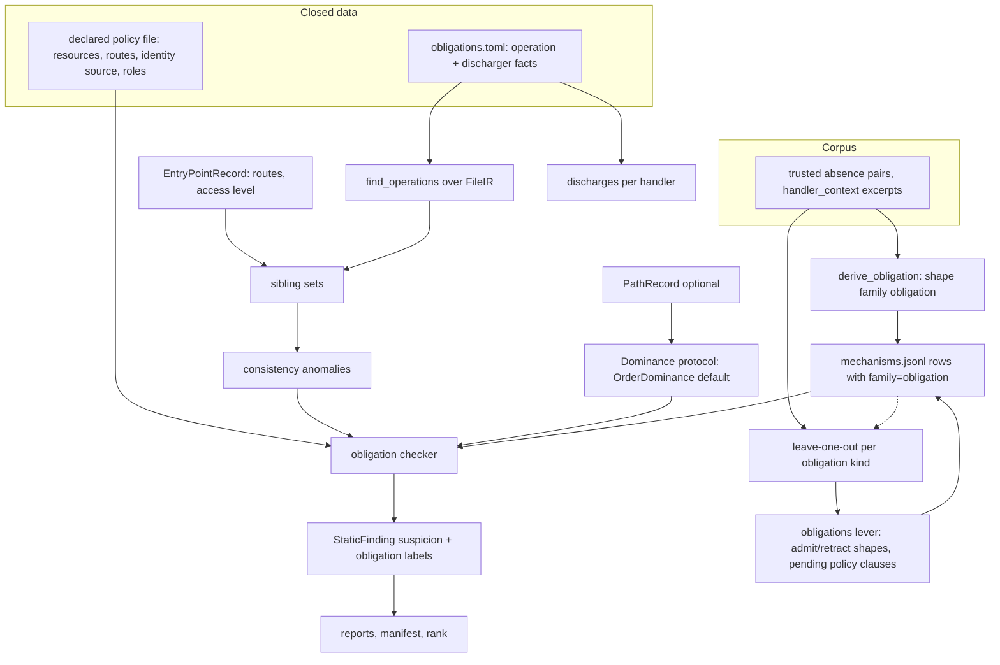
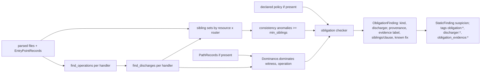
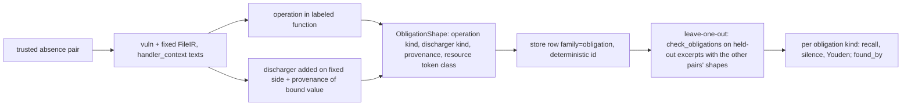

# Design Document

## Overview

**Purpose.** Give OpenUltraSAST a second detection regime beside data flow: an operation that carries an obligation (a protected read or write, a privileged action, a security-relevant setting) is reported when an entry point reaches it and nothing on the way discharges the obligation (a path guard, an identity constraint bound from the authenticated context, an ownership check, a non-permissive value, validated input). The application's own policy says which obligations exist: the consistency of sibling handlers, and optionally a declared policy file.

**Users.** AppSec engineers get absence findings that name the missing discharger, the evidence for the obligation, and the known fix. Maintainers get a leave-one-out number per obligation kind and an improve lever that admits obligation shapes under the existing gate. Project owners may declare their policy in a small versioned file.

**Impact.** New `semantic/obligations/` package (facts, shapes, siblings, declared policy, dominance protocol, checker). One more MAP proposer. Obligation rows in the existing mechanism store (second shape family). New harvest mode and one additive label field in the corpus. Reports, manifest and ranking gain obligation fields. No change to dispositions, the evidence ladder, taint, facts for flows, the call graph, or any gate.

### Goals

- Absence pairs in `vibe-py` and `agent-vfc` move from 0 detected to a measured leave-one-out baseline per obligation kind.
- Every obligation finding states obligation, missing discharger, evidence (siblings or policy clause) and known fix.
- Works today in function-local mode; becomes path-aware when reachability lands; becomes nesting-aware when guard dominance lands, without caller changes.
- Policy is never authored by a model.

### Non-Goals

- Flow taint, sink facts, walker, dispositions, ladder rungs.
- Call graph, summaries, path records, dominance IR (owned upstream).
- Sandbox proof of absence bugs.
- LLM-authored policy or shapes; any merge gate; vendoring unlicensed code.

## Boundary Commitments

### This Spec Owns

- Obligation facts data and loader (`obligations.toml`, `OperationFact`, `DischargerFact`, closed kinds).
- Obligation shape derivation, family tag, dedupe key, export into the mechanism store.
- Sibling sets, discharge detection per handler, consistency anomalies.
- Declared policy schema, loader, version hash, pending clauses.
- The `Dominance` protocol and its order-based default implementation.
- The obligation checker (path-aware and function-local), its findings, tags and labels.
- Obligation fields in markdown/SARIF, the manifest `obligations` block, ranking weight for obligation findings.
- Corpus: `handler_context` harvest mode, `obligation` label field, vocabulary additions, leave-one-out per obligation kind.
- The `obligations` lever (shape admit/retract, pending policy clauses) reusing the mechanisms lever machinery.

### Out of Boundary

- `semantic/taint.py`, `semantic/facts.py` (flow facts), `semantic/cst.py`, `semantic/ir.py`, `overlay.py` dispositions and `ALLOWED_EVIDENCE`.
- `semantic/callgraph.py`, `summaries.py`, `paths.py` (`reachability-flow-model`); nesting-aware dominance (`guard-dominance-regime`).
- Pair scorer rules beyond one additive detection rule for obligation-labeled rows; catalog schema beyond the `obligation` field.
- Sink-shape variant search and its lever family (`corpus-seeded-mechanisms`), reused unchanged.
- Rule and CWE policy levers, ledger format.

### Allowed Dependencies

- `FileIR`, `parse_file`, `named_ranges_from_ir`, `variants.source_kind_of_name` (read), `SemanticFacts` sources (read, for request-input provenance).
- `EntryPointRecord` from `mapping.analyze_entry_points` (read).
- `PathRecord` from `semantic/paths.py` when present (read, optional).
- `MechanismStore`, `append_from_pair`-style writer, `MechanismEdit`, `apply_mechanism_edits`, `StoreSnapshot`, `evaluate_mechanism_profiles`, `profile_regressions`, journal.
- `PairCase`, `load_pair_catalog`, selectors, `loo.score_pair_with_store` pattern, harvest library.
- Reports, manifest writer, `StaticFinding`, rank.

### Revalidation Triggers

- Any obligation finding above `suspicion` without sandbox agreement.
- A shape or policy clause authored by a model or written by the tool.
- Obligation kinds or discharger kinds outside the closed sets appearing in facts, shapes or policy.
- `Dominance` protocol signature change (both upstream engine specs implement it).
- `PathRecord` shape change upstream (the checker's path consumer must be re-checked).
- Consistency findings that demote or suppress anything.

## Architecture

### Existing Architecture Analysis

MAP already runs three proposers over one parse: inventory findings adjudicated by the overlay, the tool hunter, and variant search. Each produces `StaticFinding`s at or below `static_corroboration`, merges with overlay records where a call site coincides, and is counted in the manifest. The entry-point mapper runs before MAP and yields routes with an access level. The mechanism store is append-only with deterministic ids and a folding loader; the improve loop has a bounded lever contract with byte-for-byte revert. This design adds a fourth proposer and a second shape family, following those patterns exactly; the only new concept is the `Dominance` protocol, introduced because the spec that owns real dominance is not written yet.

### Architecture Pattern & Boundary Map



**Architecture Integration**

- Selected pattern: closed facts plus learned shapes plus recovered policy, evaluated by a proposer that never claims proof.
- Domain boundaries: facts/shapes (semantic data), siblings/policy (application intent), checker (evaluation), reports/rank/lever (consumers). No component writes another's data except the lever writing the store through the existing contract.
- Existing patterns preserved: append-only store with deterministic ids; MAP proposer at `suspicion`; lever with validator, snapshot, per-profile clause; leave-one-out as the objective.
- New component rationale: `Dominance` protocol decouples the checker from the two upstream engine specs so obligations are useful in function-local mode today.
- Dependency direction: obligation facts → shapes → siblings/policy → checker → cli/reports/rank → loo → lever. `obligations/` never imports the overlay, the scorer, or `improve`.

### Technology Stack

| Layer | Choice | Role | Notes |
|-------|--------|------|-------|
| Facts | TOML data next to the flow facts | operation and discharger kinds | closed loader, separate file so `facts.py` stays untouched |
| Shapes | stdlib dataclasses over `FileIR` | derive, key, dict round-trip | second family in the mechanism store |
| Policy | TOML file in the scanned project's calibration dir | declared resources and routes | closed schema, version hash in manifest |
| Evaluation | MAP proposer | findings at `suspicion` | function-local without paths |
| Corpus | harvest mode + label field | teach and score absence pairs | additive |
| Improve | existing lever machinery | admit/retract, pending clauses | same gate |

## File Structure Plan

```
src/openultrasast/
├── semantic/obligations/
│   ├── __init__.py       # public surface: load_obligation_facts, derive_obligation, check_obligations, ObligationFinding
│   ├── facts.py          # OperationFact, DischargerFact, OPERATION_KINDS, DISCHARGER_KINDS, PROVENANCE_KINDS, load_obligation_facts(dir)
│   ├── shapes.py         # ObligationShape (family="obligation"), derive_obligation(vuln_ir, fixed_ir, label, facts, texts), classify_discharger
│   ├── operations.py     # find_operations(ir, facts) -> Operation sites; find_discharges(ir, facts, ranges) -> Discharge witnesses
│   ├── siblings.py       # SiblingSet grouping from EntryPointRecord + operations; consistency_anomalies(sets, min_siblings)
│   ├── policy.py         # DeclaredPolicy schema + load_declared_policy(path) (closed; rejects unknown fields); version hash
│   ├── dominance.py      # Dominance protocol; OrderDominance default (decorators, router middleware, statement order, hop order)
│   └── check.py          # check_obligations(...) -> ObligationResult(findings, discharges, sibling_sets, degradations); findings_to_static
├── ruleset/obligations/{python,javascript,typescript}.toml   # closed operation/discharger facts, beside (not inside) the flow facts dir that load_facts globs
├── cli.py                # MAP: obligation check after variant search; manifest `obligations`; `mechanisms export` also writes obligation shapes
├── config.py             # [obligations] enabled=true, min_siblings=3, policy_path=".openultrasast/obligations.toml"
├── reports.py            # obligation lines in markdown, `obligation_*` SARIF properties
├── rank.py               # obligation ranking weight: sensitivity x label, below any sandbox-proven finding
├── semantic/seed.py      # pair_lessons yields obligation shapes for obligation-labeled rows (same exporter)
├── semantic/loo.py       # score_pair_with_store handles family=obligation via check_obligations; per obligation kind grouping
├── improve/validator.py  # validate_mechanism dispatches on shape family; PolicyClauseEdit (pending)
├── improve/evolve.py     # propose_mechanism_edits covers obligation rows; pending clause journaling
├── pairs.py              # ExpectedFinding.obligation (additive); obligation-labeled rows count an obligation finding inside the function as detection
benchmarks/pairs/
├── harvest.py            # mode "handler_context": function + decorators + registration lines
├── mechanisms.toml       # vocabulary additions: unconstrained_protected_read, unconstrained_protected_write, unguarded_privileged_action
tests/
├── test_obligation_facts.py, test_obligation_shapes.py, test_obligation_siblings.py, test_obligation_policy.py,
├── test_obligation_check.py (function-local + path-aware with a stub PathRecord), test_obligation_reports.py,
├── test_obligation_corpus.py (harvest mode, label, LOO per kind), test_obligation_lever.py
```

### Modified Files

- `src/openultrasast/cli.py` — `_check_obligations` after `_search_variants` in MAP (standard/deep); manifest `obligations` block; `mechanisms export` writes obligation rows too.
- `src/openultrasast/pairs.py` — `ExpectedFinding.obligation: str | None`; `_detections`-side additive rule: for a row with `obligation`, a finding with tag `obligation:<kind>` inside the labeled function counts.
- `src/openultrasast/semantic/mechanisms.py` — no schema change; `corpus_mechanisms()` unchanged; a helper `obligation_mechanisms(records)` selects `shape["family"] == "obligation"` (added in `obligations/shapes.py`, not in the store module).
- `src/openultrasast/reports.py`, `rank.py`, `config.py`, `improve/*`, `semantic/seed.py`, `semantic/loo.py`, `benchmarks/pairs/harvest.py`, `benchmarks/pairs/mechanisms.toml` as listed above.

## System Flows

### Evaluation in MAP



Gating: the checker emits a finding only when (1) the operation is reached — from an entry point along a `PathRecord`, or, without paths, when the operation sits in a handler that is itself an entry point — and (2) no discharger of the required kind dominates, and (3) the obligation is justified by a sibling set (`consistency_violation`), a policy clause (`declared_policy_violation`) or, in degraded mode without either, by the operation fact alone (`function_local`). A declared public route suppresses path-guard obligations for that route only.

### Teaching and measuring



### Lever

Admit/retract of obligation shape rows follows the mechanisms lever exactly (validator dispatches on `family`; same snapshot, tombstone, per-profile clause via `evaluate_mechanism_profiles` extended to run the checker for obligation rows). A policy clause proposal (`PolicyClauseEdit`) is journaled as `pending` with its sibling evidence and is never read by a scan until a human copies it into the policy file; accepting is a human edit of the file, not a loop action.

## Requirements Traceability

| Requirement | Summary | Components | Flows |
|-------------|---------|------------|-------|
| 1.1–1.5 | closed operation/discharger facts, loader rejects unknown, no detection outside facts | ObligationFacts | — |
| 2.1–2.5 | shapes from trusted pairs, tiers, text-free, dedupe with provenance, skip reasons | ObligationShapes, Export | teaching |
| 3.1–3.6 | sibling sets, min count, route access evidence, never demote, fixed-twin leak rate | Siblings, Checker | evaluation |
| 4.1–4.5 | declared policy: load, reject unknown, declared violation, public routes, never written by the tool | DeclaredPolicy, Checker, Lever | evaluation, lever |
| 5.1–5.5 | path-aware, discharge recorded, function_local degraded mode, identity provenance, standard/deep only | Dominance, Checker, cli | evaluation |
| 6.1–6.5 | one label, reports, hunter intent, ranking weight, manifest block | Checker, reports, rank, IntentAdjudication | — |
| 7.1–7.5 | handler_context harvest, obligation label, vocabulary, LOO per kind, roadmap | harvest, pairs, mechanisms.toml, loo | teaching |
| 8.1–8.5 | obligations lever, closed validator, gate unchanged, pending clauses, journal | Lever | lever |
| 9.1–9.3 | offline tests, gates unchanged, extra-free green | tests | — |

## Components and Interfaces

| Component | Domain | Intent | Req | Dependencies | Contract |
|-----------|--------|--------|-----|--------------|----------|
| ObligationFacts | semantic data | closed kinds and their call/attribute matches | 1 | TOML | State |
| ObligationShapes | semantic | derive, key, round-trip, export | 2, 7 | FileIR, facts, variants helpers, store | Service |
| Operations | semantic | operation sites and discharge witnesses in a file | 3, 5 | FileIR, facts | Service |
| Siblings | intent | group handlers, find anomalies | 3 | EntryPointRecord, Operations | Service |
| DeclaredPolicy | intent | load and validate policy, version | 4 | TOML | State |
| Dominance | evaluation | does a witness dominate an operation | 5 | PathRecord optional | Protocol |
| Checker | evaluation | findings with labels and evidence | 3–6 | all above | Service |
| IntentAdjudication | hunter | record intent on a finding | 6.3 | hunter client (optional) | Service |
| Corpus | corpus | harvest mode, label, LOO per kind | 7 | harvest lib, pairs, loo | Batch |
| Lever | improve | admit/retract shapes, pending clauses | 8 | validator, evolve, store | Batch |

### ObligationFacts

```python
OPERATION_KINDS = ("protected_read", "protected_write", "privileged_action", "security_setting")
DISCHARGER_KINDS = ("path_guard", "identity_constraint", "ownership_check", "non_permissive_value", "validated_input")
PROVENANCE_KINDS = ("authenticated_context", "request_input", "constant", "unknown")

@dataclass(frozen=True)
class OperationFact:
    id: str
    kind: str                     # OPERATION_KINDS
    language: str
    calls: tuple[str, ...]        # trailing-name matches, same rule as sink facts
    resource_arg: int | None      # argument or receiver position that names the resource (model, table, path)
    requires: tuple[str, ...]     # DISCHARGER_KINDS that discharge this operation
    sensitivity: str              # low | medium | high (default weight for ranking)

@dataclass(frozen=True)
class DischargerFact:
    id: str
    kind: str                     # DISCHARGER_KINDS
    language: str
    calls: tuple[str, ...] = ()   # guard calls / decorators / setters
    decorators: tuple[str, ...] = ()
    identity_sources: tuple[str, ...] = ()   # text patterns bound from the authenticated context (request.user, g.user, token payload)
    constraint_params: tuple[str, ...] = ()  # keyword or field names that constrain by identity (user, owner, user_id, tenant)

def load_obligation_facts(directory: Path | None = None) -> ObligationFacts: ...
```

Invariants: any kind outside the closed sets raises `ObligationFactsError` naming the entry; `for_language(language)` scoping like `SemanticFacts`.

### ObligationShapes

```python
@dataclass(frozen=True)
class ObligationShape:
    language: str
    operation_kind: str
    discharger_kind: str
    provenance: str              # PROVENANCE_KINDS: what the fix binds the discharger to
    resource_class: str          # "owned" | "global" | "setting" (from the operation fact's resource_arg and the added constraint)
    mechanism: str               # closed vocabulary id from the label
    family: str = "obligation"

    def key(self) -> str: ...    # text-free; family prefix so it never collides with sink shapes

def derive_obligation(vuln: FileIR, fixed: FileIR, *, function: str, obligation: str, mechanism: str, facts: ObligationFacts, flow_facts: SemanticFacts, vuln_text: str, fixed_text: str) -> ObligationShape | None: ...
def classify_discharger(vuln: FileIR, fixed: FileIR, *, function: str, facts: ObligationFacts, texts: tuple[str, str]) -> tuple[str, str] | None: ...  # (discharger kind, provenance) added on the fixed side
```

Preconditions: both sides parse; the labeled function exists on both. Postconditions: None when no operation of a required kind is in the labeled function or no discharger was added; the shape carries no text. Stored through the existing writer with `shape = to_dict()`; id from `key()`.

### Operations and Siblings

```python
@dataclass(frozen=True)
class Operation:
    path: str; line: int; function: str; kind: str; fact_id: str; resource: str | None   # resource token, identifier only

@dataclass(frozen=True)
class Discharge:
    path: str; line: int | None; function: str; kind: str; fact_id: str; provenance: str; scope: str   # scope: decorator | router | statement | hop

def find_operations(ir: FileIR, facts: ObligationFacts, ranges) -> tuple[Operation, ...]: ...
def find_discharges(ir: FileIR, facts: ObligationFacts, flow_facts: SemanticFacts, ranges, entry: EntryPointRecord | None) -> tuple[Discharge, ...]: ...

@dataclass(frozen=True)
class SiblingSet:
    key: tuple[str, str]                      # (router or module, resource token)
    handlers: tuple[str, ...]                 # "path::function"
    discharging: dict[str, tuple[str, ...]]   # discharger kind -> handlers that discharge it

def sibling_sets(entries: Sequence[EntryPointRecord], operations, discharges) -> tuple[SiblingSet, ...]: ...
def consistency_anomalies(sets, *, min_siblings: int) -> tuple[Anomaly, ...]: ...   # handler, kind, siblings that discharge
```

Invariants: a set with fewer than `min_siblings` members yields no anomaly and is counted as under-populated; anomalies never touch existing findings.

### DeclaredPolicy

```toml
# .openultrasast/obligations.toml (project-owned; the tool never writes it)
version = 1
identity_source = "request.user"          # closed: one of the discharger facts' identity_sources or "token"
[[resource]]
name = "book"                              # resource token as seen in operations
sensitivity = "high"                       # low | medium | high
identity_field = "user_id"                 # constraint param that ties the resource to its owner
[[route]]
path = "/health"
access = "public"                          # public | authenticated | role
roles = []
```

`load_declared_policy(path) -> DeclaredPolicy | None`; unknown field or value → `PolicyError` naming it; the scan continues without a policy and records `{"stage": "obligations", "reason": "policy_invalid", "detail"}`. `DeclaredPolicy.version_hash` goes to the manifest.

### Dominance

```python
class Dominance(Protocol):
    def dominates(self, witness: Discharge, operation: Operation, path: PathRecord | None) -> bool: ...

class OrderDominance:
    """Default: decorator and router-middleware witnesses dominate the handler; a statement witness dominates when it
    precedes the operation in the same function and the function has an early exit between them or the witness is a
    guard call; along a PathRecord, a witness on an earlier hop dominates."""
```

`guard-dominance-regime` provides a nesting-aware implementation behind the same protocol; the checker takes the implementation as a parameter.

### Checker

```python
@dataclass(frozen=True)
class ObligationFinding:
    operation: Operation
    missing: str                 # discharger kind
    provenance: str | None       # when an identity constraint exists but binds request input
    label: str                   # consistency_violation | declared_policy_violation | function_local
    evidence: tuple[str, ...]    # sibling handler ids or the policy clause
    known_fix: str | None        # mechanism record id whose shape matches (operation kind, discharger kind)
    intent: str | None = None    # hunter adjudication: public | protected | unknown

@dataclass(frozen=True)
class ObligationResult:
    findings: tuple[ObligationFinding, ...]
    discharges: tuple[Discharge, ...]
    sibling_sets: tuple[SiblingSet, ...]
    degradations: tuple[dict[str, object], ...]

def check_obligations(*, irs, entries, facts, flow_facts, policy, paths, dominance, store_shapes, min_siblings) -> ObligationResult: ...
def findings_to_static(result) -> list[StaticFinding]: ...   # id "obligation:<kind>:<path>:<line>:<missing>", evidence suspicion, tags
```

Rules: reached = a `PathRecord` ends at the operation, or (no paths) the operation's function is an entry point; label precedence declared > consistency > function_local; a declared public route suppresses `path_guard` obligations for that route; an operation with a matching store shape gains `known_fix`; a discharge that binds `request_input` where `authenticated_context` is required is reported with `provenance = "request_input"`.

### IntentAdjudication

When a hunter client is available (the same resolution as `pairs --hunter`), the checker asks one closed question per finding with a route: "Is this route meant to be public?" with the handler text and siblings as context; the answer is recorded as `intent` and in the rationale. It never changes the label or the evidence level; when the client is absent a degradation `intent_adjudication_unavailable` is recorded once.

### Reports, manifest, rank

Markdown per finding: `- Obligation: <kind> on <resource>`, `- Missing discharger: <kind> (<provenance>)`, `- Evidence: <label> — <siblings | clause>`, `- Known fix: <guard shape> learned from <pairs>`, `- Intent: <adjudication>`; a `## Obligations` section lists sibling sets and the policy version. SARIF properties `obligation_kind`, `obligation_missing`, `obligation_label`, `obligation_evidence`, `obligation_known_fix`, `obligation_intent`. Manifest `obligations = {sibling_sets, under_populated, operations, findings_by_label, policy_version | null, degradations, sets}` (`sets` lists `{module, resource, handlers}` so the report can name them). Rank: `ranking_priority = base(sensitivity) x weight(label)` with `declared > consistency > function_local`, capped strictly below the lowest sandbox-proven finding in the run. Proof rungs live on `CandidateVerdict`, never on `StaticFinding`, so the cap takes the proven finding ids from the run's `TRIGGERABLE` verdicts: `rank_obligations(findings, proven_ids=...)` runs once at MAP and again after REGRESS when the sandbox proved anything.

### Corpus and leave-one-out

Harvest mode `handler_context`: the labeled function plus its decorators and the registration statements that name it (router `.get(...)`/`.post(...)` calls, `add_url_rule`, middleware attachment) as one excerpt per side. Catalog row `obligation = "<OPERATION_KIND>"` (additive); vocabulary gains `unconstrained_protected_read`, `unconstrained_protected_write`, `unguarded_privileged_action` (existing `missing_auth_guard`, `identity_from_request_body`, `permissive_default` stay). `loo.score_pair_with_store` runs `check_obligations` on both sides for obligation rows; grouping adds `per_obligation_kind`; `found_by` names the shape record that supplied `known_fix`.

### Lever

`validate_mechanism` dispatches on `shape["family"]`: obligation rows check `operation_kind`, `discharger_kind`, `provenance`, `resource_class` against the closed sets. `PolicyClauseEdit(kind="resource"|"route", fields, evidence, rationale)` is validated against the policy schema, journaled under `pending_policy_clauses`, and never applied by the loop. `propose_mechanism_edits` treats obligation rows like sink rows (admit when a trial store recovers a missed holdout absence pair without leaking; retract leakers); `evaluate_mechanism_profiles` runs the checker for obligation rows.

## Data Models

- Store row: existing `Mechanism` with `shape = {family: "obligation", language, operation_kind, discharger_kind, provenance, resource_class, mechanism}`; `guard` field carries `discharger_kind` for report continuity.
- Facts: `obligations.toml` with `[[operation]]` and `[[discharger]]` tables per language; `version`.
- Policy: as above; `version_hash = sha1(normalized file)`.
- Manifest: `obligations` block; `loo.json` gains `per_obligation_kind`.
- Journal: `pending_policy_clauses: [{clause, evidence, round, rationale}]`.

## Error Handling

| Condition | Response |
|-----------|----------|
| Facts entry outside closed sets | `ObligationFactsError` naming the entry; loader fails loud (data bug) |
| Policy file invalid | `policy_invalid` degradation; scan continues without policy |
| No path records | function-local mode; `function_local` labels; degradation per language once |
| Language without grammar | skipped with `obligations_language_unsupported` |
| Sibling set under minimum | counted under-populated, no finding |
| Hunter unavailable | `intent_adjudication_unavailable`, findings unchanged |
| Store row with malformed obligation shape | skipped with `obligations_store_row_invalid` |

## Testing Strategy

- Unit: facts loader rejects an unknown kind (1.4); `derive_obligation` on the vampi pair yields `protected_read` / `identity_constraint` / `authenticated_context` and a text-free key (2.1, 2.3); a pair whose fix adds no discharger is skipped with a reason (2.5); `sibling_sets` groups three handlers on `/books` and `consistency_anomalies` flags the unconstrained one with the two siblings as evidence, and stays silent under `min_siblings` (3.2, 3.3); a public route among authenticated siblings is a missing `path_guard` with the access classification as evidence (3.4); policy loader rejects an unknown field and a declared public route suppresses the guard obligation but not the identity one (4.2, 4.4); `OrderDominance` with a stub `PathRecord` accepts a guard on an earlier hop and rejects one after the operation (5.1, 5.2); no paths → `function_local` plus degradation (5.3); identity bound from `request.args` → `provenance = request_input` (5.4).
- Integration: standard scan on a fixture with three handlers emits one `obligation:` finding at `suspicion` with tags and report lines, manifest block present, absent in quick (5.5, 6.1, 6.2, 6.5); ranking places it below a sandbox-proven finding (6.4).
- Corpus: `handler_context` excerpt keeps decorators and registration (7.1); an obligation-labeled catalog row counts an obligation finding inside the function (7.2); LOO on a three-pair toy slice reports per obligation kind and `found_by` (7.4).
- Lever: admission of an obligation shape that recovers a holdout absence pair is accepted; one that fires on a fixed twin is rejected with byte-identical store; a `PolicyClauseEdit` lands in `pending_policy_clauses` and no scan reads it (8.3, 8.4).
- Gates: detection, map and local pair gates unchanged; extra-free suite green with semantic tests skipping (9.2, 9.3).

## Security Considerations

Shapes and policy carry identifiers only; the policy file is project-owned and never written by the tool; the hunter receives redacted handler text and can only annotate. Obligation findings never execute anything and never reach the sandbox candidate set.

## Performance

Operations and discharges are found in the same parse the overlay uses; sibling grouping is linear in handlers; the checker is O(operations x witnesses) per handler and O(paths) with path records; bounded by the MAP file budget.

## Migration Strategy

1. Facts, shapes, exporter and vocabulary; measure how many absence pairs teach.
2. Operations, discharges, siblings, policy, order dominance, checker in function-local mode; MAP wiring behind `[obligations].enabled`; reports and manifest.
3. Corpus harvest mode and label; leave-one-out per kind; roadmap baseline.
4. Lever and pending clauses.
5. When `reachability-flow-model` lands: pass `PathRecord`s to the checker (no interface change). When `guard-dominance-regime` lands: swap the `Dominance` implementation.
