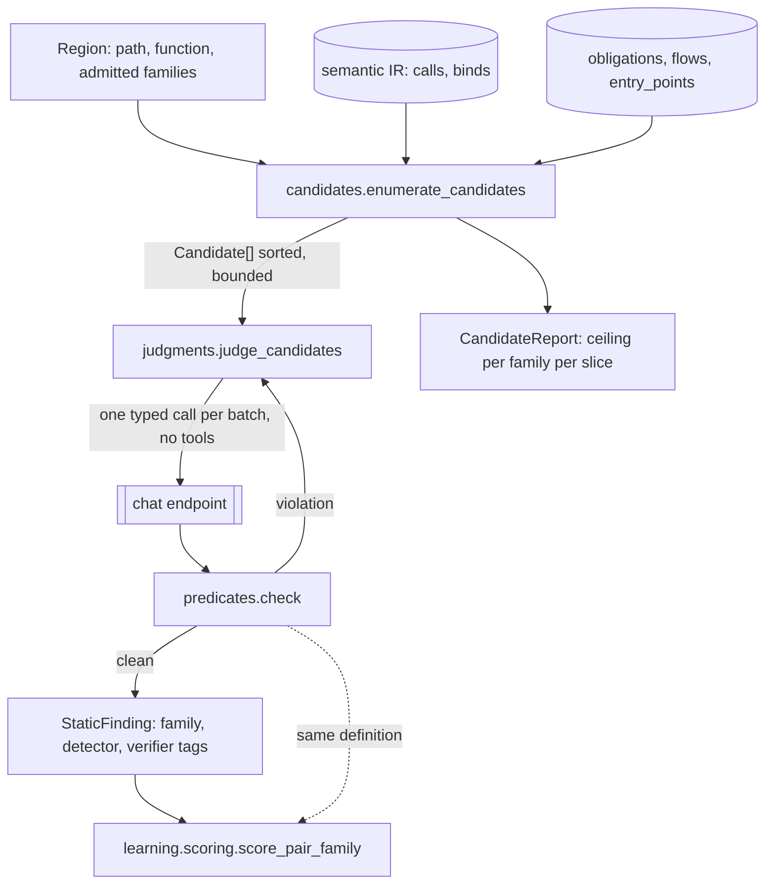

# Design Document: constrained-detector

## Overview

The detector stops searching. A deterministic pass enumerates the candidate sites inside a labeled region from the
semantic IR; the model answers one bounded, typed question per candidate with no tools and no choice of what to look
at; the predicates that decide whether a finding counts are applied while it is being made, with one retry. The
unconstrained tool hunter stays in place as the generalist and as the baseline this is measured against.

Two measurements shape every decision below and neither was a guess. **120 runs produced 120 distinct trajectories**,
so the variance is the loop's freedom rather than the model's judgement. And the candidate generator was measured
before anything was built: the **pattern ruleset caps recall at 12.1%**, below the 64.9% the unconstrained loop
already reaches, while the **semantic IR caps it at 96.6%** with a median of ten sites per labeled function.

### Goals

- Two runs of the same detector on the same input make an identical sequence of model calls.
- The limit on what the detector can find is a published number, not an assumption.
- Real-project slices decide whether a change is kept; hand-written teaching code cannot justify one alone.
- The K-run and noise-floor machinery is re-measured and deleted if a constrained detector does not need it.

### Non-Goals

- Prompt optimisation, reflective evolution, any optimiser. Deferred to a later spec, on this feature's evidence.
- Changing the taxonomy, the classifier, the scorer's outcome rules, the split, the verifier boundary or the gates.
- Adopting DSPy as a dependency. The interface shape is borrowed; the framework is not.

## Boundary Commitments

### This Spec Owns

- `learning/candidates.py` — what a candidate is, how the IR enumerates one per family shape, and the ceiling report.
- `learning/judgments.py` — the typed answer, and the toolless call that produces it.
- `learning/predicates.py` — the checks that constrain a claim at generation time and score it afterwards, defined once.
- `learning/slices.py` — deciding versus development slices, the overfitting gap, and the cross-slice rejection rule.
- `run_constrained_detector` in `learning/detectors.py`, beside the existing `run_family_detector`.
- `ousast learning candidates`, and a detector selector on `score` and `baseline`.

### Out of Boundary

- `learning/families.py`, `classify.py`, `split.py`, `verifiers.py`, `canaries.py`, `journal.py`, `acceptance.py`,
  `rounds.py`, `publish.py` keep their contracts. `scoring.py` is touched only to import predicates it already
  implements inline, and a test asserts its behaviour is unchanged.
- `tool_hunter.run_tool_hunter` keeps its contract and its callers. It is not removed while it scores higher on any
  deciding slice.
- The pair corpus, its labels, tiers and splits. The three gates.

### Allowed Dependencies

- Core: standard library only. `dependencies = []` is unchanged.
- Optional: the semantic extra for the IR. Without it, every family reports `unsupported_language` and scores nothing.
- The chat endpoint already resolved by `learning/endpoint.py`. No new provider, no new key.

### Revalidation Triggers

- The candidate ceiling on a deciding slice falling below the unconstrained loop's detection rate on that slice.
- The re-measured trajectory count per pair exceeding one.
- Any change to `scoring.py`'s outcome rules, which would invalidate the baseline this is compared against.

## Architecture

### Existing Architecture Analysis

`run_family_detector` composes `run_tool_hunter` with a family's prompt, checklist, curated tools and context files.
The hunter loop is a ReAct loop: the model calls tools until it stops, then emits findings, and a final turn asks for
JSON when it ended in prose. `_overlay_scan` already parses both sides of a pair and returns function ranges;
`semantic/ir.py` already exposes `FunctionIR` with `calls: tuple[CallSite, ...]` and `binds: tuple[Bind, ...]`,
each carrying argument texts, the names they mention and whether they are constant. `hunter_tools.obligations` and
`flows` already answer the guard and reachability questions deterministically. Nothing new has to be parsed.

### Architecture Pattern & Boundary Map



The dotted edge is the point of Requirement 4: one definition of the predicates, used to constrain and to score.

### Technology Stack

| Concern | Choice | Why |
|---|---|---|
| Candidate enumeration | `semantic/ir.py` `FunctionIR.calls` and `.binds` | 96.6% ceiling measured; the ruleset's 12.1% is below the current baseline |
| Guards in scope | `hunter_tools.obligations`, `mapping.analyze_entry_points` | already deterministic, already used by the obligations checker |
| Typed answer | `json_object` on the DeepSeek adapter, one array per batch | the provider has no schema mode; the predicates are the schema |
| Retry on violation | one bounded retry with the violation injected | DSPy Assertions' backtracking, without the framework |
| Determinism | candidates sorted, batches fixed, no tools | Req 2.4; the model's text may vary, the call sequence may not |

## File Structure Plan

### Directory Structure

```
src/openultrasast/learning/
├── candidates.py     # NEW  Candidate, CandidateKind, enumerate_candidates, ceiling, CandidateReport
├── judgments.py      # NEW  Judgment, judge_candidates, batching, the typed prompt
├── predicates.py     # NEW  PREDICATES, check_claim, violation reasons
├── slices.py         # NEW  DECIDING_SLICES, DEVELOPMENT_SLICES, overfitting_gap, cross_slice_verdict
├── detectors.py      # MOD  run_constrained_detector beside run_family_detector
└── scoring.py        # MOD  imports predicates; outcome rules unchanged, asserted by the recorded baseline
```

### Modified Files

- `src/openultrasast/learning/detectors.py` — `run_constrained_detector(root, region, config, *, client, model,
  taxonomy, ranges)`; `FamilyConfig` gains nothing, because a constrained detector is configured by the same
  prompt/checklist/limits and reads no tools.
- `src/openultrasast/learning/scoring.py` — `_hits`, `_others` and `_fabricated` delegate to `predicates`; the
  family metrics gain nothing. A test asserts the recorded baseline numbers are reproduced exactly.
- `src/openultrasast/learning/publish.py` — the overfitting gap and the per-slice table (Req 3.1, 3.4).
- `src/openultrasast/config.py` — `[learning] detector = "hunter" | "constrained"`, default `hunter` until the
  comparison says otherwise.
- `src/openultrasast/cli.py` — `learning candidates`; `--detector` on `score` and `baseline`.
- `pyproject.toml` — unchanged.

## System Flows

### One region, constrained

```mermaid
sequenceDiagram
    participant D as run_constrained_detector
    participant E as enumerate_candidates
    participant J as judge_candidates
    participant P as predicates
    D->>E: root, region, family, ranges
    E-->>D: Candidate[] (sorted by path, line, name; bounded)
    alt no candidates
        D-->>D: record no_candidate, return []
    end
    loop each fixed-size batch
        D->>J: batch, config, client
        J-->>D: Judgment[] (typed)
        D->>P: judgment, candidate, ranges, taxonomy
        alt violation
            D->>J: retry once, violation injected
            J-->>D: Judgment[]
            D->>P: re-check
        end
        P-->>D: clean claims or a recorded discard
    end
    D-->>D: StaticFinding[] tagged family, detector, verifier
```

## Requirements Traceability

| Criteria | Delivered by |
|---|---|
| 1.1, 1.2 | `candidates.enumerate_candidates`, `CandidateKind` per family shape |
| 1.3 | `candidates.ceiling`, `ousast learning candidates`, `benchmarks/measurements/*-candidate-ceiling.json` |
| 1.4 | `enumerate_candidates` returns `Unsupported` when `parse_file(...).parse_ok` is false |
| 1.5 | `no_candidate` joins the unscorable vocabulary in `scoring.unscorable_reason` |
| 1.6 | `MAX_CANDIDATES_PER_CALL`, `CandidateReport.discarded` |
| 2.1, 2.2, 2.3 | `judgments.judge_candidates`, `Judgment`, `_typed_prompt`; findings built from `Judgment` only |
| 2.4 | `test_two_runs_make_an_identical_sequence_of_calls` over a recording client |
| 2.5 | `StaticFinding.tags` gains `candidate:<path>:<line>:<name>` |
| 3.1, 3.4 | `slices.overfitting_gap`, `publish._slice_table` |
| 3.2, 3.3 | `slices.DECIDING_SLICES`, `slices.cross_slice_verdict` |
| 3.5 | `learning candidates --slice` over every slice; the artifact carries per-slice ceilings |
| 3.6 | `slices.teachable(slice)` and a note emitted with every published number |
| 3.7 | `NON_GATING_FAMILIES` unchanged; `publish` reports memory separately, never inside a web aggregate |
| 4.1, 4.2, 4.3 | `predicates.PREDICATES`, `check_claim`, one retry in `run_constrained_detector`, `discarded` tally |
| 4.4 | `scoring._hits`/`_fabricated` call `predicates`; the baseline-reproduction test pins no drift |
| 5.1, 5.2 | the trajectory script and `run_baseline` re-run against the constrained detector |
| 5.3, 5.4 | the published floor names the `learning-harness` requirements it would amend; K is labelled |
| 6.1 | `score_pair_family` unchanged; the constrained detector only produces findings |
| 6.2, 6.3 | the comparison artifact, per slice, against 64.9% / 12.3% / 52.6% and $0.030 / $0.136 |
| 6.4, 6.5 | the comparison's headline rule; `[learning] detector` keeps `hunter` selectable |
| 7.1 | `resolve_chat_endpoint` unchanged; `learning_endpoint_unavailable` recorded |
| 7.2 | the client's `cost_usd` meter, already wired |
| 7.3 | the committed gate baseline test |
| 7.4 | `has_semantic_extra` guard; `unsupported_language` without it |
| 7.5 | `redact_secrets` on every prompt and persisted trajectory |

## Components and Interfaces

### candidates.py

```python
CandidateKind = Literal["call", "bind", "operation", "config"]

@dataclass(frozen=True)
class Candidate:
    path: str
    line: int
    kind: CandidateKind
    name: str                      # the callee, the bound name, or the operation
    text: str                      # the site as written, clamped
    arg_texts: tuple[str, ...]
    arg_names: tuple[tuple[str, ...], ...]
    binding_chain: tuple[str, ...]  # what the IR resolved for the arguments, nearest first
    guards: tuple[str, ...]         # decorators and in-body guards in scope, from obligations
    function: str

    @property
    def id(self) -> str: ...        # f"{path}:{line}:{name}", the tag a finding carries

FAMILY_SHAPE: dict[str, tuple[CandidateKind, ...]] = {
    "injection": ("call",), "path": ("call",), "deserialization": ("call",),
    "untrusted_destination": ("call",), "prototype": ("call", "bind"),
    "access_control": ("operation",), "config_secrets": ("bind", "config"),
    "output_encoding": ("call",), "memory": ("call",), "unknown": ("call", "bind"),
}
MAX_CANDIDATES_PER_CALL = 12   # p90 of the measured distribution is 22; two batches covers all but the tail

def enumerate_candidates(root, region, family, *, taxonomy, limit=MAX_CANDIDATES_PER_CALL) -> CandidateSet
def ceiling(cases, *, taxonomy) -> CandidateReport   # offline, no model
```

`CandidateSet` carries `candidates`, `discarded`, and `reason` (`""`, `unsupported_language`, `no_candidate`).
Ordering is `(path, line, name)`, which makes the batches and therefore the call sequence deterministic.

### judgments.py

```python
@dataclass(frozen=True)
class Judgment:
    candidate_id: str
    verdict: bool
    source: str          # the expression carrying untrusted input, or ""
    guard: str           # the guard found, or "" meaning none
    family: str
    rationale: str

def judge_candidates(candidates, config, *, client, model, taxonomy, violation=None) -> tuple[Judgment, ...]
```

One call per batch, `tools=[]`, `json_object=True`. The prompt is the family's prompt and checklist plus the batch
rendered as data; `violation` is the single retry's injected text. Answers that name a candidate id not in the batch
are dropped before the predicates run, because a fabricated id is not a claim about anything.

### predicates.py

```python
@dataclass(frozen=True)
class Violation:
    predicate: str
    detail: str

def check_claim(judgment, candidate, *, ranges, taxonomy) -> Violation | None
def inside_labeled_function(finding, spans) -> bool      # used by scoring._hits
def is_known_family(tag, taxonomy) -> bool               # used by scoring._fabricated
```

Named predicates: `line_in_parsed_function`, `sink_at_line`, `family_in_taxonomy`, `source_in_function`. The last
two of the three helpers are the ones `scoring.py` already implements inline; moving them here is a refactor whose
only observable effect must be none, which the recorded baseline pins.

### slices.py

```python
DECIDING_SLICES = ("agent-vfc", "vfc-js", "vfc", "github")   # harvested from real projects
DEVELOPMENT_SLICES = ("vibe-py",)                             # hand-written; cannot justify a change alone

def overfitting_gap(per_slice: Mapping[str, FamilyMetrics]) -> float
def cross_slice_verdict(before, after) -> Verdict   # rejects an improvement that regresses a deciding slice, by name
def teachable(slice_name: str, cases) -> bool       # False while every row of a slice is below a gating tier
```

## Error Handling

| Condition | Behaviour | Recorded as |
|---|---|---|
| IR cannot parse the side | no candidates, no model call | `unsupported_language` |
| Labeled function has no call or bind | no model call | `no_candidate` |
| Region exceeds the batch bound | judge the first `limit`, count the rest | `CandidateReport.discarded` |
| Predicate fails twice | claim discarded | `predicates.discarded[<name>]`, published |
| Model names a candidate id not in the batch | answer dropped before predicates | `fabricated_candidate` tally |
| Endpoint unavailable | score nothing | `learning_endpoint_unavailable` |
| Cost cap crossed | stop, keep what was measured | `cost_cap_exceeded` |

## Migration and Phases

1. **Candidates and the ceiling, offline.** `candidates.py`, `learning candidates`, the per-slice ceiling artifact
   including the real-world slices (Req 3.5). No model call, so the phase is free and its result can still cancel
   the design — if the ceiling on a deciding slice is below that slice's current detection rate, stop here.
2. **Predicates extracted.** `predicates.py`, `scoring.py` delegating, the baseline-reproduction test.
3. **Judgment and the constrained detector.** `judgments.py`, `run_constrained_detector`, the determinism test.
4. **Slices and reporting.** `slices.py`, the overfitting gap, `publish` per slice.
5. **The comparison.** Constrained against unconstrained on every slice, the re-measured trajectory count and noise
   floor, and the named `learning-harness` amendments if the floor collapses.

Phase 1 is deliberately able to kill the design before any money is spent on it.
