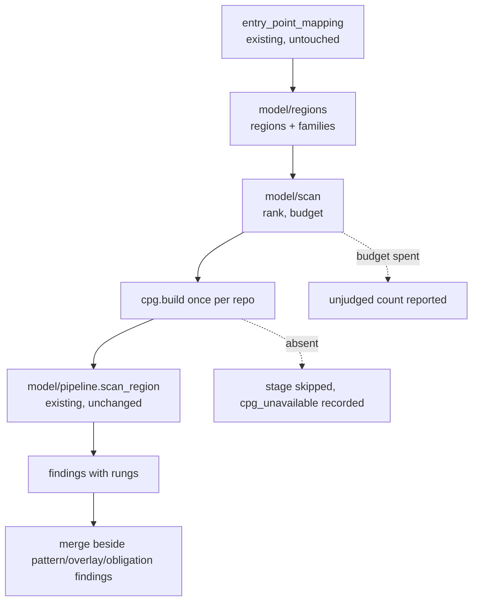

# Design Document: contributor-scan

## Overview

`model-grounded-detection` built an arbiter and measured it at 90.0% pair-correct / 6.7% leak on vibe-py. It
has **zero production callers**. This feature makes it reachable, and makes it work on a repository rather
than on a labelled function.

The shape is deliberately conservative: the model layer joins the existing scan as **one more stage inside
MAP**, beside the obligations checker it most resembles, and adds findings rather than replacing any. The
pattern and overlay paths keep working exactly as they do today, the gates stay byte-identical, and a machine
without a CPG engine scans exactly as it does now. Nothing in this design is allowed to make the tool worse
for someone who does not have Joern.

### Goals

- A finding with a rung reaches a user through `ousast scan`.
- Regions come from entry points, not from a label a contributor cannot supply.
- Ranking and budget hold at repository scale.
- The performance envelope is measured on a real checkout, not asserted.

### Non-Goals

- New arbiters or families — the three forms exist and are measured.
- Any optimiser, prompt search, or K-run averaging. The predecessor deleted that machinery; this does not
  reintroduce it by another name.
- Building a sandbox. Req 10 of the predecessor stands: adopt, never build.
- Changing the gates, the taxonomy, or the fact-table schema.

## Boundary Commitments

### This Spec Owns

- `model/regions.py` — entry points and file fallbacks to regions, with the family routing for each.
- `model/scan.py` — the repository-level driver: rank, budget, dispatch to `model/pipeline`, collect.
- The `Stage.MAP` wiring in `cli.py` and the scan's model-layer payload and report section.
- `benchmarks/repos/` — pinned known-vulnerable checkouts and their baselines.
- The decisions in Req 7 and their record.

### Out of Boundary

- `model/pipeline`, `taint`, `dominance`, `config_value`, `ladder`, `specs`, `candidates` — built, measured,
  used unchanged. If this feature needs to change one, that is a signal the change belongs in its own commit
  with its own measurement.
- `mapping.analyze_entry_points`, the overlay, the obligations checker, the gates — untouched.

### Allowed Dependencies

- Core: standard library. `dependencies = []` unchanged.
- Optional and capability-detected, each degrading to a recorded reason: the CPG engine (Joern), the LLM
  endpoint, any execution tier.

### Revalidation Triggers

- Any gate output moving (Req 1.4).
- A scan on a machine without Joern behaving differently from today (Req 1.3).
- The repository baseline losing a previously-entailed finding (Req 10.3).

## Architecture

### Existing Architecture Analysis

`ousast scan` runs `policy_load → ruleset_load → preprocess → entry_point_mapping → rank → calibrate →
STATIC → MAP → REGRESS → report`. Inside MAP it already builds a complexity map, runs the overlay, and — the
closest analogue to what we are adding — runs `_check_obligations(root, targets, entries, facts, settings,
runtime, hunter_model)`, which takes entry points, produces findings, and merges them by re-ranking.

The model layer slots in exactly there, with the same shape and the same failure discipline. `entry_points`
is already computed at line ~249 and carries what region selection needs: `path`, `line`, `end_line`,
`function_name`, `access_level`, `trust_boundary`.

### Boundary Map



### Key Decisions

| Decision | Choice | Why |
|---|---|---|
| Where it runs | a stage inside `Stage.MAP` | it needs entry points, which MAP has; it mirrors the obligations checker exactly |
| CPG lifetime | **one build per scan**, reused across regions | a build is 5–30s on an excerpt and the dominant cost at repo scale; per-region builds would make this unusable |
| Region source | entry points, file fallback | Req 2; a contributor has no labelled function |
| Family routing | by region shape and language, from the specs that exist | Req 2.3; asking every family of every region is the unbounded version |
| Budget | one total per scan, spent highest-rank-first | Req 3.2; the enumerator's per-region cap of 8 is meaningless across thousands of regions |
| Ordering | rung first, then rank | Req 3.1; what the model established outranks what the LLM proposed |
| Merge | additive | Req 1.2; removing an existing finding is a product change nobody asked for |

## File Structure Plan

### New

```
src/openultrasast/model/
├── regions.py     # EntryPointRecord|FileTarget -> Region + the families that region admits
└── scan.py        # repo driver: rank regions, hold the budget, drive pipeline, collect findings

benchmarks/repos/
├── README.md      # what a pinned checkout is for and how a baseline is regenerated
└── <repo>.toml    # pinned url + commit + the known CVE and where it lives
```

### Changed

- `cli.py` — a `model` stage inside MAP, mirroring `_check_obligations`; its payload into the manifest and a
  report section.
- `model/report.py` — a per-rung summary block for a scan (it currently reports per-slice for corpus runs).
- `config.py` — a `ModelConfig`-style block: enabled, budget, max regions. Zero-dep, defaults conservative.

### Unchanged and load-bearing

`model/pipeline`, `taint`, `dominance`, `config_value`, `specs`, `candidates`, `ladder`; `mapping`; the three
gates; `redaction`.

## Components and Interfaces

### model/regions.py

```python
@dataclass(frozen=True)
class ScanRegion:
    """Where to look, and what to look for there."""
    path: str
    function: str | None       # None for a file-level fallback region
    families: tuple[str, ...]  # only the families this region's shape and language admit
    rank: float                # from the entry point's access level and trust boundary
    source: str                # "entry_point" | "file_fallback"

def regions_for(entries, targets, *, taxonomy, language_of) -> tuple[ScanRegion, ...]
```

Ranking uses what `EntryPointRecord` already carries — an externally-reachable entry point at a trust
boundary outranks an internal one — rather than inventing a new signal.

### model/scan.py

```python
@dataclass(frozen=True)
class ScanBudget:
    """A total for the run, not a per-region cap."""
    max_model_calls: int = 200
    max_regions: int = 500

@dataclass(frozen=True)
class ModelScanResult:
    findings: tuple[ModelFinding, ...]
    by_rung: Mapping[str, int]
    regions_scanned: int
    regions_unjudged: int      # Req 3.3: reported, never silently truncated
    model_calls: int
    cost_usd: float
    degradations: tuple[Mapping[str, object], ...]

def scan_repository(root, regions, *, backend, specs, client, model, budget) -> ModelScanResult
```

One CPG for the run; regions consumed in rank order; the budget decremented per model call and checked before
each; everything past exhaustion counted into `regions_unjudged`.

## Error Handling

| Condition | Behaviour | Recorded |
|---|---|---|
| No CPG engine | stage skipped, scan otherwise identical to today | `cpg_unavailable` |
| CPG build fails on the repo | stage skipped, other stages proceed | `cpg_build_failed` + stage |
| A region's query times out | that region yields nothing, the scan continues | `cpg_query_timeout` |
| Budget exhausted | stop asking; count the rest | `budget_exhausted` + `regions_unjudged` |
| No LLM endpoint | entailment still reported; suspicion band unasked | `learning_endpoint_unavailable` |

## Requirements Traceability

| Criteria | Delivered by |
|---|---|
| 1.1, 1.2 | the `model` stage in MAP; findings merged additively |
| 1.3 | capability probe; stage skipped with `cpg_unavailable` |
| 1.4 | the committed gate baseline, re-run before and after |
| 1.5 | `ModelScanResult.by_rung` into the manifest and report |
| 2.1, 2.2 | `regions_for` over `entry_points`, file fallback recorded in `ScanRegion.source` |
| 2.3 | `ScanRegion.families` from region shape and language |
| 2.4 | no `function` label on the scan path; `ScanRegion.function` may be None |
| 3.1 | ordering by rung, then rank |
| 3.2, 3.4 | `ScanBudget` total, regions consumed in rank order |
| 3.3 | `regions_unjudged` + `budget_exhausted` |
| 3.5 | `cost_usd`, elapsed in the manifest |
| 4.1–4.5 | `benchmarks/repos/` pinned checkouts; a measurement recording build time, wall-clock, peak memory, rungs, cost, and whether the known CVE was found |
| 5.1, 5.2 | rung + witness + path:line on every finding; the report states what `suspicion` means |
| 5.3 | findings to the writable output, never the analysed tree |
| 5.4 | `model/report.py` scan summary |
| 6.1–6.5 | the image built and verified; wrappers; read-only mount; network off; pinned + checksummed engine |
| 7.1, 7.2, 7.3 | the two decisions recorded in this spec's notes with their reasons |
| 8.1, 8.2 | `model/report.py` per-slice + overfitting gap, already built |
| 8.3, 8.4 | redaction on every prompt; capability detection throughout |
| 8.5 | the sibling-audit step in task 1.1 |
| 9.1–9.7 | the corpus tasks, each gated on a read-check before vendoring |
| 10.1–10.4 | `benchmarks/repos/` baselines, delta reporting, engine version recorded |

## Migration and Phases

1. **Wire it (Req 1, 2).** Regions, the MAP stage, findings with rungs reaching a report. Gate-protected.
   Nothing else matters until a user can see a rung.
2. **Scale it (Req 3, 4).** Budget and ranking, then the first run against a pinned known-vulnerable
   checkout — the measurement that has never been taken and can reshape the rest.
3. **Ship it (Req 5, 6).** Contributor output; build and verify the image that is currently only defined.
4. **Close the deferred (Req 7).** The memory decision; retire `evidence_level`.
5. **Grow the corpus (Req 9).** PHP/WordPress first — the families the model arbitrates best. C CVEs only
   after 7.1.
6. **Regression baselines (Req 10).**

Phase 2 is the one that can invalidate the rest: if a CPG build on a real repository is infeasible, the
region/budget design changes shape and it is better to learn that before phases 3–6 are built on it.
