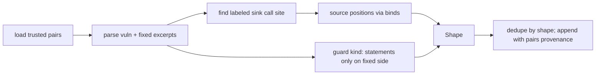

# Design Document

## Overview

**Purpose.** Turn trusted pairs into mechanism records, search scanned trees for structural variants, measure the corpus's own detection rate leave-one-out, and give the improve loop a recall-raising lever.

**Users.** Maintainers export and measure. AppSec engineers get variant findings that name the known mechanism and its known fix. The improve loop admits or retracts mechanisms under the existing gate.

**Impact.** `semantic/mechanisms.py` gains additive fields and a second writer. New `semantic/variants.py` (shapes and matching) and `semantic/loo.py` (leave-one-out). MAP runs variant search after overlay. `improve` gains the `mechanisms` lever. Reports show mechanism ids. No disposition, gate, or sandbox change.

### Goals

- One mechanism record per distinct shape, seeded from `seeded` and `reviewed` pairs.
- Variant findings on real trees at `suspicion`, merged with overlay flows when present.
- Leave-one-out recall, silence, and Youden per slice, profile, and mechanism.
- `mechanisms` lever under the existing accept gate and per-profile holdout.

### Non-Goals

- LLM-authored shapes, regex growth, disposition or ladder changes, inter-file flow, embedding changes, new gates.

## Boundary Commitments

### This Spec Owns

- Shape derivation and matching (`variants.py`).
- Additive mechanism fields, corpus writer, dedupe (`mechanisms.py`).
- Variant proposer in MAP and manifest counters.
- Leave-one-out runner and artifact (`loo.py`, `pairs --loo`).
- `mechanisms` lever, its validator rules, proposer, journal fields.
- Report rendering of mechanism ids.

### Out of Boundary

- `OverlayRecord` fields beyond an optional `mechanism_id`; dispositions; evidence rungs.
- Catalog schema, scorer rules, harvest (`pair-corpus-honesty`).
- Taint, facts, walker; call graph; hunter.
- Rule and policy levers; ledger format.

### Allowed Dependencies

- `FileIR`, `parse_file`, `SemanticFacts`/`load_facts` (read), `adjudicate` output, `MechanismStore`, `PairCase`/`load_pair_catalog`/`select_slice`, pair scorer matching helpers (read), `run_round` gate, `EvolveValidator`, journal, reports.

### Revalidation Triggers

- Variant findings stamped above `suspicion` without overlay or sandbox agreement.
- Seeding from `advisory` or `title` pairs.
- Free-form shape text accepted by the validator.
- Leave-one-out used as a gate.

## Architecture

```mermaid
flowchart TB
  PAIRS[trusted pairs: seeded | reviewed] --> EXPORT[derive_shape per pair]
  EXPORT --> STORE[mechanisms.jsonl origin=corpus]
  STORE --> VS[variant search in MAP]
  IR[FileIR of scanned tree] --> VS
  FACTS[facts: sources] --> VS
  VS --> VF[variant findings: suspicion, mechanism_id]
  OV[overlay records] --> MERGE[merge when same call site has a flow]
  VF --> MERGE
  MERGE --> CAND[regress candidates after promotions]
  PAIRS --> LOO[leave-one-out runner]
  STORE -. temp store per held-out pair .-> LOO
  LOO --> ART[loo.json + roadmap table]
  LOO --> PROP[improve proposer: admit/retract]
  PROP --> GATE[accept gate + per-profile holdout]
  GATE --> STORE
```

**Key decisions**

- Shapes are closed structures derived from `FileIR`, never text patterns.
- Variant search proposes at `suspicion`; overlay or sandbox raises.
- Leave-one-out is the corpus's detection rate and is reported only.
- The lever edits record ids from the exporter; validator rejects anything else.

### Technology Stack

| Layer | Choice | Role | Notes |
|-------|--------|------|-------|
| Shapes | stdlib dataclasses over `FileIR` | derive, match | no new parser |
| Store | existing JSONL + cache | corpus and sandbox records | additive fields |
| Search | MAP stage | proposer | file budget as rank |
| LOO | temp dirs + existing pair materialization | measurement | artifact only |
| Improve | existing lever machinery | admit/retract | same gate |

## File Structure Plan

```
src/openultrasast/
├── semantic/
│   ├── mechanisms.py   # Mechanism += origin, review_tier, pairs, shape, guard; append_from_pair; dedupe_by_shape
│   ├── variants.py     # Shape, GuardKind, derive_shape(vuln_ir, fixed_ir, label, facts) -> Shape|None; match_shapes(file_ir, shapes, facts) -> list[VariantHit]
│   ├── variant_search.py # search_tree, hits_to_findings, SearchResult (needs store/overlay/findings; variants.py stays free of them)
│   ├── seed.py         # export_mechanisms(cases, store) -> ExportReport (maintainer command `mechanisms export`)
│   └── loo.py          # evaluate_loo(cases, *, store_factory) -> LooResult; payload
├── findings.py         # origin "variant" via tags/finding_id prefix "variant:" (no schema change)
├── cli.py              # MAP: variant search after overlay; manifest counters; `pairs --loo`; `mechanisms export --slice`; `improve --mechanism-candidates/--mechanism-store/--no-mechanisms` (defaults: target calibration dir, then cwd)
├── improve/validator.py# MechanismEdit lever "mechanisms"
├── improve/evolve.py   # proposer from loo misses/leaks; mechanism edits decided by the per-profile clause over variant search (see §Lever)
└── reports.py          # mechanism id, guard, provenance on findings
tests/
├── test_variants.py, test_variant_search.py, test_variant_scan.py, test_mechanism_export.py, test_mechanism_seed.py, test_loo.py, test_mechanism_lever.py, test_mechanism_loop.py, test_mechanism_reports.py
```

### Modified Files

- `semantic/overlay.py` — `OverlayRecord.mechanism_id: str | None = None` (additive).
- `regress/candidate.py` — exposes `hotspot_from_finding`; variant findings enter the ranked candidate slice as zero-score hotspots from `cli.py` (after every scored promotion, inside the cap, through the safety check).
- `config.py` — `[variants] enabled=true, max_mechanisms=500`.

## System Flows

### Export



### Variant search in MAP

For each parsed file within the MAP budget: for each call site whose trailing callee name equals a shape's sink name and whose arity matches, check the shape's source positions: the argument carries a fact source, a function parameter, or a container read (bind whose value is a subscript or `.get(`). On match emit a `variant:<mechanism_id>:<path>:<line>` finding at `suspicion`. If an overlay record exists at that path and line with a flow, set its `mechanism_id` and do not emit a separate finding.

### Leave-one-out

For each trusted pair P in the slice: temp store from all trusted pairs except P; materialize P's sides; run variant search on both; detection if a variant hit lies inside P's labeled function and names P's mechanism id or matches P's sink; leak if any hit on the fixed side. Aggregate per slice, profile, mechanism; record which mechanism found P.

## Requirements Traceability

| Requirement | Summary | Components | Flows |
|-------------|---------|------------|-------|
| 1.1–1.5 | seed from trusted pairs, dedupe, origin corpus, maintainer command | Export, Store | export |
| 2.1–2.5 | structural shapes, closed guard kinds, no text, extra-absent degradation | Shape | export |
| 3.1–3.6 | proposer at suspicion, merge, candidates, budget, absent from quick | VariantSearch | MAP |
| 4.1–4.4 | leave-one-out per slice/profile/mechanism, artifact, not a gate | LOO | leave-one-out |
| 5.1–5.5 | lever, validator, proposer, gate unchanged, journal | Lever | improve |
| 6.1–6.3 | reports, manifest counters, suspicion label | reports | — |
| 7.1–7.3 | offline tests, gates unchanged, extra-free green | tests | — |

## Components and Interfaces

| Component | Domain | Intent | Req | Dependencies | Contracts |
|-----------|--------|--------|-----|--------------|-----------|
| Shape | semantic | derive and compare shapes | 2 | FileIR, facts | Service |
| Export | maintainer | pairs → records | 1 | PairCase, Shape, Store | Batch |
| Store | semantic | additive fields, dedupe | 1.3, 1.4 | JSONL | State |
| VariantSearch | MAP | propose at suspicion | 3 | Shape, Store, overlay | Service |
| LOO | maintainer | detection rate of the corpus | 4 | Export, VariantSearch, pair rules | Batch |
| Lever | improve | admit/retract records | 5 | validator, gate | Batch |

### Shape

```python
GUARD_KINDS = ("null_test", "bounds_test", "allowlist_test", "auth_check", "parameterized_call", "type_change", "none")
SOURCE_KINDS = ("fact_source", "parameter", "container_read")

@dataclass(frozen=True)
class Shape:
    language: str
    sink_name: str            # trailing callee segment
    arity: int
    source_positions: tuple[int, ...]
    source_kinds: tuple[str, ...]
    guard: str                # GUARD_KINDS
    mechanism: str            # closed vocabulary id from the pair label

    def key(self) -> str: ...  # stable, text-free

def derive_shape(vuln: FileIR, fixed: FileIR, *, function: str, sink: str | None, line: int | None, mechanism: str, facts: SemanticFacts, vuln_text: str = "", fixed_text: str = "", cwe: str | None = None) -> Shape | None: ...
    # texts: guard statements are neither calls nor binds in FileIR, so the guard kind is classified from the labeled
    # function's lines present only on the fixed side (closed set, none of the text enters the shape); cwe: when a label
    # names no sink and no line, the fact-sink call in the function whose CWE matches is the labeled call.
def match_shapes(ir: FileIR, shapes: Sequence[Shape], facts: SemanticFacts, *, mechanism_ids: Mapping[str, str]) -> list[VariantHit]: ...
```

Invariants: shapes carry no path, line, or literal beyond identifiers; `derive_shape` returns None when the labeled sink call site is not found.

### Store additions

`Mechanism` gains `origin: str = "sandbox"`, `review_tier: str = ""`, `pairs: tuple[str, ...] = ()`, `shape: dict[str, object] | None = None`, `guard: str = "none"`. `append_from_pair(store, shape, *, summary, cwe, pair, provenance, tier)` dedupes on `shape.key()` and extends `pairs`. Old rows load with defaults.

### VariantSearch

```python
@dataclass(frozen=True)
class VariantHit:
    path: str
    line: int
    mechanism_id: str
    sink_name: str
    source_kind: str

def search_tree(root: Path, targets: Sequence[FileTarget], store: MechanismStore, facts: SemanticFacts, *, max_mechanisms: int) -> SearchResult: ...  # hits, mechanisms_searched, files_searched, degradations
def hits_to_findings(hits, records: Sequence[OverlayRecord], summaries: Mapping[str, tuple[str, tuple[str, ...], str]]) -> tuple[list[StaticFinding], list[OverlayRecord]]: ...  # merge with overlay flows
```

Finding: id `variant:<mechanism_id>:<path>:<line>`, evidence `suspicion`, tags `["variant", "mechanism:<id>"]`, rationale names the mechanism summary and pair provenance.

### LOO

```python
@dataclass(frozen=True)
class LooOutcome:
    pair: str
    detected: bool
    silent: bool
    found_by: tuple[str, ...]   # mechanism ids (and their pairs) that hit inside the labeled function

def evaluate_loo(cases: Sequence[PairCase], *, facts: SemanticFacts) -> LooResult: ...  # per slice/profile/mechanism metrics
```

Only `seeded | reviewed` pairs seed; every trusted pair is held out once. `known_limit` pairs are excluded.

### Lever

`MechanismEdit(lever="mechanisms", action="admit"|"retract", mechanism_id, source="loo"|"export", rationale)`. Validator: id must exist in the exporter's candidate set; shape guard in `GUARD_KINDS`; no free text fields beyond rationale. Proposer: admit candidates whose leave-one-out hit recovers a currently missed holdout pair in some profile; retract admitted records that leak on holdout fixed sides. Application: admit appends the exporter record, retract appends a `retracted = true` tombstone (`MechanismStore.load` folds it away; the log stays append-only); `StoreSnapshot.restore` reverts byte for byte. A retraction may also name a record admitted in the scan store but no longer a candidate.

Gate (implemented 2026-09-05, deviation from the first draft's "gate unchanged"): the rule gate and its per-profile clause are unchanged for rule edits; mechanism edits are decided by the *same* `profile_regressions` clause applied to `evaluate_mechanism_profiles` (holdout pairs scored per provenance profile by variant search with the store before and after, via `loo.score_pair_with_store`), because the overlay scorer cannot see what the store changes. Rejection reasons: `mechanism_leak:<id>` (an admission fires on a holdout fixed side, §Error Handling), `profile_regression:<profile>`, `mechanism_no_gain` (no profile gains a correct pair and nothing is retracted); every rejection restores the store byte for byte and the reverted key is blocked in later rounds regardless of rationale. The exporter writes `mechanism-candidates.jsonl`; only the lever writes the scan-time `mechanisms.jsonl`.

## Data Models

Store row additions: `origin`, `review_tier`, `pairs`, `shape`, `guard`. Manifest: `"variants": {"mechanisms_searched": n, "files_searched": m, "findings": k, "merged_into_overlay": j}`. LOO artifact `loo.json`: `per_slice`, `per_profile`, `per_mechanism`, `outcomes[]` with `found_by`.

## Error Handling

| Condition | Response |
|-----------|----------|
| Extra absent for a language | shape derivation and search skipped for that language; degradation `variants_language_unsupported` |
| Labeled sink not found in vuln IR | pair skipped from export with a reason in the export report |
| Store row lacks `shape` (sandbox origin) | not used for search; still used for prove ordering |
| Admission leaks on holdout | round rejected, store reverted |

## Testing Strategy

- Unit: derive_shape on a Python pair (request → `os.system`, fix adds allowlist) yields sink `system`, arity 1, source position 0, guard `allowlist_test`; match_shapes finds a variant in another file and ignores constant arguments; shape has no path or literal; `<anon>` sinks resolve to enclosing named function for LOO scoring.
- Integration: export over the sast slice writes deduped rows with `origin=corpus`; variant search on the split-sink Python fixture emits a `variant` finding merged into the overlay coverage record; LOO on a three-pair toy slice reports which pair taught which.
- Improve: admitting a record that recovers a holdout pair is accepted; one that leaks is rejected with byte-identical store.
- Gates: detection, map, local pair gates unchanged; extra-free green with semantic tests skipping.

## Security Considerations

Shapes carry no code text; store rows are data. Variant findings never execute anything; sandbox candidates follow the existing safety check.

## Performance

Search is O(call sites × shapes) per file with a name index on `sink_name`; bounded by MAP budget and `max_mechanisms`. LOO parses each excerpt once and reuses IR.

## Migration Strategy

1. Store fields and exporter; export the sast and vibe-py trusted pairs; record counts.
2. Variant search behind `[variants].enabled` (default true in standard); manifest counters.
3. LOO command and roadmap table.
4. Lever and proposer.
