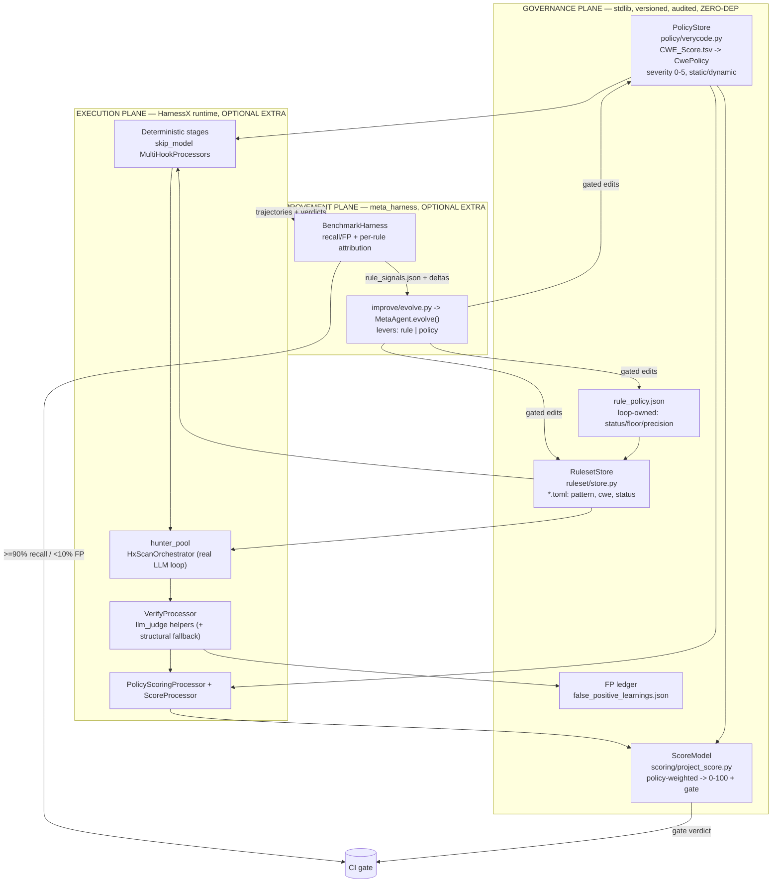
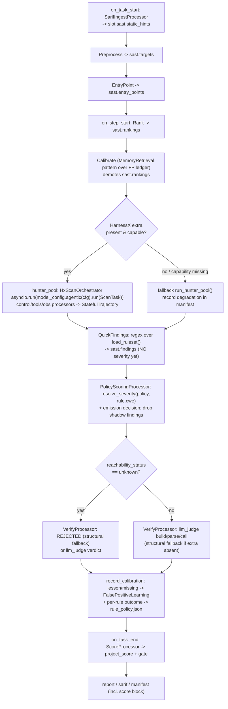
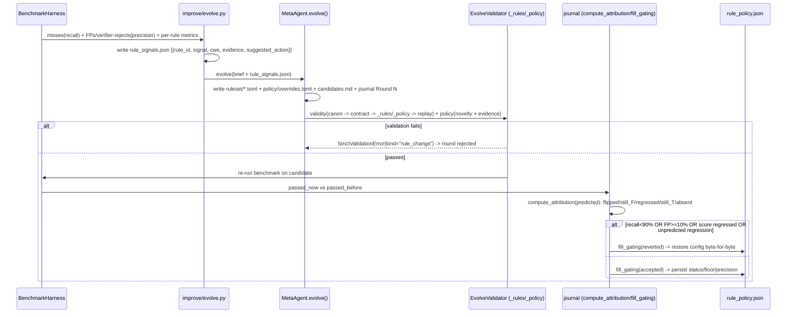
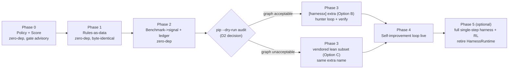

# Design Document

## Overview

**Purpose.** This feature splits OpenUltraSAST's single overloaded regex layer — which today is detector, severity authority, and volume knob at once — into three governed owners: **rules detect**, a **central CWE policy decides severity and scope**, and a **single project score** becomes the optimization target. On top of that governance plane it adopts the HarnessX runtime exactly where it pays off — the LLM hunter loop, the LLM-judge verifier, and a meta-harness self-improvement loop that adapts rules and policy gates under hard bounds.

**Users.** OpenUltraSAST maintainers gain a staged, reversible HarnessX adoption and an automatic, gated rule/policy tuning loop. Security policy owners gain a versioned, central CWE-to-severity policy. Security reviewers and CI consumers gain a bounded 0-100 AppSec project score with a two-condition gate.

**Impact.** Today `findings.PatternRule` carries a string `severity`, `quick_scan_findings` reads a module-level `PATTERN_RULES`, `calibration.py` only demotes ranking (floored at `MIN_CALIBRATED_PRIORITY = 0.1`, keyed on `tags[0]`), `benchmark.py:368` writes an inert `next_improvement_candidate="rules_or_language_hunter"`, and `harness.HarnessRuntime.run_stage` is a sync dict-state driver. This design turns rules into TOML data, removes `PatternRule.severity`, sources severity from a vendored verycode `CWE_Score.tsv`, computes a project score, makes the benchmark actionable, and confines HarnessX behind an optional, SHA-pinned, lazy-imported extra — while `dependencies = []` and `requires-python = ">=3.11"` stay intact and the **≥90% recall / <10% FP** detection gate holds at every phase.

### Goals

- Rules become versioned data (`ruleset/<lang>/*.toml`) with a loop-controlled `status` and no rule-local severity.
- One CWE = one governed severity, sourced from `policy/CWE_Score.tsv` via `resolve_severity()`.
- A single 0-100 `project_score` from `policy.severity × reachability`, with a two-condition CI gate.
- HarnessX adopted at the hunter loop, the verifier, and the meta-harness, behind `openultrasast[harnessx]`.
- A bounded self-improvement loop (`rule`, `policy` levers) that auto-reverts byte-for-byte under the gate.
- The governance + scoring + benchmark planes stay **zero-dependency** and **byte-identical by default** through Phases 0-2.

### Non-Goals

- The loop authoring or rewriting detection pattern text (human PR only).
- The loop editing the authoritative 0-5 CWE severity (verycode-upstream authority).
- A full single-step HarnessX rewrite of all deterministic stages and weight-level RL (deferred to optional Phase 5+).
- Changing the reachability vocabulary, which stays exactly `reachable | inferred-file-surface | unknown`.
- Dynamic/DAST scoring — report-only for a static tool.

## Boundary Commitments

### This Spec Owns

- The **RulesetStore** (`ruleset/store.py` + `ruleset/<lang>/*.toml`): `load_ruleset()`, the `PatternRule` schema (detection-only), and the `enabled|shadow|disabled` status vocabulary.
- The **PolicyStore** (`policy/verycode.py` + `policy/CWE_Score.tsv`): `load_policy()`, `CwePolicy`, `resolve_severity()`, and the CWE-120→CWE-121 remap.
- The **ScoreModel** (`scoring/project_score.py`): `SEV_WEIGHT`, `REACH_MULT`, `finding_penalty`, `project_score`, the score artifact, and the two-condition CI gate.
- The **loop ledger** (`.openultrasast/calibration/rule_policy.json`): the loop-owned overlay of `status`/evidence-floor/threshold/precision.
- The **HarnessX seam**: `harness/build_sast.py`, `HxScanOrchestrator`, the `MultiHookProcessor` SAST processors, the `SlotContractMixin`, and the `improve/` meta-harness driver.
- The **benchmark→signal** conversion: `rule_id` attribution, per-rule precision/recall, `rule_policy_delta`, and `rule_signals.json`.

### Out of Boundary

- The detection-pattern **content** of rules (authored by humans via PR; the loop may only toggle status / raise floors).
- The authoritative **0-5 severity** numbers in `CWE_Score.tsv` (verycode-upstream; PR gaps there).
- Upstream **HarnessX internals** beyond the minimal meta-harness patch (`_VALID_LEVERS`, `_render_task_brief`, `EvolveValidator`, changeset buckets, `contract_autocheck`).
- The DAST/dynamic execution engine; dynamic-only CWEs are report-only here.
- Retiring `HarnessRuntime` and adopting `rl/` — explicitly Phase 5+, optional.

### Allowed Dependencies

- **Stdlib only** for the governance/scoring/benchmark planes: `tomllib`, `csv`, `json`, `math`, `dataclasses`.
- **HarnessX** only behind the `[harnessx]` extra, pinned to a commit SHA, imported lazily behind `_has_harnessx()`.
- The existing `HarnessRuntime` as the top-level sync driver through Phases 0-4 (not removed by this spec until Phase 5).
- The existing reachability vocabulary emitted by `findings.py` (consumed, never redefined).

### Revalidation Triggers

- **Contract shape changes** to `PatternRule` (removing `severity`), `CwePolicy`, `VerificationResult`, `BenchmarkMiss`/`BenchmarkFalsePositive` (adding `rule_id`), or the `project_score` artifact JSON.
- **Data ownership change**: severity moving from rule → policy; calibration re-keying from `tags[0]` → `rule_id`.
- **Dependency direction change**: any new import of HarnessX outside a lazy `_has_harnessx()` guard; any addition to core `dependencies`.
- **Runtime prerequisite change**: the startup CWE-resolution invariant (fail-loud if an enabled rule's CWE is unmapped); the `pip install --dry-run` audit gate before Phase 3.
- **Lever surface change**: any addition to `journal._VALID_LEVERS` or the `EvolveValidator` bounds.

## Architecture

### Existing Architecture Analysis

| Existing element | File | Constraint to respect / debt to fix |
|---|---|---|
| `HarnessRuntime.run_stage(name, callback)` | `harness.py:74` | Sync, dict `state` (`{"degradations": []}`), single `HarnessEvent` (`scan_id`), `ProcessorSpec.reads/writes` allow-list. Incompatible with HarnessX async-generator + message-window contract — **bridge, do not map**. Stays as the top-level driver through Phase 4. |
| `PatternRule.severity: str` + module-level `PATTERN_RULES` | `findings.py:31,34` | The fused defect: regex carries its own severity string ("high"/"medium"/"low") and is the only volume control. **Remove `severity`; externalize patterns to TOML.** |
| `quick_scan_findings(root, targets, rankings)` | `findings.py` / `cli.py:126` | Reads `PATTERN_RULES` implicitly. Becomes `quick_scan_findings(..., ruleset)` wired like `static_hints`. |
| `calibrate_rankings` demotion | `calibration.py:146` | `max(MIN_CALIBRATED_PRIORITY, calibrated - 0.5)`, keyed on `finding.tags[0]` (`calibration.py:262`). Demotes ranking, never the rule. **Re-key to `rule_id`; write status flips to ledger.** |
| `verify_findings` rejects on `reachability_status == "unknown"` | `verification.py:91` | Structural verifier. Keep as **zero-dep fallback**; add LLM-judge path. |
| `benchmark.py:368` `next_improvement_candidate="rules_or_language_hunter"` | `benchmark.py` | Inert stub written to `calibration_records.json`. **Make actionable** via `rule_id` attribution + `rule_policy_delta`. |
| `cli.py` `run_stage(...)` call chain | `cli.py:104-145` | The 13-stage sync pipeline. Stages migrate to HarnessX hooks incrementally; the hunter pool first. |

### Architecture Pattern & Boundary Map

**Selected pattern.** Three planes with one-directional authority: **governance data drives execution; execution emits signals; the improvement loop edits governance under a gate.** Nothing in execution mutates governance directly. The governance + scoring planes are **pure stdlib, zero HarnessX** (non-negotiable, so CI gating runs in the default install). HarnessX lives only in the execution and improvement planes, behind the extra.

**Boundaries.** RulesetStore detects, PolicyStore decides severity/scope, ScoreModel optimizes — three owners, three change channels (human PR for patterns/severity; loop-via-`EvolveValidator` for status/floors/score-constants).



**New components rationale.** PolicyStore/ScoreModel/RulesetStore exist to break the fused regex defect; `HxScanOrchestrator`/`VerifyProcessor` exist to host the agent loop and judge; `improve/evolve.py`+`EvolveValidator` exist to make adaptation safe (bounded, gated, reversible). **Steering compliance:** zero-dep default install preserved; detection gate kept as a hard constraint separate from the score reward.

### Technology Stack

| Layer | Choice / Version | Role in Feature | Notes |
|-------|------------------|-----------------|-------|
| CLI | `cli.py` (`_run_scan`) | Wires ruleset/policy; Phase 3 routes hunter pool to `HxScanOrchestrator` | Unchanged entrypoints when extra absent |
| Governance | Python 3.11 stdlib (`tomllib`, `csv`, `dataclasses`) | RulesetStore + PolicyStore load | Zero-dep, fail-loud on unmapped CWE |
| Scoring | Python stdlib `math` | `project_score` exponential decay | Always on, zero-dep |
| Execution runtime | HarnessX `@ git+...@<SHA>` (optional extra) | Hunter loop, judge verifier, processors | Lazy import behind `_has_harnessx()` |
| Self-improvement | HarnessX `meta_harness` (extra/vendored) | `MetaAgent.evolve` + `EvolveValidator` + journal | 5/6-hook minimal patch |
| Data / Storage | TOML rulesets, TSV policy, JSON ledger/artifacts | Versioned governance + loop overlay | All `_target_`/JSON-serializable for resume |
| Events | HarnessX lifecycle hooks (`on_task_start`…`on_task_end`) | Stage→hook mapping | `HarnessRuntime` sync driver retained Phases 0-4 |
| Packaging | `pyproject.toml` `[project.optional-dependencies]` | `harnessx` extra, pinned SHA | Core `dependencies = []` unchanged |

## File Structure Plan

### Directory Structure

```
src/openultrasast/
├── ruleset/
│   ├── store.py              # load_ruleset()/write_ruleset(); PatternRule (NO severity); status/min_evidence_level/precision_estimate/version
│   ├── python/*.toml         # rules-as-data, one [[rule]] per detector
│   ├── c/*.toml              # incl. CWE-120 -> CWE-121 remapped buffer rules
│   └── <lang>/*.toml         # same pattern per language
├── policy/
│   ├── verycode.py           # load_policy() -> dict[str, CwePolicy]; resolve_severity(); CwePolicy dataclass
│   └── CWE_Score.tsv         # vendored verycode data (167 CWEs; header "Flaw Severity " has trailing space)
├── scoring/
│   └── project_score.py      # SEV_WEIGHT, REACH_MULT, finding_penalty(), project_score(), gate()
├── harness/                  # Phase 3 (extra)
│   ├── build_sast.py         # build_sast() factory mirrors examples/coding/build_coding
│   ├── task.py               # ScanTask(BaseTask)
│   ├── run.py                # HxScanOrchestrator: asyncio.run around model_config.agentic(cfg).run(...)
│   ├── slot_contract.py      # SlotContractMixin: reads_slots/writes_slots on MultiHookProcessor
│   └── processors.py         # SarifIngest/Preprocess/EntryPoint/Rank/Calibrate/QuickFindings/PolicyScoring/Verify/Score processors
└── improve/                  # Phase 4 (extra)
    ├── evolve.py             # orchestrator: benchmark -> delta -> rule_signals.json -> MetaAgent.evolve() -> re-benchmark -> accept/revert
    ├── rule_validator.py     # EvolveValidator._rules / ._policy bound checks
    └── rule_autocheck.py     # ContractAutoCheckProcessor _check_rule/_check_policy branches

.openultrasast/calibration/
└── rule_policy.json          # loop-owned ledger: status/threshold/evidence-floor/precision per rule_id
```

### Modified Files

- `findings.py` — extract `PATTERN_RULES` to TOML; **delete `PatternRule.severity`**; `quick_scan_findings(root, targets, rankings, ruleset)` takes ruleset arg.
- `calibration.py` — re-key from `tags[0]` (line 262) to `rule_id`; write `rule_policy.json` status flips, not only ranking demotion (line 146).
- `benchmark.py` — add `rule_id` to `BenchmarkMiss`/`BenchmarkFalsePositive`; per-rule precision/recall in `BenchmarkMetrics`; emit `rule_policy_delta`; replace the inert stub at line 368; add `BenchEvaluator` subclass.
- `verification.py` — add LLM-judge path (`VerifyProcessor` over `llm_judge` helpers); keep structural verifier (`reachability_status == "unknown"` reject, line 91) as zero-dep fallback.
- `config.py` — ruleset/policy/score paths + gate thresholds (`K`, `MIN_SCORE`, `min_emit_priority`, `min_emit_precision`).
- `cli.py` — `_run_scan` wires ruleset/policy; Phase 3 routes the `hunter_pool` `run_stage` call (line 122) to `HxScanOrchestrator`.
- `harness.py` — retired in Phase 5 only.
- `pyproject.toml` — add `[project.optional-dependencies] harnessx = ["harnessx @ git+https://github.com/Darwin-Agent/HarnessX.git@<SHA>"]`; core `dependencies = []` unchanged.
- `harnessx/meta_harness/{journal.py, agent.py, validate_workflow.py, processors/contract_autocheck.py}` — vendored/patched seam (Phase 4).

## System Flows

### Scan pipeline on HarnessX (Phase 3 seam)

The top-level driver stays sync (`HarnessRuntime`); only the `hunter_pool` stage opens an async surface via `asyncio.run`. Deterministic stages run as `skip_model=True` processors carrying work in typed slots; the `SlotContractMixin` validates `reads_slots`/`writes_slots` on every hook (preserving the `ProcessorSpec.reads/writes` discipline). If a HarnessX capability is unavailable at runtime, the stage falls back to its existing equivalent and records a degradation in the manifest.



### Self-improvement loop

The benchmark is the **regression suite governing the data stores**. The objective is `maximize project_score subject to recall ≥ 90% AND FP < 10%` as a hard feasibility constraint — kept separate so the loop cannot "improve" the number by shadowing rules that hurt real security. Every change is `shadow`-staged first, novelty/evidence/replay-gated, and reverted byte-for-byte on any failure.



## Requirements Traceability

| Requirement | Summary | Components | Interfaces | Flows |
|-------------|---------|------------|------------|-------|
| 1.1, 1.4 | Hunter pool on real `Harness.run()`; async confined to one stage | `HxScanOrchestrator` | `run.py:HxScanOrchestrator.run()` | Scan pipeline |
| 1.2 | Verify via llm-judge + structural fallback | `VerifyProcessor` | `processors.py:VerifyProcessor` | Scan pipeline |
| 1.3 | Extra absent → unchanged quick/standard | `cli._run_scan`, `_has_harnessx()` | capability guard | Scan pipeline (`F` branch) |
| 1.5 | Slot allow-list validated per hook | `SlotContractMixin` | `slot_contract.py` | Scan pipeline |
| 1.6 | Deterministic stages `skip_model` | SAST processors | `MultiHookProcessor(skip_model=True)` | Scan pipeline |
| 1.7 | Event/`scan_id` rename to HarnessX hooks/`run_id` | `build_sast`, journal | hook map table | Scan pipeline |
| 1.8 | Capability-missing fallback + manifest degradation | `HxScanOrchestrator` | manifest `degradations` | Scan pipeline (`G2`) |
| 2.1, 2.4 | Rules-as-data; 3 statuses; no rule severity | RulesetStore | `load_ruleset()`, `PatternRule` | — |
| 2.2, 2.3 | Severity from policy; legacy strings discarded | PolicyStore, `PolicyScoringProcessor` | `resolve_severity()` | Scan pipeline (`I`) |
| 2.5 | Shadow excluded from report+score | `PolicyScoringProcessor`, ScoreModel | emission filter | Scan pipeline (`I`,`M`) |
| 2.6 | CwePolicy 0-5 + static/dynamic; dynamic report-only | PolicyStore | `CwePolicy` | — |
| 2.7 | Fail-loud on unmapped enabled-rule CWE | PolicyStore startup invariant | `load_policy()` check | — |
| 2.8 | CWE-120 → CWE-121 remap | RulesetStore | TOML data | — |
| 2.9, 5.9, 7.5 | Governance/score/benchmark zero-dep | all GOV components | stdlib-only | — |
| 3.1 | Two levers `rule`/`policy` | `improve/evolve.py` | `_VALID_LEVERS` | Self-improvement |
| 3.2, 3.3 | No pattern text / no 0-5 severity edits | `EvolveValidator` | `_rules`/`_policy` | Self-improvement |
| 3.4 | No enabled→disabled jump (shadow mandatory) | `EvolveValidator._rules` | bound check | Self-improvement |
| 3.5 | Parse/status/bounds/dup/CWE-resolve checks | `EvolveValidator._rules` | validity phase | Self-improvement |
| 3.6 | Novelty gate on reverted re-proposals | `journal.check_novelty` | novelty gate | Self-improvement |
| 3.7 | Replay smoke gate (ruleset boots) | `run_synthetic_task_smoke_gate` | replay phase | Self-improvement |
| 3.8, 3.9 | `StrictValidationError`; journal each edit | `EvolveValidator`, journal | `fill_gating` | Self-improvement |
| 4.1, 4.2 | `rule_id` attribution; per-rule metrics; delta artifact | BenchmarkHarness | `rule_policy_delta` | Self-improvement |
| 4.3 | Delta → `rule_signals.json` (miss/fp) | `improve/evolve.py` | signal writer | Self-improvement |
| 4.4, 4.5 | Hard accept gate; byte-for-byte revert | `improve/evolve.py`, journal | `fill_gating(reverted)` | Self-improvement |
| 4.6 | Auto-shadow precision-draggers | `improve/evolve.py` | status flip | Self-improvement |
| 4.7 | Coverage-gap nominates rule (human PR) | `improve/evolve.py` | `rule_signals.json` | Self-improvement |
| 4.8, 6.5 | Score=reward, gate=feasibility (separate) | `improve/evolve.py` | objective split | Self-improvement |
| 5.1, 5.2 | 0-100 score; reachability multipliers | ScoreModel | `project_score()` | Scan pipeline (`M`) |
| 5.3 | Dynamic-only/unmapped → 0 penalty, report-only | ScoreModel | `finding_penalty()` | Scan pipeline (`M`) |
| 5.4 | Shadow excluded from score input | ScoreModel | pre-call filter | Scan pipeline (`M`) |
| 5.5 | Score artifact + manifest block | ScoreModel | score JSON | Scan pipeline (`N`) |
| 5.6 | FP lowers effective reachability, not delete | `calibration.py` | reachability knob | Self-improvement |
| 5.7 | Hard gate: sev5 + reachable → fail | CI Score Gate | `gate()` | — |
| 5.8 | Score gate advisory-first, then blocking | CI Score Gate | `gate()` | — |
| 6.1, 6.4, 6.6 | Per-merge recall/FP gate + HX tolerance | CI Pipeline | benchmark gate | — |
| 6.2 | Byte-identical baseline Phases 0-2 | BenchmarkHarness | golden diff | Migration |
| 6.3 | Gate must pass on re-benchmarked candidate | `improve/evolve.py` | accept gate | Self-improvement |
| 7.1, 7.6 | Empty core deps; pinned extra; non-recursive submodule | Packaging Config | `pyproject.toml` | Migration |
| 7.2 | Lazy import behind capability check | `_has_harnessx()` | guard | — |
| 7.3, 7.4, 7.7 | Dry-run audit; vendored fallback trigger; pre-specified | Packaging Config | audit gate | Migration (Phase 3 gate) |

## Components and Interfaces

| Component | Domain/Layer | Intent | Req Coverage | Key Dependencies (P0/P1) | Contracts |
|-----------|--------------|--------|--------------|--------------------------|-----------|
| RulesetStore | Governance | Rules-as-data + status | 2.1,2.4,2.8 | tomllib (P0), rule_policy.json (P1) | State |
| PolicyStore | Governance | CWE→severity/scope authority | 2.2,2.6,2.7 | CWE_Score.tsv (P0) | State |
| ScoreModel | Scoring | 0-100 score + gate | 5.1-5.9 | PolicyStore (P0) | Batch, State |
| HxScanOrchestrator | Execution | Hunter loop on HarnessX | 1.1,1.4,1.8 | HarnessX (P0), RulesetStore (P1) | Service, Event |
| PolicyScoringProcessor | Execution | Resolve severity + emission | 2.2,2.3,2.5 | PolicyStore (P0) | Event |
| VerifyProcessor | Execution | LLM-judge + structural fallback | 1.2 | llm_judge (P1) | Event |
| EvolveValidator (`_rules`/`_policy`) | Improvement | Bound-check loop edits | 3.2-3.8 | journal (P0), PolicyStore (P1) | Service |
| improve/evolve.py | Improvement | Benchmark→signal→evolve→gate | 4.1-4.8,6.3 | BenchmarkHarness (P0), MetaAgent (P0) | Batch |

### Governance Layer

#### RulesetStore

| Field | Detail |
|-------|--------|
| Intent | Load detection rules from versioned TOML; carry loop-controlled status; carry no severity |
| Requirements | 2.1, 2.4, 2.8, 2.9 |

**Responsibilities & Constraints**
- `load_ruleset(path) -> tuple[PatternRule, ...]` replaces module-level `PATTERN_RULES`; loaded with `tomllib` (zero-dep).
- `PatternRule` carries `rule_id`, `languages`, `cwe`, `tags`, `pattern`, `status`, `min_evidence_level`, `precision_estimate`, `version` — **no `severity` field**.
- `status ∈ {enabled, shadow, disabled}` is the volume control; the loop overlays `status`/`min_evidence_level`/`precision_estimate` from `rule_policy.json`.
- C/C++ buffer rules (`c-unsafe-copy`, `c-unsafe-memory-copy`, `c-unsafe-scanf`) declare `cwe = "CWE-121"` (remapped from unmapped CWE-120).

**Dependencies** — Inbound: `quick_scan_findings` (P0). Outbound: `rule_policy.json` overlay (P1). External: `tomllib` (P0).

**Contracts**: State [x]

##### Service Interface
```python
def load_ruleset(path: Path, ledger: Path | None = None) -> tuple[PatternRule, ...]: ...
def write_ruleset(path: Path, rules: Iterable[PatternRule]) -> None: ...

@dataclass(frozen=True)
class PatternRule:
    rule_id: str
    languages: tuple[str, ...]
    cwe: str                       # the ONLY policy join key
    tags: tuple[str, ...]
    pattern: str                   # human-PR-only; loop must never edit
    status: str = "enabled"        # enabled | shadow | disabled (loop-controlled)
    min_evidence_level: str = "static_corroboration"
    precision_estimate: float = 0.0
    version: str = "1"
```
- **Preconditions:** every loaded rule has a non-empty `pattern` and a `CWE-NNN` `cwe`.
- **Postconditions:** ledger overlay applied; `status`/floors reflect `rule_policy.json`.
- **Invariants:** no `severity` attribute exists; `status` is one of the three literals.

#### PolicyStore

| Field | Detail |
|-------|--------|
| Intent | Authoritative CWE→severity/scope; resolve finding severity |
| Requirements | 2.2, 2.3, 2.6, 2.7, 2.8 |

**Responsibilities & Constraints**
- `load_policy() -> dict[str, CwePolicy]` keyed `"CWE-NNN"` from `CWE_Score.tsv` (167 CWEs; severity column header is literally `"Flaw Severity "` with a trailing space — parse defensively).
- `resolve_severity(policy, rule.cwe, target, ranking)` replaces every literal `rule.severity` read. **Policy always wins**; any legacy rule severity string is discarded.
- **Startup invariant (fail-loud):** every `enabled` rule's `cwe` must resolve in PolicyStore, else the scan aborts. `dynamic`-only CWEs are report-only.

**Dependencies** — Inbound: `PolicyScoringProcessor`, ScoreModel (P0). External: `csv`, `dataclasses` (P0).

**Contracts**: State [x]

##### Service Interface
```python
@dataclass(frozen=True)
class CwePolicy:
    flaw_category: str
    severity: int     # 0..5 — AUTHORITATIVE; overrides any rule string; loop must never edit
    static: bool      # SAST scope gate
    dynamic: bool     # DAST scope — report out-of-scope, never scored by static tool

def load_policy(tsv: Path = CWE_SCORE_TSV) -> dict[str, CwePolicy]: ...
def resolve_severity(policy: Mapping[str, CwePolicy], cwe: str, target, ranking) -> int: ...
def assert_rules_resolve(rules, policy) -> None:  # raises at startup if an enabled rule's CWE is unmapped
    ...
```
- **Invariants:** one CWE ⇒ one severity; two rules for the same CWE always receive identical severity.

### Scoring Layer

#### ScoreModel

| Field | Detail |
|-------|--------|
| Intent | Compute a 0-100 project score and the two-condition gate verdict |
| Requirements | 5.1-5.9 |

**Responsibilities & Constraints**
- Pure stdlib (`math`), always on, zero-dep — runs in the default install with no HarnessX.
- Excludes `shadow`-status findings before computing; assigns 0 penalty to dynamic-only/unmapped CWEs (reports them instead).
- The `REACH_MULT` keys are exactly the three values `findings.py` emits; the reachability multiplier is the **FP-calibration knob** (a confirmed FP lowers effective reachability, never deletes a rule).
- Emits the scan-level artifact and the manifest score block; computes the hard gate (sev5 + reachable) and the score gate (advisory-first).

**Contracts**: Batch [x] / State [x]

##### Service Interface
```python
SEV_WEIGHT = {5: 50, 4: 25, 3: 10, 2: 2, 1: 1, 0: 0}
REACH_MULT = {"reachable": 1.0, "inferred-file-surface": 0.6, "unknown": 0.4}

def finding_penalty(f, rule_cwe: str, policy) -> float:
    pol = policy.get(rule_cwe)
    if pol is None or not pol.static:            # dynamic-only / unmapped -> report, don't score
        return 0.0
    return SEV_WEIGHT[pol.severity] * REACH_MULT.get(f.reachability_status, 0.4)

def project_score(findings, rule_cwe_by_id, policy, K: float = 60.0) -> int:
    # shadow-status findings excluded before this call
    P = sum(finding_penalty(f, rule_cwe_by_id[f.finding_id], policy) for f in findings)
    return round(100 * math.exp(-P / K))         # P=0 -> 100; one critical-reachable -> ~43

def gate(findings, score, *, min_score: int, block_severity_reachable: int = 5,
         blocking: bool) -> dict: ...
```
- **Postconditions:** artifact JSON (see Data Models) written next to per-finding output and merged into the manifest.

### Execution Layer

#### HxScanOrchestrator

| Field | Detail |
|-------|--------|
| Intent | Run the hunter pool on a real HarnessX agent loop, confining async to one stage |
| Requirements | 1.1, 1.4, 1.7, 1.8 |

**Responsibilities & Constraints**
- Invoked from the existing `hunter_pool` `run_stage` callback (`cli.py:122`); wraps `asyncio.run(model_config.agentic(harness_config).run(ScanTask(...)))`.
- `build_sast()` mirrors `examples/coding/build_coding`; `ModelConfig(main=hunter, judge=…, ranker=…, patcher=…).agentic(cfg)` keeps model info out of `HarnessConfig`.
- Each hunter sub-harness registers `LoopDetectionProcessor`, `CostGuardProcessor`/`TokenBudgetProcessor`, `ToolFailureGuard`, `ToolFilterProcessor`, `SelfVerifyProcessor`, `EpisodeMetricsProcessor`/`OTelProcessor`/`CheckpointProcessor`.
- Produces a `StatefulTrajectory` per target; rewards backfilled from verifier verdicts. On capability-missing, falls back to `run_hunter_pool()` and appends to manifest `degradations`.

**Dependencies** — External: HarnessX core + processors (P0, lazy). Inbound: `cli._run_scan` (P0).

**Contracts**: Service [x] / Event [x]

##### Event Contract
- Hook mapping: `stage_start`→`on_step_start`, `stage_end`→`on_step_end`, `scan_id`→`session_id`/`run_id`; `before/after_model|tool` direct. `HARNESSX_CONTRACT_MODE` (message-window) + `OUS_SLOT_CONTRACT` (key-level via `SlotContractMixin`) split the old single `contract_mode`.

#### PolicyScoringProcessor

| Field | Detail |
|-------|--------|
| Intent | Resolve policy severity per finding and make the emission decision |
| Requirements | 2.2, 2.3, 2.5 |

**Responsibilities & Constraints**
- Runs `on_after_tool`/`on_step_end`; reads `sast.rankings` + PolicyStore; writes resolved severity + emit-decision.
- Drops `shadow` findings from the reported set and the score input while recording their outcome for precision tracking.
- Applies `min_emit_priority`/`min_emit_precision` thresholds — the new volume controls that replace "every regex match becomes a finding".

**Contracts**: Event [x]

#### VerifyProcessor

| Field | Detail |
|-------|--------|
| Intent | LLM-judge verification with a zero-dep structural fallback |
| Requirements | 1.2 |

**Responsibilities & Constraints**
- Wraps `build_judge_prompt`/`parse_judge_response`/`_call_judge` (`llm_judge.py`) as a `judge`-role sub-harness; maps the strict-JSON verdict (`plausible|unsupported|hedging|…` + `lesson`/`missing`) to `VerificationResult`.
- **Fallback:** the existing structural verifier (`verification.py:91`, rejects on `reachability_status == "unknown"`) is used verbatim when the extra is absent or the judge is unavailable.

**Contracts**: Event [x]

### Improvement Layer

#### EvolveValidator (`_rules` / `_policy`)

| Field | Detail |
|-------|--------|
| Intent | Enforce the bounded-lever safety contract on every loop edit |
| Requirements | 3.2-3.8 |

**Responsibilities & Constraints** (the gate — runs in the *validity* phase beside `_contract`/`_replay`)
- `_rules`: edit parses; `status ∈ {enabled,shadow,disabled}`; `tighten`/`loosen` adjusts only threshold/evidence-floor **within configured bounds**; `add` doesn't duplicate a `rule_id`; **every `cwe` resolves in PolicyStore**; **pattern text unchanged** (reject otherwise); **no `enabled→disabled` jump** (require `shadow`).
- `_policy`: touches only evidence floor, scope, `K`/`MIN_SCORE` within bounds; **never the 0-5 severity**.
- On any failure: `raise StrictValidationError(kind="rule_change")` → the whole round is rejected.

**Contracts**: Service [x]

##### Service Interface
```python
_VALID_LEVERS = frozenset({
    "configuration", "control", "action", "instruction",
    "rule",    # status/evidence-floor/threshold in ruleset/ — NEVER pattern text
    "policy",  # evidence floor + scope + K/MIN_SCORE — NEVER the 0-5 CWE severity
})

class EvolveValidator:
    def _rules(self, edit) -> None: ...   # raises StrictValidationError(kind="rule_change")
    def _policy(self, edit) -> None: ...
```

#### improve/evolve.py (orchestrator)

| Field | Detail |
|-------|--------|
| Intent | Drive benchmark→signal→evolve→re-benchmark→accept/revert under the gate |
| Requirements | 4.1-4.8, 6.3 |

**Responsibilities & Constraints**
- Converts `rule_policy_delta` + FP learnings → `rule_signals.json` (recall side `signal="miss"`; precision side `signal="verifier_reject"|"fp"`); calls `MetaAgent.evolve()`.
- **Acceptance gate (hard):** round accepted **only if** aggregate recall ≥ 90% **AND** FP < 10% **AND** `project_score` did not regress on the held set **AND** no unpredicted regression; otherwise `fill_gating(outcome="reverted")` restores config byte-for-byte.
- Precision-dragging rules are **auto-shadowed**, never deleted; coverage gaps nominate a rule via `rule_signals.json` (pattern authoring stays human-PR).
- Objective: `maximize project_score s.t. recall/FP gate` — score is the reward, the gate is the feasibility region; never folded together.

**Contracts**: Batch [x]

## Data Models

### Ruleset policy schema (detection only — TOML)

```toml
[[rule]]
rule_id            = "python-sql-injection"
languages          = ["python"]
cwe                = "CWE-89"                  # the ONLY policy join key
tags               = ["injection"]
pattern            = '(\.execute)\s*\(\s*[^,)]*%'   # human-PR-only
status             = "enabled"                 # enabled | shadow | disabled (loop-controlled)
min_evidence_level = "static_corroboration"    # loop may raise within bounds
precision_estimate = 0.62                      # backfilled from benchmarks
version            = "3"
```

Status semantics: `enabled` fires/scores/reports; `shadow` fires and records outcomes but is excluded from report and score (mandatory staging state for any loop-proposed change); `disabled` does not fire.

Loop ledger (`rule_policy.json`) — loop-owned overlay, re-keyed on `rule_id`:
```json
{ "python-sql-injection": { "status": "shadow", "min_evidence_level": "dynamic_corroboration",
                            "precision_estimate": 0.41, "outcome": "accepted", "round": 7 } }
```

### Project-score schema (artifact + manifest block)

```json
{ "project_score": 73, "max_severity": 5, "penalty_total": 30.0,
  "by_category": {"Command or Argument Injection": 1, "Cryptographic Issues": 2},
  "out_of_scope_dynamic_only": 0,
  "unmapped_cwe": [],
  "gate": {"min_score": 80, "block_severity_reachable": 5, "blocking": false, "passed": false} }
```

### Consistency & Integrity

- **Authority direction:** governance data is the source of truth; execution reads it, emits findings/signals; only the loop (via `EvolveValidator`) writes `status`/floors/score-constants back, never the pattern or the 0-5 severity.
- **Temporal/versioning:** `PatternRule.version` and `rule_policy.json.round` give per-rule audit; the journal records each lever edit; `fill_gating(reverted)` restores byte-for-byte.
- **Serialization (resume-safe):** all scan slots (`sast.targets`, `sast.findings`, `sast.rankings`, verifications) use plain dicts/dataclasses with `_target_` registration so they survive `wake()`.

## Error Handling

### Error Strategy

| Error type | Condition | Response |
|---|---|---|
| **Startup config error** | An `enabled` rule's `cwe` is unmapped in PolicyStore | `assert_rules_resolve` raises; **fail loud**, abort scan before any work (Req 2.7) |
| **Malformed ruleset/policy TOML** | `tomllib` parse failure | Fail loud at load; CI catches before merge |
| **Loop edit violates bounds** | Pattern edit / severity edit / enabled→disabled / duplicate `rule_id` / unmapped CWE | `EvolveValidator` raises `StrictValidationError(kind="rule_change")`; entire round rejected (Req 3.8) |
| **Reverted re-proposal w/o rationale** | Novelty gate hit | `journal.check_novelty` blocks; loop continues with other candidates (Req 3.6) |
| **Replay smoke gate failure** | Edited ruleset/policy won't boot | Round rejected before benchmark re-run (Req 3.7) |
| **Acceptance-gate failure** | recall<90% OR FP≥10% OR score regressed OR unpredicted regression | `fill_gating(reverted)` restores config byte-for-byte (Req 4.5) |
| **HarnessX capability missing at runtime** | Extra absent or sub-harness unavailable | Stage falls back to existing equivalent; record degradation in manifest (Req 1.8) |
| **Slot contract violation** | Stage reads/writes an undeclared slot | `SlotContractMixin` raises under `OUS_SLOT_CONTRACT=strict`; warns under `warn` (Req 1.5) |
| **Slot serialization loss on resume** | Non-`_target_` slot restores as `None` | Per-slot-type round-trip test guards; `_target_` registration required |

### Monitoring

- `EpisodeMetricsProcessor.episode_summary` → manifest metrics block; `OTelProcessor` OTLP export when configured.
- `HarnessJournal` writes per-run `{run_id}.jsonl` / `_trace.jsonl` / `_state.json`, rotated on `SegmentBoundaryEvent`.
- The score artifact `unmapped_cwe` list surfaces policy-completeness drift; the journal changeset table surfaces every rule/policy lever edit per round.

## Testing Strategy

### Unit Tests
- `load_policy()` parses the `"Flaw Severity "` trailing-space header and yields 167 `CwePolicy` entries with correct `static`/`dynamic` flags.
- `project_score()` boundary cases: P=0 → 100; one severity-5 reachable finding → ~43; one low finding → ~97; shadow findings excluded.
- `resolve_severity()` returns policy severity (not the legacy rule string) and is identical for two rules sharing a CWE.
- `EvolveValidator._rules` rejects: pattern edit, severity edit, `enabled→disabled` jump, duplicate `rule_id`, unmapped CWE.
- `finding_penalty()` returns 0.0 for dynamic-only and unmapped CWEs.

### Integration Tests
- **Byte-identical baseline (Req 6.2):** with the default ruleset and an empty `rule_policy.json`, `benchmark.py` output matches the pre-feature golden corpus exactly.
- **Startup invariant (Req 2.7):** an enabled rule with an unmapped CWE aborts the scan with a loud error.
- **Self-improvement round (Req 4.4/4.5):** a deliberately noisy rule is auto-shadowed when it drags precision; a round that regresses recall is reverted byte-for-byte.
- **Capability fallback (Req 1.8):** extra absent → `quick`/`standard` run through the sync driver unchanged; degradation recorded when a HX stage is requested but unavailable.
- **Slot round-trip (Req on resume):** each scan slot type serializes and restores without loss after `wake()`.

### E2E / Gate Tests
- **CI detection gate (Req 6.1):** the pipeline fails the merge if recall<90% or FP≥10% on the corpus.
- **Two-condition score gate (Req 5.7/5.8):** hard gate fails on a sev5+reachable finding; score gate is advisory until `K`/`MIN_SCORE` are calibrated, then blocking.
- **Zero-dep guard (Req 7.5):** with HarnessX absent, governance/scoring/benchmark planes operate and CI gating runs in the default install.

### Performance / Tolerance
- **HX tolerance (Req 6.4):** an enabled HarnessX-backed stage keeps recall/FP within the configured tolerance of the zero-dep baseline.
- Hunter-loop cost/token budgets enforced by `CostGuardProcessor`/`TokenBudgetProcessor`.

## Security Considerations

- **Supply-chain posture (Req 7):** core `dependencies = []` is preserved; HarnessX ships only as a SHA-pinned optional extra, lazy-imported behind `_has_harnessx()`. A `pip install --dry-run` audit runs before Phase 3; if the realized transitive graph pulls browser binaries / Docker SDK / a FastAPI web stack as *mandatory* deps and maintainers judge it unacceptable for a supply-chain auditing tool, the pre-specified **vendored lean subset** (Option C) is switched in under the same extra name — a packaging change, not a redesign. Submodule init is **non-recursive** so the large `verl` RL fork is never pulled.
- **Loop containment:** the meta-agent can never invent or rewrite detectors (no pattern edits) or rewrite the severity authority (no 0-5 edits); `shadow`-first staging, novelty/evidence/replay gates, and byte-for-byte revert bound its blast radius — directly preventing the "too influential" defect from re-entering via the loop.
- **Gate integrity:** the recall/FP gate is a hard constraint that is never folded into the score reward, so the loop cannot "improve" the number by shadowing rules that hurt real security.

## Migration Strategy

Every phase is independently shippable, test-gated, and reversible. Phases 0-2 deliver governance value at **zero dependency cost** and stay byte-identical by default. Phases 3-4 are the HarnessX adoption behind the extra. Phase 5 is the optional native end-state.



| Phase | Scope | Dep cost | Merge gate | Reversibility |
|---|---|---|---|---|
| **0 — Policy & score** | Vendor `CWE_Score.tsv`; `policy/verycode.py` + `scoring/project_score.py`; CWE-120→121 remap; startup CWE-resolution invariant; emit score artifact + advisory gate. `HarnessRuntime`/`PATTERN_RULES` unchanged. | **zero** | benchmark byte-identical; score is additive output | gate disable flag |
| **1 — Rules as data** | Extract `PATTERN_RULES`→`ruleset/<lang>/*.toml`; delete `PatternRule.severity`; `load_ruleset()`; `resolve_severity`; add `status` + emit thresholds. | **zero** | benchmark **byte-identical** to Phase 0 | keep `PATTERN_RULES` fallback |
| **2 — Benchmark→signal + ledger** | `rule_id` on misses/FPs; per-rule precision/recall; emit `rule_policy_delta`; `rule_policy.json` ledger; calibration writes status flips re-keyed on `rule_id`. | **zero** | empty ledger == current behavior | empty ledger = no-op |
| **3 — HX execution adoption** | Run `pip --dry-run` audit (D2 gate). Add `[harnessx]` extra (pinned SHA, lazy, zero-dep CI guard); `build_sast()` + `HxScanOrchestrator`; hunter pool on real `Harness.run()`; `VerifyProcessor`; `PolicyScoring`/`ScoreProcessor`. `HarnessRuntime` stays. | **opt-in heavy** | extra-absent: unchanged; extra-present: recall/FP within tolerance | feature flag off |
| **4 — Self-improvement live** | Vendor/patch the meta-harness seam; orchestrator benchmark→delta→signal→`evolve()`→re-benchmark→accept/revert. | **opt-in** | ≥90% recall / <10% FP per-round; auto-revert | don't run `evolve` → ledger-only changes |
| **5 — Full harness + RL (optional)** | Migrate deterministic stages to single-step harness + `SlotContractMixin`; retire `HarnessRuntime`; promote score gate to blocking; optional `rl/`. | **opt-in** | golden-diff vs Phase 3 empty; gate held | per-stage revert |

**Rollback triggers.** Any phase that drops recall<90% or raises FP≥10% on the corpus blocks the merge; any self-improvement round failing the acceptance gate reverts byte-for-byte; an unacceptable `pip --dry-run` graph switches Phase 3 to the vendored subset.
