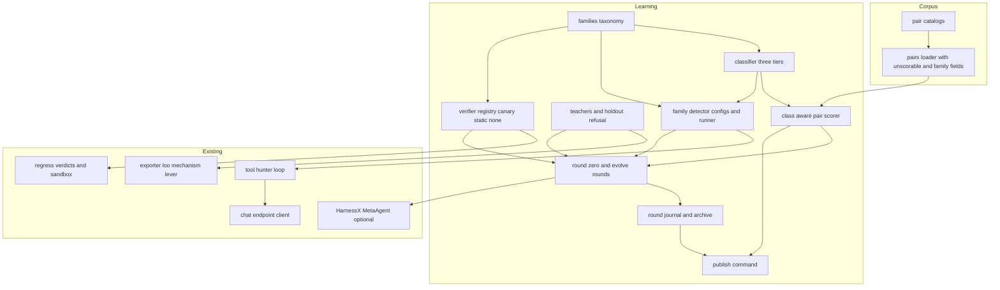
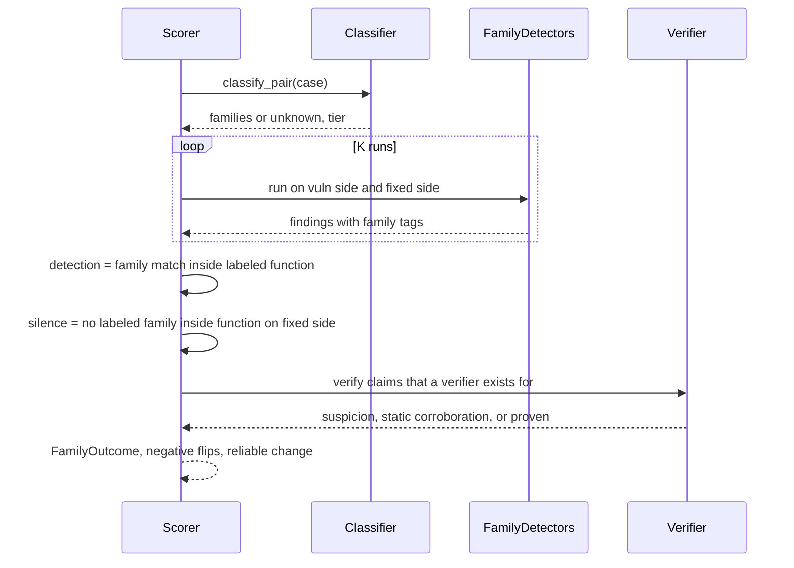
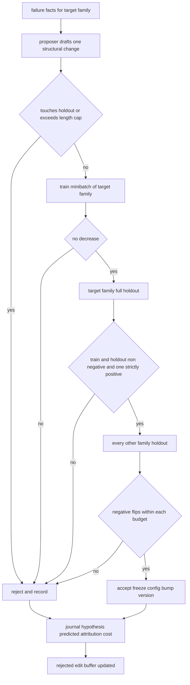

# Design Document: learning-harness

## Overview

**Purpose**: Turn OpenUltraSAST from a hand-authored analyzer with a leaking improvement loop into a learning harness: an auto-classifier routes every pair, finding and code region to one of ten verifier-aligned families; one detector configuration per family is evolved one change per round from structured failure facts; a class-aware pair-wise scorer with unscorable denominators and a measured per-family noise floor decides acceptance; only verifier-confirmed claims are reported above suspicion; the split is enforced by construction.

**Users**: the maintainer runs round zero, evolve rounds and the publish command; operators read scan findings that now carry a family, a detector version and a verifier outcome; reviewers work the classifier disagreement queue.

**Impact**: the tool hunter becomes the primary detector and the static machinery becomes tools and verifiers. The pair scorer's hunter path, the exporter, leave-one-out, the mechanism lever and the improve journal change behavior; findings, catalogs and the manifest gain additive fields. Gates stay byte-identical.

### Goals
- One trustworthy number per family per slice, with its denominator, taxonomy version, noise floor and cost.
- A round can only be accepted when it helps its target family on held-out pairs and hurts no other family beyond its measured budget.
- Nothing above `suspicion` without a verifier; verifier code and gold labels outside every editable surface.
- Round zero on the web families over vibe-py and agent-vfc before any learning.

### Non-Goals
- Browser-engine, interpreter or renderer bugs; crash oracles for C and C++ (the memory-safety family is measured, never gating).
- New static shape families, new hand-written facts, evidence-ladder or disposition changes, merge gates on non-local slices, model fine-tuning.
- A general router framework or a generic agent platform; the classifier is a function and a detector configuration is a directory.

## Boundary Commitments

### This Spec Owns
- The family taxonomy file, its loader and its version (1.x).
- Classification of pairs, findings and regions, and the classifier's measurement report and review queue (2.x).
- Class-aware pair scoring: outcomes, directional bias, fixed-FPR view, K-run reliable-change test, negative flips (3.x).
- Unscorable accounting and its reasons; the additive `unscorable` and `family` fields on catalog rows (4.x).
- The single teacher-selection rule every learning path calls, and holdout refusal (5.x).
- Per-family detector configurations, their loader, the family detector runner and finding tags (6.1–6.5); the chat-endpoint resolution independent of embeddings (6.6).
- The verifier registry keyed by family, canary oracles, the second-judge step (7.x).
- Round zero, the noise floor, evolve rounds, acceptance, attribution, the archive, the round journal, cost caps (8.x, 9.x).
- The corpus repairs listed in 10.x and the publish command with committed artifacts (11.x).

### Out of Boundary
- Pair labels, tiers, splits and `known_limit` semantics beyond the two additive fields (`pair-corpus-honesty`).
- Facts, walker, dominance, obligations checker internals; the mechanism store schema; the rule and policy levers' validators.
- The sandbox runner, snippet safety rules and Docker images; this spec adds an oracle to the verdict, not a runner.
- HarnessX internals; this spec composes `MetaAgent.evolve` and the journal behind `harness_ext`.
- Harvesting new pairs; only re-harvesting existing absence recipes.

### Allowed Dependencies
- `pairs`, `benchmark`, `semantic.loo`, `semantic.seed`, `semantic.mechanisms`, `improve.evolve`, `improve.validator`, `tool_hunter`, `hunter_tools`, `provider.openrouter`, `regress.*`, `sandbox.*`, `redaction`, `harness_ext`, `config`.
- Optional extras only through `harness_ext` (HarnessX) and `semantic.extra` (tree-sitter, now including TypeScript); every step degrades to a recorded reason without them.
- Direction: `learning.families` → `learning.classify` → `learning.scoring` → `learning.split` → `learning.detectors` and `learning.verifiers` → `learning.rounds` → `learning.publish` and `cli`. `learning.*` imports the packages above; nothing outside `learning` imports `learning.rounds` or `learning.publish`. `pairs` and `benchmark` never import `learning`.

### Revalidation Triggers
- A change to the family list, a family's CWE set or its verifier (taxonomy version bump).
- A change to the pair outcome vocabulary or the reliable-change test.
- A change to the acceptance rule, the regression-budget definition or the journal schema.
- A change to the chat-endpoint resolution order or the tool-hunter finding shape.
- A change to the sandbox verdict contract (oracle callback) or snippet safety rules.

## Architecture

### Existing Architecture Analysis
- `tool_hunter.run_tool_hunter` is a 4-step loop over three curated tools with findings parsed into `StaticFinding` at `suspicion` (`finding_id = tool-hunter:<path>:<line>`, tag `tool-hunter`). It refuses to emit findings when no tool was called. It has no temperature, budget or context knobs beyond `max_steps`.
- `pairs._hunter_matches_expected` keys detection on text tokens and `_evaluate_hunter_pair` counts every fixed-side finding as a leak under `fix_policy = silent`; both are replaced on the hunter path only. The overlay and inventory paths and `pair_gate` are untouched.
- `evaluate_profiles`, `evaluate_mechanism_profiles`, `propose_mechanism_edits`, `evaluate_loo` and `build_pair_signals` filter by tier and vendored status but not by split; `export_mechanisms` seeds from every case it is given.
- `OpenRouterChatClient` and `OpenRouterEmbeddingClient` read the same `OPENROUTER_BASE_URL`; `complete_chat` always sends `temperature: 0` and drops `reasoning_content` from replies. DeepSeek requires thinking disabled for temperature to apply, `reasoning_content` replayed on tool-call turns, no `/v1` suffix, `json_object` only, no seed.
- `regress.candidate` derives a verdict from the exit code; snippets are compile-only templates or the model's `proposed_snippet`; `check_snippet_safety` bans sockets, curl and workspace writes, which a canary file in `/scratch` respects.
- `MechanismStore` is an append-only JSONL with tombstones and deterministic ids, the pattern reused for the archive and the journal.
- HarnessX 0.1.0 provides `MetaAgent.evolve(current_config, trajectories_dir, output_dir)` with post-flight checks, `JournalEntrySpec(round, label, hypothesis_id, levers, predicted_affected, prose)`, `build_context` with precision discounted by unpredicted regressions, and `RLTask.task_type` routing.

### Architecture Pattern & Boundary Map



**Architecture Integration**:
- Selected pattern: a `learning` package layered left to right (families → classify → scoring → split → detectors/verifiers → rounds → publish), composing existing seams rather than replacing them.
- Domain boundaries: the corpus owns labels and rows; `learning` owns class assignment, scoring, teaching rules, detector configurations, verifier keys and rounds; `regress` owns execution; `harness_ext` owns the HarnessX seam.
- Existing patterns preserved: append-only JSONL with tombstones for the archive and journal; `HarnessRuntime.run_stage` and degradations for every step; `ScriptedChatClient` for offline tests; `FakeSandboxRunner` for verifier tests.
- New components rationale: each is one requirement area with one owner; the classifier and scorer are functions, the detector configuration is a directory, the journal is a file.
- Steering compliance: core `dependencies = []`; recall first under a false-positive ceiling, now per family; gates byte-identical; no model-authored artifact retained without held-out validation.

### Technology Stack

| Layer | Choice / Version | Role in Feature | Notes |
|-------|------------------|-----------------|-------|
| Chat endpoint | DeepSeek platform API, OpenAI-compatible, `https://api.deepseek.com` (no `/v1`); models `deepseek-v4-flash` (default), `deepseek-v4-pro` (second judge, review queue) | Detectors, classifier model tier, proposer, judge | Thinking on by default: the client sends `thinking: {"type": "disabled"}` for detectors and the classifier so `temperature` applies; `reasoning_content` replayed on tool-call turns; `response_format json_object` with empty-content retry; `logprobs` requested by the classifier tier only. No seed: determinism is best-effort and absorbed by the noise floor. Pricing (peak, USD/1M): flash 0.44 in / 1.32 out, cache hit 0.014; pro 1.32 / 3.96. Concurrency 2500 (flash). |
| Embedding endpoint | OpenRouter, `openai/text-embedding-3-small`, unchanged | Prove-order retrieval | Reads `OPENROUTER_*` only; DeepSeek has no embeddings endpoint. |
| Evolve loop | HarnessX 0.1.0 (`meta_harness.agent.MetaAgent`, `meta_harness.journal`), optional extra | Proposal generation and attribution context | Behind `harness_ext.require_harnessx`; a scripted proposer stands in without it. |
| Parsing | tree-sitter extra + `tree-sitter-typescript>=0.23` | TypeScript rows become scorable | Optional extra only. |
| Sandbox | existing Docker CLI runner, images `python:3.12-alpine`, `node:22-alpine` | Canary verifiers | Oracle callback added to the verdict; safety rules unchanged. |
| Storage | JSONL under `.openultrasast/learning/` and `benchmarks/measurements/` | Journal, archive, noise floors, published artifacts | Append-only, committed when published. |

## File Structure Plan

### Directory Structure
```
src/openultrasast/learning/
├── __init__.py            # public surface: load_families, classify_*, score_pair_family, teachers, run_baseline, run_learning_round, publish
├── families.py            # Family, FamilyTaxonomy, load_families(ruleset/families.toml), version, verifier kind per family
├── classify.py            # Classification, classify_pair/finding/region (tiers), measure_classifier, review queue entries
├── scoring.py             # FamilyOutcome, score_pair_family, FamilyMetrics, directional_bias, negative_flips, reliable_change, fixed_fpr_view, unscorable_reason
├── split.py               # teachers(cases), refuse_if_holdout(candidate_pairs, cases) -> Refusal | None
├── detectors.py           # FamilyConfig, load_family_configs, run_family_detector (whole-file context, curated tools), finding tags
├── endpoint.py            # ChatEndpoint, resolve_chat_endpoint (DeepSeek first, OpenRouter fallback, scripted), DeepSeekChatClient adapter
├── verifiers.py           # Verifier protocol, CanaryVerifier, StaticVerifier, NoVerifier, verifier_for(family), second_judge
├── rounds.py              # run_baseline (round zero, noise floor), run_learning_round (propose, minibatch, holdout, sweep, accept/revert), Attribution
├── proposer.py            # Proposer protocol, ScriptedProposer, HarnessXProposer (MetaAgent.evolve behind harness_ext), failure facts, rejected buffer
├── journal.py             # RoundRecord, LearningJournal (append-only JSONL), Archive (family -> winning config per pair)
└── publish.py             # publish(): regenerate numbers from one command, write roadmap table and measurement artifacts
src/openultrasast/ruleset/families.toml          # closed, versioned taxonomy: id, cwes, mechanisms, verifier, description
src/openultrasast/learning/configs/<family>/     # round-zero detector configuration per family (prompt.md, checklist.md, tools.toml, budget.toml, hard_negatives.jsonl, counterexamples.jsonl)
tests/test_learning_families.py, test_learning_classify.py, test_learning_scoring.py, test_learning_split.py, test_learning_detectors.py, test_learning_endpoint.py, test_learning_verifiers.py, test_learning_rounds.py, test_learning_journal.py, test_learning_publish.py, test_fixture_difficulty.py
```

### Modified Files
- `src/openultrasast/pairs.py` — `PairCase.unscorable: str | None` computed at load (identical twin via normalized body hash, `known_limit` passthrough); duplicate report across pairs before split; `split_by_repository` helper honoring existing `split` fields and reporting straddles; `_evaluate_hunter_pair` delegates matching and leaks to `learning.scoring` through an injected callable so `pairs` does not import `learning`; `build_pair_signals` gains a `split` filter.
- `src/openultrasast/benchmark.py` — `ExpectedFinding.family: str | None = None` (additive; validated against the taxonomy when present).
- `src/openultrasast/tool_hunter.py` — `run_tool_hunter` gains `system_prompt`, `context_files`, `tools`, `max_chars` and `tags` parameters with today's values as defaults; finding parsing accepts an optional `family` field; the reply loop replays `reasoning_content`.
- `src/openultrasast/provider/openrouter.py` — `OpenRouterChatClient` gains `extra_body` (thinking, response_format, logprobs) and keeps `reasoning_content` on assistant messages; no behavior change for existing callers.
- `src/openultrasast/config.py` — `[models]` gains `chat_base_url`, `chat_api_key_env`, `judge`; `[learning]` section (`families_path`, `configs_dir`, `k_runs = 5`, `round_cost_cap_usd`, `minibatch`, `cutoff_date`); `load_dotenv` unchanged, tests inject endpoints explicitly.
- `src/openultrasast/semantic/seed.py`, `semantic/loo.py`, `improve/evolve.py` — teacher selection through `learning.split.teachers`; refusals recorded; `evaluate_loo` teaches from train only.
- `src/openultrasast/regress/candidate.py`, `regress/verdict.py` — `run_regression` accepts an optional `oracle: Callable[[SandboxResult], bool]`; `verdict_from_result` uses the oracle when given, exit code otherwise.
- `src/openultrasast/cli.py` — `ousast learning classify|score|baseline|round|publish`; `pairs --hunter` uses the family scorer and `--k-runs`; `[models].hunter` resolution through `learning.endpoint`.
- `pyproject.toml` — `tree-sitter-typescript>=0.23` in the semantic extra; `src/openultrasast/semantic/extra.py` maps `typescript`/`tsx`.
- `benchmarks/pairs/vibe-py/catalog.toml` and `recipes.toml` — the five identical twins gain `known_limit = "identical_twin"`; absence rows gain `family` and `mode = "handler_context"` (re-harvest is a maintainer step).
- `benchmarks/pairs/mechanisms.toml` — unchanged; families reference mechanism ids.
- `.kiro/steering/roadmap.md` — rewritten by `publish` from artifacts.

## System Flows

### Class-aware scoring of one pair (hunter path)



Decisions: unscorable pairs short-circuit before any run; K runs share one classification; verifier outcomes never change detection or silence, they change the reported rung.

### One evolve round



Decisions: the proposer never sees holdout inputs, outputs or scores; cost is metered per stage and the round is reverted when the cap is crossed at any stage; ties reject.

## Requirements Traceability

| Requirement | Summary | Components | Interfaces | Flows |
|---|---|---|---|---|
| 1.1–1.4 | closed taxonomy, verifier per family, version, attributes not keys | Families | `load_families`, `FamilyTaxonomy` | — |
| 2.1–2.5 | three-tier multi-label classifier, measured, review queue, whole corpus | Classifier | `classify_*`, `measure_classifier` | scoring |
| 3.1–3.6 | family-in-function detection and silence, outcomes, bias, FPR, K runs, no text tokens | Scorer | `score_pair_family`, `FamilyMetrics` | scoring |
| 4.1–4.5 | unscorable reasons, never delete, dedup, repository split, denominators shown | Loader (pairs), Scorer, Publish | `PairCase.unscorable`, `unscorable_reason`, `split_by_repository` | — |
| 5.1–5.4 | train-only teachers, refusal, re-measure lever, proposer blind | Split, Levers, Proposer | `teachers`, `refuse_if_holdout` | round |
| 6.1–6.6 | per-family config, frozen, routing plus generalist, whole file, curated tools, independent chat endpoint | Detectors, Endpoint | `FamilyConfig`, `run_family_detector`, `resolve_chat_endpoint` | scoring |
| 7.1–7.6 | suspicion unless verified, canary oracles, static corroboration, none, second judge, sealed surface | Verifiers, Regress | `Verifier`, `verifier_for`, `second_judge`, `run_regression(oracle=)` | scoring |
| 8.1–8.4 | clone, K = 5 noise floor, publish round zero, web families first | Rounds | `run_baseline`, `NoiseFloor` | — |
| 9.1–9.9 | failure facts, one change, journal, staged evaluation, acceptance, attribution, archive, cost cap, retention | Rounds, Proposer, Journal | `run_learning_round`, `Proposer`, `RoundRecord`, `Archive` | round |
| 10.1–10.5 | TypeScript, re-harvest, identical twins, fixture difficulty, post-cutoff slice | Extra, Corpus, Tests | `semantic.extra`, catalog fields, `test_fixture_difficulty` | — |
| 11.1–11.5 | one command, artifacts committed, trajectories persisted, degrade with reason, gates identical | Publish, Journal, Runtime | `publish`, `LearningJournal` | — |

## Components and Interfaces

| Component | Layer | Intent | Req | Key Dependencies | Contracts |
|---|---|---|---|---|---|
| Families | data | closed taxonomy with verifier per family | 1.x | ruleset file (P0) | Service |
| Classifier | logic | assign families with tier, measure itself | 2.x | Families (P0), Endpoint (P1) | Service, State |
| Scorer | logic | class-aware pair outcomes and statistics | 3.x, 4.x | Families (P0), Detectors (P0), Verifiers (P1) | Service |
| Split | logic | the one teacher rule and holdout refusal | 5.x | pairs (P0) | Service |
| Detectors | logic | per-family configuration and runner | 6.1–6.5 | tool_hunter (P0), Endpoint (P0), Classifier (P0) | Service, State |
| Endpoint | integration | independent chat endpoint resolution and DeepSeek adapter | 6.6 | provider.openrouter (P0), config (P0) | Service |
| Verifiers | integration | family-keyed oracles and the second judge | 7.x | regress, sandbox (P0), obligations (P1) | Service |
| Rounds | orchestration | round zero, noise floor, evolve rounds, acceptance | 8.x, 9.x | Scorer, Detectors, Proposer, Journal (P0) | Batch, State |
| Proposer | integration | structural change proposals from failure facts | 9.1–9.2 | harness_ext (P1), Endpoint (P1) | Service |
| Journal | data | round records, attribution, archive | 9.3, 9.6, 9.7, 11.3 | JSONL (P0) | State |
| Publish | orchestration | numbers from one command, artifacts, roadmap | 11.x | Scorer, Journal (P0) | Batch |

### Data layer

#### Families

| Field | Detail |
|---|---|
| Intent | Load and version the closed family taxonomy with its CWE set, mechanism set and verifier kind |
| Requirements | 1.1, 1.2, 1.3, 1.4 |

**Responsibilities & Constraints**
- Exactly ten families as decided; ids are stable identifiers; the file carries `version`.
- Verifier kind per family is one of `canary`, `static`, `none`; memory safety is `none`.
- No component may route or score on a CWE or mechanism id; they are looked up only through a family.

**Dependencies**: Inbound: Classifier, Scorer, Detectors, Verifiers (P0). External: `ruleset/families.toml` (P0).

**Contracts**: Service [x]

```python
@dataclass(frozen=True)
class Family:
    id: str                      # e.g. "injection", "path", "deserialization", "access_control", "output_encoding", "ssrf", "prototype", "config_secrets", "memory", "unknown"
    cwes: frozenset[str]
    mechanisms: frozenset[str]
    verifier: Literal["canary", "static", "none"]
    description: str

@dataclass(frozen=True)
class FamilyTaxonomy:
    version: str
    families: tuple[Family, ...]
    def by_id(self, family_id: str) -> Family: ...
    def family_of_cwe(self, cwe: str) -> Family | None: ...
    def family_of_mechanism(self, mechanism: str) -> Family | None: ...
    def related(self, a: str, b: str) -> Literal["same", "parent_child", "lateral", "fabricated"]: ...

def load_families(path: Path | None = None) -> FamilyTaxonomy   # raises FamiliesError naming the field on any deviation
```
- Invariant: `unknown` is always present and never has a verifier.

#### Journal

| Field | Detail |
|---|---|
| Intent | Append-only record of rounds with attribution, and the archive of which configuration wins which pair |
| Requirements | 9.3, 9.6, 9.7, 11.3 |

**Contracts**: State [x]

```python
@dataclass(frozen=True)
class RoundRecord:
    round: int
    family: str
    hypothesis: str
    levers: tuple[str, ...]           # "tool" | "checklist" | "counterexample" | "memory" | "prompt"
    predicted_affected: tuple[str, ...]
    predicted_at_risk: tuple[str, ...]
    outcome: Literal["accepted", "rejected", "reverted_cost", "refused_holdout"]
    reason: str
    target_train_delta: float
    target_holdout_delta: float
    sweep: dict[str, int]             # family -> negative flips
    attribution: Attribution          # flipped_predicted, flipped_unpredicted, precision
    cost_usd: float
    taxonomy_version: str
    config_version: str

class LearningJournal:                 # .openultrasast/learning/journal.jsonl
    def append(self, record: RoundRecord) -> None: ...
    def rounds(self) -> tuple[RoundRecord, ...]: ...
    def rejected_buffer(self, family: str) -> tuple[str, ...]: ...   # hypotheses rejected for this family

class Archive:                          # .openultrasast/learning/archive.jsonl
    def record(self, family: str, config_version: str, pair: str, outcome: FamilyOutcome) -> None: ...
    def winners(self, family: str) -> dict[str, str]: ...             # pair -> config version that scores it best
```
- Persistence: JSONL, one record per line, never rewritten; the HarnessX journal is mirrored when the extra is present, never the source of truth.

### Logic layer

#### Classifier

| Field | Detail |
|---|---|
| Intent | Assign zero or more families with the deciding tier; measure itself; queue disagreements |
| Requirements | 2.1, 2.2, 2.3, 2.4, 2.5 |

**Responsibilities & Constraints**
- Tier 1 (deterministic): rule id, sink family from facts, obligation kind, mechanism id, labeled CWE; any hit decides without a model.
- Tier 2 (model): `json_object` question with the taxonomy definitions, `thinking` disabled, `logprobs` requested; averaged log-probability under a threshold yields `unknown`.
- Tier 3: `unknown`.
- Never writes a label; disagreements go to `.openultrasast/learning/review-queue.jsonl`.

**Dependencies**: Inbound: Scorer, Detectors (P0). Outbound: Families (P0), Endpoint (P1, degrades to tier 1 + unknown without a client).

**Contracts**: Service [x] State [x]

```python
@dataclass(frozen=True)
class Classification:
    families: tuple[str, ...]          # () means unknown
    tier: Literal["static", "model", "none"]
    confidence: float | None

def classify_pair(case: PairCase, taxonomy: FamilyTaxonomy, *, client: ChatClient | None) -> Classification
def classify_finding(finding: StaticFinding, taxonomy: FamilyTaxonomy, *, client: ChatClient | None) -> Classification
def classify_region(path: str, text: str, function: str | None, taxonomy: FamilyTaxonomy, *, facts, client: ChatClient | None) -> Classification

@dataclass(frozen=True)
class ClassifierReport:
    taxonomy_version: str
    agreement: float                   # hierarchical credit vs maintainer labels on reviewed pairs
    confusion: dict[str, dict[str, int]]
    random_router: float
    oracle_router: float
    per_tier: dict[str, int]
    unknown: int
    queued: int

def measure_classifier(cases: Sequence[PairCase], taxonomy: FamilyTaxonomy, *, client: ChatClient | None) -> ClassifierReport
```
- Postcondition: every reviewed pair whose label disagrees with the classification appears once in the review queue with both answers and the tier.

#### Scorer

| Field | Detail |
|---|---|
| Intent | Score one pair per family from detector findings, aggregate per family and slice, decide reliable change |
| Requirements | 3.1–3.6, 4.1, 4.5 |

**Responsibilities & Constraints**
- Detection: a finding whose `family:` tag relates `same` or `parent_child` to the labeled family and whose line lies in the labeled function; `fabricated` scores the maximum penalty; text is never inspected.
- Silence: no `same`/`parent_child` finding of the labeled family inside the labeled function on the fixed side; other findings are counted in `other_findings`, never as leaks.
- K runs per pair; reliable change against the last blessed round via a paired test on per-pair outcomes; negative flips per family.

**Contracts**: Service [x]

```python
FamilyOutcome = Literal["pair_correct", "both_flagged", "both_silent", "reversed", "unscorable"]

@dataclass(frozen=True)
class PairFamilyScore:
    pair: str
    family: str
    runs: tuple[FamilyOutcome, ...]    # length K
    outcome: FamilyOutcome             # majority of runs
    other_findings_vuln: int
    other_findings_fixed: int
    rung: Literal["suspicion", "static_corroboration", "proven"]
    unscorable_reason: str | None

@dataclass(frozen=True)
class FamilyMetrics:
    family: str
    scorable: int
    unscorable: dict[str, int]         # reason -> count
    outcomes: dict[FamilyOutcome, int]
    recall: float
    silence: float
    youden: float
    directional_bias: float            # (both_flagged - both_silent) / scorable
    fixed_fpr_recall: float            # recall at the family's FPR ceiling
    negative_flips: int                # vs last blessed round
    reliable_change: bool
    taxonomy_version: str

def score_pair_family(case: PairCase, family: str, vuln_runs: Sequence[Sequence[StaticFinding]], fixed_runs: Sequence[Sequence[StaticFinding]], *, ranges, taxonomy) -> PairFamilyScore
def aggregate(scores: Sequence[PairFamilyScore], *, baseline: Sequence[PairFamilyScore] | None) -> dict[str, FamilyMetrics]
def unscorable_reason(case: PairCase, *, parse_ok: bool, ranges) -> str | None   # identical_twin | unsupported_language | unresolved_label | missing_context | known_limit:<x>
```

#### Split

| Field | Detail |
|---|---|
| Intent | The one rule that selects teachers, and the refusal for anything touching holdout |
| Requirements | 5.1, 5.2, 5.3, 5.4 |

**Contracts**: Service [x]

```python
def teachers(cases: Sequence[PairCase]) -> tuple[PairCase, ...]                 # vendored, gating tier, split == "train", scorable
def refuse_if_holdout(taught_by: Iterable[str], cases: Sequence[PairCase]) -> Refusal | None   # Refusal(pairs=..., reason="holdout_pair")
```
- `export_mechanisms`, `evaluate_loo`, `evaluate_profiles`, `evaluate_mechanism_profiles`, `propose_mechanism_edits` and `build_pair_signals` obtain teachers only through `teachers`; refusals are recorded as degradations `{"stage": "learning", "reason": "holdout_pair_refused", "pairs": [...]}`.

#### Detectors

| Field | Detail |
|---|---|
| Intent | Load frozen per-family configurations and run the family detector with whole-file context and curated tools |
| Requirements | 6.1, 6.2, 6.3, 6.4, 6.5 |

**Responsibilities & Constraints**
- A configuration is a directory `learning/configs/<family>/` with `prompt.md` (length cap enforced at load), `checklist.md`, `tools.toml` (subset of `read_file`, `grep_repo`, `find_refs`, `read_definition`, `entry_points`, `flows`, `obligations`), `budget.toml` (`max_steps`, `max_cost_usd`, `max_chars`), `hard_negatives.jsonl`, `counterexamples.jsonl`, `version`.
- Round zero writes every family's directory from the current hunter prompt; a round rewrites only its target family and bumps that `version`.
- The runner builds the user message from the whole file plus resolved definitions, runs `run_tool_hunter` with the family's tools and prompt, and tags findings `family:<id>`, `detector:<id>@<version>`; the generalist is the `unknown` family's configuration.

**Contracts**: Service [x] State [x]

```python
@dataclass(frozen=True)
class FamilyConfig:
    family: str
    version: str
    prompt: str
    checklist: str
    tools: tuple[str, ...]
    max_steps: int
    max_cost_usd: float
    max_chars: int
    hard_negatives: tuple[dict[str, object], ...]
    counterexamples: tuple[dict[str, object], ...]

def load_family_configs(configs_dir: Path, taxonomy: FamilyTaxonomy) -> dict[str, FamilyConfig]   # raises ConfigError on cap or tool violations
def run_family_detector(root: Path, region: Region, config: FamilyConfig, *, client: ChatClient, model: str) -> list[StaticFinding]
```
- Precondition: `region.families` from the classifier; postcondition: every finding carries exactly one `family:` tag and one `detector:` tag.

#### Endpoint

| Field | Detail |
|---|---|
| Intent | Resolve the chat endpoint independently of the embedding endpoint and adapt DeepSeek quirks |
| Requirements | 6.6 |

**Responsibilities & Constraints**
- Resolution order: explicit injection (tests) → `OPENULTRASAST_HUNTER_CLIENT` scripted modes → `DEEPSEEK_API_KEY` with `DEEPSEEK_BASE_URL` (default `https://api.deepseek.com`) → `OPENROUTER_API_KEY` with `OPENROUTER_BASE_URL`. Embeddings keep reading `OPENROUTER_*` only.
- `[models]`: `hunter` (default `deepseek-v4-flash`), `judge` (default `deepseek-v4-pro`), `chat_base_url`, `chat_api_key_env`.
- Adapter: `thinking` disabled and `temperature 0` for detectors and classifier; `reasoning_content` replayed; `response_format json_object` with one retry on empty content; `logprobs` on request; usage fields normalized (`prompt_cache_hit_tokens`) into cost accounting.

**Contracts**: Service [x]

```python
@dataclass(frozen=True)
class ChatEndpoint:
    base_url: str
    api_key: str
    provider: Literal["deepseek", "openrouter", "scripted"]
    thinking: bool
    price_in_per_m: float
    price_out_per_m: float

def resolve_chat_endpoint(config: ResolvedConfig, *, override: ChatClient | None = None) -> tuple[ChatClient, ChatEndpoint] | None
class DeepSeekChatClient:   # implements ChatClient; wraps OpenRouterChatClient with extra_body and reasoning_content replay
    def complete(self, *, model, messages, tools, timeout_seconds=60, json_object=False, logprobs=False) -> ChatResponse
```

#### Verifiers

| Field | Detail |
|---|---|
| Intent | Confirm a claim through the family's oracle, or refuse to raise it |
| Requirements | 7.1–7.6 |

**Responsibilities & Constraints**
- `CanaryVerifier` (injection, path, deserialization, and command execution inside injection): writes a snippet from a family template that imports the target function, plants a canary (row in an in-memory database, file under `/scratch`, object with a marker method) and prints `CANARY:<token>` only when the vulnerability fires; the oracle is the token in stdout, never the exit code. The snippet passes `check_snippet_safety` unchanged.
- `StaticVerifier` (access control): the obligations checker's finding on the same function raises to `static_corroboration`.
- `NoVerifier`: stays at `suspicion`.
- `second_judge`: a `deepseek-v4-pro` call with the snippet, the oracle output and the claim, answering `json_object` `{"confirms": bool, "reason": str}`; a proven claim is published only when it confirms.
- Templates, oracle code and gold labels live under `learning/verifiers/` and `benchmarks/`, both excluded from every proposer write root.

**Contracts**: Service [x]

```python
class Verifier(Protocol):
    kind: Literal["canary", "static", "none"]
    def verify(self, claim: StaticFinding, *, root: Path, language: str, runner: SandboxRunner, limits: SandboxConfig) -> Verification

@dataclass(frozen=True)
class Verification:
    rung: Literal["suspicion", "static_corroboration", "proven"]
    oracle_output: str
    reason: str

def verifier_for(family: Family) -> Verifier
def second_judge(verification: Verification, claim: StaticFinding, *, client: ChatClient, model: str) -> bool
```
- `regress.run_regression(..., oracle=Callable[[SandboxResult], bool] | None)`: when given, `TRIGGERABLE` iff the oracle returns true; exit-code behavior unchanged otherwise.

### Orchestration layer

#### Rounds

| Field | Detail |
|---|---|
| Intent | Round zero with noise floors; evolve rounds with staged evaluation, acceptance, attribution and revert |
| Requirements | 8.1–8.4, 9.1–9.9 |

**Responsibilities & Constraints**
- `run_baseline`: clone the current hunter prompt into every family directory, run K = 5 over scorable vendored pairs of the selected slices, compute per-family negative-flip rate between runs as `NoiseFloor`, persist `noise-floors.json`, publish round zero.
- `run_learning_round`: failure facts for the target family → proposer → refusal checks (holdout, length cap, allowed levers) → minibatch → holdout → sweep → accept (freeze, bump version, archive) or revert (restore the directory snapshot) → journal → rejected buffer.
- Acceptance: `train_delta >= 0 and holdout_delta >= 0 and (train_delta > 0 or holdout_delta > 0) and all(sweep[f] <= floor[f])`; ties reject.
- Cost metered per stage from usage; crossing `round_cost_cap_usd` at any stage reverts and records `reverted_cost`.
- The proposer receives no holdout material; scoring of holdout happens after the proposal is frozen.

**Contracts**: Batch [x] State [x]

```python
@dataclass(frozen=True)
class NoiseFloor:
    family: str
    k_runs: int
    negative_flip_rate: float
    budget_flips: int                  # ceil(rate * scorable pairs)

def run_baseline(cases, *, slices, taxonomy, configs_dir, client, model, k_runs=5, out_dir) -> BaselineReport
def run_learning_round(cases, *, family, taxonomy, configs_dir, proposer, client, model, journal, archive, floors, cost_cap_usd, minibatch) -> RoundRecord
```
- Idempotency: a round directory is written under `.openultrasast/learning/rounds/<n>/` with the snapshot, proposal, scores and trajectories; rerunning a round number refuses.

#### Proposer

| Field | Detail |
|---|---|
| Intent | Draft one structural change for one family from structured failure facts |
| Requirements | 9.1, 9.2, 5.4 |

**Contracts**: Service [x]

```python
@dataclass(frozen=True)
class FailureFacts:
    family: str
    misses: tuple[MissFact, ...]       # pair, function, sink_or_check, line, verifier_outcome, runs
    leaks: tuple[LeakFact, ...]
    rejected: tuple[str, ...]          # hypotheses from the buffer
    config: FamilyConfig

@dataclass(frozen=True)
class Proposal:
    hypothesis: str
    lever: Literal["tool", "checklist", "counterexample", "memory", "prompt"]
    change: dict[str, object]          # file-level edit inside the family directory
    predicted_affected: tuple[str, ...]
    predicted_at_risk: tuple[str, ...]

class Proposer(Protocol):
    def propose(self, facts: FailureFacts) -> Proposal | None

class ScriptedProposer: ...            # tests and offline runs
class HarnessXProposer: ...            # MetaAgent.evolve with allowed_write_roots = the family directory only; degrades to None with a recorded reason without the extra
```

#### Publish

| Field | Detail |
|---|---|
| Intent | Regenerate every published number from one command and commit its artifacts |
| Requirements | 11.1, 11.2, 4.5 |

**Contracts**: Batch [x]

```python
def publish(cases, *, taxonomy, journal, floors, out_dir=Path("benchmarks/measurements"), roadmap=Path(".kiro/steering/roadmap.md")) -> PublishReport
```
- Writes `<date>-<slice>-<family>.json` artifacts, a markdown table with scorable/unscorable counts, taxonomy version, noise floor and cost per point beside every number, and replaces the roadmap's measured section between markers.

## Data Models

### Domain Model
- Aggregates: `FamilyTaxonomy` (versioned, immutable per version); `FamilyConfig` (per family, versioned, frozen between rounds); `RoundRecord` (append-only); `PairCase` (owned by the corpus, gains two additive fields).
- Invariants: a finding carries exactly one `family:` tag; a pair has at most one `unscorable` reason; a round targets exactly one family; the archive maps a pair to one winning configuration per family.

### Data Contracts
- Catalog row additions: `[[pair.expected]] family = "<id>"` (validated against the taxonomy), `known_limit = "identical_twin"` for the five twins; `unscorable` is computed, never stored.
- Manifest block `learning = {taxonomy_version, families: {id: FamilyMetrics}, classifier: ClassifierReport, round: n | null}`; findings carry tags `family:`, `detector:`, `verifier:<rung>`.
- Journal and archive JSONL as above; `noise-floors.json`; `review-queue.jsonl` entries `{pair, label_family, classified, tier, confidence}`.

## Error Handling

- Taxonomy or configuration deviations fail fast at load with the field named (`FamiliesError`, `ConfigError`).
- Missing extras degrade with a recorded reason: no HarnessX → `ScriptedProposer` or `proposer_unavailable`; no TypeScript grammar → rows `unsupported_language`; no sandbox → `NoVerifier` for canary families with `sandbox_unavailable`.
- Endpoint errors: transient retries as today; empty `json_object` content retried once then recorded; a round whose endpoint fails mid-stage is reverted with `endpoint_failed`.
- Holdout refusal, cost overrun and safety rejection are outcomes, not exceptions, and always land in the journal.
- Monitoring: every stage runs under `HarnessRuntime.run_stage`; cost per stage and per round is written to the round directory.

## Testing Strategy

- Unit: taxonomy loader rejects an eleventh family and a missing verifier kind (1.1, 1.2); `related` returns `parent_child` for a CWE child and `fabricated` for an unknown id (3.1); classifier tier 1 decides from a rule id without a client and tier 2 falls to `unknown` under the threshold with a scripted client (2.1, 2.2); scorer counts detection only inside the labeled function and never from text (3.1, 3.6); silence ignores other-family findings (3.2); directional bias and negative flips on synthetic run sets (3.3, 3.5); `unscorable_reason` on an identical twin and an unsupported language (4.1); `teachers` excludes holdout and `refuse_if_holdout` names the pair (5.1, 5.2); configuration loader rejects a prompt over the cap and a tool outside the allowed set (6.1, 6.5); endpoint resolution prefers DeepSeek over OpenRouter and never touches the embedding variables (6.6); canary snippet passes safety and the oracle keys on the token (7.2); acceptance rule rejects ties and budget breaches (9.5); journal round-trips a record and the rejected buffer (9.3, 9.6).
- Integration: `pairs --hunter` with a scripted client on the shared handler fixture yields family outcomes and the manifest block (3.x, 6.3); `export_mechanisms` and `evaluate_loo` teach from train only and record refusals (5.1, 5.3); `run_baseline` with a scripted client writes noise floors and round-zero artifacts (8.x); `run_learning_round` with `ScriptedProposer` accepts a helpful change, rejects a tie, reverts on cost and journals attribution (9.x); `run_regression(oracle=)` returns `TRIGGERABLE` on the token with `FakeSandboxRunner` (7.2).
- Corpus: TypeScript rows parse under the extra (10.1); the five twins load as `known_limit:identical_twin` and are excluded from denominators (10.3, 4.1); `test_fixture_difficulty` fails on a fixture easier than its named rows (10.4); post-cutoff slice reported separately (10.5).
- Gates: `gate`, `map_gate`, `pair_gate` stdout byte-identical to the pre-feature commit; extra-free suite green with semantic and harnessx tests skipping (11.5).
- Live (maintainer, not CI): round zero on vibe-py and agent-vfc web families through DeepSeek, artifacts committed under `benchmarks/measurements/`.

## Security Considerations
- Every prompt and every persisted trajectory passes `redact_secrets`; verifier templates, oracle code and gold labels are outside the proposer's write roots; snippets keep today's safety bans; the sandbox stays network-off and workspace read-only; the second judge sees the snippet and oracle output, never the labels.

## Performance & Cost
- Round zero: K = 5 over ~250 vendored pairs, both sides, whole-file context ≈ 25M input tokens; at DeepSeek flash peak pricing under $15, off-peak half. A round: minibatch + holdout + sweep ≈ one baseline pass; `round_cost_cap_usd` default 10. Concurrency bounded by the runtime's existing budget controls.

## Migration Strategy
- Phase 1 (offline, no model): taxonomy, classifier tier 1, scorer, split, unscorable rows, endpoint resolution, TypeScript grammar, identical twins, fixture-difficulty check; existing numbers re-published with denominators.
- Phase 2 (live): round zero on web families; noise floors; classifier tier 2 measured; review queue worked.
- Phase 3: verifiers for the four canary families and the static verifier; second judge.
- Phase 4: evolve rounds with `ScriptedProposer` first, then `HarnessXProposer`; obligations lever as the access-control family's first round.
- Rollback: every round is a directory snapshot; `publish` regenerates from artifacts, so a bad round is reverted by restoring the family directory and re-publishing.
