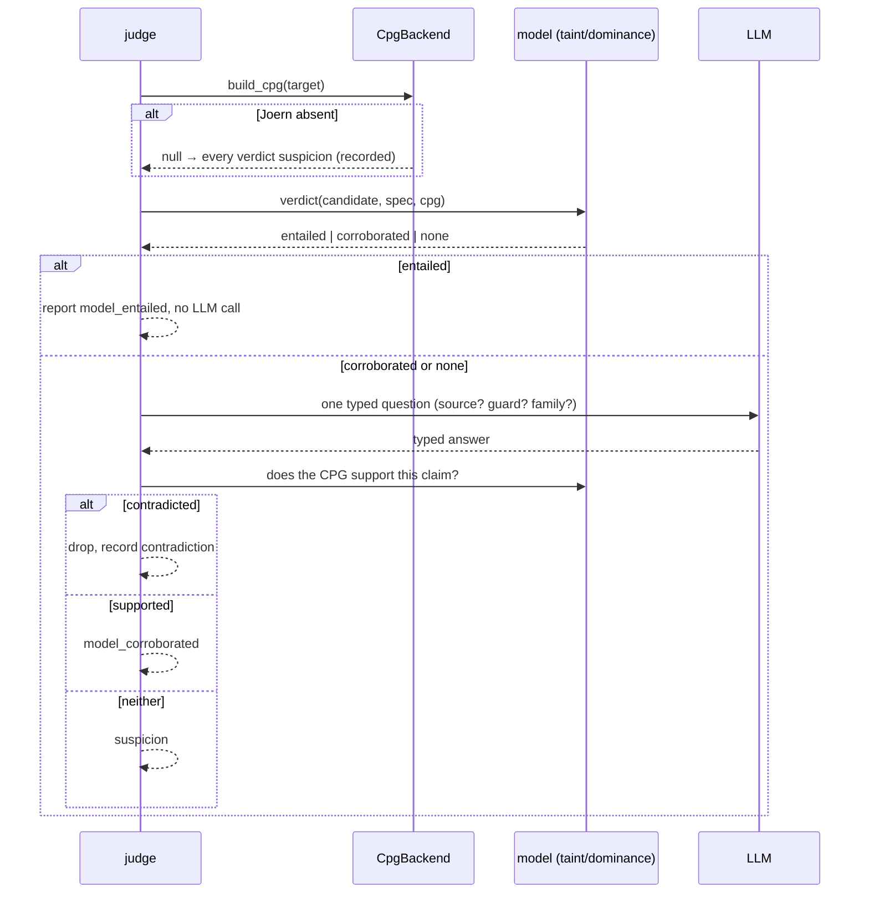

# Design Document: model-grounded-detection

## Overview

The detector stops being a noisy oracle and becomes a proposer that a deterministic program model audits. The
model is a **Code Property Graph** (Joern, Apache-2.0): one graph merging AST, CFG, PDG and call graph, over
which taint reachability and guard dominance produce verdicts on the evidence ladder — `suspicion`,
`model_corroborated`, `model_entailed`, `execution_confirmed`. The LLM is asked one bounded question per
candidate; its answer is checked against the CPG, not averaged over runs.

Two disciplines shape every decision below. **Subtraction first:** the noise architecture and the outgrown
test surface are removed and audited before the CPG arbiter is adopted, because the session that produced this
spec logged eighteen defects building on an overgrown surface. **Adopt, don't build:** the CFG/PDG our flat IR
lacks comes from Joern, not from a hand-built engine — the 2.2% entailment ceiling is the measured distance
between our AST projection and a real CPG, and closing it by hand is reimplementing Joern.

### Goals

- Remove the noise architecture and reduce the test suite with it, gate-protected and reversible.
- A deterministic model verdict on the band the model covers; honest `suspicion` on the rest.
- The CPG engine, the LLM endpoint and any execution tier are optional; the core stays zero-dependency.
- The security modelling — taxonomy, source/sink/sanitizer/guard specs — is ours, expressed as CPG queries.

### Non-Goals

- Building a control-flow or dataflow engine (adopted, Req 4). Prompt optimisation, evolve loops, acceptance
  rules (deleted, Req 8.5). The execution tier itself (deferred to Clearwing, Req 10). Soundness — the
  north-star `model_entailed`-as-pure-arbiter is not v1.

## Boundary Commitments

### This Spec Owns

- The subtraction: which modules are removed, the dangling-import check, the module-audit manifest.
- `cpg/` — the Joern seam (`CpgBackend`, the subprocess/query implementation, the null backend).
- `model/` — `Verdict`/`Rung`, taint reachability, guard dominance, constant abstraction; the security specs
  ported from the deleted modules' vocabularies.
- The proposer/judge orchestration where the LLM's claim is checked against the model.
- The corpus-as-calibration harness and its model-gap report.

### Out of Boundary

- The family **taxonomy** (`learning/families.py`) — retained unchanged, re-homed under `model/`.
- The corpus loader, per-slice split and gates — retained; the gates stay byte-identical.
- Redaction, the LLM endpoint client (`learning/endpoint.py`) — retained.
- Clearwing's sandbox lifecycle — never reimplemented; the execution tier adopts it.

### Allowed Dependencies

- Core: standard library only. `dependencies = []` unchanged.
- Optional, capability-detected (like the semantic and sandbox extras today): **Joern on PATH** for the CPG;
  the DeepSeek/OpenRouter endpoint for the judge; Clearwing for the execution tier. Each degrades to a
  recorded reason.

### Revalidation Triggers

- The Joern seam failing to produce a deterministic verdict for a family on the corpus (Req 6.4).
- Any gate output moving (Req 1.4, 11.2).
- A removed module found still imported (Req 1.3).

## Architecture

### Existing Architecture Analysis

The `learning/` package (4,091 lines, 16 modules) implements the noise architecture and is **absent from the
gate path** — the gates import only from `pairs`, `benchmark`, `findings`, `mapping`, `preprocess`, `rank`,
`complexity.map`. So the subtraction is clean: removing `rounds`, `acceptance`, `proposer`, `journal`, the
noise machinery in `scoring`, and the mechanism loop cannot move a gate. What survives and re-homes: the
taxonomy (`families.py`), the candidate enumerator (`candidates.py`, the `suspicion`-band feeder), the LLM
client (`endpoint.py`). The security *knowledge* to port lives in the deleted modules' data: the guard
vocabulary in `semantic/variants.py`, the sink tables, and the obligation facts in `semantic/obligations/`.

### Architecture Pattern & Boundary Map

```mermaid
flowchart TD
    subgraph subtract["Phase 0 — subtraction (gate-protected)"]
      DEL[remove noise architecture] --> AUDIT[module audit manifest]
      AUDIT --> TESTS[reduce test suite to surviving reqs]
    end
    subgraph model["The model arbiter"]
      SRC[target] --> CPG["cpg.CpgBackend: Joern → CPG"]
      CPG --> TAINT[model.taint: source→sink − sanitizer]
      CPG --> DOM[model.dominance: guard dominates operation]
      SPECS[(taxonomy + source/sink/sanitizer/guard specs)] --> TAINT
      SPECS --> DOM
      TAINT --> V[Verdict: entailed | corroborated]
      DOM --> V
    end
    ENUM[candidates: suspicion-band sites] --> JUDGE
    V --> JUDGE[proposer/judge: one typed question, checked against V]
    JUDGE --> F[Finding: rung, family, evidence]
    CPG -. absent .-> NULL[null backend → suspicion, recorded]
```

### Technology Stack

| Concern | Choice | Why |
|---|---|---|
| CPG engine | Joern, Apache-2.0, capability-detected on PATH | AST+CFG+PDG+callgraph for our exact languages; a hand-built engine is the 2.2%→ ceiling we measured |
| Joern access | `joern-parse` → `cpg.bin`, then `joern --script <query.sc>` emitting JSON, via subprocess | deterministic, out-of-process (no in-JVM), one isolated seam; server mode is a later optimisation behind the same seam |
| Taint / dominance | CPGQL queries authored by us, seeded from the deleted vocabularies | the modelling is the contribution; the traversal is the engine's |
| Verdict determinism | queries are pure over a fixed `cpg.bin`; verdicts sorted | Req 6.4 — same CPG, same sequence |
| LLM judge | retained `learning/endpoint.py` client | unchanged; the judge answers the residual only |
| Absence / obligations | ported to CPG dominance queries | the classes that never crash, which Clearwing cannot arbitrate |

## File Structure Plan

### Removed (Req 1)

```
learning/rounds.py  acceptance.py  proposer.py  journal.py  canaries.py  verifiers.py  difficulty.py
learning/scoring.py            # the K-run/floor/sign-test machinery; per-slice aggregation re-homes to model/report.py
learning/detectors.py          # the evolvable-config surface; the run-one-family judge re-homes to model/judge.py
improve/evolve.py              # the mechanism lever and rule-evolve loop
semantic/mechanisms.py         # the shape store and search
semantic/variants.py           # the optimisation loop; classify_guard + the guard vocabulary port to model/specs.py
```

### New

```
src/openultrasast/cpg/
├── backend.py     # CpgBackend protocol; JoernBackend (subprocess); NullBackend (→ suspicion)
├── queries/       # authored CPGQL: taint.sc, dominance.sc — emit JSON
└── capability.py  # has_cpg(): Joern on PATH, like has_semantic_extra
src/openultrasast/model/
├── ladder.py      # Rung, Verdict, Finding rung assignment
├── taint.py       # taint reachability over a CpgResult; entailed vs corroborated
├── dominance.py   # guard-dominates-operation for absence families
├── specs.py       # TaintSpec + DominanceSpec per family, seeded from the deleted vocabularies
├── judge.py       # one bounded typed question; claim checked against the verdict
├── calibrate.py   # vulnerable-parent/fix differential; model-gap report (Req 9)
└── report.py      # per-slice, overfitting gap, rung on every finding (re-homed honesty discipline)
```

### Retained, re-homed or unchanged

- `learning/families.py` → `model/taxonomy.py` (moved, meaning unchanged, Req 7.1).
- `learning/candidates.py` → `model/candidates.py` (the suspicion-band enumerator, Req 8.4).
- `learning/endpoint.py` → `model/endpoint.py` (the judge client).
- `semantic/obligations/` retained; its operation/discharge facts feed `model/dominance.py`.
- `pairs.py`, the gates, redaction — unchanged.

### The audit manifest (Req 3)

`benchmarks/measurements/2026-09-08-module-audit.json`: every source module classified `load_bearing`,
`standalone_capability`, or `orphaned`, with the importer/CLI/gate evidence and a keep-or-remove decision;
`fusion.py`, `mcp.py`, `skills.py`, `harness_ext.py`, `hunter_harness.py` named explicitly.

## System Flows

### One region, model-grounded



## Requirements Traceability

| Criteria | Delivered by |
|---|---|
| 1.1, 1.2, 1.2b | the Removed list; the noise + mechanism modules deleted, security vocabularies ported to `model/specs.py` |
| 1.3 | a `compileall` + import-graph check asserting no surviving module imports a removed one |
| 1.4, 11.2 | the committed gate-baseline test, run before and after subtraction |
| 1.5 | one line per removed module in the audit manifest |
| 2.1, 2.2, 2.5 | test removal in the same change as the code; a test→requirement map; the anti-pattern tests deleted |
| 2.3 | the change reports the before/after count and the requirement each cluster served |
| 2.4 | the gate-baseline, redaction, determinism (6.4), per-slice and ceiling-regeneration tests are the pinned floor |
| 3.1, 3.2, 3.4 | `model/audit` classifier → the audit manifest; orphans removed |
| 3.3 | the five named subsystems each carry an explicit keep/remove line |
| 4.1, 4.2 | `cpg/backend.py` JoernBackend behind `has_cpg`; core `dependencies = []` |
| 4.3 | `NullBackend` → every verdict `suspicion`, `cpg_unavailable` recorded |
| 4.4 | no CFG/PDG engine authored; `model/candidates.py` is IR-only, suspicion band |
| 4.5 | the subprocess seam is the single Joern touch-point; the JVM cost is documented there |
| 5.1, 5.2, 5.3, 5.4 | `model/ladder.py` `Rung`/`Verdict`; corroborated/entailed established with no model call; rung in every format |
| 6.1 | `model/taint.py` over the CPG taint query |
| 6.2 | `model/dominance.py` over the CPG dominance query |
| 6.3 | `model/taint.py` constant-abstraction arm for config |
| 6.4 | `test_two_runs_over_one_cpg_give_an_identical_verdict_sequence` |
| 6.5 | `calibrate` regenerates the entailment ceiling per family/slice with fallbacks named |
| 7.1 | `model/taxonomy.py` (the retained families) |
| 7.2, 7.3 | `model/specs.py` TaintSpec + DominanceSpec seeded from the ported vocabularies |
| 7.4 | specs and gold labels live outside any LLM/optimiser write root |
| 8.1, 8.2, 8.3, 8.4 | `model/judge.py`: one typed question; contradiction drops; corroboration advances; neither → suspicion |
| 8.5 | no rounds/acceptance/floor/evolve exist to import (Req 1) |
| 9.1, 9.2 | `model/calibrate.py` differential over vulnerable-parent/fix; model-gap report |
| 9.3 | `model/report.py` per-slice, real-world deciding |
| 9.4 | the calibrate harness reads the fix diff as oracle; CVE-history harvest seam |
| 10.1, 10.2, 10.3 | `Rung.execution_confirmed` optional; adopted from Clearwing; not required for web/logic v1 |
| 11.1 | `model/report.py` per-slice + overfitting gap + rung |
| 11.3 | `has_cpg`/endpoint/execution all capability-detected, degrade to a reason |
| 11.4 | redaction on every prompt and persisted artifact |

## Components and Interfaces

### cpg/backend.py

```python
@dataclass(frozen=True)
class CpgResult:
    """A handle to a built CPG plus the query runner. Opaque; only model/ reads it."""
    cpg_path: Path
    run: Callable[[str, Mapping[str, object]], object]   # query name, params -> parsed JSON

class CpgBackend(Protocol):
    def available(self) -> bool: ...
    def build(self, root: Path) -> CpgResult | None: ...   # None → caller degrades to suspicion

class JoernBackend:
    """joern-parse <root> -> cpg.bin ; joern --script queries/<name>.sc -> JSON. Out of process."""
class NullBackend:
    """available() is False; build() returns None. The core install's default."""

def resolve_cpg_backend() -> CpgBackend   # Joern on PATH → JoernBackend, else NullBackend
```

### model/ladder.py

```python
class Rung(str, Enum):
    SUSPICION = "suspicion"; CORROBORATED = "model_corroborated"
    ENTAILED = "model_entailed"; EXECUTION_CONFIRMED = "execution_confirmed"

@dataclass(frozen=True)
class Verdict:
    rung: Rung
    family: str
    witness: str            # the taint path, the dominance fact, or "" for suspicion
    contradiction: str = "" # why an LLM claim was dropped, when it was
```

### model/specs.py

```python
@dataclass(frozen=True)
class TaintSpec:            # per flow family, seeded from the deleted sink tables + guard vocabulary
    family: str
    sources: tuple[str, ...]      # CPGQL source matchers
    sinks: tuple[str, ...]
    sanitizers: tuple[str, ...]

@dataclass(frozen=True)
class DominanceSpec:        # per absence family, seeded from obligations facts
    family: str
    operations: tuple[str, ...]   # obligated operations on a protected resource
    dischargers: tuple[str, ...]  # guards that discharge — must dominate the operation
```

`taint.verdict(cpg, spec, candidate)` → `ENTAILED` when a source→sink path exists with no sanitizer node
(the CPG establishes it alone), `CORROBORATED` when a path exists that a sanitizer may break (the LLM judges
sufficiency), else `None`. `dominance.verdict(cpg, spec, candidate)` → `ENTAILED` when an obligated operation
is dominated by no discharger and its siblings are, else `CORROBORATED`/`None`.

## Error Handling

| Condition | Behaviour | Recorded |
|---|---|---|
| Joern absent | every verdict `suspicion` | `cpg_unavailable` |
| CPG build fails on a target | that target scores `suspicion`, others proceed | `cpg_build_failed` |
| Query times out | `suspicion` for the affected candidate | `cpg_query_timeout` |
| LLM endpoint absent | model verdicts still produced; the judge residual stays `suspicion` | `learning_endpoint_unavailable` |
| A removed module still imported | the import-graph check fails the build | — |

## Migration and Phases

1. **Subtract and audit (Req 1–3).** Remove the noise architecture; port the guard/sink vocabularies into
   `model/specs.py` before deleting their modules; run the import-graph check and the gate-baseline; reduce
   the tests in the same change; commit the audit manifest. Gate-protected and reversible; no CPG yet.
2. **Joern spike on one family (Req 4, 6.1).** The `CpgBackend` seam and the injection `TaintSpec`, proven
   end to end on the injection slice: build a CPG, run the taint query, produce entailed/corroborated
   verdicts, assert determinism. This phase can stop the design if Joern cannot deliver a deterministic
   verdict at acceptable cost — the analogue of the candidate-ceiling gate.
3. **The ladder and the judge (Req 5, 8).** `Verdict`/`Rung`, and `judge.py` checking the LLM's residual
   answer against the verdict. No K-runs, nothing to average.
4. **Absence and the rest of the taxonomy (Req 6.2, 7).** Dominance queries from the obligation facts; the
   remaining `TaintSpec`s. Regenerate the entailment ceiling (Req 6.5) and watch it rise as depth improves.
5. **Corpus calibration and reporting (Req 9, 11).** The vulnerable-parent/fix differential, the model-gap
   report, per-slice + overfitting gap.
6. **Execution tier stub (Req 10).** The `execution_confirmed` rung and the Clearwing adoption seam, built
   only when a class needs it — memory/C first, and not for web/logic v1.

Phase 1 removes ~5,000 lines before a line of Joern is written. Phase 2 can end the design before the
integration cost is paid, exactly as the candidate ceiling could have in the prior spec.
