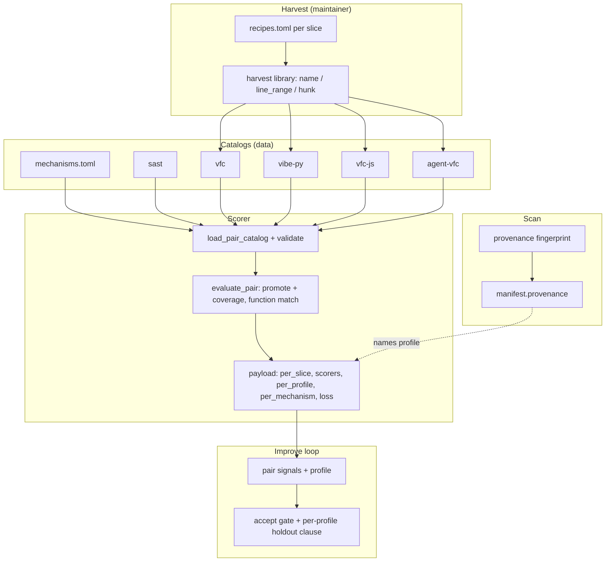
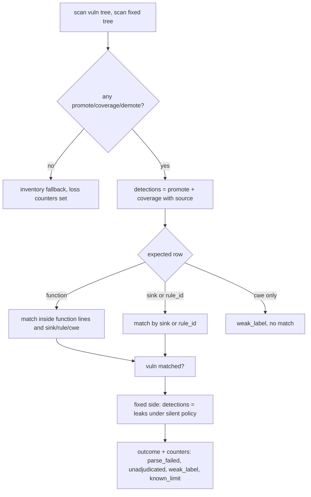
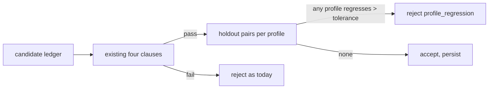

# Design Document

## Overview

**Purpose.** This feature makes the pair scoreboard honest and gives it three web and agent-authored slices, so the follow-up engine specs can be measured per mechanism and per provenance instead of by one Youden on a lossy scorer.

**Users.** Maintainers grow and score corpora. Engineers evolving the overlay read per-mechanism and per-profile numbers. The improve loop reads holdout metrics per profile. Operators see a provenance value in their manifest.

**Impact.** `pairs.py` counts coverage and matches by function. Catalogs carry `mechanism`, `provenance`, `split`, and `known_limit`. Harvest anchors at the declarator and gains line-range and hunk modes. Three catalogs are added. `preprocess` computes provenance. `run_improvement` grows a per-profile clause. `real-world-vfc-slice` is closed and superseded on the corpus plane.

### Goals

- Scorer counts every adjudicated detection and reports parser and adjudication loss.
- Every pair is attributable: function, mechanism, provenance, split, license.
- `vibe-py`, `vfc-js`, `agent-vfc` load offline and score.
- Per-profile and per-mechanism metrics; per-profile improve acceptance.
- No gate changes; Youden on non-local slices is never a merge condition.

### Non-Goals

- Any change to taint, facts, CST walker, dispositions, or ERROR-node tolerance.
- BaxBench generation slices (later, after deep mode).
- Profile-specific fact tables, thresholds, or ledger files.
- LLM classification.

## Boundary Commitments

### This Spec Owns

- `pairs.py` scoring semantics, payload fields, slice list, catalog validation.
- `src/openultrasast/semantic/functions.py` (added in the round-3 debug plan): declarator-aware named function ranges shared by the overlay's range filling, the scorer, and the catalog generator; stdlib plus `semantic/ir.py` only, never imports `overlay` or `pairs`. The scorer boundary owns naming; `ir.py` and `cst.py` stay untouched.
- Catalog label schema and `benchmarks/pairs/mechanisms.toml`.
- Harvest tooling (shared library plus per-slice recipes).
- `benchmarks/pairs/{sast,vfc,vibe-py,vfc-js,agent-vfc}` contents and READMEs, `datasets.toml`.
- `provenance.py` and its manifest field.
- The per-profile clause in the improve accept gate.

### Out of Boundary

- `semantic/*` except one additive optional field on `OverlayRecord`, the range-filling expression in `overlay._flows_for`, and the new `semantic/functions.py` helper listed above.
- `ruleset/store.py` ledger format, CWE policy, project score.
- Stage plan, sandbox, hunter, MCP.
- `LANGUAGE_MANIFESTS` and the stage-1 gate.

### Allowed Dependencies

- Existing `PairCase`, `evaluate_pair`, `adjudicate`, `parse_file` (for function line ranges), `build_pair_signals`, `run_improvement`, `preprocess_repository`, `write_manifest`.
- Stdlib only for new core modules. `git` binary via subprocess for trailers, optional.
- Public hosts for harvest (maintainer only): raw.githubusercontent.com, Real-Vuln-Benchmark manifest, upstream npm package repos.

### Revalidation Triggers

- Changing `OverlayRecord` fields beyond the one optional `function` field.
- Adding a fifth provenance profile.
- Making any slice other than `local` fail CI.
- Vendoring a file without a license field.
- Changing the mechanism vocabulary without bumping its version.

## Architecture

### Existing Architecture Analysis

`load_pair_catalog` concatenates `catalog.toml`, `sast/catalog.toml`, `vfc/catalog.toml`. `evaluate_pair` routes `sast` and `vfc` through `_evaluate_overlay_pair`, which counts only `promote` and falls back to inventory when nothing adjudicated. `scorers` is populated only for `vfc`. `build_pair_signals` emits miss/fp rows with pair name. `run_improvement` accepts on four clauses. `preprocess.detect_tags` is deterministic per file. `vfc/harvest.py` extracts by name with a comment-blind search.

### Architecture Pattern & Boundary Map

Selected: **label-driven scorer plus shared harvest plus deterministic profile**. One scorer, one harvest library, one provenance function; slices are data.



**Key decisions**

- Coverage with a source counts like promote on both sides.
- Function-scoped matching when the label names a function; CWE-only rows are `weak_label`.
- Provenance is closed and deterministic; `synthetic` comes only from the catalog.
- Profiles branch the accept decision, not the ledger.

### Technology Stack

| Layer | Choice / Version | Role in Feature | Notes |
|-------|------------------|-----------------|-------|
| CLI | existing `ousast pairs --slice` | new slice names, `--profile` filter | argparse choices |
| Catalog | TOML `[[pair]]`, `[[pair.expected]]` | new fields | loader validates |
| Vocabulary | `benchmarks/pairs/mechanisms.toml` | closed set, versioned | data, not code |
| Harvest | stdlib urllib, `benchmarks/pairs/harvest.py` | name, line_range, hunk modes | maintainer only |
| Provenance | `src/openultrasast/provenance.py` | fingerprint | stdlib, optional `git` |
| Improve | `improve/evolve.py` | per-profile clause | existing gate kept |
| Tests | pytest, extra-free default | offline | overlay asserts skip without extra |

## File Structure Plan

```
benchmarks/pairs/
├── mechanisms.toml              # closed vocabulary v1 with one-line definitions
├── harvest.py                   # shared library: fetch, extract_by_name (comment-blind), extract_line_range, extract_hunk, python_block, provenance_header
├── datasets.toml                # + Real-Vuln-Benchmark, SecBench.js, AIDev, BaxBench, SecurityEval, CodeSecEval, CWEval, CyberSecEval
├── sast/                        # juliet strcpy fixture restored; owasp-java-hash known_limit
├── vfc/
│   ├── harvest.py               # thin shim -> ../harvest.py (keeps existing tests)
│   ├── recipes.toml             # + function already present; curl re-harvested
│   └── generate_catalog.py      # emits function, mechanism, provenance, split
├── vibe-py/
│   ├── README.md                # educational/CTF caveat, license, matching rule
│   ├── recipes.toml             # repo, commit, file, line range, function, cwes, authorship, is_vulnerable
│   ├── catalog.toml
│   └── <pair>/{vuln,fixed}.py
├── vfc-js/
│   ├── README.md
│   ├── recipes.toml             # upstream repo, parent, fixCommit, file, sink line, class
│   ├── catalog.toml
│   └── <pair>/{vuln,fixed}.js|ts
└── agent-vfc/
    ├── README.md                # review checklist
    ├── recipes.toml             # repo, parent, commit, file, trailer, mechanism, reviewer
    ├── catalog.toml
    └── <pair>/{vuln,fixed}.<ext>
src/openultrasast/
├── pairs.py                     # coverage counting, function match, weak_label, per_profile/per_mechanism, loss counters, validation
├── provenance.py                # fingerprint(root) -> Provenance(value, signals)
├── preprocess.py                # calls provenance once per tree
├── reports.py                   # manifest.provenance
├── semantic/overlay.py          # OverlayRecord.function: str | None = None (additive)
├── improve/evolve.py            # per-profile holdout clause
└── cli.py                       # slice choices, --profile
tests/
├── test_pair_corpus.py          # extended
├── test_pair_harvest.py         # renamed from test_vfc_harvest.py, + modes
├── test_provenance.py
└── test_improve.py              # per-profile rejection
```

### Modified Files

- `src/openultrasast/pairs.py` — see above; `OVERLAY_SLICES` grows; `PairCase` gains `provenance`, `mechanism` (on expected), `split`, `known_limit`.
- `src/openultrasast/semantic/overlay.py` — fill `function` from the `FunctionIR` whose range contains the record line; default `None`.
- `src/openultrasast/improve/evolve.py` — `_Eval` computes `per_profile` on holdout; new reject reason `profile_regression:<profile>`.
- `src/openultrasast/preprocess.py`, `reports.py`, `cli.py` — wiring only.
- `benchmarks/pairs/README.md`, `.kiro/steering/roadmap.md` — slice list and spec order.

## System Flows

### Overlay pair scoring



Known-limit pairs run the same flow but are excluded from `achievable` metrics and listed under `known_limit`.

### Improve acceptance



## Requirements Traceability

| Requirement | Summary | Components | Flows |
|-------------|---------|------------|-------|
| 1.1–1.6 | count coverage, function match, weak_label, side-by-side, loss, local only | Scorer | overlay pair scoring |
| 2.1–2.6 | mechanism, provenance, known_limit, validation, split, function | LabelSchema, Vocabulary | load |
| 3.1–3.6 | comment-blind anchor, modes, python, curl re-harvest, offline | HarvestLibrary | harvest |
| 4.1–4.3 | Juliet fixture, Java hash known_limit, achievable counts | sast catalog | load, score |
| 5.1–5.6 | three slices, licenses, dataset pointers | SliceCatalogs | harvest, load |
| 6.1–6.4 | deterministic provenance in manifest | ProvenanceFingerprint | scan |
| 7.1–7.5 | per-profile/per-mechanism payload, holdout clause, cap, min size | Scorer, ProfileGate | improve acceptance |
| 8.1–8.4 | offline tests, gates unchanged | tests | CI |

## Components and Interfaces

| Component | Domain | Intent | Req Coverage | Dependencies | Contracts |
|-----------|--------|--------|--------------|--------------|-----------|
| Scorer | Eval | honest pair outcomes and payload | 1, 7.1 | adjudicate, parse_file P0 | Service, State |
| LabelSchema | Catalog | validated pair and expected fields | 2, 4 | tomllib P0 | State |
| Vocabulary | Catalog | closed mechanism set | 2.1 | none | State |
| HarvestLibrary | Maintainer | extract functions by name, range, hunk | 3, 5 | urllib P1 | Batch |
| SliceCatalogs | Catalog | vibe-py, vfc-js, agent-vfc | 5 | HarvestLibrary P0 | State |
| ProvenanceFingerprint | Scan | deterministic profile | 6 | preprocess P0, git P2 | Service |
| ProfileGate | Improve | per-profile holdout clause | 7.2–7.4 | Scorer P0, evolve P0 | Batch |

### Eval

#### Scorer

| Field | Detail |
|-------|--------|
| Intent | Count what the overlay found; report loss; slice by profile and mechanism |
| Requirements | 1.1–1.6, 7.1 |

```python
@dataclass(frozen=True)
class PairOutcome:  # existing fields plus
    provenance: str
    mechanisms: tuple[str, ...]
    known_limit: str | None
    split: str
    weak_labels: int
    parse_failed_vuln: int
    parse_failed_fixed: int
    unadjudicated_vuln: int
    unadjudicated_fixed: int
    detection_kinds: tuple[str, ...]   # promote | coverage | inventory

@dataclass(frozen=True)
class PairEvalResult:  # existing fields plus
    per_profile: dict[str, PairCorpusMetrics]
    per_mechanism: dict[str, PairCorpusMetrics]
    achievable: dict[str, PairCorpusMetrics]   # per slice, known_limit excluded
    known_limit: tuple[str, ...]
```

- Preconditions: catalog validated.
- Postconditions: `scorers[slice]` has `overlay` and `inventory` for every overlay slice, and `hunter` when a model or scripted client is available; counters are non-negative.
- Invariants: `local` is the only slice `pair_gate` may cite in `reasons`.

Matching rule, in order: (1) if `expected.function`, record must lie inside that function's lines (from `OverlayRecord.function` or from `parse_file` ranges on the vulnerable file); (2) `rule_id in proposal_id` or `sink in sinks`; (3) CWE equality only when (1) or (2) also holds; rows with none of function, sink, rule_id are `weak_label` and never match.

### Catalog

#### LabelSchema and Vocabulary

Pair fields added: `provenance` (required for new slices, default `synthetic` for sast, `human` for vfc and github, `human` for local), `split` (`train` default, `holdout` declared), `known_limit` (string reason or absent). Expected row fields added: `mechanism` (required), `function` (required and must be a named function, never `<anon>`, for every slice in `OVERLAY_SLICES` except `sast`; the loader enforces it). Sink matching is exact against the record's fact sink ids, or through the facts' `rule_ids` alias table; never substring. Rows whose recipe carries `reviewer = "pending"` load at `review_tier = "title"` (see the Amendment below; the earlier candidates file is retired).

`mechanisms.toml` v1:

```
version = "1"
[[mechanism]] id = "source_reaches_sink"
[[mechanism]] id = "container_taint"
[[mechanism]] id = "config_sink_weak_literal"
[[mechanism]] id = "unchecked_length_copy"
[[mechanism]] id = "unchecked_alloc_size"
[[mechanism]] id = "null_deref_unguarded"
[[mechanism]] id = "signed_size_operand"
[[mechanism]] id = "fixed_buffer_capacity"
[[mechanism]] id = "identity_from_request_body"
[[mechanism]] id = "missing_auth_guard"
[[mechanism]] id = "secret_in_client"
[[mechanism]] id = "permissive_default"
[[mechanism]] id = "path_join_user_input"
[[mechanism]] id = "prototype_pollution"
[[mechanism]] id = "redos"
[[mechanism]] id = "uaf"
[[mechanism]] id = "type_confusion"
[[mechanism]] id = "validation_strength"
[[mechanism]] id = "cross_artifact"
[[mechanism]] id = "other"
```

Each row carries a one-line `definition`. Loader rejects unknown ids.

### Maintainer

#### HarvestLibrary

Batch contract:

- Trigger: `python benchmarks/pairs/harvest.py <slice> [recipe]`. CI never runs it.
- Modes: `name` (comment-blind declarator search: strip `/* */`, `//`, `#`, and string literals to a mask before searching; the match line must not be inside a mask and must be followed by `(` and a `{` before `;`), `line_range` (exact lines from both blobs), `hunk` (function enclosing the first changed hunk of `git diff parent..commit -- file`, obtained from the two blobs with a stdlib diff).
- Python: block by indentation from the `def` line to the first line with lower indentation.
- Output: provenance header plus body; recipe rejected without parent, commit, license.
- Idempotent per recipe name.

### Scan

#### ProvenanceFingerprint

```python
@dataclass(frozen=True)
class Provenance:
    value: str            # human | agent | mixed | synthetic
    signals: tuple[str, ...]

def fingerprint(root: Path, *, git: bool = True, sample_commits: int = 200) -> Provenance: ...
```

Signals: paths `.claude/`, `CLAUDE.md`, `AGENTS.md`, `.cursor/`, `.cursorrules`, `.github/copilot-instructions.md`, `.windsurf/`; text markers `Generated with Claude Code`, `<meta name="author" content="Lovable"`, `Co-Authored-By: Claude`, `Co-authored-by: Codex`, `Co-authored-by: Cursor`, `Co-authored-by: Copilot`, `Devin`, `google-labs-jules`; git trailers over the last `sample_commits`. `agent` when the trailer share is at least 0.85, else `mixed` when any signal, else `human`. Never `synthetic` from a scan.

### Improve

#### ProfileGate

`run_improvement` gains `profile_tolerance: float = 0.0` and `min_holdout_pairs: int = 5`. After the four existing clauses pass, evaluate holdout pairs per profile before and after; reject with `profile_regression:<profile>` when pair-correct or Youden drops by more than the tolerance for any profile with at least the minimum pairs; profiles under the minimum are reported, not gated. Profiles are the closed provenance set; at most four.

## Data Models

Catalog row (additions in bold):

- `name`, `slice`, `language`, `origin`, `license`, `repo`, `commit`, `parent`, `commit_url`, `cve`, `vuln`, `fixed`, `relpath`, `min_recall`, `fix_policy`, **`provenance`**, **`split`**, **`known_limit`**
- `[[pair.expected]]`: `cwe`, `class`, `path`, `rule_id`, `sink`, `evidence`, **`function`**, **`mechanism`**, `line`

Payload additions:

```json
{
  "per_profile": {"agent": {...}, "human": {...}, "synthetic": {...}},
  "per_mechanism": {"identity_from_request_body": {...}},
  "achievable": {"sast": {...}},
  "known_limit": ["owasp-java-hash"],
  "loss": {"vfc": {"parse_failed_files": 0, "unadjudicated_proposals": 120, "weak_labels": 0}}
}
```

Manifest addition: `"provenance": {"value": "agent", "signals": ["AGENTS.md", "trailer:Claude 0.91"]}`.

## Error Handling

| Condition | Response |
|-----------|----------|
| Unknown mechanism or provenance in catalog | load fails loud with pair name |
| `sink = "unknown"` without function or rule_id | load fails loud; existing vfc rows are migrated by task 2.4 |
| Harvest name not found or only in comments | `RecipeError`, no partial file |
| Harvest HTTP failure | non-zero exit, no file |
| Git unavailable at scan | provenance from file signals only; signal list says `git:unavailable` |
| Profile under minimum holdout | reported in improve journal, not gated |
| Semantic extra absent | overlay slices fall back to inventory as today; loss counters show it |

## Testing Strategy

- Unit: coverage-with-source counts on both sides; function-scoped match rejects a promotion outside the function; CWE-only row is `weak_label`; catalog rejects unknown mechanism; harvest name mode skips a comment mention and anchors on the declarator; line-range and hunk modes round-trip local strings; Python block extraction; provenance returns `human` with no signals, `mixed` with `AGENTS.md`, `agent` with a synthetic git log of trailers.
- Integration: `evaluate_catalog` on each new slice returns per-profile and per-mechanism metrics; `run_improvement` rejects a change that regresses the `agent` holdout while improving `synthetic`; Juliet strcpy pair is no longer byte-identical; owasp-java-hash appears under `known_limit`.
- CLI: `pairs --slice vibe-py --json`, `vfc-js`, `agent-vfc` exit zero; `--profile agent` filters.
- Regression: stage-1 gate, map gate, and local pair gate outputs unchanged; extra-free suite green; new slice names absent from `LANGUAGE_MANIFESTS`.
- Do not assert any Youden floor on non-local slices.

## Security Considerations

Vendored excerpts are public code with license headers. Harvest talks only to listed public hosts. Agent-authored pairs include no secrets; the review checklist requires redaction of any token found in the excerpt (redaction module already exists). No exploit payloads from SecBench.js are vendored.

## Migration Strategy

1. Land scorer changes with existing catalogs and record the new numbers in the roadmap (expect vfc recall to drop under function matching).
2. Migrate existing vfc rows: add `function` from recipes, add `mechanism`, set `provenance = "human"`, declare a holdout half.
3. Re-harvest curl; restore Juliet; mark Java hash.
4. Add slices one at a time; each lands with its README and dataset pointers.
5. Wire provenance and the profile clause last; default tolerance zero.

`real-world-vfc-slice` stays in the tree as closed history; its `spec.json` gains `superseded_by`.

## Amendment 2026-09-05: review tiers and pointer slices

Discovered while growing the corpus: the license rule (Req 5.4) and the binary review rule (Req 5.3) capped the vibe and web slices at tens of pairs. Two additive changes lift the cap without weakening honesty.

**Review tiers.** `PairCase.review_tier` in `{seeded, advisory, title, reviewed}` with defaults per slice: sast and vfc `advisory` (public CVE or benchmark label), vibe-py `seeded`, vfc-js `advisory`, agent-vfc `title` until `reviewer` is set, local `reviewed`. `PairEvalResult.per_tier` is reported next to `per_profile`. `evolve.evaluate_profiles` filters holdout pairs to `seeded | reviewed` before computing per-profile metrics. `catalog_gen` writes `title` rows into the catalog (the candidates file is retired) and stamps `review_tier` from `reviewer`.

**Pointer slices.** Catalog rows may carry `vendored = false` and no `vuln`/`fixed` paths; the recipe fields (repo, parent, commit, path, mode, line, fix_path, fix_line) travel in the catalog row. `pairs.evaluate_pair` resolves such rows through `harvest.materialize_pointer(case, cache_dir)` which fetches into `OPENULTRASAST_PAIR_CACHE` (default `~/.cache/openultrasast/pairs/<slice>/<name>/`) and returns the two paths; when `OPENULTRASAST_PAIRS_NETWORK` is not `1` the pair is skipped and `degradations` gains `{"stage": "pairs", "reason": "pointer_pair_skipped", "pair": name}`. `load_pair_catalog` loads pointer rows but tests and gates call `select_vendored(cases)`. `ousast pairs --pointers` enables network for one run; CI never sets it. `.gitignore` gains the cache path. Provenance of pointer pairs follows the recipe (`agent` for the Real-Vuln LLM repositories, whose authorship column is upstream-reviewed).

Boundary: unchanged. Pointer harvesting reuses `harvest.py` modes; no new engine dependency; the redaction pass applies to cached files as well.

