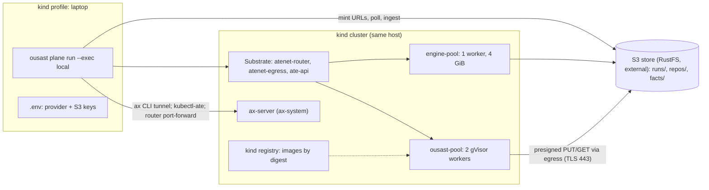
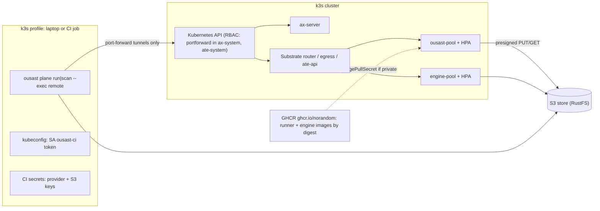

# Design Document

> **Status 2026-10-04.** Groups 1-2 are done on kind (records `benchmarks/measurements/2026-10-02-k8s-01-profile/`
> and `2026-10-02-k8s-02-store-delivery/`). Task 2.6 is paused. The production target changed. The operator runs a
> kube-ax cluster (k3s, Agent Substrate v0.3.0, AX v0.3.1, 2 nodes). There we may only submit AX Tasks: no k8s
> object creation, no secrets, no access to `ate-system`. The engine now runs there as AX Tasks through
> `benchmarks/learn/engine_trace_ax.py`. The engine-task image (`plane/Dockerfile.engine-task`) is built FROM
> `ghcr.io/norandom/ax-task-runner:v0.3.1`. Tasks read and write through presigned HTTPS links, are named
> `ousast-engine-*`, and run a 1.7 GB heap with `ActiveProcessorCount=2` and one resident Joern session per pin. A
> pin whose sandbox dies is retried once under a new name, then handed to the VM lane (2.5 GB heap). Egress is
> operator-managed: HTTPS 443 to public hosts is open; LAN and cluster-internal addresses are blocked. Archive
> names (`.tar`, `.gz`, `.zip`, `.bin`) failed through the store host's Cloudflare cache until the operator added a
> cache-bypass rule; presigned objects are staged as `.dat` as a safeguard. Groups 3-8 are **to re-plan** against
> that cluster under roadmap G4 (`.kiro/steering/roadmap.md`, section of 2026-10-04). Their text below is kept
> as written. G4 (detection on push for any repository: `ousast plane scan --base --head`, engine pins on kube-ax,
> model calls on the VM or CI) is the new target for group 7, sized by what G1-G3 keep.

## Overview

The plane keeps its shape: `ousast plane run` is the reconciler, ax is the only executor, every task is one
digest-pinned image under the runner contract, memory is the S3 store. What changes is where the reconciler's
peers live and how they are named. Three facts from the code and the upstream checkouts decide the design:

- **Every host assumption is an address or a process in four places.** `kind-` + `KIND_CLUSTER_NAME` is built in
  `doctor.py:39`, `egress.py:115`/`:148` and `router.py:145`; `localhost:5001` in `doctor.py:45-47` and
  `up.sh:10`; the receiver is a thread of the CLI (`reconciler.py:350-352`) reached by an EndpointSlice to the kind
  gateway (`receiver-service.yaml.tmpl`, `up.sh:55-57`); the router and ax-server are reached by `kubectl
  port-forward` (`router.py:146-148`; ax's own CLI does the same, `ax/internal/tunnel/tunnel.go:180-238`).
- **The store is already the one thing every profile shares.** `S3Store` is verified at every open
  (`memory.py:608-640`), its `runs/` prefix expires after 30 days (`RUNS_RULE_ID`, `memory.py:589-591`), and no
  task reaches it today. A presigned URL is a credential, and the plane already has a channel for credentials that
  never touches a manifest or the golden boot: the start request (`router.py`, `start_task`, `runner.py:219-275`).
- **ax-server authenticates nobody; Kubernetes does.** `deploy/ax-server.yaml` runs `--addr=:8080` with no auth
  flag; the `ax` CLI tunnels to `svc/ax-server` through kubectl; `kubectl-ate` port-forwards to `ate-api-server`
  and sends a Kubernetes ServiceAccount token (`cmd/kubectl-ate/internal/cmd/root.go:59-60`). So the only
  authenticated door into either control plane is the Kubernetes API with a kubeconfig.

Hence (maintainer, 2026-10-02): the reconciler stays the CLI and gains an execution mode. `local` is the kind
profile as today; `remote` is the same `ousast plane run` (later `ousast plane scan`) from a laptop or a CI job
against ax in k3s, with task artifacts delivered to the S3 store through presigned URLs minted by the CLI and
carried in the start request, and the CLI polling the store for completion. No in-cluster reconciler is needed
for the move; the receiver thread goes in both profiles once the store path passes its kind proof.

### Goals

- Two profiles of one code base, `kind` and `k3s`; every change proven on kind first (Req 2.4, 7.1).
- No module names a host (`kind-ousast`, `localhost:5001`, `172.19.0.1`); a test enforces it (Req 1.3).
- One delivery path (the store) in both profiles; one credential channel (the start request).
- The Joern engine as a plane task on its own pool (Req 4); a delta Run for a push (Req 6).

### Non-Goals

Provisioning k3s; changing Substrate or ax (their manifests are applied with our values, not edited in place);
any detection, scoring or population change; an unattended in-cluster reconciler (deferred, section 2.4).

## Architecture





The two diagrams differ in the kubeconfig principal, the registry, the pool sizes and the HPA. Nothing else.

New code: `plane/profile.py` (the profile), `plane/delivery.py` (presign, poll, extract), `plane/k8s.py`
(manifest rendering per profile), `plane/tasks/engine.py`, `plane/scan.py` (Req 6). `reconciler.py` loses the
receiver wiring and gains a `Delivery` dependency; it stays under the 500 lines `test_plane_reconciler.py:803`
enforces because every new concern is a sibling module, as `router.py` and `egress.py` already are.

## Components and Interfaces

### 1. Configuration surface: `PlaneProfile` (Req 1)

**Decision.** One frozen dataclass `PlaneProfile` in `plane/profile.py`, loaded by `load_profile()` from a TOML
file named by `OUSAST_PLANE_PROFILE` (a name resolved under `ops/k8s/profiles/<name>.toml`, or a path; default
`kind`), with every field overridable by an environment variable of the same upper-cased name
(`OUSAST_KUBE_CONTEXT`, `OUSAST_REGISTRY`, ...). Profiles hold no secret: keys stay in the environment or
`.env`, as today.

| Field | `kind.toml` | `k3s.toml` | Replaces |
| --- | --- | --- | --- |
| `exec` | `local` | `remote` | the implicit host mode |
| `kube_context` | `kind-ousast` | `ousast-k3s` (the maintainer's context name) | `"kind-" + KIND_CLUSTER_NAME` in three modules |
| `registry` | `localhost:5001` | `ghcr.io/norandom` | `doctor.py:45`, `up.sh:10` |
| `images` | `kind-images.json` | `images.json` (from the release, section 8) | the `image:` literals in `plane/tasks/*.yaml` |
| `router_url` | `""` (port-forward) | `""` (port-forward) | `OUSAST_ROUTER_URL` stays as the test override |
| `ax_server` | `""` (ax CLI tunnel) | `""` | `$AX_SERVER` stays as ax's own override |
| `memory` | `s3://sast-memory` | `s3://sast-memory` | `OUSAST_MEMORY` default `file://` is removed for the plane (no fallback) |
| `atespace` | `default` | `default` | `generate.ATESPACE` |
| `snapshots_bucket` | `s3://ax-snapshots` | `s3://ax-snapshots` | ax's `gs://dberkov-gke-dev3/ate-env/` (rendered into our ax-server patch) |
| `pools.default`, `pools.engine` | `{replicas: 2, cpu: 1, memory: 1536Mi}`, `{1, 2, 4Gi}` | documented production values | `workerpool.yaml.tmpl` |
| `image_pull_secret` | `""` | `ghcr-pull` | none today |

**Why a file plus env, not env only.** Eleven values change together per cluster; env-only has no reviewable
record of what "k3s" is (the `ops/ax/README.md` table at lines 193-204 already struggles to list them), and a
CI job would carry eleven exports. The env override keeps the existing tests (`OUSAST_ROUTER_URL`,
`OUSAST_ARTIFACT_HOST`) and one-off experiments working. **Rejected:** a `[plane]` section in the scan config
TOML (the scan config is a user's tool configuration; the plane is a maintainer surface and must not leak into
`ousast scan`); a Kubernetes ConfigMap (there is no in-cluster reconciler to read it).

`doctor()` takes the profile: it checks `kube_context` reachability, the two namespaces, that the `images` file's
runner reference resolves (`docker manifest inspect` for GHCR, the `/v2/` catalog for a local registry), that
`memory` opens (`open_store` verifies the bucket), and prints each configured address (Req 1.2). The literal scan
(section 9) covers `src/`, `ops/`, `plane/` and `docs/` except the profile files themselves and
`ops/ax/up.sh`, which may name kind because it creates it.

### 2. Execution mode: the CLI with `--exec local|remote` (Req 2)

**Decision.** `ousast plane run RUN.yaml [--exec local|remote]` (default from the profile). Both modes run the
same `reconciler.run`: render, `ax apply`, egress policy, resume, start, await, delete. What differs is
addressing and principal, and none of it is new client code:

| Call | Through | Principal in `remote` |
| --- | --- | --- |
| `ax apply/resume/get/delete` (`reconciler.Ax`) | ax's own tunnel: `kubectl port-forward -n ax-system svc/ax-server` (`tunnel.go:203-238`), context from the profile | kubeconfig for SA `ousast-ci` |
| `kubectl ate create/get/update egress-policy` (`egress.Egress`) | kubectl-ate's own port-forward to `ate-api-server`, bearer = the SA token (`root.go:59-60`) | same SA; Substrate's authorization of that token for `egress-policy` is an open question (below) |
| `POST /ousast/v1/start` (`router.open_router`) | `kubectl port-forward svc/atenet-router` in `ate-system`, as today | same SA |
| artifacts, inputs, state | the S3 store (section 3) | the store's agent key from the CI secrets |

**Auth: kubeconfig with a ServiceAccount token, not an ingress.** ax-server has no authentication
(`deploy/ax-server.yaml:71-79`: `--addr=:8080`, nothing else) and Substrate's router routes on a header. Exposing
either through Traefik would publish an unauthenticated control plane behind whatever middleware we bolt on;
tunnelling through the Kubernetes API keeps one authenticated, audited door and uses the clients as they ship.
**Rejected:** Traefik IngressRoute for ax-server and the router (unauthenticated upstreams, a second auth layer to
design, and ax's CLI would still tunnel); a bespoke ax HTTP client (Req boundary: no replacement of the `ax` CLI
beyond what addressing needs, and the tunnel already handles addressing).

**RBAC (`ops/k8s/base/rbac-ci.yaml`).** ServiceAccount `ousast-ci` in `ax-system`; Role in `ax-system` and in
`ate-system`: `pods` get/list, `services` get, `pods/portforward` create; nothing cluster-wide, no verbs on
Substrate's or ax's CRDs (both are reached through their servers, not through the Kubernetes API). The token is a
bound TokenRequest (`kubectl create token ousast-ci --duration=...`) stored as the CI secret `KUBECONFIG`. Secrets
for the provider and the store stay where the reconciler runs: `.env` on a laptop, repository secrets in CI,
Kubernetes Secrets only on the day an in-cluster reconciler exists (2.4). The start-request path is unchanged
(Req 2.3).

**Run state of record moves to the store.** `state.json` is written locally under `$OUSAST_RESULTS/plane/<run>/`
as today and mirrored to `runs/<run>/state.json` on the store after each change; a rerun from another machine
seeds its local copy from the store. This is what lets CI job N+1 resume CI job N's Run (Runs are long,
resumable and artifact-driven: `reconciler.py:272-312`).

**Kind keeps `local` (Req 2.4).** Same command, same manifests, local registry, laptop as reconciler; the only
differences are the profile's values. The kind proof of each increment is run in `local`, and increment 3 runs
`remote` against kind from a container that holds only the kubeconfig and the secrets (section 7).

#### 2.4 Deferred: an in-cluster reconciler

Not needed for the move. It would add: survival of a laptop sleeping or a CI job timing out mid-Run, scheduled
Runs, and Secrets injected by Kubernetes. It would cost: a workload (Job per Run is the natural shape, keeping
the CLI path identical), a PVC or store-only state, a submit path, and RBAC for ax's and Substrate's Services from
inside the cluster. Revisit when unattended Runs are wanted; the store-backed state above is its prerequisite.

### 3. Delivery: presigned URLs in the start request, both profiles (Req 3)

**Decision.** The runner PUTs `output.tar` to a presigned S3 URL and GETs each declared input from a presigned
URL; the CLI mints them and polls the store. The URLs travel in the start body, never in env:

```json
{"run": "...", "task": "...", "credentials": {"DEEPSEEK_API_KEY": "..."},
 "delivery": {"put": "<presigned PUT runs/<run>/<task>/output.tar>",
              "inputs": {"CANDIDATES": "<presigned GET runs/<run>/<producer>/<artifact>>"}}}
```

- **Why the start body.** A presigned URL is a bearer capability, so the credentials-only-in-the-start-request
  rule applies; env would bake it into the ActorTemplate and hand it to the golden boot; and the body has no
  32 KB ceiling (Substrate rejects env values over 32768 characters, `reconciler.py:141`). `StartGate.offer`
  (`runner.py:250-275`) validates `delivery` the way it validates `credentials`: `https` URLs only, hostnames,
  no echo. Expiry = `OUSAST_TASK_TIMEOUT` (7200 s) + 600 s; a re-start after a re-resume re-mints.
- **Why presigned rather than a scoped delivery credential.** A per-task S3 key needs a per-task policy on RustFS,
  gives the sandbox `ListBucket` and reads beyond its inputs, and would travel in the same body. Presigned URLs
  name exactly the objects a task may write and read, which is what the receiver enforces today
  (`Receiver.input_file`, `egress.py:230-247`).
- **Why not an in-cluster receiver Service.** It is a server to run, holds state in a process, and is reachable
  only from a pod; that is the gap remote mode has. **Rejected.**
- **Objects.** `runs/<run>/<task>/output.tar` (the runner's PUT); after the CLI extracts it, the declared
  `outputs[]` are re-put as `runs/<run>/<task>/<artifact>` so a consumer's presigned GET names one artifact, and
  `runs/<run>/<task>/done.json` carries the summary's status. The 30-day `runs/` expiry already applies; memory
  rows are ingested from the local extraction by `remember` as today (f: annotations and `memory_key` seeding
  unchanged, `generate.py:_chain_inputs`, `memory.seed`).
- **Completion.** `_await`'s `delivered()` becomes `Delivery.delivered(task)`: a HEAD on `output.tar`, polled at
  `OUSAST_POLL_SECONDS` (3 s). The runner's completion marker logic (`runner.py`, `_run_once`) is unchanged.
- **Inputs no task produces** (`candidates.json`, `functions.json`, `case.json`) may also be store objects
  declared as inputs, which lifts the ~20 KB inline-files limit (`ops/ax/README.md:117`); Workspace `files`
  stay for the smoke Task and small cases.

**One path for both profiles (d).** The store is required and verified in both; keeping the receiver for kind
would keep `receiver_address`, `OUSAST_ARTIFACT_DIAL`, the `Host`-dial trick and the EndpointSlice alive for one
profile and leave the kind proof proving a path k3s never runs. The receiver thread, `receiver-service.yaml.tmpl`,
`receiver_cluster_ip` and the `up.sh` step go after increment 2's proof (the `harnessx-removal` sequencing rule:
nothing deleted before its replacement passes). Tests that used `OUSAST_ARTIFACT_HOST` move to a local HTTP PUT
target that accepts presigned-shaped URLs.

**Egress per task (c).** `policy_for` drops the `http` rule and emits one `tls_passthrough` rule on 443 for the
sorted union of the store endpoint's hostname (`urlsplit(S3_ENDPOINT).hostname`, IPs rejected as today), the bound
Workspaces' Git hosts (`git_hosts`) and the bound Model's `openultrasast.io/egress-hosts`. A model-free task's
policy names the store and its Git hosts only. The gateway already passes TLS to the Model host by hostname, so
the store host is the same mechanism (`egress.py:7-16`). Open question: the store endpoint must be a DNS name
the gateway resolves; `files.because-security.com` is; an in-cluster RustFS would need a resolvable Service name.

### 4. The engine as a plane task (Req 4)

**Decision.** `plane/tasks/engine.py` runs in the Joern image under the runner contract, on a second WorkerPool
`engine-pool`. The root `Dockerfile` gains the two lines `Dockerfile.runner:25-29` has (the `ax-task-runner`
shim and `/workspace`), so one *contract* in two images: `ousast-runner` (slim, PyYAML) and `ousast-engine`
(JRE + Joern + php-cli, ~2.8 GB). **Rejected:** Joern inside the single runner image (every task would pull
2.8 GB and every golden snapshot carry it; the engine runs for a minority of cases); Docker-in-pod (no socket on
containerd; `Dockerfile:1-7` already argues against it).

- **Task.** Template `plane/tasks/engine.yaml`: `command: ["engine"]`, env `OUSAST_WORKSPACE_DIR`,
  `OUSAST_FIXED_DIR`, `OUSAST_INPUT_CASE`, pins and `OUSAST_FAMILIES`, bound to the same two Workspaces the
  `alerts` task binds (`generate.py:342-353`). The module lifts `benchmarks/push/finding_dump.py`'s scan into
  `openultrasast.cpg.dump` (the image ships `src/`, not `benchmarks/`) and reuses `engine_alerts.engine_rows`,
  `read_record` and the `alerts` helpers (`scan`, `coverage`, `write_rows`, `write_summary`). It emits the same
  `alerts.jsonl` rows (`rule_id: engine:<family>`, `source: "engine"`) and `summary.json` (coverage with the
  engine's languages, files and bytes read, questions, seconds, degradations per pin) as `alerts-engine`, with
  `host: false`. The instrument rule stays: no `read N files` line or `questions == 0` fails the task loudly.
- **Sizing from the record** (`benchmarks/measurements/2026-09-30-php-engine-alerts/record.json`): container
  peak 2.129 GiB under a 3 GiB limit, 789 s for both pins of froxlor, deadline 1800 s per pin. Task resources:
  requests 3 Gi / 1 CPU, limits 4 Gi / 2 CPU; `engine-pool` workers 4 Gi / 2 CPU, replicas 1 on kind (the 7 GB
  host holds it only with `ousast-pool` at one worker), production replicas in `k3s.toml`. Task timeout: two pins
  times 1800 s plus grace fits `OUSAST_TASK_TIMEOUT` 7200.
- **Placement is the open question of this increment.** ax's templates set no worker selector
  (`workerpool.yaml.tmpl:1-3`), so Substrate picks any free worker of the sandbox class. The kind proof must show
  a 3 Gi actor lands only on `engine-pool`. If Substrate does not place by resource fit, the fallback is a
  separate atespace with its own pool if Substrate scopes pools that way; failing that, the engine stays
  `alerts-engine` on a Docker host and the k3s engine becomes a plain Kubernetes Job outside ax, recorded as such.
  **Probe outcome (task 1.5, 2026-10-02, `benchmarks/measurements/2026-10-02-k8s-01-profile/`): `placement: any`.**
  With `ousast-pool` at one 1536Mi worker and a `probe-pool` of one 3Gi worker both ACTIVE, a `repo-facts` actor
  requesting 2560Mi (limit 3Gi) was placed on the 1536Mi `ousast-pool` worker (`kubectl ate get workers`: ACTORS
  1/1000 there, 0/1000 on `probe-pool`), and so was the 256Mi actor. Substrate does not place by resource fit, so
  group 5 takes the fallback: the engine pool must be the only pool its actors can land on. Before 5.2, check whether
  Substrate scopes pools by atespace (an `engine` atespace with `engine-pool` as its only pool); if it does not, the
  k3s engine runs as a plain Kubernetes Job outside ax and `alerts-engine` stays the kind path.
- **`alerts-engine` stays** for development on a host with Docker (kind profile), its help text and
  `docs/plane.md` row marked "development only; the plane task is `engine`" (Req 4.3). Generated Runs choose
  `engine` when the profile's `images` file has an engine image, else leave `alerts` for `alerts-engine`.

### 5. `ops/k8s/` layout (Req 5)

```
ops/k8s/
  profiles/kind.toml, k3s.toml          # section 1; k3s values documented, not secrets
  base/
    workerpool-default.yaml.tmpl         # replicas, limits, nodeSelector from the profile (render: plane/k8s.py)
    workerpool-engine.yaml.tmpl          # engine-pool, same template, engine values
    ax-server-snapshots.yaml             # a strategic-merge patch setting AX_SNAPSHOTS_BUCKET (applied over ax's deploy)
    rbac-ci.yaml                         # SA ousast-ci; Roles + RoleBindings in ax-system and ate-system (section 2)
    secrets.example.env                  # the variable names only: DEEPSEEK_API_KEY, OPENROUTER_API_KEY, S3_*, AWS_*
  k3s/
    imagepullsecret.yaml.tmpl            # ghcr-pull from a GitHub PAT, referenced by the pools' pod template
    hpa-default.yaml, hpa-engine.yaml    # External metric ate_workerpool_workers{state=at_capacity}, averageValue 0.7
    prometheus-adapter.yaml              # from substrate/demos/autoscaled-workerpool, namespace ax-system
  render.sh                              # ousast plane manifests --profile <p> --out DIR; kubectl apply -f DIR
```

`ops/ax/up.sh` keeps creating kind and calls `render.sh kind` for the pools; its receiver step is deleted in
increment 2. **gVisor on k3s is a correction to the requirements text:** Substrate does not use a Kubernetes
`RuntimeClass`. The `ateom-gvisor` worker (`workerImage: ko://.../cmd/ateom-gvisor`) fetches the gvisor release
tarball named by `manifests/ate-install/sandboxconfig-gvisor.yaml` (`gs://gvisor/releases/nightly/...`) and runs
`runsc` itself inside the worker pod (`cmd/ateom-gvisor/actorpath.go:35-45`). The node checklist is therefore:
PodSecurity in `ax-system` admits the worker pod's security context (recorded from kind in increment 6), the
node reaches the tarball URL or a mirror named in a copied SandboxConfig, and `/var/lib/ate` sits on local-path
storage with room for golden actors (24 MB each, `ops/ax/README.md:112`). Autoscaling is k3s-only: the HPA
needs Prometheus and the adapter (the Substrate demo README says kind-only for the demo; we take its manifests),
and the 7 GB host cannot scale anyway. The queueing consequence of one actor per worker is recorded in the
runbook: a Run with `--workers N` beyond the pool's replicas queues in ax as Suspended until a worker frees.

### 6. `ousast plane scan <url> --base <c> --head <c>` (Req 6)

`plane/scan.py`, reusing `generate.py`'s render path with a new case source:

1. **Workspace generation** (`generate.scan_cases(url, base, head, cache)`): a shallow clone into the case cache
   (`runner.find_cached_checkout` layout), two pinned Workspaces `<repo_dir>-<head7>` and `<repo_dir>-<base7>`
   (`workspaces.py` shape, pins in `openultrasast.io/git-commits`), repository key by `memory.repo_key`.
2. **Candidates from changed functions**: `generate.fix_ranges(repo, base, head, side="new")` gives the head-side
   hunks (the `push/` delta primitive `_diff_records` is the same `git diff -U0`), `repo_facts.enclosing` names
   the function per hunk line, filtered to `repo_facts.product_files`. Quick rules on the changed files
   (`tasks.alerts.scan`) add alerted functions; `roles` runs once per repository when memory has no `roles` rows
   for it; `repo-facts` supplies callers. `candidates.json` and `functions.json` are store inputs (section 3).
3. **Run composition**: per changed-function set `facts -> va, vb -> agree -> vc -> final -> features ->
   remember`, plus `engine` when a changed file's language is engine-covered and not quick-covered, or PHP
   (`ENGINE_ALONGSIDE_QUICK`). Budgets from `generate.verify_budget` (0.022 USD per candidate, headroom 1.5);
   `--ceiling` caps the sum. `--all` (whole repository, secondary) takes every product function.
4. **Results** land in memory under `repos/<host>__<owner>__<name>/<head>.jsonl` through `remember` and
   `ousast plane remember` (rows already carry `repo` and `pin`, `memory.py:77`); `runs/<run>/` holds the raw
   artifacts for 30 days. The report prints the attribution table and the plane's agreement (`final`); the
   decision engine's verdict only when a model is adopted (learned-decision-engine Req 6 unchanged).
5. **Latency split (e).** `ousast pre-push` stays the blocking hook: quick rules and the delta engine inside
   `OUSAST_PUSH_DEADLINE` (30 s, `ops/README.md:322`). `ousast plane scan --exec remote --no-wait` submits and
   prints the Run name in the hook's report; `--wait SECONDS` blocks for CI. `ousast plane status <run>` reports
   later. The wrapper `ops/pre-push` gains an opt-in `OUSAST_PLANE_SCAN=1`; it never blocks on the plane.

### 7. Increment order, kind proof and measurement

| # | Increment | Kind proof (`local` unless stated) | Recorded under `benchmarks/measurements/` |
| --- | --- | --- | --- |
| 1 | `PlaneProfile`, literals replaced, `doctor` by profile | `ousast plane doctor` passes with `kind.toml`; literal scan 0 | `<date>-k8s-01-profile/record.json`: doctor lines per profile, scan count |
| 2 | Store delivery + receiver-less egress; receiver removed after | `ops/ax/smoke-run.sh` delivers `facts.json` via the store; policy has one TLS rule | `-02-store-delivery/`: bytes, PUT-to-poll seconds, rendered policies |
| 3 | `--exec remote` from a CI-shaped container (kubeconfig + secrets only) against kind | smoke Run completes; audit log lists only the Role's verbs | `-03-remote-exec/`: kube audit verbs vs Role, run status |
| 4 | Images on GHCR, digests, repin (section 8) | kind pulls `ghcr.io/norandom/ousast-runner@sha256` (pull secret if private); smoke Run | `-04-ghcr-images/`: sizes, pull seconds per image |
| 5 | `engine` task + `engine-pool` | froxlor case as `engine`: rows equal the 2026-09-30 host record (6/6), placement on engine-pool shown | `-05-engine-task/`: rows diff, seconds, peak memory, placement |
| 6 | Pools per profile, HPA manifests, node checklist | kind pools rendered and applied; worker securityContext recorded; HPA renders (k3s-only live) | `-06-pools/`: footprint table, securityContext |
| 7 | `plane scan` on a real pair (a PHP CVE pair from the dev corpus) | Run completes; rows under `repos/<repo>/<head>` | `-07-plane-scan/`: candidates, cost, agreement, rows |
| 8 | Runbook (`docs/deployment.md`), checklist mapped to R1-R7 | n/a (documentation; every "planned" label removed only with a recorded run) | the checklist links the records above |

### 8. GitHub Actions and re-pinning

`.github/workflows/images.yml` on tags `v*` (separate from `release.yml`, which builds the wheel): build
`plane/Dockerfile.runner` as `ghcr.io/norandom/ousast-runner` and the root `Dockerfile` as
`ghcr.io/norandom/ousast-engine` with `docker/build-push-action`, tag by version, and write the two digests to a
release asset `images.json` (`{"runner": "ghcr.io/...@sha256:...", "engine": "..."}`) and to job outputs.
`generate.repin_templates` (`generate.py:484-497`, one image for all templates) becomes `repin(plane, images)`:
`engine.yaml` gets `images["engine"]`, every other template `images["runner"]`; `ousast plane repin images.json`
exposes it and `--runner-image FILE` keeps working for a single-image file. Private packages: the pools' pod
template names `imagePullSecret` from the profile.

### 9. Tests

- `tests/test_plane_literals.py`: scans `src/`, `plane/`, `ops/` (minus `ops/ax/up.sh`, `ops/k8s/profiles/`) and
  `docs/` for `kind-ousast`, `localhost:5001`, `172.19.`, `127.0.0.1:` and `port-forward` outside `router.py`
  and the ax tunnel note; built at runtime like `test_removed_plane_references.py`.
- `tests/test_plane_profile.py`: defaults, file + env precedence, unknown key rejected, no secret field, both
  committed profiles load.
- `tests/test_plane_k8s.py`: render both profiles; kind has no HPA and no pull secret; k3s has both; engine pool
  limits >= the engine task's limits; every image reference is digest-pinned.
- `tests/test_plane_rbac.py`: the rendered Role's verbs equal the set of Kubernetes API calls the CLI makes
  (fake `kubectl`/`ax`/`kubectl-ate` record their argv; the test maps them to `pods/portforward`, `pods`,
  `services`) and nothing more.
- `tests/test_plane_egress.py`: for every committed Task template, `policy_for` yields one TLS rule whose hosts are
  exactly the store host, the bound Git hosts and the Model hosts; no `http` rule; an IP endpoint is refused.
- `tests/test_plane_delivery.py`: start body with `delivery` accepted; URLs never logged; expiry; PUT and GET
  against a local server; `delivered()` polling; declared-only inputs.
- `tests/test_plane_engine_task.py`: fixture record -> rows and summary equal `engine_alerts.produce`'s shape;
  the instrument failures.
- `tests/test_plane_scan.py`: candidates from a two-commit fixture repository; Run composition; budgets.
- **Only live on kind:** placement on `engine-pool`; Substrate accepting the SA token for `egress-policy`;
  the gateway passing TLS to the store host; GHCR pulls; the HPA (k3s only). These are the kind proofs above.

## Data Models

Store layout additions: `runs/<run>/state.json`, `runs/<run>/<task>/output.tar`, `runs/<run>/<task>/<artifact>`,
`runs/<run>/<task>/done.json`, `runs/<run>/inputs/<name>`; all under the existing 30-day `runs/` rule. Start body:
`credentials` as today plus optional `delivery {put, inputs{name: url}}`. `PlaneProfile` as in section 1.
`images.json` as in section 8.

## Error Handling

A profile naming an unreadable context, a bucket that fails `verify_bucket`, or an images file without a digest
fails before `ax apply` with the field named. A presigned PUT that fails three times ends the task `failed` with
the HTTP status (`runner.deliver` semantics kept); an expired URL after a re-resume is re-minted by the next
start. A store HEAD error during polling is retried with the resume backoff and reported after ten consecutive
failures, like `ax get` (`reconciler.py`, `_await`). A `delivery` URL that is not `https` to a hostname is a 400
from `StartGate.offer`. The engine task fails loudly on an unread input, as `read_record` does.

## Requirement Traceability

| Req | Components | Tests | Kind proof / record |
| --- | --- | --- | --- |
| R1 nothing assumes this host | `profile.py`, `doctor.py`, `egress.py`, `router.py`, `ops/k8s/profiles/` | literals, profile | increment 1 |
| R2 reconciler in the cluster -> CLI with `--exec remote`; kind first-class | `reconciler.py` (`Delivery`), `Ax` with context, `rbac-ci.yaml`, store-backed state | rbac, profile | increments 3, 1 |
| R3 receiver-less artifacts and egress | `delivery.py`, `runner.py` start body and PUT/GET, `egress.policy_for` | delivery, egress | increment 2 |
| R4 engine as a task | `tasks/engine.py`, `cpg/dump.py`, `Dockerfile` shim, `engine.yaml`, `engine-pool` | engine task, k8s | increment 5 |
| R5 sizing and autoscaling | `k8s.py`, `ops/k8s/base`, `ops/k8s/k3s` | k8s | increment 6 (HPA live only on k3s) |
| R6 delta Run | `scan.py`, `generate.scan_cases`, `ops/pre-push` opt-in | scan | increment 7 |
| R7 proven on kind, documented | every increment's record; `docs/deployment.md` | n/a | increment 8 |

## Open Questions

1. **Substrate authorization for the CI token.** `kubectl-ate` sends a ServiceAccount token; which audience and
   which Substrate-side grant let `ousast-ci` create `egress-policy` in `default` is not in the checkouts read
   here. Proven or refuted in increment 3.
2. **Engine placement.** Whether Substrate places a 3 Gi actor only on workers that fit it (section 4). The
   fallback is named.
3. **gVisor tarball reachability on k3s** (`gs://gvisor/...` in the SandboxConfig): mirror or egress needed.
4. **Store endpoint hostname** for any future in-cluster RustFS; today's external endpoint is fine.
5. **Two images under one contract** versus the maintainer's "one runner image for all tasks": the design
   reads it as one contract; confirm.
6. **GHCR visibility** (public packages need no pull secret) and whether Substrate's and ax's `ko` images go to
   the same registry namespace.
7. **Reconciler size**: remote mode and `Delivery` must stay under the 500-line test; if they do not, the test's
   bound moves with a reason, not silently.
