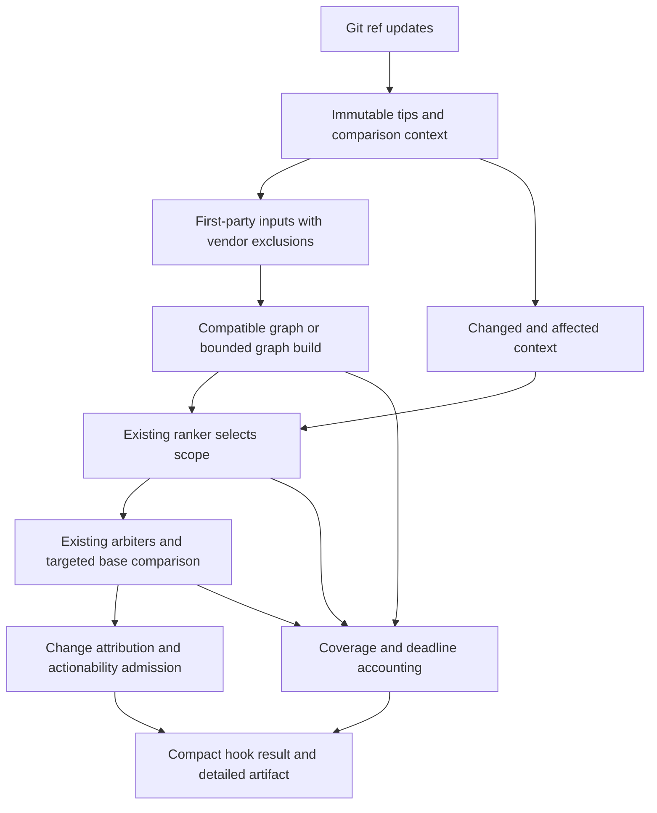

# Design: pre-push-safety-net

Status: approved for task generation on 2026-09-12 following the maintainer's "ok, next kiro phase".
Requirements and tasks are approved; group 1 implementation was authorized by "approve." on
2026-09-12. Runtime and latency claims remain unverified.

## Overview

The hook is a bounded transaction around the existing ranker and detector. It analyzes immutable
pushed tips, supplies change context to the ranker, and admits only actionable security regressions
to the terminal. The ranker remains the scope mechanism. Third-party vendor code stays outside
targets and graphs. WordPress is one regression workload, not the architecture's organizing unit.

The design separates three decisions: the ranker selects questions, the arbiter establishes modeled
claims, and hook policy decides whether a supported change-related claim merits an interruption.
An entailed rung is necessary for initial admission but is not sufficient by itself: a wrong fact,
an irrelevant old defect, or an unactionable witness can still produce noise.

### Goals and Non-Goals

- Deliver specific security findings with witness, change relationship, location, and repair direction.
- Bound the entire push and retain exact coverage; reuse matching analysis work without stale verdicts.
- Measure recall, noise, coverage and latency together across supported languages/frameworks.
- Do not build a second ranker/scope heuristic, an incremental CPG engine, a daemon, an automatic fixer,
  or a mandatory model service. Do not scan intermediate pushed history in this feature.

## Boundary Commitments

### This Spec Owns

- Git push inputs, immutable snapshots, comparison identity, and change context passed to the ranker.
- Local artifact reuse, the shared push deadline, delta attribution and hook alert admission.
- Concise rendering, explicit finding/coverage/push dispositions, and integration instructions.

### Out of Boundary

- Ranking features, weights, tier definitions, and exploration: `flow-aware-ranking` owns these.
- Family facts, sanitizers, graph construction semantics and generic driver correctness:
  `contributor-scan` owns these. Hook integration may extend contracts but may not fork the driver.
- Broader telemetry mechanisms: `zero-with-a-reason`; durable dismissals and learning:
  `finding-feedback-loop`. Initial rollout does not require either to be complete.
- Vendor source analysis, new C memory abstractions, dependency CVE inventories, whole-tree assurance.

### Allowed Dependencies

Use Git, Python's standard library, `preprocess`, `mapping`, `model/regions`, `model/layout`,
`model/scan`, `model/evidence`, `cpg/backend`, existing arbiters, redaction and report records.
No new mandatory package or service. Dependency direction is existing engine/types -> push adapters
and policy -> push runner -> CLI. The engine never imports the push package; shared deadline and
artifact contracts live at the engine boundary. Ranker internals never depend on Git hook objects.

### Revalidation Triggers

Changes to engine/frontend/overlay versions, facts/sanitizers, layout, scope rules, ranker mode,
query depth, deduplication, finding identity, or alert admission invalidate relevant cached results
and require the security/fixed/benign push suite. Ranker changes also require untouched evaluation.
Driver contract changes revalidate ordinary `ousast scan`, coverage reports, and repository benchmarks.

## Architecture

### Existing Architecture Analysis

`preprocess_repository` reads the live filesystem and labels it with HEAD; this is not a pushed
snapshot. `scan_repository` builds a full-root CPG before selecting regions. `ScanBudget` limits
regions/model calls, not total elapsed time. Backend graphs are temporary, with per-command timeouts
and cleanup. `order_by_evidence` is implemented but disabled by the ordinary CLI caller.

Consequently the current ranker does not bound graph-build cost. A faster ordering alone cannot
establish a fast pre-push hook, and passing fewer regions must not be described as incremental parsing.

The deadline surrounds the entire flow. Cache lookup does not bypass identity checks; a miss does
not trigger unbounded work. The default path is local and deterministic. An optional LLM may reorder
within allowed ranker constraints or explain existing evidence; it cannot mint facts or admit alerts.

### Language and Framework Contract

Requirements 8.1, 8.2, 8.3, 8.4 make abstract analysis a transfer contract, not a claim of automatic
language coverage. Frontends and versioned facts identify sources, sink argument roles, carried
values, dispatch, guards, obligations and configuration properties. The common evidence vector,
ranker scope decisions and arbiters consume these representations. Core ranking must not inspect
repository names, PHP syntax, WordPress calls or Express API names to assign priority. Equivalent
normalized evidence receives the same core tier and score regardless of origin; policy admission
also requires the independently evaluated capability for that origin.

Existing seams are `mapping.py` (route/middleware mapping), `ruleset/semantic/*.toml` and
`ruleset/obligations/*.toml` (reviewed language/framework facts), `model/specs.py` (abstract question
construction), `model/evidence.py` (shared ranking), and `cpg/queries/` (graph queries). Reuse them;
do not add a universal source IR or move framework checks into the hook. Frontend normalization
belongs at the backend/query boundary and must document unsupported constructs. Existing
language-specific integrations require audit; this design does not claim they already conform.

For Express, verify route registration and ordered middleware, request input, imported handlers,
service calls, callbacks and async boundaries. A function named `authenticate` does not establish
that its guard governs an operation. Require the same guard/obligation evidence as in other
frameworks. `node_modules` and other declared third-party trees stay outside targets AND graphs;
explicit framework/library summaries describe relevant behavior without analyzing vendor source.
Do not exclude first-party JavaScript merely because it is browser code: record its partition and
capability separately from the server. TypeScript support also needs frontend evidence, not an
assumption based on normalizing its language label to JavaScript.

PMPro is the development workload; Node/Express checks transfer of the frozen core. Framework/fact
adaptations are recorded separately from zero-change transfer, and any case used for repairs becomes
regression data. C and C++ use the same scheduling/reporting contract but may need different abstract
domains: taint transfer, guard dominance and numeric bounds are distinct capability claims. Keep
libpng as an envelope/unsupported-bounds control until a suitable domain is implemented and measured.
Concrete workload roles and required paired changes are in `evaluation.md`.

### Technology Stack

| Layer | Choice | Role |
|---|---|---|
| Push input | Installed Git, object-format-aware commands | Resolve refs, trees and immutable blobs |
| Runtime | Existing Python >=3.11 CLI and standard library | Transaction, cache, deadline, policy |
| Analysis | Existing Joern backend; evaluated baseline 4.0.625 | Graph and arbiters, version recorded |
| Storage | Local content-addressed directories and JSON manifests | Atomic reusable artifacts, no database |
| Presentation | Existing finding records plus compact hook renderer | Separate findings and coverage |

Docker, Compose and provisioning defaults were aligned to 4.0.625 in task 1.1, with a verified
local PHP/JavaScript image smoke. Host deployment and hook performance remain separate claims.

## File Structure Plan

New files (proposed, not created by this documentation change):

| Path | Responsibility |
|---|---|
| `src/openultrasast/contracts.py` | Strict immutable manifest serialization shared by engine and adapters |
| `src/openultrasast/model/contracts.py` | Generic deadline, change context and exact selected/deferred scope contracts |
| `src/openultrasast/cpg/artifact.py` | Backend-owned graph identity, census and live lease protocol |
| `src/openultrasast/push/contracts.py` | Immutable ref/comparison identities and comparison-owned completion/status records |
| `src/openultrasast/push/snapshot.py` | Parse ref updates, resolve bases, materialize blobs, produce change context |
| `src/openultrasast/push/cache.py` | Artifact keys, validity, atomic publication and eviction |
| `src/openultrasast/push/policy.py` | Delta identity, actionability admission and push disposition |
| `src/openultrasast/push/runner.py` | Shared deadline, ranker/engine orchestration, per-ref result aggregation |
| `src/openultrasast/push/report.py` | Compact terminal result and reproducible push manifest |
| `benchmarks/push/README.md` and `benchmarks/push/measure.py` | Labeled push recipes and joint quality/latency measurement |
| `tests/test_push_snapshot.py`, `tests/test_push_cache.py`, `tests/test_push_policy.py`, `tests/test_push_runner.py` | Contract and integration checks below |

Contract configuration (task 1.4) uses `[push]`: optional `comparison_base`, positive
`deadline_seconds` (30), positive `cancellation_allowance_seconds` (2), positive integer
`cache_max_bytes` (2 GiB), `mode` (`advisory` by default, or `blocking`) and independent
`incomplete_coverage_policy` (`allow` by default, or `block`). Unknown keys, malformed
sections and coerced/nonfinite numeric values are rejected. These settings are inert until
runner integration; they do not enable a hook or admit experimental capabilities. The cache
limit is a local storage budget, not a latency claim. Completion records are owned by an
exact comparison so reused head graphs cannot merge evidence from different bases. Live
leases have no JSON constructor; only the backend can validate and issue them in task 6.1.

Modified files: `cli.py` and `config.py` add explicit push command/configuration;
`model/regions.py` carries change context without Git-specific logic; `model/scan.py` consumes the
ranker's selected questions and returns exact selected/deferred IDs, deadline and reusable-graph
contracts; `cpg/backend.py` owns graph artifact validation and process cancellation. Existing
`model/evidence.py` changes only through the ranking spec. Packaging pin fixes remain in existing
Docker/Compose/ops paths. `README.md` documents opt-in integration without overwriting existing hooks.

Cross-language validation reuses `tests/test_model_evidence.py` for equivalent normalized evidence,
`tests/test_model_scan.py` for shared scope/coverage behavior, and existing mapping/fact tests for
frontend adaptation. Reviewed workload recipes use `benchmarks/repos/*.toml` and the proposed
`benchmarks/push/` harness. Necessary mapping/fact/query fixes stay within the engine/ranking specs;
they do not become JavaScript-specific branches in `push/`.

## Components and Interfaces

### Snapshot Adapter

`PushUpdate(local_ref: str, local_oid: str, remote_ref: str, remote_oid: str)` records every input
line. `PushComparison(head_oid: str, base_oid: str | None, base_reason: str, refs: tuple[str, ...])`
records immutable identity. Object IDs are validated through Git; no hard-coded SHA-1 length.

For existing refs, compare the supplied old and new tips, including force-pushes. For a new branch,
use a configured comparison ref resolved to an OID and its unique merge base with the pushed tip;
record that this is a chosen baseline, not the previous remote branch. No configured/unique/local
base means comparison incomplete. Do not substitute HEAD or a remote-tracking ref silently. No
automatic fetch inside the hook. Peel annotated tags to commits; other objects are unsupported.
Deletion updates require no target scan. Deduplicate identical target graphs, but retain separate
comparisons when the same target has different bases. Multiple refs share one deadline.

The snapshot implementation uses `SnapshotAdapter.resolve_updates`, the owned `materialize`
context manager, and `compare`. Preparation has explicit file, source-byte, tree/diff-output and
line-mapping limits. Materialization verifies blob identity and records omitted symlinks, gitlinks
and LFS pointers. Its completeness flag describes source preparation, not security coverage.
The shipped implementation uses Linux directory-relative cleanup that does not follow links.

Materialize tracked blobs directly into isolated scratch storage; do not checkout over the user's
tree or run filters/build scripts. Use NUL-delimited tree/diff records and argument arrays. Include
deletions as impact seeds and retain rename attribution. Symlinks are not followed outside the
snapshot; gitlinks, absent LFS content and unsupported objects produce explicit coverage limits.
Target-tree content is the analysis population; intermediate history is out of scope.

### Ranker Scope Contract

The snapshot adapter provides `ChangeContext`: base/head identities, changed/deleted paths and spans,
manifest/config changes, and known affected first-party relationships. It supplies evidence, not
an alternative inclusion policy. The existing ranker produces `ScopeDecision`: selected question
IDs, their priority/evidence, deferred question IDs with reasons, and unresolved context boundaries.
Identifiers include unit/language/path/function/family to avoid collisions across partitions.

Adapter-produced contexts declare `path_encoding="filesystem-bytes-hex"` for structural paths
(changed/deleted/declaration paths, spans, renames and line correspondences). Use
`ChangeContext.decode_path` when matching canonical question paths; semantic relationship
`QuestionIdentity` paths retain their normal encoding. Existing text-context construction remains
compatible. This preserves unusual and non-UTF-8 filesystem names without ambiguous display escaping.
The caller supplies known declaration/configuration paths as raw bytes; an unavailable declaration
inventory is explicitly unresolved. Unique identical lines outside edit hunks provide lexical
correspondence even after a declaration rename or guard removal. Repeated lines, unmatched moves
and ambiguous rename attribution remain unresolved; these anchors do not prove semantic function
identity, guard effects or defect novelty. Those decisions remain with tasks 3.3 and 4.1.

Third-party vendor exclusions apply before both preprocessing targets and graph construction.
Tests remain available but unshipped, consistent with the approved layout decision. The ranker
cannot reintroduce vendor sources. Known external summaries are versioned facts; without a relevant
summary, a claim depending on excluded internals is unresolved. Do not assume a missing external
call is safe. Entry/callee, field, hook and removed-guard context must be represented in the ranked
question; an unchanged sink may be affected by changed reachability or sanitization.

Graph construction and question scope are distinct costs. Initial graph input is the first-party
repository per supported frontend, or an explicitly declared analysis unit with recorded boundaries.
Do not create an additional heuristic source-slicer. A mixed-language repository has explicit
frontend partitions and coverage per partition; unsupported cross-language edges remain unresolved.
Use old graph relationships only as prioritization hints after a code change, never as current proof.
If a ranked question's necessary first-party context is absent, expand its declared unit within the
remaining budget or report it unresolved. No claim of exact tier-0 pruning extends beyond the
modeled graph/facts/scope; unanswered evidence is never tier 0.

### Cache and Engine Boundary

The initial driver uses a generic `model/partitions.py` graph handle to route existing
question requests to physically filtered frontend inputs. It does not select questions:
one existing ranker order, region budget and `ScopeDecision` cover all partitions.
`PartitionCoverage` records language, frontend, input paths and byte count, excluded
paths, unshipped test paths, build status and capability boundaries. Query locations
return to repository-relative paths before change-context matching. Projection and
cleanup consume the same execution deadline and cancellation allowance as the backend.
Runtime origin is `unspecified` when no declaration establishes browser/server scope;
JavaScript presence alone does not admit an Express capability. TypeScript and C/C++
retain explicit capability limits. These records prepare later artifact manifests;
they do not implement persistent graph storage.

Graph key: digest of every included blob/path and applicable declarations, frontend/engine version,
overlay semantics/options, language, and exclusions. Query key additionally includes graph key,
question/context/depth, facts/sanitizers, query code and relevant analysis configuration. Result key
also includes ranking/admission versions and any model/prompt identity. Comparison results include
both base and head identities. Persist manifests with source byte counts and graph census.

These identities deliberately separate graph construction from ranking experiments. A ranking-only
change can reuse a compatible graph and unchanged query evidence while invalidating affected ranked
results. A query/fact change invalidates its answers without automatically rebuilding a graph whose
input/frontend/overlay semantics are unchanged. This supports iteration on the core as well as
repeated push checks; it does not authorize reusing stale evidence after a source change.

Only validated, complete artifacts can satisfy complete-result lookups. Partial artifacts may be
retained for diagnostics but never promoted by cache presence. Publish atomically from private
temporary paths under a per-key lock; another push may wait only within its deadline. Apply a
configured cache size limit and evict unleased entries. No live graph mutation or dependence on
CPG node IDs remaining stable across builds. A changed input invalidates that graph; incremental
Joern mutation is neither assumed nor promised. Unchanged declared units and identical snapshots
can reuse graphs; changed units rebuild. Measure whether this is enough before claiming scale.

The maintainer confirmed interest in persistence followed by differential updates on 2026-09-12.
Persistence is the first optimization; differential graph mutation remains a separate future
experiment. Its acceptance gate must compare against a cold rebuild on identical inputs and
semantics, including changed/deleted/renamed declarations, affected call edges and dataflow
overlays, and invalidation of dependent query/results artifacts. Updating only changed file nodes
is insufficient. No graph partition may claim complete cross-partition analysis without validated
relationship handling. This sequencing does not expand the approved implementation into a new
incremental engine.

The backend owns `GraphArtifact` validation/lifecycle. The generic driver accepts an optional
validated graph lease and an absolute monotonic deadline, preserving its ordinary fresh-build path.
Queries operate on an isolated lease if loading can modify a graph. Every subprocess timeout is
bounded by remaining transaction time, including fallback frontend, overlay, shard and retry work.
Cancel process groups, close leases, then persist coverage within the cancellation allowance.

### Delta and Actionability Policy

Admission requires all of: an enabled/evaluated capability, `model_entailed` or a future actually
produced `execution_confirmed` result, a locatable witness, applicable family semantics, no unresolved
dependency that undermines the claim, supported change attribution, and a concrete repair direction.
No production caller currently reaches `execution_confirmed`; it is not a prerequisite or a promise.

Findings are keyed by family/mechanism and stable source/operation identity, with rename/span mapping;
line numbers alone do not establish novelty. Re-query relevant base counterparts under the same
semantics and sufficient comparable context. A missing old finding from a truncated/failed scan is
unknown, not proof that the head introduced a bug. A removed guard or newly connected source can
establish a worsened flow at an unchanged sink. Unknown novelty stays in the diagnostic artifact
with one aggregate comparison-coverage notice. Initial checkout is not automatic acceptance of debt.

Deduplicate by defect, retaining distinct witnesses and ref associations. Explain input/operation,
security consequence, why this change matters and a specific repair locus; do not require automatic
patch generation. Templates grounded in facts/witnesses are sufficient. Admission rejects generic
"sanitize input" advice without a supported context/operation. An LLM explanation must cite the
same witness and cannot raise the rung or invent exploitability.

### Result and Hook Adapter

`PushResult` separates `finding_status` (`actionable` / `none`), `coverage_status` (`complete_within_scope`
/ `incomplete` / `unavailable` / `not_applicable`) and `push_disposition` (`allow` / `block`). Zero
selected questions cannot mean complete when applicable questions were deferred or context is unknown.
The detailed manifest retains per-ref/per-capability coverage, supported and unsupported populations,
all admitted defects, rejected-candidate reasons, exact scope and timings.

Initial profile default: advisory, with the same admission policy as blocking. Blocking is opt-in and
returns nonzero only for admitted new/worsened findings; incomplete coverage defaults to allow plus
a notice, with a separately configurable strict coverage policy. Show up to three concise defect
summaries plus the remaining count/artifact path; the cap never changes the exit decision. Do not
render the full SAST backlog. No actionable findings: at most one bounded status line. Incomplete:
one notice naming the primary reason and a concrete retry/diagnostic action. Unchanged results may
be reused, but a still-relevant admitted defect is not dismissed merely because it was printed before.

Expose a proposed `ousast pre-push` command receiving Git's stdin and remote arguments, plus explicit
base/head replay. Hook installation is explicit: preserve `core.hooksPath`, existing hook exit
semantics, and stdin for other consumers. Provide an integration snippet and refuse automatic
overwrite of an existing hook. Analysis runs no project code and performs no source modification.

## Requirements Traceability

| Requirements | Design elements |
|---|---|
| 1.1, 1.2, 1.3, 1.4 | Snapshot Adapter: immutable objects, per-ref comparisons, special update cases |
| 2.1, 2.2, 2.3, 2.4 | Ranker Scope Contract: change context, vendor exclusion, boundary/guard handling |
| 3.1, 3.2, 3.3, 3.4, 3.5 | Delta and Actionability Policy: admission, witnesses, comparison and deduplication |
| 4.1, 4.2, 4.3, 4.4 | Cache and Engine Boundary: shared deadline, complete artifact identity and leases |
| 5.1, 5.2, 5.3, 5.4, 5.5 | Result and Hook Adapter: separate statuses, compact rendering, explicit policies |
| 6.1, 6.2, 6.3, 6.4, 6.5 | Testing Strategy and Rollout: capability admission and joint gates |
| 7.1, 7.2, 7.3, 7.4 | Local runtime, model redaction/budget, manifests, non-destructive integration |
| 8.1, 8.2, 8.3, 8.4 | Language and Framework Contract; frozen-core transfer and workload matrix in evaluation.md |

## Error Handling

Unreadable input or failed census invalidates the affected graph. Missing base invalidates novelty
comparison. Missing context invalidates affected checks. Deadline exhaustion preserves completed
findings and records deferred work. These states remain visible even when the hook permits the push.
If result persistence fails, print one artifact-write notice and retain the real finding/coverage
decision in the terminal; do not fabricate a successful cache entry or hang while retrying.

## Testing Strategy and Rollout

1. Snapshot contracts (1.1–1.4, 7.1, 7.4): dirty trees, non-HEAD pushes, multiple refs with different
   bases, force-push/new-branch/missing-object cases, tags, deletion-only pushes, unusual paths,
   symlinks/gitlinks, and coexistence with an existing hook.
2. Ranker/context tests (2.1–2.4): handler-to-unchanged-sink, field/hook flows, removed guards,
   first-party cross-file context, vendor source absent from both graph and targets, unresolved
   vendor boundary, polyglot partition coverage. No second selection heuristic in the push adapter.
3. Admission tests (3.1–3.5, 5.1–5.5): high rung with wrong/unsupported semantics is rejected;
   unchanged backlog and missing-base claims stay out; new supported defects include actionable
   witnesses; one defect reached by many regions prints once; advisory and blocking share admission.
4. Deadline/cache tests (4.1–4.4, 7.3): source/context/fact/query/version invalidation, corrupt/partial
   entries, concurrent pushes, timeout during build/overlay/query/retry, process-group termination,
   no repeated per-ref budget reset, exact selected/deferred IDs rather than slicing old order.
5. Real push evaluation (6.1–6.5, 8.1–8.4): use PMPro for core development, then freeze the core
   and replay labeled introducing/fixing/benign changes on a JavaScript/Express Node API workload.
   Preserve Python regressions and a separate untouched Node API repository; training applications
   and cases used to fix mapping are not fresh holdouts. Include injection, path and authorization/
   configuration where supported, plus middleware and cross-module/async controls. Test equivalent
   normalized evidence for identical core decisions. Keep libpng's envelope and unsupported bounds
   separate from a future C/C++ positive control. See `evaluation.md` for selection and labeling gates.

Measure the accepted experimental acceptance profile in requirements on declared hardware and fixed workloads.
Warm means prior reusable work from the preceding state, not only repeating the identical tip.
Report identical-tip hits separately from a one-function change and a dependency/configuration
change. Include first installs, cold graphs, growing repository size, multi-ref pushes and incomplete
outcomes. Freeze the applicable population before ranker selection; deferred questions count against
completion. Report p50/p95 plus timeout counts, observed precision with confidence intervals, recall,
benign interruption rate and fixed-side silence. A low-noise score with low recall/coverage fails.

Rollout order: reconcile engine pins and benchmark honesty; prove one end-to-end change/witness/fix
with the existing ranker; establish deadline/cache feasibility; run untouched and benign evaluation;
admit passing capabilities in advisory mode; consider opt-in blocking only after these gates pass.
LLM ranking is a later experiment, not a prerequisite. If realistic changed-unit rebuilds cannot
meet the deadline/coverage gates, keep the hook experimental and revisit the graph strategy with
measurements; do not solve the miss by silently shrinking context or lowering alert standards.
