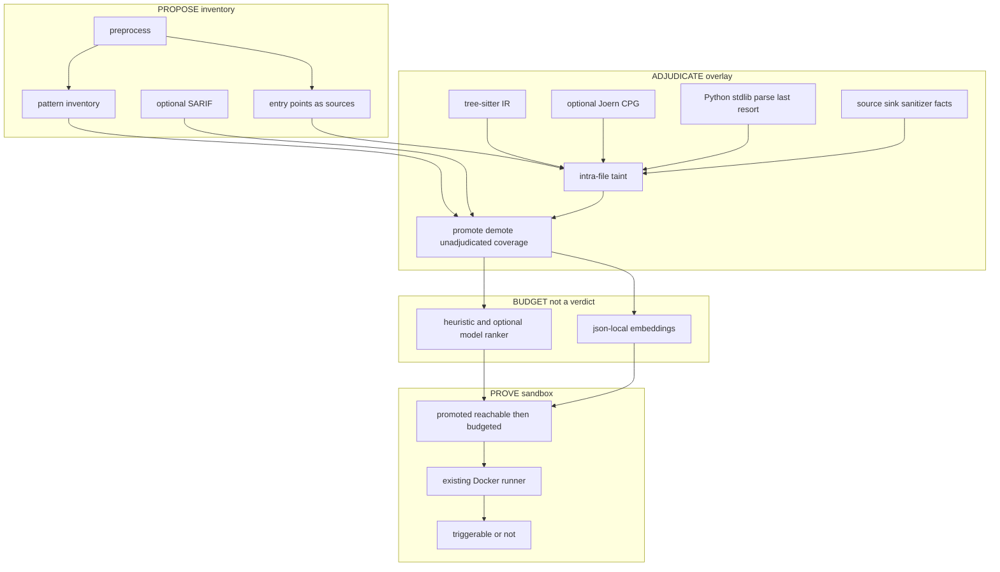
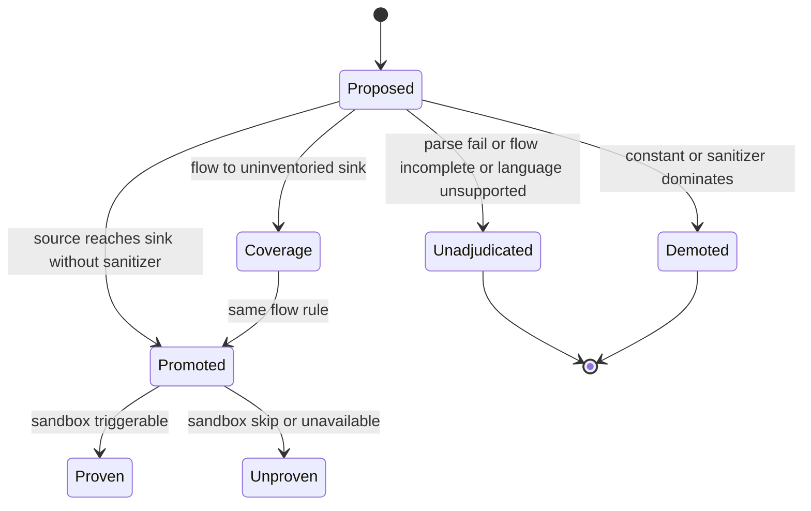

# Design Document

## Overview

**Purpose.** This feature makes the three-stage scan *mean* three jobs: pattern inventory **proposes** sinks; a flow overlay **adjudicates** those proposals on real files; the sandbox **proves** only what was promoted. Operators scanning a working tree they are writing get honest `unadjudicated` instead of fake cleanliness.

**Users.** Developers get `quick` as cheap inventory on WIP code. AppSec gets `standard` dispositions (promote / demote / unadjudicated / coverage). DevOps gets `deep` budget spent on promoted reachable sinks.

**Impact.** Today `quick_scan_findings` is the de facto decision. After this spec, inventory is necessary but not sufficient. MAP writes overlay artifacts. REGRESS candidate selection reads promotions, not demotions.

### Goals

- Map every current scan module onto propose, adjudicate, budget, or prove — rank/embed is not a verdict.
- Treat messy unlabeled trees as the default; labeled corpora as calibration.
- Fail closed: cannot parse or cannot follow flow → `unadjudicated`, not demote.
- **Prioritize the semantic engine now**: tree-sitter IR for in-scope languages; Joern optional CPG sidecar; stdlib Python parse only as last resort.
- Tunable embeddings + existing ranker order **prove** candidates.
- SAST pair slice scores the overlay; smoke gate stays inventory-only.

### Non-Goals

- Replacing pattern rules or `LANGUAGE_MANIFESTS`.
- LLM-as-adjudicator or LLM-as-parser.
- Requiring Joern or an embedding API for `quick`.
- Using retrieval similarity to drop promotions.
- Auto-authoring source/sink/sanitizer facts from `ousast improve`.
- Buffer-size / memory-safety semantics (Juliet CWE-121 goodG2B stays a known leak until a later spec).

## Boundary Commitments

### This Spec Owns

- Overlay dispositions and flow-fact records.
- Source / sink / sanitizer **facts as data** (not CWE severity).
- Tree-sitter probe/runner (CLI-first, like Docker) and last-resort Python stdlib parse.
- Optional Joern probe/runner (CLI sidecar).
- Intra-file taint on the tree-sitter IR.
- Prove-budget: heuristic rank + OpenRouter embeddings over the mechanism log.
- Calibration scoring of overlay on the sast pair slice; unlabeled-scan honesty.

### Out of Boundary

- Pattern text, rule `enabled|shadow|disabled`, CWE TSV, project score formula (`three-stage-scan` / ruleset / policy).
- Complexity-map identity keys, Docker sandbox flags, hunter suspicion contract (`three-stage-scan`).
- Pair catalog schema except scoring **which** findings count (overlay vs inventory).
- External analyzer execution (SARIF ingest remains a proposal input).
- MCP exposing `deep`.

### Allowed Dependencies

- Preprocess, mapping, rank (`heuristic_rank` 0.5/0.2/0.3), `quick_scan_findings`, complexity map, `ousast index` / json-local vectorstore, tool hunter, sandbox runner, pair eval, reports.
- Host binaries when present: `tree-sitter`, `joern` / `joern-parse` (probed, never required for inventory).
- Optional embedding model from existing `[embeddings]` config.
- Clearwing as an **oracle** for tree-sitter callgraph + taint-pattern tables + mechanism retrieval — not a dependency.

### Revalidation Triggers

- Adding a fourth disposition that implies “safe.”
- Demoting when flow is incomplete.
- Stamping overlay above `static_corroboration`.
- Selecting sandbox candidates from demoted or unadjudicated sets.
- Demoting because retrieval score is low.
- Folding overlay Youden into `python -m openultrasast.gate`.
- Making tree-sitter or Joern a hard dependency of `quick`.

## Architecture

### Existing Architecture Analysis

Concrete mapping of **what exists today** onto the three roles:

| Role | Stage / mode | Module today | What it actually does | After this spec |
|------|----------------|--------------|------------------------|-----------------|
| Propose | STATIC / `quick` | `findings.quick_scan_findings` | Pattern rules decide the report | **Proposal list only** |
| Propose | STATIC | `mapping.ingest_sarif` | Operator SARIF | Still proposals |
| Propose | STATIC | `mapping.analyze_entry_points` | Routes / CLI | **Sources** for overlay |
| Budget | STATIC | `rank.heuristic_rank` 0.5/0.2/0.3 | File budget | Same formula; later **prove order** |
| Budget | `ousast index` | `vectorstore` json-local | Hunter retrieval | **Prove retrieval** on promotions |
| Adjudicate? | MAP | `complexity.map` | Hotspot band | Attention only |
| Adjudicate | MAP | **new** tree-sitter IR + taint | — | **Primary semantic engine** |
| Adjudicate | MAP | **new** Joern CLI sidecar | — | Optional CPG facts; never required |
| Adjudicate fallback | MAP | stdlib `ast` | Routes only today | Python last resort if tree-sitter missing |
| Suspicion | MAP | `tool_hunter` | LLM + grep | May query overlay; never adjudicate |
| Prove | REGRESS / `deep` | `regress` + sandbox | Recipes on ranked findings | Recipes on **promoted then budgeted** findings |
| Calibrate | CI | `gate.py` / `pairs` | Cheat-sheet vs Youden | Inventory vs overlay, unchanged split |

**Selected pattern.** Propose → adjudicate → **budget** → prove. Clearwing’s tree-sitter callgraph + taint tables + mechanism memory are the oracle, not a library import. Embeddings never demote.



### Technology Stack

| Layer | Choice | Role |
|-------|--------|------|
| CLI / modes | existing `quick` `standard` `deep` | Role gating |
| Propose | pattern rules + SARIF | Inventory |
| Semantic IR | `tree-sitter` CLI or API extra; probe like Docker | Primary adjudicator parse |
| Semantic CPG | Joern CLI when present | Optional inter-file facts |
| Fallback parse | stdlib `ast` | Python only, last resort |
| Facts | TOML next to the ruleset | Sources sinks sanitizers |
| Budget | existing ranker + json-local vectorstore | Prove order, tunable |
| Prove | existing Docker CLI sandbox | Unchanged runner |

`quick` stays zero-dep. `standard`/`deep` degrade to unadjudicated when parsers are missing.

## File Structure Plan

```
src/openultrasast/semantic/
  __init__.py
  facts.py              # source sink sanitizer facts
  engines.py            # probe tree-sitter, joern, ast fallback
  ir.py                 # FileIR from the first engine that works
  taint.py              # worklist; incomplete -> Unadjudicated
  overlay.py            # dispositions
  prove_budget.py       # rank + optional retrieval over promotions
src/openultrasast/ruleset/semantic/
  python.toml javascript.toml c.toml java.toml
```

### Modified Files

- `stages.py` / `cli.py` — overlay in MAP; prove-budget before regress.
- `findings.py` — inventory unchanged.
- `regress/candidate.py` — `promote` only, then budget order.
- `rank.py` / `index.py` / `vectorstore.py` — reuse; do not invent a second store.
- `reports.py` — disposition columns.
- `pairs.py` — sast slice uses overlay.
- `mcp.py` — still no `deep`.

## System Flows



**Key decisions**

- Demote only with a positive reason (constant or sanitizer on that path).
- Unadjudicated is the default for messy real files.
- Coverage findings enter the same state machine as proposals.

### Unlabeled working-tree flow

No expected.toml. Success is: every inventory item has a disposition; unadjudicated reasons are explicit; `deep` does not execute demoted sinks; `--fail-on worth-fixing` ignores unadjudicated.

## Requirements Traceability

| Requirement | Summary | Components | Flows |
|-------------|---------|------------|-------|
| 1.1–1.5 | Role split by mode | Stage plan, overlay, prove budget, regress | propose → adjudicate → budget → prove |
| 8.1–8.6 | Semantic engines | engines.py, ir.py, taint.py | tree-sitter then Joern then ast |
| 9.1–9.5 | Prove budget | prove_budget.py, rank, vectorstore | retrieval never demotes |
| 2.1–2.5 | Messy trees, unadjudicated | IR fail, taint incomplete | unlabeled scan |
| 3.1–3.5 | Promote demote coverage | taint, overlay | state diagram |
| 4.1–4.5 | Calibration vs product | gate.py, pairs.py | sast overlay score |
| 5.1–5.5 | Evidence honesty | overlay evidence, hunter | ladder |
| 6.1–6.5 | Prove promoted only | candidate filter, sandbox | deep |
| 7.1–7.5 | Artifacts and fail-on | reports, overlay.json | operator |

## Components and Interfaces

| Component | Domain | Intent | Req Coverage | Dependencies | Contracts |
|-----------|--------|--------|--------------|--------------|-----------|
| InventoryProposer | Propose | Existing pattern + SARIF list | 1.1 | findings, mapping | State |
| FactStore | Adjudicate | Sources sinks sanitizers as data | 3, 5.5 | ruleset/semantic | State |
| FileIR | Adjudicate | Parse one file or fail | 2.1 | ast | Service |
| TaintEngine | Adjudicate | Intra-file paths or incomplete | 2.2, 3 | FileIR, FactStore | Service |
| Overlay | Adjudicate | Dispositions on proposals | 1.2, 3, 5 | TaintEngine | State |
| ProveFilter | Prove | Candidates from promote | 1.3, 6 | Overlay, regress | Service |
| OverlayPairEval | Calibrate | SAST slice uses dispositions | 4 | Overlay, pairs | Batch |

### Adjudicate layer

#### OverlayRecord

| Field | Detail |
|-------|--------|
| Intent | One disposition per proposal or coverage item |
| Requirements | 3.5, 7.1 |

**State contract**

```
proposal_id: str
path: str
line: int | None
disposition: promote | demote | unadjudicated | coverage
reason: str
cwe: str
sources: list[str]
sinks: list[str]
sanitizers: list[str]
evidence_level: static_corroboration | suspicion
```

**Invariants**

- `demote` requires a recorded constant or sanitizer.
- `unadjudicated` requires a reason in {`parse_failed`, `language_unsupported`, `flow_incomplete`, `facts_unavailable`}.
- `promote` and `coverage` do not exceed `static_corroboration`.

#### TaintEngine service

```
analyze_file(path, text, language, facts) -> FileFlow | Unadjudicated
adjudicate(proposals, flows, facts) -> list[OverlayRecord]
```

- Engine order: tree-sitter grammar → Joern file export if probed and useful → Python stdlib parse → unadjudicated.
- Joern may add paths; it must not demote a tree-sitter promote, and a Joern miss must not demote.
- Postconditions: every inventory proposal appears exactly once; extras are `coverage` only.

### Prove layer

#### ProveFilter

Inbound: overlay + reachability from mapping. Outbound: existing `regress` candidates.

- Drop `demote`.
- Do not sandbox `unadjudicated` as a negative proof.
- Keep `promote` that are reachable or inferred-file-surface.
- Order survivors with heuristic rank, then **mechanism recall**: hard filter (language, CWE, tags) then OpenRouter dense cosine on the mechanism text. Low similarity never drops a promotion.
- Write mechanisms only after prove/triggerable. JSONL log is authoritative; json-local `mechanisms` namespace is a rebuildable embedding cache via `OpenRouterEmbeddingClient`.

## Data Models

**Facts (data, versioned with the ruleset)**

- `source`: identifier (e.g. request parameter, header, stdin, argv)
- `sink`: call shape + CWE (aligned to existing rule ids when possible)
- `sanitizer`: call shape that stops taint (parameterized execute, `printf` with literal format, `safe_load`, list-form subprocess)

**FileFlow**

- assignments and call arguments in one function
- one-hop name copies (`bar = param`, `sql = f"...{bar}"`)
- no types, no inter-file, no may-alias heap in v1

**Mechanism (Clearwing reference architecture)**

Identity is the *pattern*, not a file slice:

| Field | Role |
|-------|------|
| id | stable uuid |
| summary | one sentence, no path/line |
| cwe, language | filters |
| tags, keywords | hard filters, not a ranker |
| what_made_it_exploitable | why a near-miss became a bug |
| source_finding_id, source_repo | provenance only |

Persistence: append-only JSONL (portable). Recall is **not** Clearwing’s TF-IDF ladder.

1. **Filter** — language, CWE, tags (exact overlap). This is a hard prefilter, not a ranker.  
2. **Rank** — OpenRouter `/embeddings` (`OpenRouterEmbeddingClient`, existing `[embeddings].model`) over `summary + what_made_it_exploitable + tags`. Cosine against the promotion’s overlay text. Cache vectors in json-local `mechanisms` namespace, keyed by mechanism id + model id.  
3. **Degrade** — no key / no model / embed failure → heuristic ranker only, degradation recorded. Never bag-of-words cosine.

Query for a promotion: embed the overlay rationale (sources, sink, CWE). Result is a **boost to prove order**, never a demote.

Repo-code chunks (`ousast index` 80-line slices) stay for hunter/verifier retrieval. They are **not** the prove-budget store. Textbook fixtures must not fill the mechanism log unless they were actually proven in the sandbox.

## Error Handling

| Condition | Disposition | Operator sees |
|-----------|-------------|---------------|
| Syntax error / parse fail | unadjudicated parse_failed | proposal kept, marked unresolved |
| No tree-sitter grammar and not Python | unadjudicated language_unsupported | same |
| Joern missing | ignore sidecar | standard still overlays via tree-sitter |
| Embedding model missing | heuristic prove order | deep still runs |
| Callee in another file | unadjudicated flow_incomplete | same |
| Fact file missing | unadjudicated facts_unavailable; `quick` still emits inventory | degradation in manifest |
| Sandbox missing | promoted remains unproven | `sandbox_unavailable` |

## Testing Strategy

- Unit: parse fail → unadjudicated; constant `exec("ls")` → demote; `eval(request.args)` → promote; `sql = f"…{x}"; execute(sql)` → coverage or promote.
- Pair: `--slice sast` uses overlay; `juliet-c-cwe134-printf` stays PASS; `owasp-python-deser` stays PASS; Juliet `goodG2B` exec/strcpy must **demote or unadjudicated**, not inventory-leak counted as pair fail for overlay.
- Unlabeled: tmp tree with a syntax-error file next to a clean `eval(request.args)` — error file unadjudicated, clean file promoted; no expected.toml required.
- Gate: `python -m openultrasast.gate` still inventory-only.
- Deep: candidate list excludes demoted.

## Security

- Overlay does not execute target code.
- Facts cannot override CWE severity.
- Hunter still cannot stamp corroboration.

## Performance

- Overlay is per-file, MAP stage, same file budget as rank.
- Skip files already unreadable at preprocess.

## Migration

- Default `standard` runs overlay when facts load; if facts missing, degrade as Requirement 7.5.
- Existing `quick` CI unchanged.
- Pair gate local 100% remains inventory-or-overlay-equivalent on fixture counterparts (those files are still “nice”; unlabeled tests are additional).
