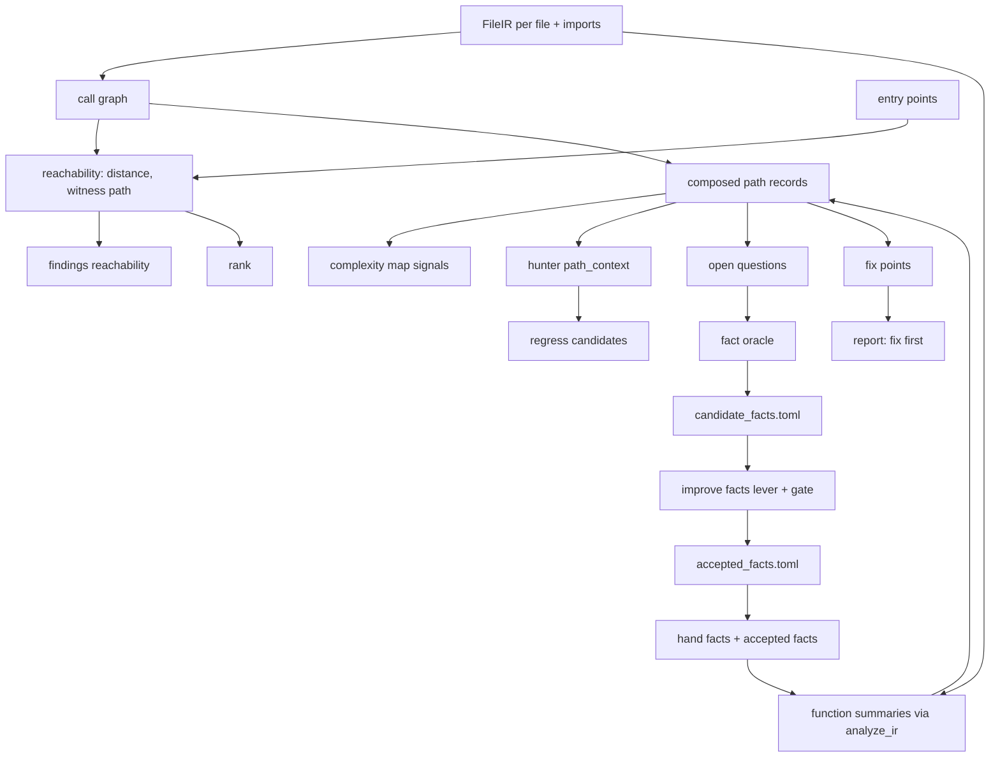
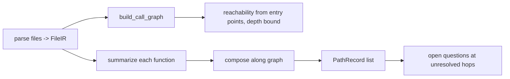
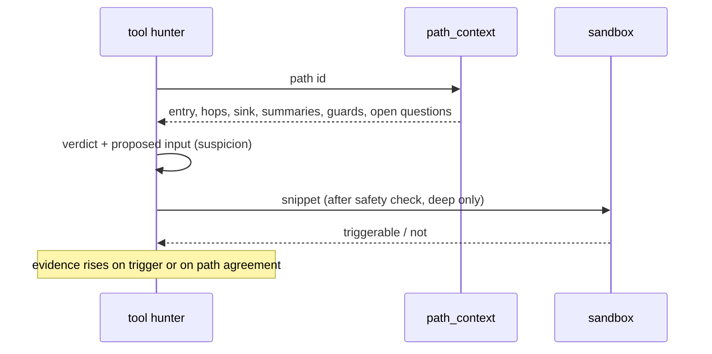
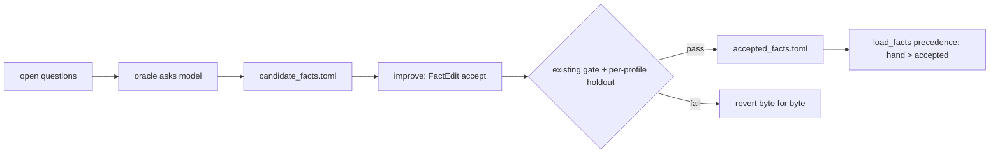

# Design Document

## Overview

**Purpose.** This feature gives OpenUltraSAST a path model: how an entry point reaches a sink, through which functions, with which summaries. It turns reachability into graph distance, puts the hunter on paths, lets model answers become gated facts, and ranks fix points by reachable risk removed.

**Users.** AppSec engineers read paths and fix points. DevOps gets worth-fixing on real reachability. Maintainers get an improve loop that can accept facts. The hunter gets a path and one question instead of a file.

**Impact.** New `semantic/callgraph.py`, `semantic/summaries.py`, `semantic/oracle.py`, `risk/fixpoints.py`. `mapping` attaches graph reachability. `rank` and `complexity` consume distance and path count. `tool_hunter` gains `path_context`. `regress/candidate.py` accepts hunter findings with a locatable sink. `improve` gains a `facts` lever. Reports gain a fix-first section. No disposition, gate, or sandbox flag changes.

### Goals

- Path records from entry to sink across files, bounded, over-approximate, never inferring safety.
- Reachability, rank, map, and worth-fixing use graph distance.
- Hunter on paths; hunter findings can reach the sandbox; evidence rises on checks.
- Model answers become candidate facts, accepted only through the gated lever.
- Fix points with risk removed, reported first.

### Non-Goals

- Guard semantics (next spec), CST fixes (adjacent spec), alias or symbolic analysis, concolic execution, LLM parsing, evidence stamp changes for existing sources, new gates.

## Boundary Commitments

### This Spec Owns

- Call graph, summaries, path records, and their artifacts.
- Graph reachability attachment and the rank and map signal additions.
- `path_context` hunter tool and hunter-candidate eligibility.
- Fact oracle, candidate and accepted fact stores, loader precedence, `facts` lever and its validator rules.
- Fix-point computation and report section.

### Out of Boundary

- `OverlayRecord` fields, dispositions, evidence rungs.
- Rule status and policy levers, CWE policy, project score.
- Sandbox runner, recipes, verdict vocabulary, safety check.
- Pair scorer, catalog schema.

### Allowed Dependencies

- `FileIR`, `FunctionIR`, `CallSite` plus one additive `imports` field on `FileIR`.
- `analyze_ir`, `load_facts`, `SemanticFacts`.
- `EntryPointRecord`, `attach_reachability_hints`, `heuristic_rank`, `build_complexity_map`, `Hotspot`.
- `run_tool_hunter`, `HunterTools`, `select_candidates`, `_hotspot_from_forced_finding`, safety check.
- `run_improvement`, validator, journal, per-profile holdout metrics.
- `OpenRouterChatClient` or HarnessX provider through existing seams; `redaction`.

### Revalidation Triggers

- Changing `FunctionIR` or `CallSite` fields beyond additive.
- Any consumer treating `unknown` distance as unreachable or safe.
- Loading candidate facts without acceptance.
- Adding a question kind.
- Fix points influencing any gate.

## Architecture

### Existing Architecture Analysis

| Existing element | Today | After |
|---|---|---|
| `mapping.attach_reachability_hints` | line-in-handler hints | plus graph distance and witness path |
| `rank.heuristic_rank` reachability term | tags and hints integer | graph distance when available |
| `complexity.build_complexity_map` | size, nesting, tags, density, tests | plus path count, min distance |
| `tool_hunter.run_tool_hunter` | read, grep, find_refs over a hotspot file | plus `path_context`; path-scoped prompt |
| `regress.select_candidates` | hotspots with promoted inventory ids, sev-5 forced | plus hunter findings with locatable sink |
| `improve` levers | rule, policy | plus facts |
| `load_facts` | one directory | hand-written, then accepted candidate facts |
| reports | inventory, map, worth-fixing | plus fix first |

### Architecture Pattern & Boundary Map

Selected: **graph over existing IR, summaries from existing taint, closed oracle behind the existing gate.**



**Key decisions**

- Edges over-approximate; distance `unknown` is never safe.
- Summaries are pure functions of IR and facts, cached by hash.
- Evidence for hunter findings rises only on path agreement or sandbox trigger.
- Candidate facts never load until accepted; hand facts win.
- Fix points are reported, never gated.

### Technology Stack

| Layer | Choice / Version | Role | Notes |
|-------|------------------|------|-------|
| Graph | stdlib dicts, BFS | call graph, distance | no networkx |
| Summaries | existing `analyze_ir` | per-function facts | cached by file hash |
| Oracle | existing chat client seams | closed questions | optional, offline-skippable |
| Stores | TOML in `.openultrasast/calibration/` | candidate and accepted facts | same dir as ledgers |
| Reports | existing markdown, manifest, SARIF | fix first section | additive |

## File Structure Plan

```
src/openultrasast/
├── semantic/
│   ├── ir.py            # FileIR.imports: tuple[str, ...] = ()  (additive); cst/ast fill it
│   ├── callgraph.py     # build_call_graph(irs) -> CallGraph; resolve; reachability(entry_points, depth)
│   ├── summaries.py     # summarize(function, facts) -> Summary; compose(graph, summaries, depth) -> paths
│   ├── paths.py         # PathRecord, write_paths, load_paths
│   ├── oracle.py        # open_questions(paths, graph) ; ask(questions, client) ; candidate store io
│   └── facts.py         # load_facts(dirs...) precedence: hand > accepted
├── risk/
│   └── fixpoints.py     # dominators over path graph; risk removed; artifact
├── mapping.py           # attach_graph_reachability(targets, graph, distances)
├── rank.py              # reachability from distance when present
├── complexity/signals.py# path_count, min_distance signals
├── tool_hunter.py       # path_context tool; path-scoped prompt when paths exist
├── regress/candidate.py # hunter findings with locatable sink -> forced hotspot after safety check
├── improve/validator.py # FactEdit lever "facts"; closed kinds; source must be candidate cache or benchmark signal
├── improve/evolve.py    # facts lever in run_round; same gate + per-profile clause
├── reports.py           # fix-first section; manifest.paths, manifest.open_questions
├── config.py            # [reach] depth=4, max_fanout=32, oracle_enabled, max_questions
└── cli.py               # wiring in MAP; artifacts callgraph.json, paths.json, fixpoints.json
tests/
├── test_callgraph.py, test_summaries.py, test_paths.py, test_oracle.py, test_fixpoints.py
├── test_tool_hunter.py (path_context), test_regress_candidates.py (hunter eligibility), test_improve.py (facts lever)
└── test_map_gate.py (path assertion)
```

### Modified Files

- `semantic/cst.py`, `semantic/ir.py` — collect import statements into `FileIR.imports`; no other IR change.
- `mapping.py` — new function; `EntryPointRecord` unchanged.
- `stage_processors.py` — MAP stage runs graph, summaries, paths before overlay; overlay unchanged.
- `map_gate.py` — path assertion per language family.

## System Flows

### Path construction



Composition rule: for a caller hop with tainted argument i to callee c, if `summary(c).param_to_sink[i]` is non-empty, extend the path; if `summary(c).param_to_return[i]`, the call result is tainted in the caller; if c is unresolved or beyond depth, mark `incomplete_at` and stop. No demotion is ever produced by composition.

### Hunter on a path



### Facts lever



## Requirements Traceability

| Requirement | Summary | Components | Flows |
|-------------|---------|------------|-------|
| 1.1–1.6 | call graph, unresolved, distance, over-approx, extra-free, artifact | CallGraph | path construction |
| 2.1–2.5 | summaries, composition, depth, unresolved hop, path records | Summaries, Paths | path construction |
| 3.1–3.6 | reachability, rank, map, worth-fixing, map gate | ReachabilityAttach, rank, complexity | — |
| 4.1–4.5 | path_context, path prompt, candidate eligibility, evidence, budget | HunterPaths, candidate | hunter on a path |
| 5.1–5.6 | question kinds, when asked, cache, precedence, no exec, no model | FactOracle, facts loader | facts lever |
| 6.1–6.5 | facts lever, validator, gate, journal, hand facts win | FactsLever | facts lever |
| 7.1–7.5 | fix points, risk removed, report, sev-5 invariant, artifact | FixPoints, reports | — |
| 8.1–8.5 | split-sink path check, labeled-function distance, gates unchanged, offline | map_gate, pairs payload, tests | — |

## Components and Interfaces

| Component | Domain | Intent | Req | Dependencies | Contracts |
|-----------|--------|--------|-----|--------------|-----------|
| CallGraph | semantic | resolve calls, distances | 1 | FileIR P0, entry points P0 | Service, State |
| Summaries | semantic | per-function taint facts, composition | 2 | analyze_ir P0, facts P0 | Service |
| Paths | semantic | path records artifact | 2.5 | Summaries P0 | State |
| ReachabilityAttach | mapping | distance on findings, rank, map | 3 | CallGraph P0 | Service |
| HunterPaths | hunter | path_context, path prompt, eligibility | 4 | Paths P0, tool_hunter P0, candidate P0 | Service |
| FactOracle | semantic | closed questions, candidate cache | 5 | chat client P1, redaction P0 | Batch, State |
| FactsLever | improve | accept or reject candidate facts | 6 | validator P0, evolve P0, holdout metrics P0 | Batch |
| FixPoints | risk | dominators, risk removed, report | 7 | Paths P0, policy P0 | Batch, State |

### Semantic

#### CallGraph

```python
@dataclass(frozen=True)
class CallEdge:
    caller: str          # "path::function"
    callee: str | None   # resolved node id or None
    call_line: int
    resolution: str      # exact | import | ambiguous | unresolved

@dataclass(frozen=True)
class CallGraph:
    nodes: tuple[str, ...]
    edges: tuple[CallEdge, ...]
    unresolved: int

def build_call_graph(irs: Sequence[FileIR]) -> CallGraph: ...
def reachability(graph: CallGraph, entry_nodes: Sequence[str], *, max_depth: int) -> dict[str, tuple[int, tuple[str, ...]]]: ...
```

Resolution order: same file definition; definition in an imported module (by `FileIR.imports` and path stem); any definition with that trailing name (ambiguous, one edge each, capped by `max_fanout`); else unresolved. Method calls resolve by trailing name. C resolves by bare name across the tree.

Invariants: never drops a call; `unresolved` counted; distance absent means `unknown`.

#### Summaries and Paths

```python
@dataclass(frozen=True)
class Summary:
    node: str
    param_to_sink: dict[int, tuple[tuple[str, int], ...]]   # param index -> (sink id, line)
    param_to_return: tuple[int, ...]
    constant_params: tuple[int, ...]
    facts_version: str
    source_hash: str

@dataclass(frozen=True)
class PathRecord:
    path_id: str
    entry: str
    hops: tuple[tuple[str, int], ...]       # (node, call line)
    sink: str
    sink_line: int
    sink_node: str
    cwe: str
    incomplete_at: str | None
    summaries_used: tuple[str, ...]
    open_questions: tuple[str, ...]

def summarize(function: FunctionIR, node: str, facts: SemanticFacts) -> Summary: ...
def compose(graph: CallGraph, summaries: Mapping[str, Summary], entry_nodes: Sequence[str], *, max_depth: int) -> tuple[PathRecord, ...]: ...
```

Preconditions: summaries for every node in the graph, or `incomplete_at` on missing.
Postconditions: no `PathRecord` implies safety; incomplete paths are kept.

### Mapping and ranking

#### ReachabilityAttach

`attach_graph_reachability(targets, graph, distances)` adds to each target's reachability hints an entry `{"kind": "graph", "function_name", "distance", "witness"}`. `findings._reachability_for_line` treats a graph hint whose function contains the line as `reachable`. Rank: `reachability = max(existing, 5 - min(distance, 4))`, rationale records `graph_distance`. Map signals: `path_count`, `min_distance`.

### Hunter

#### HunterPaths

Tool `path_context(path_id) -> {entry, hops, sink, sink_line, summaries, guards: [], open_questions}`. Guards list is empty until `guard-dominance-regime`. When paths exist for a hotspot, the prompt names one path and asks for: verdict, reasoning tied to hops, proposed input. Findings carry `path_id` in tags. Eligibility: a hunter finding whose `line` matches a `PathRecord.sink_line` or an overlay sink line becomes a forced hotspot via `_hotspot_from_forced_finding`, ranked after overlay promotions, subject to `max_candidates` and the safety check. Evidence stays `suspicion`; a sandbox trigger sets the verdict as today; a path agreement is recorded in `reachability_evidence`.

### Oracle and facts

#### FactOracle

```python
QUESTION_KINDS = ("nullable_return", "bounded_argument", "transformer_set_get", "returns_parameter_taint", "sanitizes_parameter")

@dataclass(frozen=True)
class Question:
    kind: str
    callee: str
    language: str
    context_hash: str
    context: str        # redacted callee text or signature only

@dataclass(frozen=True)
class CandidateFact:
    kind: str
    callee: str
    language: str
    answer: dict[str, object]   # structured per kind
    model: str
    context_hash: str
    asked_at: str
```

Batch contract: trigger after composition when a model is configured; input open questions capped by `max_questions`; output appended to `candidate_facts.toml`; idempotent by `(kind, callee, context_hash)`. Never executes code; context passes through `redaction`.

`load_facts(directory, accepted: Path | None)` merges accepted facts after hand-written facts; on id collision the hand-written row wins and a degradation is recorded.

Answer shapes: `nullable_return: {nullable: bool}`, `bounded_argument: {arg: int, bounded_by: int | "constant"}`, `transformer_set_get: {set: str, get: str, key_args: [int], value_arg: int}`, `returns_parameter_taint: {params: [int]}`, `sanitizes_parameter: {params: [int], cwe: str}`.

### Improve

#### FactsLever

```python
@dataclass(frozen=True)
class FactEdit:
    lever: str = "facts"
    action: str           # accept | retract
    fact_key: str         # kind:callee:context_hash
    source: str           # candidate_cache | benchmark_signal
    rationale: str = ""
```

Validator: kind in `QUESTION_KINDS`; `fact_key` present in the candidate cache; `retract` only for accepted candidate facts, never hand-written; no pattern text. `run_round` proposes accepts for candidate facts that touch open questions on missed pairs; the existing gate and the per-profile holdout clause decide; revert restores `accepted_facts.toml` byte for byte; journal records before and after metrics.

### Risk

#### FixPoints

```python
@dataclass(frozen=True)
class FixPoint:
    node: str
    kind: str            # function | entry
    paths_collapsed: int
    risk_removed: float
    witness_paths: tuple[str, ...]

def compute_fix_points(paths: Sequence[PathRecord], severity_by_cwe: Mapping[str, int], evidence_weight: Mapping[str, float]) -> tuple[FixPoint, ...]: ...
```

A node dominates a path if every route from that path's entry to its sink passes through the node. Risk removed sums `severity × weight(evidence)` over dominated paths; weight defaults: sandbox-proven 1.0, path-complete 0.6, incomplete 0.3. Sorted by risk removed. Reported in markdown and manifest; the worth-fixing candidate set is unchanged.

## Data Models

Artifacts under `.openultrasast/runs/<id>/`: `callgraph.json`, `paths.json`, `fixpoints.json`. Manifest additions:

```json
{
  "reach": {"nodes": 412, "edges": 1180, "unresolved": 96, "max_depth": 4, "entry_nodes": 9},
  "paths": {"complete": 14, "incomplete": 31},
  "open_questions": 12,
  "fix_first": [{"node": "api/runs.py::create_run", "paths_collapsed": 6, "risk_removed": 24.0}]
}
```

Calibration stores: `.openultrasast/calibration/candidate_facts.toml`, `accepted_facts.toml`. Both `[[fact]]` tables with the `CandidateFact` fields plus `accepted_at` on the latter.

## Error Handling

| Condition | Response |
|-----------|----------|
| Extra absent, non-Python file | node exists with no calls; edges from it unresolved; `graph_unavailable` degradation per language |
| Parse failed file | node absent; callers' edges unresolved |
| Depth or fan-out exceeded | path `incomplete_at` with reason `depth` or `fanout` |
| No entry points | distances empty; findings keep today's hints; fix points empty |
| Model absent | open questions recorded; oracle skipped with degradation |
| Model answer malformed | dropped; question stays open |
| Accepted fact collides with hand fact | hand fact wins; degradation `fact_shadowed` |
| Hunter snippet fails safety check | inconclusive as today |

## Testing Strategy

- Unit: graph resolution exact, import, ambiguous, unresolved; distance and witness on a small tree; summary of a function with param-to-sink and param-to-return; composition across two files; depth stop is incomplete not safe; fix points on a diamond graph; oracle idempotency; validator rejects pattern text and hand-fact retraction; loader precedence.
- Integration: split-sink Python fixture yields a complete path from the route to the planted sink; map gate path assertion passes; a scripted hunter using `path_context` produces a finding that becomes a forced candidate and runs under the fake sandbox; `run_improvement` with a scripted candidate fact accepts when holdout improves and reverts when a profile regresses.
- Gates: detection gate, local pair gate, existing split-sink assertions unchanged; extra-free suite green with graph assertions skipping.
- No default test needs a model, sandbox, or network.

## Security Considerations

Graph and summaries are static reads. Oracle context is redacted and limited to the callee signature and body; no secrets, no execution. Hunter snippets run only in the sandbox after the existing safety check. Candidate facts are data and cannot introduce pattern text.

## Performance & Scalability

Graph is O(functions + calls). Summaries cached by file hash. Composition bounded by depth 4 and fan-out 32 by default. Oracle bounded by `max_questions` per run. Fix points run over path records, not statements.

## Migration Strategy

1. Graph and distances as artifacts only; nothing consumes them. Baseline recorded.
2. Reachability attachment and rank term; verify split-sink map gate still passes and now asserts a path.
3. Summaries and path records; pairs payload reports labeled-function distance.
4. Hunter path context and candidate eligibility behind config; default on for standard when a model is set.
5. Oracle and facts lever; default `oracle_enabled = false` until the first accepted facts are reviewed.
6. Fix points and report section.

Rollback per phase is config off; artifacts are additive.
