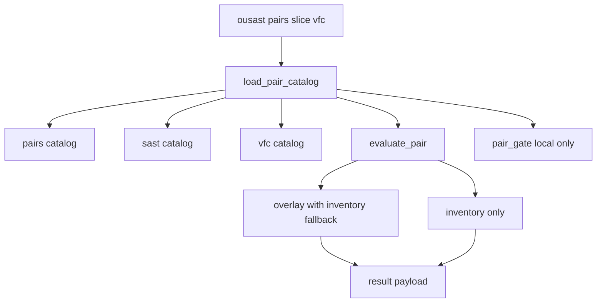
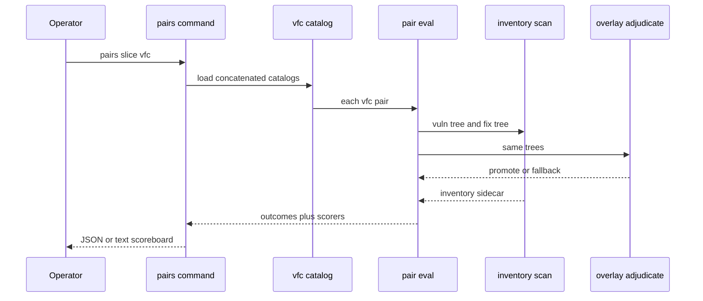

# Design Document

## Overview

**Purpose.** This feature gives OpenUltraSAST a labeled vuln-versus-fix slice from real OpenSSL, Firefox, and Chromium functions so engineers can evolve the harness against product code instead of only OWASP/Juliet.

**Users.** Maintainers grow and score the catalog. AppSec engineers read the honesty dashboard. CI proves the catalog loads and the slice command runs offline.

**Impact.** A new `vfc` slice is concatenated into the pair catalog. Overlay and inventory scores are reported side by side for that slice. The local 100% pair gate and the stage-1 smoke gate do not change.

### Goals

- Seed at least one reviewed isolated function pair each from OpenSSL, Firefox, and Chromium, with provenance.
- Score `vfc` as an honesty dashboard with overlay versus inventory figures.
- Harvest one function from public parent/fix blobs without cloning megarepos.
- Keep CI extra-free and offline; vfc Youden is not a merge condition.

### Non-Goals

- Cloning mozilla-central, gecko-dev, or Chromium.
- FixFox, Bugzilla scraping, or vendoring VFC dumps.
- CWE-121 buffer-size semantics, inter-file taint, or parser extra packaging.
- Changing inventory rules so the seed pairs become pair_correct.
- Making overlay or vfc Youden fail CI.

## Boundary Commitments

### This Spec Owns

- The `vfc` pair slice: catalog rows, vendored excerpts, provenance headers, recipes.
- Harvest procedure that extracts one function from public parent/fix snapshots.
- Dual overlay/inventory scoreboard fields for the vfc slice.
- CLI slice choice `vfc` and tests that the slice loads and runs.
- Dataset pointers for OpenSSL, Firefox/gecko-dev, and Chromium.

### Out of Boundary

- Overlay dispositions, taint, facts, FileIR (`propose-adjudicate-prove`).
- Tree-sitter extra packaging (`tree-sitter-overlay-extra`).
- Stage-1 `LANGUAGE_MANIFESTS` detection gate and local 100% pair gate fail condition.
- Pattern rule bodies; do not retune memcpy/eval to chase vfc Youden.
- Memory-safety / CWE-121 semantics (later spec may reuse these pairs).

### Allowed Dependencies

- Existing `PairCase` / `load_pair_catalog` / `evaluate_pair` / `result_payload`.
- Overlay pair path already used by `sast` (inventory fallback when unadjudicated).
- Stdlib HTTP client for harvest (maintainer-only, not CI).
- Public hosts: GitHub raw blobs, hg.mozilla.org / Phabricator raw diffs.

### Revalidation Triggers

- Changing `PairCase` required fields or catalog concatenation order.
- Failing CI on any slice other than `local`.
- Adding vfc names to `LANGUAGE_MANIFESTS`.
- Making harvest a network-using CI step.
- Importing parser wheels into harvest or pair eval.

## Architecture

### Existing Architecture Analysis

Pair eval materializes each side of a pair into an isolated temp tree and scans it. `local` and `github` use inventory (`quick_scan`). `sast` uses overlay, falling back to inventory when no promote/demote/coverage occurred. Catalog load already concatenates a second file. The pair gate prints every slice but fails only when `local` pair_pass_rate is below 100%.

### Architecture Pattern and Boundary Map

Selected: **concatenated honesty slice + dual scoreboard**. Same catalog schema. Overlay eval generalized from `sast` to `{sast, vfc}`. Inventory sidecar computed only for vfc.



**Key decisions**

- Primary `per_slice.vfc` metrics come from overlay-with-fallback (same as sast).
- `scorers.vfc.overlay` and `scorers.vfc.inventory` are explicit so operators can compare.
- Harvest never runs in pytest. Seed excerpts are committed.
- Dependency direction: recipes/excerpts → vfc catalog → pair loader → eval → CLI payload. Harvest writes excerpts; it does not import overlay.

### Technology Stack

| Layer | Choice / Version | Role in Feature | Notes |
|-------|------------------|-----------------|-------|
| CLI | existing `ousast pairs --slice` | Operator entry | Add `vfc` to choices |
| Catalog | TOML `[[pair]]` | Same schema as github/sast | New file, concatenated |
| Scoring | existing overlay + inventory | Dual scoreboard | No new taint engine |
| Harvest | Python stdlib urllib | Maintainer fetch | Not a core package dep |
| Tests | pytest extra-free | Offline existence + CLI | No network |

## File Structure Plan

```
benchmarks/pairs/
├── catalog.toml              # unchanged rows; still the default path
├── datasets.toml             # add OpenSSL, Firefox, Chromium pointers
├── README.md                 # document vfc slice
├── sast/catalog.toml         # unchanged
└── vfc/
    ├── catalog.toml          # slice = vfc rows
    ├── recipes.toml          # harvest inputs for seed and later pairs
    ├── harvest.py            # extract one function from parent/fix URLs
    ├── openssl-cve-2014-0160/
    │   ├── vuln.c
    │   └── fixed.c
    ├── firefox-cve-2020-15667/
    │   ├── vuln.c
    │   └── fixed.c
    └── chromium-cve-2019-5786/
        ├── vuln.cc
        └── fixed.cc
```

### Modified Files

- `src/openultrasast/pairs.py` — concatenate vfc catalog; overlay path for `vfc`; `scorers` on the eval result; `DEFAULT_VFC_CATALOG`.
- `src/openultrasast/cli.py` — `--slice` choice `vfc`.
- `src/openultrasast/pair_gate.py` — comment that vfc is honesty-only; fail condition stays local.
- `tests/test_pair_corpus.py` — vfc load, provenance, CLI, not in `LANGUAGE_MANIFESTS`, pair_gate still passes.
- `benchmarks/pairs/datasets.toml` — project pointers.
- `benchmarks/pairs/README.md` — slice list and harvest pointer.

## System Flows



Harvest (maintainer, not CI): recipe → fetch parent blob and fix blob → extract named function → write provenance header → write vuln/fixed files. Catalog rows stay hand-reviewed.

## Requirements Traceability

| Requirement | Summary | Components | Interfaces | Flows |
|-------------|---------|------------|------------|-------|
| 1.1, 1.2, 1.3 | vfc slice with three projects | VfcCatalog | catalog load | pairs command |
| 1.4 | reject advisory-only | HarvestTool, VfcCatalog | recipe validation | harvest |
| 2.1–2.4 | provenance and same relpath | ProvenanceHeader, VfcCatalog | catalog fields + file header | harvest |
| 3.1–3.4 | honesty not merge gate | PairGatePolicy, DualScorer | pair_gate, payload | gate |
| 4.1–4.4 | overlay vs inventory | DualScorer | scorers map | pairs command |
| 5.1–5.5 | harvest without clones | HarvestTool | recipes + harvest script | harvest |
| 6.1–6.4 | isolated reviewed functions | VfcCatalog, SeedExcerpts | expected CWE/sink | pair eval |
| 7.1–7.4 | offline testability | VfcTestMatrix | pytest + CLI | extra-free CI |

## Components and Interfaces

| Component | Domain/Layer | Intent | Req Coverage | Key Dependencies | Contracts |
|-----------|--------------|--------|--------------|------------------|-----------|
| VfcCatalog | Catalog | Reviewed vfc rows | 1.1, 1.2, 1.3, 2.3, 6.4 | Pair loader P0 | State |
| ProvenanceHeader | Catalog | Auditable origin on disk | 2.1, 2.2, 2.4 | VfcCatalog P0 | State |
| HarvestTool | Maintainer | Extract one function from public blobs | 1.4, 5.1, 5.2, 5.3, 5.4 | urllib P1 | Batch |
| DualScorer | Eval | Overlay primary + inventory sidecar | 4.1, 4.2, 4.3, 4.4, 3.3 | overlay eval P0 | State |
| PairGatePolicy | Eval | Local-only fail | 3.1, 3.2, 3.4, 7.4 | pair_gate P0 | State |
| SeedExcerpts | Catalog | Three isolated functions | 1.2, 6.1, 6.2, 6.3 | VfcCatalog P0 | State |
| VfcTestMatrix | Tests | Offline load and CLI | 7.1, 7.2, 7.3, 5.5 | pytest P0 | State |

### Catalog

#### VfcCatalog

| Field | Detail |
|-------|--------|
| Intent | Concatenated `slice = "vfc"` rows with OpenSSL, Firefox, Chromium seeds |
| Requirements | 1.1, 1.2, 1.3, 2.3, 6.4 |

**Responsibilities & Constraints**
- Same `[[pair]]` / `[[pair.expected]]` schema as github/sast.
- `load_pair_catalog` appends `benchmarks/pairs/vfc/catalog.toml` when loading the default catalog.
- Names stay out of `LANGUAGE_MANIFESTS`.
- Runnable set stays small; recipes may list more than CI runs.

**Dependencies**
- Inbound: pair loader — concatenate file (P0)
- Outbound: evaluate_pair — cases (P0)

**Contracts**: State [x]

##### State Management
- `DEFAULT_VFC_CATALOG` next to `DEFAULT_SAST_CATALOG`.
- Missing vfc file: do not crash default load if we require the seed to exist; the seed is committed so the file is present. Tests assert it exists.

#### ProvenanceHeader

| Field | Detail |
|-------|--------|
| Intent | Human-readable origin on every vendored excerpt |
| Requirements | 2.1, 2.2, 2.4 |

**Responsibilities & Constraints**
- Header comments include repo, commit, parent, commit URL, CVE, license, function name.
- Catalog row repeats repo, commit, commit_url, cve, license.
- License must be stated (OpenSSL License, MPL-2.0, BSD-3-Clause for the seeds).

#### SeedExcerpts

| Field | Detail |
|-------|--------|
| Intent | Isolated functions, same relpath, reviewed labels |
| Requirements | 1.2, 6.1, 6.2, 6.3 |

Seed pairs (reviewed):

| Name | Project | CVE | Function | Expected class | Honesty note |
|------|---------|-----|----------|----------------|--------------|
| openssl-cve-2014-0160 | OpenSSL | CVE-2014-0160 | `tls1_process_heartbeat` | CWE-126 / memcpy | memcpy remains after fix → likely LEAK |
| firefox-cve-2020-15667 | Firefox libmar | CVE-2020-15667 | `mar_insert_item` | CWE-119 / memcpy | namelen signedness fix; memcpy remains → likely LEAK |
| chromium-cve-2019-5786 | Chromium Blink | CVE-2019-5786 | `FileReaderLoader::ArrayBufferResult` | CWE-416 UAF | no inventory sink → likely MISS |

Stubs (SSL types, MarItem, DOMArrayBuffer) are allowed only to keep the changed function intact.

### Eval

#### DualScorer

| Field | Detail |
|-------|--------|
| Intent | Overlay-with-fallback as primary vfc metrics; inventory sidecar |
| Requirements | 4.1, 4.2, 4.3, 4.4, 3.3 |

**Responsibilities & Constraints**
- `evaluate_pair` uses overlay when `slice in {"sast", "vfc"}`.
- Inventory-only evaluation of vfc cases fills `PairEvalResult.scorers["vfc"]["inventory"]`.
- Overlay metrics also appear as `scorers["vfc"]["overlay"]` (same numbers as `per_slice["vfc"]`).
- `result_payload` includes `scorers`.
- Do not use these figures as a gate.

**Contracts**: State [x]

```python
class PairEvalResult:
    outcomes: tuple[PairOutcome, ...]
    overall: PairCorpusMetrics
    per_slice: dict[str, PairCorpusMetrics]
    signals: tuple[dict[str, object], ...]
    scorers: dict[str, dict[str, PairCorpusMetrics]]
```

##### Service Interface
- `evaluate_catalog(cases) -> PairEvalResult`
- Preconditions: each case has existing vuln and fixed files.
- Postconditions: if any case has `slice == "vfc"`, `scorers["vfc"]` has `overlay` and `inventory`.
- Invariants: pair_gate fail reasons mention only local.

#### PairGatePolicy

| Field | Detail |
|-------|--------|
| Intent | Keep merge fail on local 100% only |
| Requirements | 3.1, 3.2, 3.4, 7.4 |

`pair_gate` may still *evaluate* the full catalog for the printed dashboard. It must not add vfc pair_correct to `reasons`.

### Maintainer

#### HarvestTool

| Field | Detail |
|-------|--------|
| Intent | Fetch parent/fix blobs and extract one function |
| Requirements | 1.4, 5.1, 5.2, 5.3, 5.4 |

**Contracts**: Batch [x]

##### Batch / Job Contract
- Trigger: maintainer runs harvest with a recipe name. CI does not.
- Input: `recipes.toml` row: name, host, repo, parent, commit, path, function, cve, license, relpath.
- Validation: parent and commit required; reject recipes that have only an advisory URL.
- Output: vuln/fixed files with provenance headers. Catalog row is still a human edit.
- Idempotency: overwrite excerpts for that recipe name; do not fetch in tests.

Function extract: start at the named declarator, copy through balanced braces. Do not clone a repo; HTTP GET of a raw blob or a raw diff.

Hosts: `raw.githubusercontent.com`, Phabricator `?diff=1`. Not FixFox.

### Tests

#### VfcTestMatrix

| Field | Detail |
|-------|--------|
| Intent | Offline proof the corpus exists and the slice runs |
| Requirements | 7.1, 7.2, 7.3, 5.5 |

- Catalog load includes `vfc`; files exist; names include openssl, firefox, chromium.
- Provenance headers contain commit URL, CVE, license.
- `ousast pairs --slice vfc --json` exits 0; payload has those names and `scorers.vfc`.
- Pair gate still passes; vfc names not in `LANGUAGE_MANIFESTS`.
- Harvest extract is unit-tested on a local string, not the network.
- Do not assert 100% pair_correct or a Youden floor.

## Data Models

### Domain Model

- **Pair**: isolated vuln snapshot + fixed snapshot + expected CWE/sink + provenance.
- **Slice**: `vfc` honesty set. Not a gate.
- **Scorer**: `overlay` or `inventory`.
- **Recipe**: harvest input, not ground truth until reviewed into the catalog.

### Logical Data Model

Catalog row (existing fields plus required provenance for vfc):

- `name`, `slice = "vfc"`, `language`, `origin`, `license`, `repo`, `commit`, `parent`, `commit_url`, `cve`, `vuln`, `fixed`, `relpath`, `min_recall`, `fix_policy = "silent"`
- `[[pair.expected]]`: `cwe`, `class`, `path`, `rule_id`, `sink`, `evidence`

`scorers` payload:

```json
{
  "scorers": {
    "vfc": {
      "overlay": { "pairs": 3, "pair_correct": 0, "youden": 0.0 },
      "inventory": { "pairs": 3, "pair_correct": 0, "youden": 0.0 }
    }
  }
}
```

Exact counts are not a contract; presence of both objects is.

## Error Handling

- Missing vfc catalog file when loading the default catalog: fail tests (seed is required). Loading an explicit `--catalog` path does not auto-append vfc.
- Harvest HTTP failure: non-zero exit, no partial file without a provenance header.
- Advisory-only recipe: reject before fetch.
- Overlay parse_failed / language_unsupported: inventory fallback (existing sast behavior).

## Testing Strategy

- Unit: harvest brace-extract on a fixture string; catalog load sees three project names; provenance fields non-empty.
- Integration: `evaluate_catalog(select_slice(..., "vfc"))` returns three outcomes and both scorers; pair_gate still passed.
- CLI: `main(["pairs", "--slice", "vfc", "--json"])` == 0.
- Regression: `LANGUAGE_MANIFESTS` leak check includes vfc names; extra-free suite still green.

## Security Considerations

- Vendored excerpts are public historical vuln code with license headers. Do not vendor exploit PoCs (Chromium FileReader exploit HTML is out of scope; only the C++ function).
- Harvest talks only to listed public hosts. No Bugzilla credentials. No FixFox.

## Supporting References

Seed commit identifiers are recorded in `research.md` and must appear in the vendored headers at implementation time.
