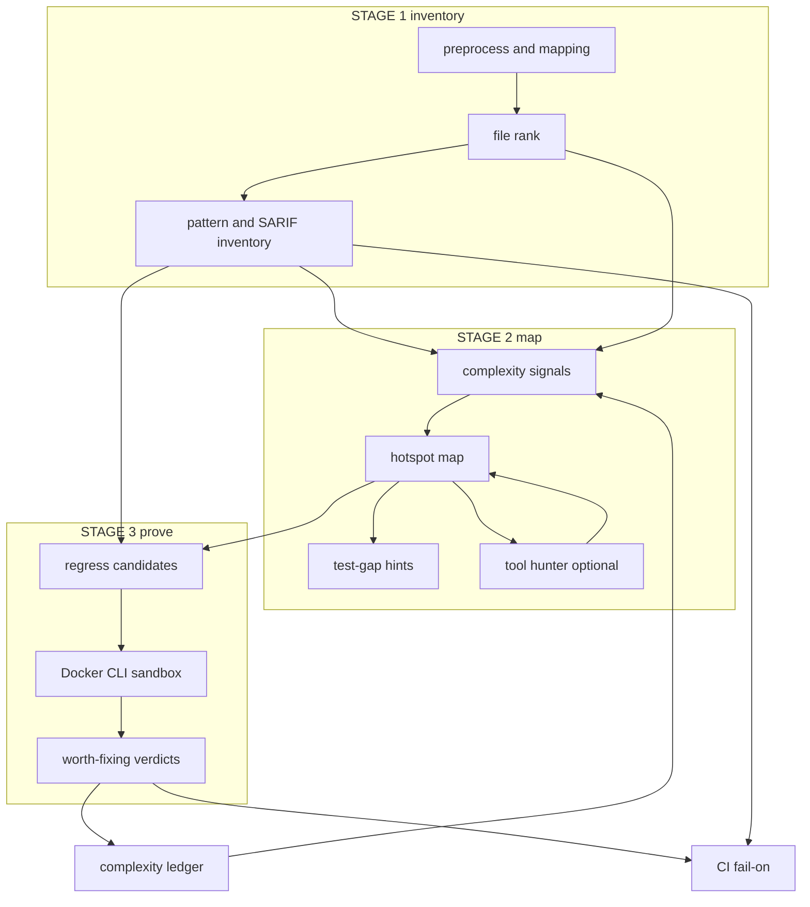
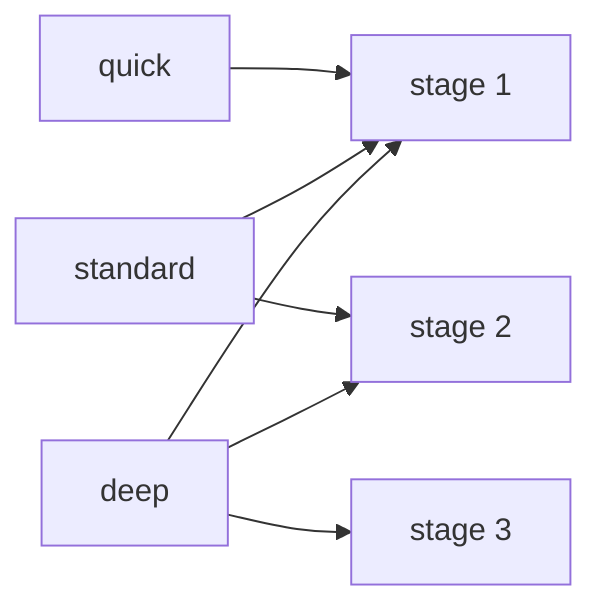
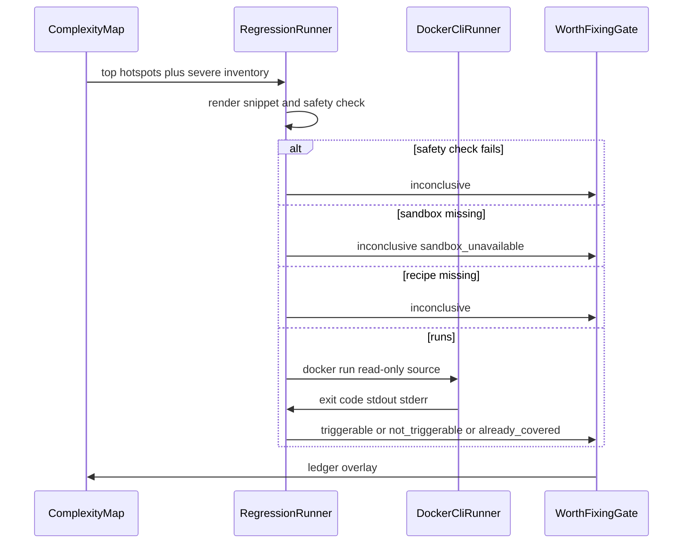
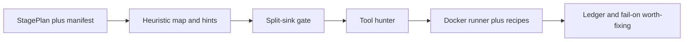

# Design Document

## Overview

**Purpose.** This feature turns an OpenUltraSAST scan into three operator questions: what exists (static inventory), where problems are most likely and how to aim tests (complexity map), and whether a finding is worth fixing (isolated regression). It is a follow-up to the HarnessX governance spec, not a replacement of CWE policy, scoring, or rules-as-data.

**Users.** DevOps engineers get a cheap pull-request inventory and a nightly prove-worth-fixing job. AppSec reviewers get a hotspot map and test-gap hints instead of a regex dump. Maintainers get an evaluation gate that split-sink cases can fail.

**Impact.** Today `--mode standard` reuses regex findings and `--mode deep` exits. After this spec, `quick` remains stage 1, `standard` builds a complexity map and may run a tool-using hunter, and `deep` runs a Docker-isolated regression that is the only path allowed to execute target-derived code.

### Goals

- Map existing `--mode quick|standard|deep` onto stages 1 / 1+2 / 1+2+3 with explicit manifest accounting.
- Keep stage 1 zero-dependency, no model, no target execution.
- Emit a complexity map and test-tuning hints that do not collapse to pattern-hit count.
- Prove worth-fixing inside an isolated sandbox; fail CI on `worth_fixing` only when asked.
- Hunter tools follow dataflow; hunter output is `suspicion`.
- Stage 2/3 quality is gated on split-sink and mutation corpora.

### Non-Goals

- Rewriting PolicyStore, ScoreModel, or detection pattern text.
- Requiring the HarnessX extra for any stage.
- Full fuzzing, exploit development, or auto-patching.
- Importing Clearwing.
- A second CLI family (`--stage`).

## Boundary Commitments

### This Spec Owns

- **Stage plan**: which stages a mode runs, skip/degrade accounting, `stages_requested` / `stages_completed` in the manifest.
- **Complexity map**: `Hotspot` records, signals, test-gap hints, `complexity_map.json`.
- **Complexity ledger**: overlay of hotspot scores from regression verdicts.
- **Sandbox**: capability probe and Docker CLI runner that never mounts the host Docker socket.
- **Regression / worth-fixing**: candidate selection, language recipes, verdicts, `--fail-on worth-fixing`.
- **Tool hunter**: repo-bound read / grep / callers loop for stages 2–3, evidence honesty.
- **Split-sink evaluation**: corpora and the "beats pattern-hit ranking" gate.

### Out of Boundary

- CWE TSV, `resolve_severity`, project-score formula, rule `enabled|shadow|disabled`.
- `MetaAgent.evolve` pattern-status loop.
- Semgrep/CodeQL execution (ingest of operator-supplied SARIF remains as today).
- Patch generation and repository mutation.
- Sanitizer-image matrix and campaign fuzzing.
- MCP docker/shell tools, and exposing `deep` on MCP (CLI/CI only).
- Trail of Bits `skills.STAGES` (`map`/`hunt`/`verify`/`fix`). That `map` is mapping-discipline skill routing, not the complexity-map scan stage.

### Allowed Dependencies

- Existing preprocess, rank, mapping, findings, verification, reports, config, CLI, OpenRouter client, HarnessRuntime events.
- Optional HarnessX extra as an alternate hunter host, not a requirement.
- Operator-provided Docker CLI and LLM credential.
- Stdlib only for new core modules (`subprocess` for Docker, `urllib` already used by OpenRouter).

### Revalidation Triggers

- Changing the mode→stage mapping or `--fail-on` vocabulary.
- Changing hotspot identity keys (breaks the complexity ledger).
- Changing sandbox flags or mounting the Docker socket.
- Stamping hunter output above `suspicion`.
- Using cheat-sheet recall as the stage 2/3 merge gate.

## Architecture

### Existing Architecture Analysis

| Existing element | Constraint |
|---|---|
| `cli._run_scan` modes | Reuse names; stop exiting on `deep` |
| `quick_scan_findings` | Stage 1 detector; not the stage 2 hunter |
| `rank.heuristic_rank` | File budget; not the complexity map |
| `mapping.analyze_entry_points` | Input to map signals and caller hints |
| `hunter._run_hunter_task` | Must stop being a regex alias when a model is set |
| `OpenRouterChatClient` | Default hunter transport |
| `SandboxConfig` | Limits already match the threat model; need a runner |
| `verify_finding` | Keep as structural review gate; do not treat it as worth-fixing |
| `gate.py` 90% recall | Stage 1 only after this spec |

### Architecture Pattern & Boundary Map

**Selected pattern.** Ordered pipeline: **inventory drives the map; the map drives regression; regression overlays the map.** Execution never mutates governance data. Target code runs only in the sandbox.



**Dependency direction:** config/types → preprocess/rank/mapping/findings → complexity map → hunter tools → sandbox → regress → CLI/report/gate.

### Technology Stack

| Layer | Choice | Role | Notes |
|-------|--------|------|-------|
| CLI | existing `ousast scan --mode` | Stage selection | Add `--fail-on worth-fixing` |
| Hunter transport | `OpenRouterChatClient` | Tool loop | Stdlib; HarnessX optional |
| Sandbox | Docker CLI via `subprocess` | Isolated execution | No Python docker SDK |
| Map / ledger | JSON artifacts | Attention + evolution | Same overlay style as `rule_policy.json` |
| Evaluation | split-sink fixtures | Stage 2/3 gate | Smoke fixtures stay stage 1 |

## File Structure Plan

### Directory Structure

```
src/openultrasast/
├── stages.py                 # Stage enum, mode map, StagePlan, degradation helpers
├── complexity/
│   ├── __init__.py
│   ├── signals.py            # per-file/function signals from targets, findings, tests
│   ├── map.py                # build_complexity_map, Hotspot, ComplexityMap
│   ├── hints.py              # test-gap hints, closed test-kind set
│   └── ledger.py             # load/apply/write complexity_ledger.json
├── hunter_tools.py           # read_file, grep_repo, find_refs; path clamp
├── tool_hunter.py            # bounded tool loop over a chat client
├── sandbox/
│   ├── __init__.py
│   ├── probe.py              # docker CLI present and usable
│   └── runner.py             # DockerCliRunner, SandboxRunner protocol, FakeSandboxRunner
└── regress/
    ├── __init__.py
    ├── candidate.py          # select and render candidates
    ├── recipes.py            # language command recipes
    └── verdict.py            # run candidates, worth-fixing gate

benchmarks/fixtures/
├── split-sink-python/
├── split-sink-javascript/
├── split-sink-java/
└── split-sink-c/
benchmarks/manifests/split-sink-*.toml
```

### Modified Files

- `cli.py` — run stage 2/3; stop exiting on `deep`; `--fail-on worth-fixing`; write new artifacts.
- `reports.py` — `scan_exit_code` grows `worth-fixing`; report sections for inventory, map, and worth-fixing.
- `config.py` — `ComplexityConfig` (top_k, max_hunter_hotspots) and `RegressConfig` (max_candidates, image pins); **consume** existing `SandboxConfig` (do not add a second sandbox TOML).
- `hunter.py` — schedule remains; execution delegates to `tool_hunter` when a model is set, else inventory-only.
- `verification.py` / reports — inventory vs worth-fixing labeling; hunter findings stay `suspicion`.
- `gate.py` — stage-1 smoke gate unchanged; add split-sink map gate.
- `reports.py` — map and verdict sections in markdown/manifest.
- `.github/workflows/ci.yml` — PR stays quick; optional nightly deep when Docker is available.

## System Flows

### Mode to stages



If stage 2 has no model, the heuristic map still writes. If stage 3 has no Docker, stages 1–2 remain and `sandbox_unavailable` is recorded.

### Stage 3 worth-fixing



## Requirements Traceability

| Requirement | Summary | Components | Flows |
|-------------|---------|------------|-------|
| 1.1–1.6 | Mode maps to stages; manifest accounting; degrade forward | `stages.py`, `cli.py` | Mode to stages |
| 2.1–2.5 | Stage 1 inventory, no execute, no model | existing preprocess/rank/findings | Stage 1 |
| 3.1–3.5 | Complexity map independent of regex count | `complexity/map.py`, `signals.py` | Stage 2 |
| 4.1–4.4 | Test-gap hints, no repo writes | `complexity/hints.py` | Stage 2 |
| 5.1–5.8 | Sandbox regression, worth-fixing, fail-on | `sandbox/*`, `regress/*` | Stage 3 |
| 6.1–6.6 | Tool hunter, path clamp, suspicion | `hunter_tools.py`, `tool_hunter.py` | Stage 2/3 |
| 7.1–7.5 | Ledger overlay, cannot hide sev-5 reachable | `complexity/ledger.py` | Stage 3 → map |
| 8.1–8.6 | Split-sink / mutation gate | fixtures, `gate.py` | Evaluation |
| 9.1–9.6 | PR cheap, nightly bounded, visible skip | `cli.py`, CI workflow | Degradation |

## Components and Interfaces

| Component | Domain | Intent | Req Coverage | Dependencies | Contracts |
|-----------|--------|--------|--------------|--------------|-----------|
| StagePlan | Orchestration | Mode → stages, skip reasons | 1.1–1.6, 9.3–9.6 | config | State |
| ComplexityMapBuilder | Map | Hotspots from signals + ledger | 3.1–3.5, 7.1–7.3 | preprocess, rank, findings | Batch, State |
| TestTuningAdvisor | Map | Test-gap hints | 4.1–4.4 | ComplexityMap | Batch |
| HunterTools | Hunter | Read/grep/refs inside repo | 6.1–6.2 | mapping | Service |
| ToolHunter | Hunter | Bounded tool loop | 6.1–6.5 | OpenRouter, HunterTools | Service |
| SandboxProbe | Sandbox | Docker usable? | 5.2, 9.3 | docker CLI | Service |
| DockerCliRunner | Sandbox | Isolated `docker run` | 5.2, 5.8 | docker CLI | Service |
| RegressionRunner | Regress | Candidates, recipes, verdicts | 5.1–5.6 | Sandbox, map | Batch |
| WorthFixingGate | Regress | CI fail-on | 5.4–5.7, 7.4 | RegressionRunner, policy | Batch |

### Orchestration

#### StagePlan

| Field | Detail |
|-------|--------|
| Intent | Declare which stages run and why a stage was skipped |
| Requirements | 1.1, 1.2, 1.3, 1.4, 1.5, 1.6, 9.3, 9.4, 9.6 |

```python
from enum import StrEnum

class Stage(StrEnum):
    STATIC = "static"
    MAP = "map"
    REGRESS = "regress"

MODE_STAGES = {
    "quick": (Stage.STATIC,),
    "standard": (Stage.STATIC, Stage.MAP),
    "deep": (Stage.STATIC, Stage.MAP, Stage.REGRESS),
}

@dataclass(frozen=True)
class StagePlan:
    mode: str
    requested: tuple[Stage, ...]
    completed: tuple[Stage, ...]
    skipped: tuple[dict[str, str], ...]  # stage, reason
```

- **Invariants:** `quick` never includes `MAP` or `REGRESS`. Skipped stages appear in `runtime.state["degradations"]` with the same shape as existing capability fallbacks.
- **Naming:** `Stage.MAP` is the complexity-map scan stage. It is unrelated to `skills.STAGES` value `"map"` (Semgrep/CodeQL skill routing). Do not merge the two enumerations.

### Complexity map

#### ComplexityMapBuilder

| Field | Detail |
|-------|--------|
| Intent | Rank likely problem areas without using pattern-hit count as the score |
| Requirements | 3.1, 3.2, 3.3, 3.4, 3.5 |

**Signals** (stdlib, no extra libs):

- size: loc
- nesting: max indent or brace depth
- surface tags from `FileTarget`
- reachability from entry-point hints
- inventory density as a *feature*, not the score (used in rationale, down-weighted in the formula)
- test presence: sibling `test_*` / `*_test` / `*Test.java` / `*_test.go` under common test roots
- ledger overlay last

**Hotspot identity:** `path` + `function_name or ""`. Function name from reachability hints or a language-specific def/func regex; empty if unknown. Java/Groovy mapping is tag-only today, so identity is usually the file; that is acceptable for ranking and test-gap hints.

```python
@dataclass(frozen=True)
class Hotspot:
    path: str
    function_name: str | None
    score: float
    band: str  # high | medium | low
    signals: dict[str, float | int | bool | str]
    rationale: str
    test_hint: TestHint | None
    inventory_finding_ids: tuple[str, ...]

@dataclass(frozen=True)
class ComplexityMap:
    hotspots: tuple[Hotspot, ...]
    heuristic_only: bool
```

- **Invariant:** sorting files by `len(inventory_finding_ids)` descending must not be identical to map order on the split-sink corpus (enforced by the gate).
- **Postcondition:** write `.openultrasast/runs/<id>/complexity_map.json`.

#### TestTuningAdvisor

Closed `test_kind` set: `unit | property | sanitizer | http-contract | fuzz-harness`.

```python
@dataclass(frozen=True)
class TestHint:
    path: str
    function_name: str | None
    gap: str  # no_adjacent_test | no_function_reference | no_fuzz_entry | covered
    test_kind: str | None
    reason: str
```

- **Invariant:** `gap == "covered"` ⇒ `test_kind is None`. Never writes into the scanned tree.

#### Complexity ledger

Path: `<repo>/.openultrasast/calibration/complexity_ledger.json`.

```json
{
  "parser.c:parse_header": {
    "score_delta": 1.5,
    "last_verdict": "triggerable",
    "round": 3
  }
}
```

Apply at map build. `score_delta` cannot drop a reachable policy-severity-5 inventory finding out of the stage-3 candidate set.

### Hunter

#### HunterTools

```python
def clamp_repo_path(root: Path, user_path: str) -> Path: ...
def read_file(root: Path, path: str, *, max_chars: int) -> str: ...
def grep_repo(root: Path, pattern: str, *, max_matches: int) -> list[dict[str, object]]: ...
def find_refs(root: Path, symbol: str, mapping_index: object) -> list[dict[str, object]]: ...
```

- **Invariant:** any resolved path whose common prefix is not `root` raises `PathEscapesRepo`.
- Grep is Python `re` over enumerated source files (zero-dep). Ripgrep is an optional fast path if present, still clamped.

#### ToolHunter

Bounded loop: max steps from the hotspot's hunter budget (reuse tier A/B/C caps). Each model turn may call the three tools or stop with a JSON list of suspicions.

```python
def run_tool_hunter(
    root: Path,
    hotspots: list[Hotspot],
    *,
    client: ChatClient,
    model: str,
    max_steps: int,
) -> list[StaticFinding]: ...
```

- **Postconditions:** each finding `evidence_level == "suspicion"`; `finding_id` prefix `tool-hunter:`.
- **Fallback:** no model → empty hunter findings, `heuristic_only=True` on the map, degradation `hunter_model_unavailable`.

### Sandbox and regression

#### SandboxRunner

```python
class SandboxRunner(Protocol):
    def run(self, spec: SandboxJob) -> SandboxResult: ...

@dataclass(frozen=True)
class SandboxJob:
    image: str
    command: tuple[str, ...]
    repo_root: Path
    scratch_files: dict[str, str]  # relative to /scratch
    timeout_seconds: int
    memory_mb: int
    pids_limit: int
```

`DockerCliRunner` argv (conceptual): `docker run --rm --init --network none --read-only --tmpfs /scratch:rw,exec --memory --pids-limit --cap-drop ALL --security-opt no-new-privileges --user` non-root `--mount type=bind,src=repo,dst=/workspace,ro` image command.

- **Forbidden:** `-v /var/run/docker.sock`, `--network host`, `--privileged`, writable bind of the source tree.
- `SandboxProbe.available()` runs `docker info` with a short timeout.

#### RegressionRunner

Select `min(max_candidates, top_k_hotspots ∪ sev5_reachable_inventory)`. Render a recipe snippet into `scratch_files`. Safety check rejects snippets that mention `socket`, `curl`, `docker.sock`, or writes under `/workspace`.

Verdicts:

| Observation | Verdict |
|---|---|
| recipe or sandbox missing, timeout, safety reject | `inconclusive` |
| existing project test covering the hotspot already passes in sandbox | `already_covered` |
| candidate exits non-zero with a crash, assertion, or sanitizer abort | `triggerable` |
| candidate exits 0 | `not_triggerable` |

`worth_fixing` ⇔ `triggerable` and related finding reachability is `reachable` or `inferred-file-surface`.

`--fail-on` gains `worth-fixing`. Existing `findings` / `verified` unchanged.

Recipes MVP: Python (`python /scratch/case.py` with `PYTHONPATH=/workspace`), JavaScript (`node /scratch/case.js`), C (`cc` + run) when the image contains a compiler. Java recipe may return `inconclusive` until added.

## Data Models

### Manifest additions

```json
{
  "stages": {
    "requested": ["static", "map", "regress"],
    "completed": ["static", "map"],
    "skipped": [{"stage": "regress", "reason": "sandbox_unavailable"}]
  },
  "complexity": {"hotspot_count": 12, "heuristic_only": true},
  "worth_fixing": {"count": 0, "verdicts": []}
}
```

Degradations reuse the existing list: `{ "stage": "regress", "reason": "sandbox_unavailable" }`.

### Consistency

- Map artifact and ledger are JSON, resume-safe.
- Hunter suspicions never jump evidence levels in this spec.
- Stage 1 artifacts remain byte-compatible with current `findings.json` schema; new fields are additive.

## Error Handling

| Error | Response |
|---|---|
| `deep` requested, Docker missing | Complete 1–2, skip 3, degradation, exit 0 unless other fail-on hits |
| Model missing on `standard` | Heuristic map, no hunter findings, degradation |
| Path escape in a tool | Tool error to the model; do not throw the scan |
| Snippet fails safety check | `inconclusive`, do not run |
| Docker run timeout | kill container (`--rm`), `inconclusive` |
| Ledger would hide sev-5 reachable | Candidate still selected |

## Testing Strategy

### Unit

- Mode→stage mapping and skip accounting.
- Path clamp rejects `../`.
- Map order on a fixture where regex hits a trivial helper and the real bug is a split-sink parser — parser ranks higher.
- Covered hotspot yields `gap=covered` and no test kind.
- Safety check rejects docker.sock and network snippets.
- Ledger boost/demote; sev-5 reachable remains a candidate.

### Integration

- Fake sandbox: `triggerable` / `not_triggerable` / timeout mapped to verdicts.
- Tool hunter with a scripted chat client that must call `grep_repo` before concluding on a split-sink file; fail if it only returns JSON with no tool call.
- `--fail-on worth-fixing` exits non-zero only when a `worth_fixing` verdict exists.

### Evaluation / CI

- Stage 1: existing `python -m openultrasast.gate` on smoke corpora.
- Stage 2: split-sink manifests; true vulnerable function in the high band; map order ≠ pattern-hit order.
- Stage 3: `@pytest.mark.docker`; skip if probe fails; at least one planted split-sink that stage 1 missed is `triggerable`.
- PR workflow stays `quick`. Nightly/deep is a separate job with Docker.

### Anti-patterns this spec forbids in tests

- One-line `eval(request.args)` as the only stage-2 proof.
- Asserting hunter findings equal regex findings.
- Calling the real Docker daemon in the default `pytest` job.

## Security Considerations

- Scanned code is untrusted. Stage 1–2 read it as text. Stage 3 executes only in Docker with network off, source read-only, no docker.sock, dropped caps, no-new-privileges, non-root user.
- Hunter tools cannot read outside the repo.
- Regression snippets are data, not host shell. They go to `/scratch` in the container.
- Secrets redaction already applies to traces and markdown; keep it on for map rationales that quote source.

## Performance & Scalability

- Map is O(files) plus one pass of findings. No extra model required.
- Tool hunter runs only on `max_hunter_hotspots` (default 8).
- Stage 3 `max_candidates` default 5; timeout from `SandboxConfig.timeout_seconds`.
- Large-repo CI: PR = stage 1; nightly = stage 2 always, stage 3 if probe passes.

## Migration Strategy



| Phase | Ships | Merge gate | Rollback |
|---|---|---|---|
| 0 StagePlan | `deep` no longer exits; skips 2/3 with degradations | existing tests | revert CLI |
| 1 Heuristic map | `complexity_map.json` on `standard` | unit map tests | feature: empty map writer |
| 2 Split-sink gate | new fixtures; map ≠ hit-count | new gate job | gate off |
| 3 Tool hunter | OpenRouter loop, suspicion | scripted-client test | model unset |
| 4 Sandbox | Docker CLI + Python/JS recipes | docker-marked tests skip-ok | probe skip |
| 5 Worth-fixing | ledger + fail-on | integration on fake runner | flag unused |

`deep` changing from hard-exit to skip-or-run is intentional and documented. No artifact schema is removed.
