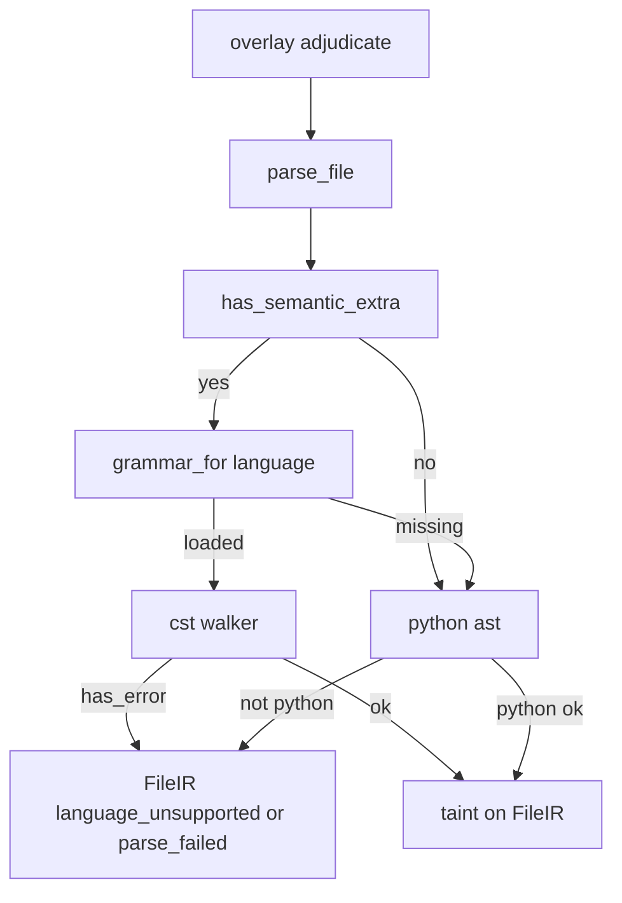
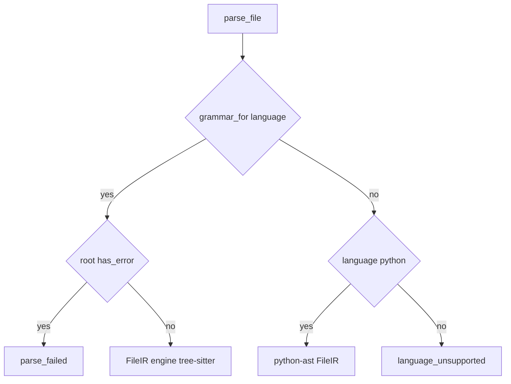

# Design Document

## Overview

**Purpose.** This feature turns on a real structured parse for overlay adjudication by installing an optional extra. AppSec scans of JavaScript, C/C++, Java, and Python then get `FileIR` from official tree-sitter grammars instead of `language_unsupported`.

**Users.** Default/CI installs keep `quick` and extra-free pytest. Operators who install `openultrasast[semantic]` get overlay promote/demote on the in-scope languages.

**Impact.** `parse_file` prefers extra grammars when they load. The dead CLI parse-success path is removed. Taint, facts, dispositions, sandbox, and the detection gate do not change.

### Goals

- Optional extra with official grammar wheels; core `dependencies` stay empty.
- One CST walker into existing `FileIR` (`Bind`, `CallSite`, `FunctionIR`).
- Fail closed: missing extra, missing grammar, or error tree → `unadjudicated`.
- Dual test matrix: extra-free always; extra-on JS plus C or Java.

### Non-Goals

- Joern queries, inter-file taint, CWE-121 buffer semantics, pair-catalog harvest, LLM parse.
- New overlay dispositions or evidence rungs.
- Requiring the extra for `quick` or for importing `openultrasast`.

## Boundary Commitments

### This Spec Owns

- Packaging extra `semantic` and lazy grammar load.
- CST → `FileIR` projection and `parse_file` dispatch order.
- Probe semantics: extra/grammar vs host CLI.
- pytest `semantic` marker and CI extra-on job.

### Out of Boundary

- Overlay dispositions, fact TOML, taint worklist (`propose-adjudicate-prove`).
- Stage plan, sandbox, hunter suspicion (`three-stage-scan`).
- Pair catalog slices (`real-world-vfc-slice`).
- CWE policy, pattern rules, MCP `deep`.

### Allowed Dependencies

- Existing `FileIR` types and `parse_file` callers (`taint.py`, `overlay.py`).
- `harness_ext` capability-guard pattern (find_spec, no import at module load).
- External: PyPI `tree-sitter` and grammar packages listed in Technology Stack (extra only).

### Revalidation Triggers

- Changing `FileIR` / `Bind` / `CallSite` fields.
- Importing `tree_sitter` at module load of `cli` or `semantic/__init__`.
- Adding core (non-extra) parser dependencies.
- Using host `tree-sitter` CLI output as overlay IR.

## Architecture

### Existing Architecture Analysis

Overlay already calls `parse_file` → taint → dispositions. Python `ast` works. `parse_tree_sitter_cli` always returns `None`. `tree_sitter_available()` is true if a CLI binary exists, which does not imply a grammar.

### Architecture Pattern and Boundary Map

Selected: **hybrid extra guard + CST walker + existing dispatch.** Same packaging seam as HarnessX. `parse_file` remains the only overlay parse entry.



**Key decisions**

- Extra grammars are the product parse. Host CLI is not a success path.
- Taint does not import tree-sitter.
- Dependency direction: extra guard → cst walker → `parse_file` → taint → overlay. No reverse imports.

### Technology Stack

| Layer | Choice / Version | Role in Feature | Notes |
|-------|------------------|-----------------|-------|
| Packaging | extra `semantic` | Optional wheels | Core `dependencies` stay `[]` |
| Parser runtime | `tree-sitter>=0.23,<0.27` | `Language` + `Parser` | Constructor API, not `build_library` |
| Grammars | `tree-sitter-python`, `tree-sitter-javascript`, `tree-sitter-c`, `tree-sitter-cpp`, `tree-sitter-java` | Per-language CST | `cpp` for `.cpp`; `c` for `.c` |
| Tests | pytest marker `semantic` | Skip extra-on tests | Default CI extra-free |
| Types | mypy override `tree_sitter*` | Extra absent in typecheck env | Same as `harnessx.*` |

License of adopted wheels: MIT. Pins are verified at implement time against the selected minor.

## File Structure Plan

```
src/openultrasast/semantic/
  extra.py      # has_semantic_extra, grammar_for; no tree_sitter import at module load
  cst.py        # Node walk → FileIR; node-kind map
  ir.py         # parse_file dispatch; keep python ast; remove CLI success path
  engines.py    # stop treating host CLI as overlay-ready
pyproject.toml
tests/test_semantic_extra.py
tests/test_semantic_cst.py
.github/workflows/ci.yml
```

### Modified Files

- `pyproject.toml` — extra `semantic`; pytest marker; mypy overrides.
- `src/openultrasast/semantic/ir.py` — dispatch; delete `parse_tree_sitter_cli` as success path.
- `src/openultrasast/semantic/engines.py` — `tree_sitter_available` must not mean CLI-only; extra/grammar helpers live in `extra.py`.
- `src/openultrasast/semantic/__init__.py` — export `has_semantic_extra` only if needed; do not import cst at package load.
- `tests/test_semantic_overlay.py` — extra-free JS stays `language_unsupported` without monkeypatching a fake IR as “tree-sitter success”.
- `.github/workflows/ci.yml` — second job with `--extra semantic` running `@pytest.mark.semantic`.
- `dagger/ci.py` — keep extra-free unless the same extra-on command is cheap to add; default is GHA second job only.

Do not modify `taint.py`, `overlay.py`, `facts.py`, `gate.py`, `pairs.py`.

## System Flows



Gating: grammar load failure is missing extra/grammar, not a scan abort. `has_error` is `parse_failed`.

## Requirements Traceability

| Requirement | Summary | Components | Flows |
|-------------|---------|------------|-------|
| 1.1–1.3 | Extra-free quick and import | extra.py, pyproject | no grammar load on quick |
| 2.1–2.4 | Structured parse; JS promote; C/Java demote; same dispositions | extra.py, cst.py, ir.py, existing taint/overlay | parse_file → taint |
| 3.1–3.5 | Fail closed; Python ast last resort; missing extra does not fail standard | ir.py, extra.py | unsupported / parse_failed |
| 4.1–4.3 | One walker; no JS/C visitors; CLI not success | cst.py, ir.py | grammar_for only |
| 5.1–5.5 | No LLM; Joern not required; corroboration; prove/gate unchanged | none new | existing overlay |
| 6.1–6.3 | Dual tests | markers, CI job | skip vs extra-on job |

## Components and Interfaces

| Component | Domain | Intent | Req Coverage | Key Dependencies | Contracts |
|-----------|--------|--------|--------------|------------------|-----------|
| SemanticExtra | Packaging | Probe extra and load grammar | 1.1–1.3, 3.1–3.2, 4.3 | PyPI wheels P0 | Service |
| CstWalker | Parse | CST to FileIR | 2.1–2.3, 3.4, 4.1 | SemanticExtra P0, FileIR P0 | Service |
| ParseDispatch | Parse | parse_file order | 2.1, 3.3–3.5, 4.3 | CstWalker P0, python ast P0 | Service |
| ExtraTestMatrix | Validation | skip vs extra-on CI | 6.1–6.3 | pytest P0 | Batch |

### Parse layer

#### SemanticExtra

| Field | Detail |
|-------|--------|
| Intent | Capability guard and per-language grammar load |
| Requirements | 1.2, 1.3, 3.1, 3.2, 4.3 |

**Contracts**: Service

```python
def has_semantic_extra() -> bool:
    """True iff tree_sitter and at least one in-scope grammar module are importable. No eager import of wheels at semantic package load."""

def grammar_for(language: str) -> object | None:
    """Return a tree_sitter.Language for python, javascript, c, cpp, java, or None. Lazy importlib.import_module. Never raises into the scan."""
```

- Preconditions: `language` is a preprocess language id.
- Postconditions: `None` means overlay must not claim tree-sitter IR.
- Invariants: host CLI path does not make this return non-None.

#### CstWalker

| Field | Detail |
|-------|--------|
| Intent | One walk from a tree-sitter tree to FileIR |
| Requirements | 2.1–2.3, 3.4, 4.1 |

**Contracts**: Service

```python
def file_ir_from_tree(*, path: str, text: str, language: str, tree: object) -> FileIR:
    """Project named nodes into Bind, CallSite, FunctionIR. If root.has_error, parse_ok False reason parse_failed. engine is tree-sitter when parse_ok."""
```

Node-kind map (names are grammar types; walker is shared):

| Kind | python | javascript | c / cpp | java |
|------|--------|------------|---------|------|
| function | function_definition | function_declaration, method_definition, arrow_function | function_definition | method_declaration, constructor_declaration |
| assign | assignment, augmented_assignment | assignment_expression | assignment_expression | assignment_expression |
| call | call | call_expression | call_expression | method_invocation |
| name | identifier | identifier | identifier | identifier |
| string | string | string | string_literal | string_literal |

**Implementation Notes**

- Integration: only `parse_file` calls this after `grammar_for`.
- Validation: JS `eval(req.query.x)` and C `printf("%s\\n", data)` fixtures with extra on.
- Risks: node-type aliases (JS `assignment_pattern`); table is the extension point, not a new visitor module per language.

#### ParseDispatch

| Field | Detail |
|-------|--------|
| Intent | Existing `parse_file` with extra-first order |
| Requirements | 2.1, 3.3–3.5, 4.2, 4.3 |

Order: grammar_for → cst; else python ast if `language == python`; else `language_unsupported`. Do not call host CLI for overlay IR.

## Data Models

`FileIR`, `Bind`, `CallSite`, `FunctionIR` stay as in `ir.py`. No new disposition. `engine` values: `tree-sitter` | `python-ast` | `none`.

## Error Handling

| Condition | Overlay | Scan |
|-----------|---------|------|
| Extra not installed | language_unsupported for non-Python | standard succeeds |
| Grammar missing for language | language_unsupported or Python ast | standard succeeds |
| root.has_error | parse_failed | standard succeeds |
| Wheel import error | treat as extra absent | do not raise |

## Testing Strategy

- Unit extra-free: import `openultrasast.cli` does not import `tree_sitter`; JS `parse_file` → `language_unsupported`; Python ast still promotes `eval(request.args)`; `quick` scan unchanged (1.1–1.3, 3.1, 3.3, 6.1).
- Unit extra-on (`pytest.mark.semantic`): JS `eval(req.query.x)` overlay `promote` (2.2); C `printf("%s\\n", data)` overlay `demote` with dominating fact (2.3); syntax-broken JS → `parse_failed` (3.4); `engine == tree-sitter` on success (2.1).
- Skip: if `not has_semantic_extra()`, marked tests skip, extra-free suite green (6.3).
- CI: default job extra-free; second job installs extra and runs `-m semantic` (6.2).
- Do not assert detection-gate Youden (5.5).

## Security Considerations

Parser wheels run in-process on operator source. Same trust as reading the tree today. Extra does not execute target code. Overlay evidence stays `static_corroboration` or below (5.3).

## Performance

Parse is per-file MAP, same file budget as rank. No whole-program index.

## Migration Strategy

Default install behavior unchanged. Operators who want JS/C/Java overlay run `uv sync --extra semantic`. No artifact format migration.

## Supporting References

Grammar load sketch (not runtime-imported in core):

```python
from tree_sitter import Language, Parser
import tree_sitter_javascript as tsjs
parser = Parser(Language(tsjs.language()))
tree = parser.parse(text.encode())
```
