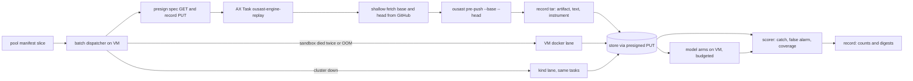

# Design Document

## Overview

This spec builds the instrument for roadmap G0: a frozen pool of repositories that no development step has seen,
and a push-level score on it. The score is what a user of the hook sees. On a vulnerability-introducing push, did
the hook say so (catch rate)? On an ordinary push, did it say anything (false-alarm rate)? Replays run as AX Tasks
on kube-ax. kind and the VM run the same tasks as fallbacks.

Four facts from the code shape the design:

- **Populations already have a freeze-and-guard pattern.** `benchmarks/independent/freeze.py` verifies cases by
  reading git only, `evaluate.py` scores with fixed rules and Wilson intervals, and
  `tests/test_independent_population.py` fails when a reserved repository is named anywhere in `benchmarks/`,
  `src/` or `tests/` outside its directory. Harvest batch 3 used that guard as a black box: candidates written,
  guard run with output discarded, subsets bisected on red. That is how v3 stays unread.
- **The hook can already replay a change.** `ousast pre-push PATH --base B --head H --artifact F` resolves two
  local commits (`snapshot.py`, `resolve_replay`: no fetch, no merge-base), runs quick rules and the engine inside
  one deadline (default 30 s, engine inline) and writes a JSON artifact. The terminal text has one `Skipped:` line
  per skipped check. The artifact holds three finding streams: admitted defects, advisory engine findings
  (new or worsened, vetoed only by capability) and quick-rule matches with their CWE.
- **The AX pattern works but lives in one script.** `engine_trace_ax.py` (manifest, egress checks, presigned
  objects, retry once under a new name, cleanup) and the lane scheduler in `engine_trace.py` (`run_plan`: fixed
  lanes, fallback queue, `progress.json`, `STOP`, resume by input digest) are engine-specific.
- **Placement on kube-ax is random.** One worker per node, shared by all actors. Two heavy tasks fit per worker,
  but only two concurrent tasks in all guarantee at most two on one worker.

### Goals

- A pool frozen by code against every used source (Req 1), with two kinds of change per repository (Req 2).
- A scorer whose numbers mean what the hook shows, with silent zeros visible (Req 3).
- One replay is one AX Task via a dispatcher shared with the engine (Req 4); a baseline and fresh slices (Req 5).

### Non-Goals

Detection changes, population v3, model calls in the cluster, languages the hook does not analyse.

## Architecture

## Components and Interfaces

### 1. Pool sourcing and eligibility (Req 1)

**Decision 1.1: sources and ecosystems.** Candidates come from GitHub reviewed advisories (`gh api /advisories`,
the enumeration harvest-3 used) for pip, npm, maven and composer, published 2019 or later, whose CWE maps to one of
the seven families through the project's family CWE table. Each needs a linked fix commit with one parent in one
repository. OSV records for the same advisory give the first affected version. That version is a cross-check for
the introducing commit (section 2). Reason: these four ecosystems are the five languages the hook analyses
(Python, JavaScript, TypeScript, PHP, Java). GHSA links commits and CWEs; OSV adds version brackets. Rejected:
drawing from every ecosystem (Go, Ruby, C#). That would mostly measure missing frontends, which is already known.
Coverage still reports uncovered files inside the drawn repositories. Rejected: NVD and published fix datasets.
NVD links commits weakly, and the datasets are mined corpora that development or model training has likely seen.

**Decision 1.2: eligibility by code against every used source.** `benchmarks/unseen/eligibility.py` builds the
used set before the draw. It never prints names; it records counts per source and a digest of the set.

| Source (Req 1.1) | Where it is read |
| --- | --- |
| Pair corpora | every catalog, recipe and dataset file under `benchmarks/pairs/`, plus the local pointer-pair manifests |
| Populations v1, v2 | `population-v1.toml`, `population-v2.toml`, read directly |
| Population v3 | never opened; the existing guard test only (below) |
| Harvest records | the batch catalogs under `benchmarks/pairs/advisory-fixes*` (the records hold counts only) |
| Memory examples | `example` rows of the local FileStore and the S3 store (`repo` field) |
| Experiment units | `plane/experiments/*.units.jsonl` and registered units files |
| Measurement records | everything under `benchmarks/measurements/` and `benchmarks/experiments/` |
| Anything else | a text sweep for `github.com/<owner>/<name>` over `benchmarks/`, `src/`, `tests/`, `plane/`, `.kiro/` |

Names are normalised (lower case, no `.git`, no trailing slash). Each candidate is resolved through the GitHub API
to its canonical `full_name`, its former names (redirects) and its fork network (`parent`, `source`). A candidate
is out if any of these is in the used set. A fork shares code with what it was forked from.

v3 is checked like harvest-3 did. The draft manifest is written into `benchmarks/unseen/`. Then
`pytest -q tests/test_independent_population.py -k referenced` runs with its output discarded. The guard already
sweeps `benchmarks/` outside the population directory. On red, the candidate list is bisected by rewriting the
draft until green, and the dropped count is recorded. No v3 name is ever printed or read by a person.

**Decision 1.3: post-cutoff preference.** An advisory published after 2026-06-01 (harvest-3's cutoff for the
decision engine's model) is flagged `post_cutoff`. Within each ecosystem stratum post-cutoff advisories are drawn
first. Results are reported for both groups. Reason: a post-cutoff advisory cannot be in the model's training
data as a known vulnerability. Rejected: post-cutoff only. Harvest-3 kept 12 post-cutoff pairs out of 251, and
three slices of 100 repositories cannot be filled from that window.

**Decision 1.4: licences.** The licence is read at the pinned head commit (LICENSE file, then the API's SPDX id).
Only permissive licences are published by name: MIT, Apache-2.0, BSD-2-Clause, BSD-3-Clause, ISC, 0BSD, Unlicense,
Zlib, PostgreSQL, BSL-1.0. Everything else (copyleft, source-available, none) goes to the gitignored
`benchmarks/unseen/private/pool-p1.toml`. The committed manifest then holds an opaque id and the sha256 of
(URL, commits) for that entry, so the freeze digest still covers it. Reason: Req 1.4 read literally. Rejected:
"OSI-approved" as the bar, as population v2 used. It is wider than the requirement says (open question 1,
resolved 2026-10-04: copyleft stays private).

Also required: anonymous HTTPS, at most 500 MB, at least 40 eligible ordinary commits, one per fork network.

### 2. Change extraction (Req 2.1, 2.2)

Extraction runs on the VM over a full `--filter=blob:none` clone in a scratch cache. It uses git only, like
`freeze.py`. No scanner, engine or model touches a pool repository before the freeze.

**Decision 2.1: the vulnerability-introducing range.** Let F be the fix and P its parent. The vulnerable lines are
the old-side lines of F's hunks in the vulnerable function. For a pure-addition fix (an absence bug such as a
missing guard), they are the vulnerable function's own lines.

1. **`introducing` (preferred).** `git blame -w -M -C --porcelain P -L <lines> -- <file>`. The candidate V is the
   commit that last wrote the sink line (for absence bugs, the function's declaration). V is accepted if all hold:
   at V's first parent the sink line's normalised text is absent from the file's vulnerable function; V is not a
   merge or root commit; V changes at most 50 files and 2,000 lines; when OSV names a first affected version, V is
   reachable from that tag and not from the previous release tag. If the text is present at V's parent, blame
   walks back from there, at most five steps. The replay is `base = V^`, `head = V`.
2. **`last_touch` (fallback).** When no V passes, `git log -L :<function>:<file> P` gives the newest commit L
   before F that changed the vulnerable function. The replay is `base = L^`, `head = P`. The vulnerable code is in
   head, and the range contains a change to the vulnerable function.

Each change records its method, family, vulnerable function (resolved in head), head-side changed lines,
`post_cutoff` and the advisory id.

Bias of each, stated in the record. `introducing` inherits SZZ noise: blame finds the last writer, not the author
of the flaw. A refactor, a move the heuristics miss or a reformat can stand in for the real introduction. The
absence check, the walk-back and the version bracket cut this down, but do not remove it. The bias runs both
ways: a wrong V may introduce nothing (a miss is not the hook's fault) or may move a flaw (the delta-based hook is
right to call it existing). `last_touch` is pessimistic for a delta hook. The flaw is often already in base, so
the hook's novelty rule correctly stays quiet and the change counts as a miss. Catch is therefore reported per
method. The headline is `introducing`; `last_touch` is a lower bound. Rejected: fix-parent against a fixed old
base (for example 50 commits back). The range often misses the vulnerable function entirely and grows without
bound on busy repositories.

Label check: every third `introducing` change is read by an agent before the freeze, with no model call, as
harvest-3 reviewed diffs. It is marked `confirmed`, `refactor` or `unclear`. The confirmed share is the label
noise estimate. The scorer also reports catch on the confirmed subset.

**Decision 2.2: ordinary commits.** The candidates are non-merge commits on the first-parent line of the default
branch that change at least one source file of an analysed language. Excluded:

- explicit security signals in the message: `secur|cve|ghsa|vuln|inject|xss|csrf|ssrf|exploit|sanitiz|escap`;
- reverts (`^Revert`, `This reverts commit`);
- dependency bumps (bot authors such as dependabot and renovate, `bump|upgrade .* from`, or only manifest and lock
  files changed);
- commits whose source changes are all generated or vendored (`vendor/`, `node_modules/`, `dist/`, `*.min.js`,
  lock files, `linguist-generated` in `.gitattributes`, "generated" headers);
- any fix commit of any advisory of the repository, and any commit touching a known vulnerable function of it;
- commits over 1,000 changed source lines (counted, reported).

Twelve are drawn per repository with a seeded random draw. Strata are three time thirds of the repository's
history crossed with four size buckets of changed source lines (1-10, 11-50, 51-200, 201-1,000). Allocation is
proportional to the repository's own commits per cell, with at least one per time third. Each change records base
(its first parent), head, changed files and line ranges. Reason: proportional allocation keeps the false-alarm
rate a per-push rate as a user meets it. Rejected: `freeze.py`'s broad `SECURITY_WORDS`. It also drops commits
saying "query", "token", "session" or "valid", which removes the ordinary commits where false alarms are most
likely, and the rate would look better than it is. Rejected: docs-only commits. They are trivially quiet and
would dilute the rate.

Label noise: an ordinary commit may itself introduce an unknown vulnerability, so a flag counted as a false alarm
may be true. The false-alarm rate stays as Req 3.2 defines it. Flagged ordinary changes are adjudicated beside it
(all if 30 or fewer, else every third) against protocol-v2's standard, and the adjudicated share is reported.

### 3. Sizing and slices (Req 2.3, 5.2)

Wilson 95% interval, z = 1.96: centre (p + z²/2n)/(1 + z²/n), half width z·sqrt(p(1-p)/n + z²/4n²)/(1 + z²/n).
Taking the larger distance from p as the width, the smallest n that meets the bar, computed exactly:

| Rate | Assumed p | Bar | n needed |
| --- | --- | --- | --- |
| false alarm | 0.05 | +/- 3 points | 315 |
| false alarm | 0.10 | +/- 3 points | 483 |
| false alarm | 0.20 | +/- 3 points | 756 |
| catch | 0.10 | +/- 10 points | 62 |
| catch | 0.25 | +/- 10 points | 88 |
| catch | 0.40 | +/- 10 points | 97 |

Catch: 100 vulnerability-introducing changes per slice, one per repository. At p = 0.4, Wilson gives
[0.309, 0.498], within 10 points. One per repository keeps them independent.

False alarm: ordinary changes of one repository are correlated (noisy code flags often). Wilson assumes
independence, so the count is inflated by a design effect 1 + (m - 1)·ICC. With m = 12 per repository and an
assumed ICC of 0.05, that is 1.55. 100 repositories × 12 = 1,200 changes, effective n 774 ≥ 756. The plain Wilson
interval at p = 0.2, n = 1,200 is about +/- 2.3 points. A repository-cluster bootstrap interval is reported beside
it, and the ICC measured on slice 1 is recorded. If it exceeds 0.05, the next pool sizes up. A frozen slice is
never changed.

**Decision 3.1: slices.** Pool p1 has three slices of 100 repositories each (100 + 1,200 changes per slice; 300
repositories and 3,900 changes in all). Repositories are assigned by a seeded shuffle, stratified by ecosystem and
`post_cutoff`. Slice 1 serves the baseline and the G1 arms table. Slices 2 and 3 serve the first two adoption
decisions. When they are spent, pool p2 is drawn by the same code, and it excludes p1. Reason: each slice alone
meets the Req 2.3 widths, so any decision can stand on one slice. Rejected: one large pool scored whole. Every
decision would then see every repository, which Req 5.2 forbids. Rejected: ten small slices. None would meet the
widths. Per family, 100 changes split over seven families give intervals of about +/- 20 to 25 points. They are
reported, not sized (open question 3).

Use ledger: `benchmarks/unseen/usage-p1.jsonl` is append-only, one row per use (slice, decision or experiment id,
date, result digest). A slice with a row whose purpose is `informed` cannot appear again as `qualifies` for that
change. A test checks this.

### 4. Scoring rules (Req 3.1, 3.2, 3.3)

Each replay uses the hook's defaults: `--deadline 30`, `--engine inline`, `--max-regions 500`, `--mode advisory`.
That is what a user's push gets. The text output is kept with every `Skipped:` line, and so is the artifact.

**Decision 4.0: a registered long-deadline arm** (maintainer decision 2026-10-04, open question 5). Beside the
default replay, slice 1 is replayed once more with `--deadline 300` and every other flag unchanged. The arm is
registered (manifest committed, `unseen: {pool: p1, slice: 1}`) before its first replay. G1 then reports both
what the user sees (30 s) and what the engine could catch given time (300 s), so a miss caused by the deadline is
told apart from a miss by the engine. It is a measurement arm, not a proposed default: adopting a longer hook
deadline would be a separate decision under 7.2.

**Decision 4.0a: calibrated cluster deadline and native check** (maintainer, 2026-10-05).
The gVisor proof exhausted 30 seconds in snapshot preparation on a 1,725-file repository.
Cluster replays therefore scale the 30/300-second arms by the median paired cluster/native
time through the quick tier, rounded to integer seconds. Native runc replays retain 30/300 seconds.
A deterministic sample (default 20, or all of a smaller proof manifest) runs both lanes at
600 seconds for calibration. Report per-change stage times and median slowdown with bootstrap
95% intervals for time through quick, engine build and engine queries separately. Incomplete
timings or degraded scans invalidate calibration. Records contain counts, times and opaque digests.

A deterministic native sample accompanies the cluster slice. Compare whether each push flags
anything, with a Wilson 95% interval. If its lower bound is below 95%, or any sample pair is
missing/failed, flag the run and exclude cluster results from the baseline. Disagreements name
change IDs only. The scorer reports applied deadlines and factors. Docker pulls explicitly after
checking its data-root free space against an unpacked image size upper bound plus 1 GiB; failures
retain sanitized stderr tails and exit codes. See the unseen README for coordinator commands.

**Decision 4.1: catch, per family.** A finding counts if its family is the change's family. Engine streams carry a
family; a quick-rule match maps its CWE through the family CWE table. Its head location must also be in the
vulnerable function or within 10 lines of the change's head-side hunks (protocol v1's window).

| Family | Location rule |
| --- | --- |
| injection, path, deserialization, output_encoding, untrusted_destination | sink line in the vulnerable function, or the changed lines +/- 10 |
| access_control | the vulnerable function itself (the handler that lacks the check), or the changed lines +/- 10 |
| config_secrets | the changed file and lines +/- 10 (file scope; function `<global>`) |

All three streams count: admitted defects, advisory engine findings and quick-rule matches. Each catch also names
the stream that made it. Reason: the hook shows all three to the user. Rejected: admitted defects only. That
scores the blocking path, which G3 decides separately, and would hide what users read.

**Decision 4.2: false alarm.** An ordinary change is a false alarm when any of the three streams holds at least one
finding, of any family, anywhere. The alerts-only rate (admitted defects) is reported beside it.

**Decision 4.3: coverage, so zeros cannot hide.** Every change gets exactly one state:

- `instrument_failure`: no record, a failed fetch, the head commit not verified, or zero bytes of the changed files
  read. It is re-run once, then reported. It never counts as quiet or missed.
- `unanalysable`: no changed file is in a language the hook covers (the hook's `language_not_covered` notice).
- `quick_only`: the quick tier read the changed files, but no engine question completed on them.
- `engine_covered`: at least one engine question completed on a changed file.

The task entry proves its input as AGENTS.md requires. It records files and bytes in the checkout, bytes of each
changed file, the JVM's wall time and the hook's exit code. A replay faster than a JVM can start is flagged
`suspect_fast` and goes to the failure path. Catch and false alarm are reported over all changes and over each
coverage state.

### 5. The AX workload (Req 4)

**Decision 5.1: the image.** `plane/Dockerfile.engine-task` gains a second stage, `FROM engine AS replay`, built
with `--target replay` and pinned by digest. It adds `git`, the package with its runtime dependencies and
`benchmarks/unseen/replay_entry.py`. Joern, php-cli, Java 21 and the frontend-retention patch come from the engine
stage, so both lanes run the same Joern. The import smoke runs `ousast pre-push --help`. The root image stays
`ghcr.io/norandom/ax-task-runner:v0.3.1`. Rejected: a separate Dockerfile. It would duplicate the Joern install,
and two Joern copies are two instruments that drift. Rejected: one stage for both. The engine image's isolated
venv without yaml and boto3 is proven, and replay dependencies would change its digest on every bump.

**Decision 5.2: the task entry.** `replay_entry.py` is standard library only, like `engine_task_entry.py`, and
reuses its `transfer` (egress readiness wait, three attempts, no URL text in errors).

1. GET `SPEC_URL` (presigned, `.json`): repository URL, base, head, change id, hook flags.
2. `git init`, then `git fetch --depth 1 origin <head>` and `git fetch --depth 1 origin <base>` over HTTPS
   (GitHub serves commits by SHA). Verify both with `git cat-file -e`. The fetch is bounded at 180 s; the 500 MB
   repository cap bounds its size.
3. Run `ousast pre-push <checkout> --base <base> --head <head> --artifact /tmp/out/push.json` with defaults, the
   backend heap at 1700 MB and the cluster JVM flags of `engine_trace_worker.py`. Capture stdout.
4. Pack `push.json`, `push.txt`, `engine.json` (the head and base scan records and witness rows from the artifact,
   keyed by repository and revision, for engine-evidence arms) and `instrument.json` (section 4.3, image digest,
   step timings). PUT to `RESULT_URL` as `.dat`. The PUT is completion.

On any error it PUTs a failure record naming the step and HTTP status, as the engine entry does. Task names are
`ousast-engine-replay-<slug>-<digest>`, the prefix the operator's egress watcher matches. No key or store
credential enters the manifest. Only the two presigned URLs do, and the spec object keeps repository names out of
AX status and cluster telemetry.

**Decision 5.3: the generic dispatcher.** `benchmarks/ax/batch.py` takes over from `engine_trace_ax.AX` and
`engine_trace.run_plan`:

- `Item`: id, input objects (name to bytes), the result object name, command, extra env, input digest.
- `Workload`: image digest, allowed URL env names, deadline, how to validate a received result.
- Lanes: `ax` (manifest, apply, poll the result object and AX phase, delete, clean objects), `kind` (the same
  manifest against the kind AX), `docker` (the VM image, one container at a time).
- Scheduler: two AX lanes plus one VM lane by default. A sandbox death is retried once under a new name; a second
  death or a JVM OOM goes to the VM fallback queue, which beats overflow on the VM lane. `progress.json` is written
  only by the scheduler. A `STOP` file halts new launches. Resume skips items whose stored record has the same
  input digest. Cleanup failure stops dispatching.

The engine pass becomes a workload over it, with the same tests. Reason: the egress, secrecy and cleanup logic took
several fixes and must exist once. Rejected: a replay-specific copy of `engine_trace_ax.py`. Rejected: putting it in
`src/` now. G4's `ousast plane scan` may need it there, and it moves when G4 is planned.

Concurrency is two AX tasks. Placement is random, and only two guarantees two per worker at most. Four would need
the operator to add placement (open question 2, resolved 2026-10-04: stays at two, no placement change
requested). Estimated wall time per slice: about 75 s per replay (fetch, 30 s hook, setup), 1,300 replays over
three lanes, about 9 hours. The long-deadline arm (4.0) is bounded at about 345 s per replay; at that bound 1,300
replays over three lanes take about 42 hours, less where the hook finishes early. It runs with `STOP` and resume
across sessions.

**Decision 5.4: model arms on the VM.** Arms that need DeepSeek (the decision engine, the combiner) read the stored
records on the VM. They build candidates from the head side's changed functions, score them, and take the change
score as the maximum. Each runs under its experiment manifest's `budget_usd` through the metered client, dry run
first, with responses cached. Nothing in the cluster calls a model.

**kind (Req 4.5)** runs the identical manifest and image through the `kind` lane. Every new task is proven there
before kube-ax, as `plane-on-kubernetes` requires.

### 6. Records and the guard (Req 1.2, 1.3, 5.1)

`benchmarks/unseen/` holds `pool-p1.toml` (repositories, licences, slices, changes with base, head, method,
family, function, lines), `freeze-p1.json` (used-set digests and counts per source, guard result, label-check
counts, freeze digest = sha256 of the canonical manifest), `protocol-p1.md` (the scoring rules of section 4,
committed before the first replay) and `usage-p1.jsonl`. The `private/` directory is gitignored.

The guard grows by one parametrised reservation. The existing sweep becomes a list of (reservation directory,
names): `benchmarks/independent/` for populations and `benchmarks/unseen/` for pools, including the private
manifest when present. It also sweeps `plane/`. A second test asserts that pool and population names are disjoint,
and prints only a count on failure. A third asserts that a frozen pool's digest matches `freeze-p1.json`, so the
pool is never edited. Raw per-change records stay outside the repository (`~/ousast-results/unseen/` and the
store). Committed result records under `benchmarks/measurements/` carry counts, rates, intervals and digests,
never names.

### 7. Metrics and reporting (Req 3.3, 3.4, 5.3)

`benchmarks/unseen/score.py` reports per family and overall: catch and false-alarm rate with Wilson 95%
intervals, the cluster bootstrap interval for false alarms, coverage counts per state, catch per method,
post-cutoff and per stream, and the alerts-only rate.

**Decision 7.1: arms at fixed budgets.** An arm with a score is thresholded per budget (1%, 5%, 10%). The
threshold is the lowest score whose false-alarm rate on the slice's ordinary changes stays within the budget.
Catch at that threshold is reported with its Wilson interval and the realised false-alarm rate. That in-slice
threshold is labelled exploratory. For a qualification, the threshold is fixed beforehand on an earlier slice or
on held-out folds, and it is applied unchanged. A binary arm (today's hook) has one operating point, reported with
the budgets it meets. Rejected: AUC over changes (it averages operating points no user runs).

**Decision 7.2: next to held-out folds.** Experiment manifests registered after this spec lands carry
`unseen: {pool, slice}`. `analyse` writes an `unseen` block into `result.json` next to the fold estimates: catch at
each budget for each arm, and the paired difference B - A with an exact McNemar test on the 100 changes. The
fold rule decides as today. The slice is recorded in the usage ledger.

**Decision 7.3: adoption gate on the unseen slice** (amended 2026-10-04, maintainer decision; Req 5.4; open
question 4 resolved). Reporting is not enough. An arm B is adopted over the production arm A only if, on the
untouched slice that qualifies it, both hold:

- catch at the 5% budget, with B's threshold fixed beforehand (7.1), is not significantly lower than A's: exact
  two-sided McNemar on the paired vulnerability-introducing changes, alpha 0.05;
- for an arm with one operating point (a binary arm such as a hook setting), its false-alarm rate is not
  significantly higher than A's: exact two-sided McNemar on the paired ordinary changes, alpha 0.05, with the
  repository-cluster bootstrap interval of the difference reported beside it, since those changes are clustered.

`analyse` writes `unseen.gate: pass | regression | not_run` into `result.json`. `not_run` (no slice, slice
already `informed` for this change, or more than 5% `instrument_failure`) blocks adoption like `regression`. The
fold rule and this gate must both pass.

### 8. Increments

1. **Used set and guard.** `eligibility.py`, the extended guard and the usage-ledger test. Exit: guard green on an
   empty pool; a planted used repository, a renamed one and a fork are each rejected in tests.
2. **Sourcing and extraction.** Candidates, both change kinds and the label check, on the VM. Exit: a draft for 300
   repositories with method counts, the confirmed share and exclusion counts.
3. **Freeze p1.** Guard bisection for v3, then manifest, freeze record and protocol committed. Exit: freeze digest
   committed and guard green.
4. **Dispatcher.** `benchmarks/ax/batch.py`, with the engine pass moved onto it. Exit: existing tests green and a
   two-pin engine smoke on kube-ax matching its stored records.
5. **Replay task.** Image stage and entry, proven on kind, then kube-ax on five changes from this repository's own
   history (never pool changes). Exit: instrument fields show bytes read and realistic JVM time, and quick-tier
   output matches the VM lane.
6. **Scorer.** `score.py` on synthetic records, including every coverage state and an instrument failure. Exit:
   unit tests green.
7. **Baseline.** Today's hook, from a frozen export of HEAD, on slice 1 (1,300 replays). Exit: the record committed
   (counts and digests only) and a `baseline` row in the usage ledger. That is G0's exit.
8. **Arms on slice 1 (G1)** (added 2026-10-04 with decisions 4.0 and 7.3). The registered long-deadline arm,
   the engine-evidence arm from the stored records, the model arms on the VM (5.4) under their budgets, and the
   `unseen` block with the adoption gate in `analyse`. Exit: one committed table of arms on slice 1 at the 1/5/10%
   budgets (counts, rates, intervals, digests), and `exploratory` rows in the usage ledger.

## Error Handling

A failed fetch, a missing commit or a hook crash gives a failure record, never an empty success. A dead sandbox is
retried once, then the VM runs it. A store or AX cleanup error stops the dispatcher. A slice with more than 5%
`instrument_failure` after re-runs is not scored; the cause is fixed first.

## Testing Strategy

Unit tests: used-set normalisation (case, `.git`, renames, forks), blame acceptance on a synthetic repository,
ordinary-commit exclusions, Wilson values against section 3, budget thresholds, coverage states, the task manifest
and dispatcher resume and fallback with a fake lane. Guard tests run in CI; cluster runs stay manual.

## Requirement Traceability

| Requirement | Design |
| --- | --- |
| 1.1 eligibility against every source, v3 via the guard | 1.2 |
| 1.2 frozen manifest, never edited | 6, increment 3 |
| 1.3 pool directory, guard extended | 6 |
| 1.4 licences, private manifest | 1.4 |
| 2.1 introducing changes, family, function, post-cutoff | 1.1, 1.3, 2.1 |
| 2.2 ordinary changes across time and size | 2.2 |
| 2.3 sizes for interval widths | 3 |
| 3.1 default replay, skipped checks kept | 4, 5.2 |
| 3.2 catch and false-alarm rules | 4.1, 4.2 |
| 3.3 per family, Wilson, coverage | 4.3, 7 |
| 3.4 arms at 1/5/10% budgets | 4.0, 7.1, increment 8 |
| 4.1 one change one Task, prefix, image by digest | 5.1, 5.2 |
| 4.2 HTTPS fetch, presigned record, no keys | 5.2 |
| 4.3 generic dispatcher, concurrency, retry, fallback, resume | 5.3 |
| 4.4 model arms on the VM within budgets | 5.4 |
| 4.5 kind runs the same tasks | 5.3, 5 (kind paragraph) |
| 5.1 baseline on slice 1, counts and digests | 6, increment 7 |
| 5.2 fresh slice per decision | 3.1, usage ledger |
| 5.3 experiments report unseen next to folds | 7.2 |
| 5.4 adoption needs no significant unseen regression | 7.3 |

## Open Questions

Maintainer decisions of 2026-10-04 resolve questions 1, 2, 4 and 5; question 3 stays open for G3.

1. **Resolved 2026-10-04.** Licences: only permissively licensed repositories are published by name. Copyleft and
   all other licences go to the gitignored private manifest, covered in the committed manifest by an opaque id and
   a digest (Req 1.4 as written; decision 1.4). Population v2's OSI-approved bar is not used.
2. **Resolved 2026-10-04.** Concurrency stays at two AX lanes plus the VM lane. No operator placement change is
   requested (5.3).
3. Per-family BLOCK (G3) needs about 100 changes per family. Pool slices together, or draw a family-enriched pool
   for G3?
4. **Resolved 2026-10-04.** An adoption requires no significant regression on the unseen slice, not only a report
   (Req 5.4, amended; decision 7.3).
5. **Resolved 2026-10-04.** G1 adds a registered long-deadline arm (`--deadline 300`) next to the default 30 s, so
   the table shows both what the user sees and what the engine could catch (decision 4.0, increment 8).
