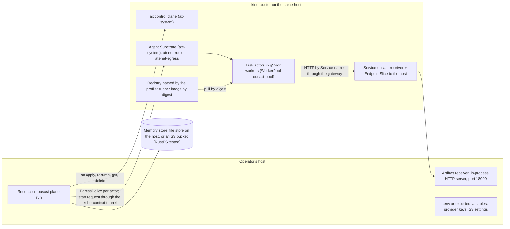
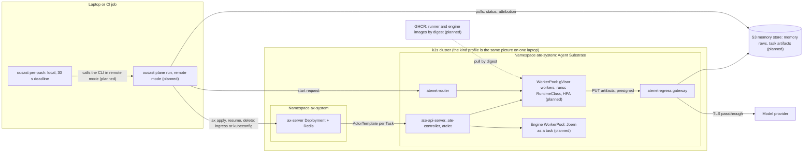

# Deployment

How the agentic plane is deployed today, and what moving it to a separate Kubernetes cluster
would take. State as of 2026-10-02 (v2.0.0). A scan needs none of this: `ousast scan` and
`ousast pre-push` run from the Python package (and the Docker image for Joern, see
[Engine and pre-push](ops/README.md)). The plane is the maintainers' surface for model work over
whole repositories, driven by `ousast plane`.

Two words are used strictly on this page. **Implemented** means the code on `main` does it and it
has run on the maintainer's host. **Planned** means it has not been done; the guidance is derived
from the code and the host's lessons, and the code changes it needs are named with their file paths.

**No deployment of the plane to a cluster other than the maintainer's single-node kind cluster has
been made.** Section B is guidance, not a record.

## What runs where today (implemented)



| Part | Where it runs | Code or manifest |
| --- | --- | --- |
| Reconciler (`ousast plane run`, `status`, `remember`) | the operator's host | `src/openultrasast/plane/reconciler.py` |
| Artifact receiver | an HTTP server inside the reconciler process, on the host, port `OUSAST_ARTIFACT_PORT` (18090) | `src/openultrasast/plane/egress.py` (`Receiver`, `RECEIVER_PORT`) |
| How actors reach the receiver | the Service `ousast-receiver.ax-system` (port 80) with a selector-less EndpointSlice whose endpoint is the kind network's gateway address on the host; the runner dials the ClusterIP with the Service name as `Host`, which the egress gateway allows by hostname | `ops/ax/receiver-service.yaml.tmpl`, rendered by `up.sh` |
| ax control plane, Agent Substrate, egress gateway, router | the kind cluster (`ax-system`, `ate-system`) | installed by `ops/ax/up.sh` from the upstream checkouts under `~/.cache/ousast/ax-src/` |
| Tasks | one actor per Task in a gVisor worker; two warm workers of 1 CPU / 1.5 GiB | `ops/ax/workerpool.yaml.tmpl` |
| Runner image | the registry the profile names (`registry` in `ops/k8s/profiles/kind.toml`: the kind-local one), pinned by digest in the profile's images file (`ops/k8s/profiles/kind-images.json`) | `plane/Dockerfile.runner`; the `image` of every template under `plane/tasks/` |
| Provider keys | read from the operator's environment or `.env` (which never overrides an exported variable), sent only in the start request through the tunnel `router.py` opens to `svc/atenet-router` in the profile's kube context | `src/openultrasast/plane/router.py` |
| Memory store | `OUSAST_MEMORY`: a file store under `~/ousast-results/plane/memory` by default, or `s3://<bucket>[/<prefix>]` on any reachable S3-compatible server (RustFS is the tested one) | `src/openultrasast/plane/memory.py`, [Memory](memory.md), [RustFS setup](rustfs.md) |
| Run state and artifacts | `$OUSAST_RESULTS/plane/<run>/` on the host (default `~/ousast-results/plane/`) | `reconciler.py` (`run_dir`) |

Only the reconciler talks to the memory store: a sandboxed task cannot read it, so the loop's
`memory-snapshot` is seeded by the reconciler before the Run ([The plane on ax](plane.md)).

## A. This host: the local setup (implemented)

What `ops/ax/up.sh` needs on the PATH: `docker`, `go`, `kubectl`, `kind`, `ko` and `ax` (it
refuses to start when one is missing). Tools live in `~/go/bin` and `~/.local/bin`; sources and
rendered files in `~/.cache/ousast/ax-src/` (`OUSAST_AX_SRC`).

1. **Bring up the cluster and the plane.**

    ```bash
    ops/ax/up.sh
    ```

    Idempotent: each step is skipped when already done. It creates the kind cluster
    (`KIND_CLUSTER_NAME`, default `ousast`) with its registry (`KO_DOCKER_REPO`, default: the
    `registry` of `ops/k8s/profiles/kind.toml`), installs Agent Substrate, applies the egress gateway (the agentgateway
    variant, one prebuilt image) when the install left it out, deploys the ax control plane, applies
    the receiver Service with the host's kind-gateway address as its endpoint, applies the gVisor
    worker pool, builds and pushes the runner image and writes its digest pin to
    `~/.cache/ousast/ax-src/runner-image`, installs the `ax` CLI from the deployed checkout (a release
    CLI skews from the server), and runs one smoke Task. It ends by printing the host's memory and the
    kind containers' usage.

2. **Check it.**

    ```bash
    uv run ousast plane doctor --profile kind
    ```

    The checks of the profile (`--profile`, default `kind`; `ops/k8s/profiles/`): its configured addresses
    on the first line, the kube context reachable, every pod in `ate-system` and in `ax-system` ready, the
    runner image of the profile's images file present in its registry (a local registry over its v2 API, a
    remote one through `docker manifest inspect`), and the memory store opening (an S3 bucket is verified).
    Each failing line names the fix (`ops/ax/up.sh` for the kind profile). `doctor` is informational:
    `ousast plane run` does not call it.

3. **Run the end-to-end smoke Run.**

    ```bash
    ops/ax/smoke-run.sh
    ```

    It renders `ops/ax/smoke-run.yaml.tmpl` with the current runner digest and submits the Run
    `ax-e2e-smoke` through the reconciler: one model-free `repo-facts` Task (`budget: {usd: 0,
    calls: 0}`) over a files-only Workspace, resumed, started through the router, its `facts.json` and
    `summary.json` delivered to the host, then `ousast plane status ax-e2e-smoke` prints the attribution
    table. The script calls the repository's `.venv/bin/ousast`, so `uv sync` first.

4. **Keys and the store.** Put `DEEPSEEK_API_KEY` (chat) and `OPENROUTER_API_KEY` (embeddings) in
    `.env` or export them; a Task's Model names the variable (`secretKey.key`), and the key travels
    only in that Task's start request. Set `OUSAST_MEMORY=s3://<bucket>` with `S3_ENDPOINT`,
    `AWS_ACCESS_KEY_ID`, `AWS_SECRET_ACCESS_KEY` (optional `S3_REGION`, `S3_BUCKET`) for the S3 store;
    the bucket must be set up once by an admin as [RustFS setup](rustfs.md) describes, and the store
    verifies it at every start.

5. **Run a real Run**, as in [Examples](examples.md#7-running-the-agentic-plane): `ousast plane run
    plane/runs/validation-46.yaml`, then `status` and `remember`.

6. **Tear down** with `ops/ax/down.sh`, which deletes the cluster and its registry.

**Footprint** (measured 2026-09-29, idle, two workers; [ax on this host](ops/ax/README.md#measured-footprint-2026-09-29-idle-two-workers)):

| Item | Value |
| --- | --- |
| kind node container memory | 1.7 GiB (27% of the 7.7 GiB host) |
| registry container memory | 34 MiB |
| node volume (images, containerd) | 4.9 GB on disk |
| worker pool | 2 gVisor workers, 1 CPU / 1.5 GiB limit each |

Disk is the binding constraint: the Substrate install and the `ko` builds need several GB of Go
caches (`go clean -cache -modcache` afterwards), and every Task is its own actor template with a
golden actor (about 24 MB each under `/var/lib/ate/actors` on the node). The failures the host
produced, and what each one taught, are listed in
[ax on this host](ops/ax/README.md#what-this-host-taught-each-one-cost-a-failed-live-run).

## B. A separate Kubernetes cluster (planned)

The target: a cluster that runs Agent Substrate with its egress gateway and the ax control plane,
pulls the runner image from a registry of yours, receives task artifacts without a developer
laptop in the path, and keeps its memory in your S3 bucket. The provider key already travels only
in the start request through `atenet-router`, which works the same through the kube-context tunnel to any
cluster. Everything else below is either a step you take or a code change that is not made yet.

### B.1 Cluster with Agent Substrate, its egress gateway and ax

- Install Agent Substrate on the cluster following its own instructions. `ops/ax/up.sh` uses
  Substrate's kind helpers (`hack/create-kind-cluster.sh`, `hack/install-ate-kind.sh`), which do
  not apply to another cluster.
- Apply the egress gateway. On this host it is the agentgateway variant
  (`manifests/ate-install/agentgateway-egress` in the Substrate checkout, applied with
  `kubectl kustomize --load-restrictor=LoadRestrictionsNone`), which needs no Rust build; the
  Envoy variant does. Without the gateway an actor has no network at all, and the per-task
  EgressPolicies the reconciler writes (`src/openultrasast/plane/egress.py`) work unchanged
  against the Substrate-installed gateway: deny by default, hostnames only, plain HTTP to the
  receiver, TLS passthrough to the Workspaces' Git hosts and the Model's declared hosts.
- Deploy ax (`make deploy AX_IMAGE_REPO=<your registry>` in the ax checkout) **after** B.2.
- Apply a WorkerPool (B.6). Substrate installs none by itself ("no free workers").

### B.2 ax's snapshot bucket: `AX_SNAPSHOTS_BUCKET`

ax's deploy manifest (`deploy/ax-server.yaml` in the ax checkout) sets `AX_SNAPSHOTS_BUCKET` to
the ax authors' own bucket (`gs://dberkov-gke-dev3/ate-env/` in the checkout used here). Point it
at **your own bucket before deploying ax**. On this host the bucket named there did not exist in
the S3 server, deleted golden actors piled up in `DELETING` and filled the disk during a 600-task
harvest (2026-10-01); creating the bucket let deletes complete, and even then a deleted actor's
directory stays on the node, so long Runs need a janitor that removes directories no live actor
owns.

### B.3 A registry the workers can pull from, the runner image pinned by digest

- Build the runner from the repository root and push it to your registry:

    ```bash
    docker build -f plane/Dockerfile.runner -t <registry>/ousast-runner:dev .
    docker push <registry>/ousast-runner:dev
    docker inspect --format '{{range .RepoDigests}}{{println .}}{{end}}' <registry>/ousast-runner:dev
    ```

- Substrate rejects tags: every Task's `image` must be the `<registry>/ousast-runner@sha256:...`
  reference. Write it into a file (on this host, `~/.cache/ousast/ax-src/runner-image`) and pass
  `--runner-image FILE` to `ousast plane workspaces` and `ousast plane harvest`, which re-pin the
  Tasks they generate. The committed templates under `plane/tasks/` and the generated
  `plane/tasks/validation-46.yaml` carry the kind profile's registry and digest and need the same
  re-pin (regenerate, or replace the reference) before they run elsewhere.
- Workers must be able to pull from the registry (credentials, if any, are the cluster's concern;
  ax's default runner image on `gcr.io` needs credentials and is not used here).
- `ousast plane doctor --profile <name>` resolves the runner reference of the profile's images file in the
  profile's `registry` (implemented 2026-10-02, plane-on-kubernetes task 1.2). `doctor` is informational,
  `plane run` does not depend on it.

### B.4 One configurable kube context (implemented 2026-10-02)

The reconciler, the egress client and the router tunnel take the kube context from the profile
(`kube_context` in `ops/k8s/profiles/<name>.toml`, `OUSAST_KUBE_CONTEXT` overrides it; plane-on-kubernetes
task 1.2): `doctor.py`, `egress.py` and `router.py` are handed it and build none, and
`tests/test_plane_literals.py` fails on any module, manifest or page that names this host's cluster,
registry or addresses. The egress client also needs `kubectl-ate` (or the executable
`OUSAST_KUBECTL_ATE` names) able to use that context.

### B.5 The receiver: in-cluster instead of on the host

Today the receiver is a thread inside the reconciler process (`egress.py`, `Receiver`), and the
reconciler learns of a task's completion by watching that object's `delivered` set in memory
(`reconciler.py`). Actors reach it through the Service `ousast-receiver.ax-system` whose
EndpointSlice points at the host. Three paths, in order of effort:

1. **Interim, works with the unchanged code:** keep the host receiver and render
   `ops/ax/receiver-service.yaml.tmpl` with an endpoint address the egress gateway pod can reach
   (`KIND_GATEWAY` is just an IPv4 address in the template, `OUSAST_ARTIFACT_PORT` the port). The
   reconciler's host must be reachable from the cluster (a VPN or a routed address), and the
   gateway dials the address the actor connected to, so the Service's ClusterIP must still map to it.
2. **Planned: the receiver as an in-cluster Deployment** behind the same Service name, with the
   reconciler reading deliveries and serving inputs from it instead of from its own thread. This
   needs code: the receiver and its `delivered`/`inputs` state are in-process today, and the
   runner's `GET /inputs/<producer>/<artifact>` is served by that same process.
3. **Follow-on: presigned-URL delivery to the S3 store.** The runner would `PUT` its output tar to a
   presigned URL on the memory store's bucket and fetch inputs the same way, and the reconciler
   would read from the bucket. Nothing of this exists; the EgressPolicy would then have to allow
   the store's hostname for the task.

### B.6 Worker pool sizing

`ops/ax/workerpool.yaml.tmpl` declares two warm gVisor workers of 1 CPU / 1.5 GiB (requests 250m /
1.5 GiB) for the 7 GB host, selected onto nodes by `ate.dev/substrate-version`. An actor occupies a
whole worker, so the pool size is the number of tasks that can run at once; set `--workers` on
`ousast plane run` to match. Size the workers above the largest Task's limits (`verify`: requests
250m / 384Mi, limits 1 CPU / 1 GiB; `roles` and the others are in `plane/tasks/`), and keep the
golden-actor storage on the node in mind (B.2).

### B.7 The S3 memory store reachable from where the reconciler runs

The `s3://` store already works against any reachable S3-compatible server with versioning,
lifecycle rules, object tags and S3 Select (RustFS is the tested one; the bucket setup and the
agent policy are on [RustFS setup](rustfs.md)). Only the reconciler reads and writes it, so today
it must be reachable from the operator's host; if the reconciler moves into the cluster, from its
pod. No Task talks to the store directly; the day one does (B.5, path 3), that Task's EgressPolicy
must allow the store's hostname (the policies allow hostnames only, never addresses), the way a
Model declares its hosts today through `openultrasast.io/egress-hosts`.

### B.8 Secrets in Kubernetes Secrets, injected into the reconciler's environment

The reconciler reads the variable a Model's `secretKey.key` names (`DEEPSEEK_API_KEY`,
`OPENROUTER_API_KEY`) and the store's `S3_ENDPOINT`, `AWS_ACCESS_KEY_ID`, `AWS_SECRET_ACCESS_KEY`
(optional `AWS_SESSION_TOKEN`, `S3_REGION`, `S3_BUCKET`) from its own environment or `.env`. When
the reconciler runs in the cluster, keep them in Kubernetes Secrets and inject them into **the
reconciler's** pod environment (`envFrom` with `secretRef`, or `valueFrom.secretKeyRef` per
variable). Never put a value into a manifest: the Model manifests name a variable, the rendered
Task carries no key, and the key reaches an actor only in the start request, where the runner keeps
it in memory and redacts it from echoed stderr. The `secretKey.name` values in `plane/models/`
(`deepseek`, `openrouter`) are the names such Secrets would carry. Running the reconciler
in-cluster is itself planned: today it is a host process, and its state directory
(`OUSAST_RESULTS`) would need a persistent volume.

### What is implemented and what is planned

| Item | Status |
| --- | --- |
| ax as the only executor; `plane run|status|doctor|remember|memory-normalise|workspaces|harvest|alerts-engine` | implemented, run on this host |
| Per-task EgressPolicy, credentials only in the start request, per-task budgets and attribution | implemented |
| S3 memory store against any reachable S3-compatible server, verified at startup | implemented (RustFS tested) |
| Local bring-up, doctor, smoke Run (`ops/ax/`) | implemented |
| Re-pinning generated Tasks to another registry (`--runner-image`) | implemented; the committed templates name the kind profile's registry (`tests/test_plane_literals.py` checks it) |
| Deployment to a cluster other than this host's kind cluster | **not done** |
| One configurable kube context | implemented (2026-10-02): `kube_context` in the profile, `OUSAST_KUBE_CONTEXT` overrides |
| `doctor` registry check against a configurable registry | implemented (2026-10-02): the profile's `registry` and images file |
| Receiver as an in-cluster Deployment | **planned** (code change) |
| Presigned-URL delivery to the S3 store | **follow-on**, not started |
| Reconciler running in-cluster with Secrets injected into its environment | **planned** |
| `AX_SNAPSHOTS_BUCKET` on your own bucket, worker pool sized to the cluster | your deployment's setting; documented, nothing to change in this repository |

## Production topology: ax on a Kubernetes cluster

The maintainer's questions, answered from the code and the upstream checkouts under
`~/.cache/ousast/ax-src/`: how is it hosted in ax, is there one container, how does ax relate to
Kubernetes, and what scaling the pre-push hook would take. The decisions of 2026-10-02 set the
target: **two profiles of one code base**, `kind` (this laptop, kept as a first-class local
execution mode, where every change is proven first) and `k3s` (production). Everything marked
**planned** is not built; the rest is what runs on this host today.



No inbound path exists in this picture: the CLI reaches ax-server and the router from outside, the
tasks push their artifacts to the store through the egress gateway, and the CLI reads the store.
Today's EndpointSlice back to a laptop (`ops/ax/receiver-service.yaml.tmpl`) is the kind profile's
device and does not appear in production.

### ax, Kubernetes and Agent Substrate in three sentences

**ax is a Kubernetes application**: a Deployment `ax-server` with a Redis beside it in the
namespace `ax-system` (`ax/deploy/ax-server.yaml` in the ax checkout; its controller runs with
`--template=default-template --template-atespace=ax-system`), and the `ax` CLI reaches it through a
a tunnel to `svc/ax-server` through the kube context (`ax/internal/tunnel/tunnel.go`), so `ousast plane run`
needs a kube context or an ingress, not a public endpoint. **ax does not run containers itself**:
it turns every Task into an ActorTemplate on Agent Substrate (`ax/internal/substrate/client.go`,
`CreateActorTemplate`), built from the Task's image and environment, and the image must be pinned
by digest (Substrate's `SandboxConfig` validation rejects tags: "All images must include a
digest"). **Agent Substrate is the layer that owns the machines**: in the namespace `ate-system`
it runs `ate-api-server`, `ate-controller`, the `atelet` DaemonSet, `atenet-router`, the
`atenet-egress` gateway, a Postgres and a RustFS (`substrate/manifests/ate-install/`), and three
CRDs under `ate.dev/v1alpha1`, `WorkerPool`, `SandboxConfig` and `CSIDriverConfig`; a
`WorkerPool` keeps warm worker pods (`ko://.../cmd/ateom-gvisor`), and an actor is one gVisor
sandbox inside one of those workers, booted from the golden snapshot that
[The plane on ax](plane.md) describes, suspended and resumed by the controller. Names are limited
to 63 bytes (`MaxNameLength` in `ax/pkg/apis/v1alpha1/types.go`), which is why the generated Task
names are short.

**What k3s changes** (planned; nothing has been applied to a k3s cluster): k3s runs containerd
with no Docker socket, so the host-Docker path of `ousast plane alerts-engine` does not exist
there and the engine must become a task (below); Substrate's gVisor workers need `runsc` and a
`RuntimeClass` on the nodes they are scheduled to; k3s ships Traefik (the ingress the CLI can use
instead of a kubeconfig) and local-path storage. Images are built by GitHub Actions from tagged
commits, published to GitHub Container Registry and digest-pinned in the manifests; a private
package needs an `imagePullSecret` on the worker ServiceAccount. Substrate's and ax's own images
are built with `ko` from their checkouts and pushed to the same registry. The kind profile keeps
its local registry (`ops/k8s/profiles/kind.toml`) and `ops/ax/up.sh`.

### One image, and what concurrency equals

There is **one container image** for every Task: `plane/Dockerfile.runner` (`python:3.12-slim`
plus this package, PID 1 `/usr/local/bin/ax-task-runner`, which is
`openultrasast.plane.runner`). Each Task manifest under `plane/tasks/` names the same image by
digest (the pin is kept in `~/.cache/ousast/ax-src/runner-image`) and selects its work with
`spec.command`: the runner starts `python -m openultrasast.plane.tasks.<command[0]>`
(`runner.py`, `task_module`). `repo-facts`, `verify`, `agree`, `features`, `remember`, `alerts`,
`loop` and `roles` are modules in that image, not images of their own; the engine would be the
second image (planned). So the production answer to "how many containers" is: one image, one
actor per Task, and **an actor occupies a whole worker** (its limits are the ActorTemplate's, the
worker holds one actor at a time). Concurrency is therefore the number of workers in the
`WorkerPool`, nothing else: `ops/ax/workerpool.yaml.tmpl` declares `replicas: 2` of 1 CPU /
1.5 GiB, so at most two Tasks run at once on this host, and `ousast plane run --workers` must not
exceed the pool. Substrate ships an autoscaled pool
(`substrate/demos/autoscaled-workerpool/README.md`: an HPA on the external metric
`ate_workerpool_workers{state=at_capacity}` through prometheus-adapter, writing
`WorkerPool.spec.replicas`; its README says the demo is kind-only today) and request parking
(`substrate/demos/parking/`: the router holds a resume until a worker frees up). Neither is
applied by `ops/ax/up.sh`; the production profile's pool manifests and autoscaling rule are
**planned**.

### The three components that are bound to the host today

| Component | Today (the kind profile) | Production (the k3s profile, planned) |
| --- | --- | --- |
| Reconciler (`ousast plane run`, `src/openultrasast/plane/reconciler.py`) | a process on the operator's host; calls `ax` and `kubectl` against the profile's `kube_context`, holds the Run's state under `OUSAST_RESULTS` | **the reconciler stays the CLI.** An execution mode `local` or `remote`: in `remote`, the same `ousast plane run` from a laptop or a CI job submits the Run to ax-server in k3s (over the cluster's ingress or a kubeconfig), sends the start requests, then polls the store and prints the same `status` and attribution table. Credentials come from the caller's environment as today (CI secrets in a job; B.8's rule, no value in a manifest). An unattended in-cluster reconciler (a Deployment with a submit API, or a Job per Run) is a **later option**, not the first step |
| Artifact receiver (`plane/egress.py`, the `Receiver` thread inside the reconciler) | reached through the Service `ousast-receiver.ax-system` whose EndpointSlice points at the kind gateway address on the host (`ops/ax/receiver-service.yaml.tmpl`) | **no receiver in remote mode.** Tasks deliver their artifacts and fetch their inputs through presigned URLs on the S3 memory store (B.5, path 3; the store's hostname enters each Task's EgressPolicy, B.7), and the CLI reads completion from the store. The kind profile keeps the receiver thread; an in-cluster receiver Deployment (B.5, path 2) is not the chosen direction |
| Joern engine (`plane/engine_alerts.py`, the host's `openultrasast:dev` container, run with `--memory 3g`) | `ousast plane alerts-engine` runs it on the host, one container at a time, and marks the Run's `alerts` tasks done | **an `engine` task on a second, larger `WorkerPool`** (the engine does not fit a 1.5 GiB worker, and k3s has no Docker socket), from an engine image digest-pinned in GHCR, emitting the same `alerts.jsonl` rows and coverage; `alerts-engine` on the host stays as the development path |

The S3 memory store (RustFS tested) is already external; in remote mode it is also the artifact
path, so it must be reachable from the CLI's host and, through the egress gateway, from the
workers.

### Scaling the pre-push hook in production

**Today** `ousast pre-push` is a local, deterministic check: it materialises base and head,
discovers the changed regions, runs the evidence ranker and arbiter on head and compares with base,
all within `--deadline` (30 s by default) and in `--mode advisory` unless blocking is opted into
([Pre-push: the delta check](scanning.md#pre-push-the-delta-check-experimental),
`src/openultrasast/push/`, [Engine and pre-push](ops/README.md#experimental-pre-push-integration)).
**The plane is not in that path**: no hook submits a Run, no model is called without an explicit
`--model-config`, and nothing leaves the developer's machine.

**The production shape** (planned, none of it built) splits the work by latency:

1. **Blocking, inside the hook's deadline**: what runs today, the quick rules and the delta
   engine on the changed regions. It stays local and deterministic, so the push is never held for
   a model or a cluster.
2. **Asynchronous, on the plane**: the hook or the CI job calls the CLI in remote mode with a
   *delta Run* whose candidates are the functions the push changed; the Run is the per-case chain
   of [The plane on ax](plane.md#per-case) (`facts`, `verify` a and b, `agree`, `verify` c on the
   disputed only, `final`). The caller either waits, with its own deadline, for the CLI to print
   the status and attribution table, or returns at once and a later `ousast plane status <run>`
   reports from the store; a commit status check or a review comment would be built on that. The
   worker pool is sized to the push rate or autoscaled on `at_capacity` workers. An unattended
   in-cluster reconciler that accepts submissions without a CLI session is the later option named
   above.

**Cost per push, estimated from measured rates.** Two measured per-candidate rates exist for one
model verdict: `$0.003215` (`spend.cost_per_candidate_evaluate_usd` in
`benchmarks/measurements/2026-10-01-decision-engine-injection-slice/record.json`) and `$0.0021`
(exp-002 arm A, `overall.usd_per_candidate.A` in
`benchmarks/measurements/2026-10-02-exp-002/record.json`). A push that changes five functions needs
two verify passes per candidate: 5 x 2 x $0.0021 = $0.021, or 5 x 2 x $0.003215 = $0.032 at the
higher rate, plus a third pass on the disputed candidates only. That is where "about two cents per
push" comes from; it is arithmetic over the decision engine's measured rates, not a measurement of
a push Run, and `ousast plane status` would print the real figure per Task.

**What is not built** (each is a named gap, not a configuration):

- The delta-Run command. `ousast plane scan <repo> --base <commit> --head <commit>` **does not
  exist**; `ousast plane` has `run`, `status`, `doctor`, `remember`, `memory-normalise`,
  `workspaces`, `harvest` and `alerts-engine` (`src/openultrasast/cli.py`).
- A candidates task for an arbitrary repository. `repo-facts` takes its candidates from a
  population's validation set; a step that derives them from a diff is not written.
- Workspace generation from a URL and a commit outside a population. `plane/generate.py` is
  population-driven (`read_cases` reads a validation set and a population TOML), so a Run for a
  repository that is not in a population cannot be generated today.
- The remote execution mode itself: the `local`/`remote` switch, configurable cluster context,
  ax-server and router addresses (the `kind-` prefix is hard-coded, B.4), presigned delivery from
  the runner to the store, and the CLI reading completion and `summary.json` from the store
  instead of its receiver thread.
- The engine task and its WorkerPool, the GHCR build, the production pool and autoscaling
  manifests, and the k3s runbook and checklist.
- The check or comment that carries the asynchronous verdict back to the push.

### Sizing

The worker is the unit. Every Task's `limits` fit the 1 CPU / 1.5 GiB worker of
`ops/ax/workerpool.yaml.tmpl`; the requests are what the Task declares, the worker is what it
occupies.

| Task (`plane/tasks/*.yaml`) | Requests | Limits | Per push |
| --- | --- | --- | --- |
| `repo-facts` | 250m / 512Mi | 1 CPU / 1280Mi | 1 (`facts`) |
| `verify` | 250m / 384Mi | 1 CPU / 1Gi | 2 (`va`, `vb`), plus 1 (`vc`) on disputed candidates |
| `agree` | 100m / 256Mi | 1 CPU / 512Mi | 1 (`agree`; `final` reuses it after `vc`) |
| `features`, `remember` | 250m / 512Mi; 100m / 256Mi | 1 CPU / 1Gi; 1 CPU / 512Mi | optional, for the decision engine and the memory |
| `alerts`, `loop` | 250m / 512Mi | 1 CPU / 1280Mi | not in a push Run (loop Runs only) |
| `roles` | 250m / 384Mi | 1 CPU / 1Gi | not in a push Run (harvest Runs only) |
| `engine` (planned) | from a measured run | above 3 GiB (the host run uses `--memory 3g`) | its own pool, not the default one |

- **Actors per push**: 4 (`facts`, `va`, `vb`, `agree`), 6 with a tie-break (`vc`, `final`);
  `features` and `remember` add two more when the verdict is to be kept.
- **Critical path**: `facts` then `va` and `vb` side by side, then `agree`, then (sometimes) `vc`
  and `final`: three to five Task boots in series, each a golden-snapshot restore plus the model
  calls of the verify passes.
- **One actor per worker**: `agree` asks for 256Mi and still holds a 1.5 GiB worker while it runs,
  because the worker's capacity, not the Task's request, is the unit. A pool of `W` workers runs
  at most `W/2` pushes through their verify phase at once; on this host (`W = 2`) that is one
  push at a time, and every further push waits (the reconciler's `--workers` bound, or Substrate's
  request parking if the pool is saturated). Autoscaling the pool on `at_capacity` workers is the
  upstream answer and is **planned** here.

## C. The manifests under `plane/`

| Path | Moves unchanged? | What changes |
| --- | --- | --- |
| `plane/models/*.yaml` | yes | nothing: provider, prices, `secretKey` variable names and `openultrasast.io/egress-hosts` are cluster-independent |
| `plane/tasks/*.yaml` (templates) | no | only the `image` reference: `<your registry>/ousast-runner@sha256:<digest>` (B.3); resources stay unless the pool is sized differently |
| `plane/tasks/validation-46.yaml`, `plane/runs/*.yaml` | regenerate | generated by `ousast plane workspaces --validation-set ... --runner-image FILE`; the Run spec itself (steps, inputs, outputs, budgets) is cluster-independent |
| `plane/workspaces/*.yaml` | yes | nothing: Git sources at pinned commits; their hosts enter each task's EgressPolicy automatically; inline `files` stay under the ~20 KB limit the actor template tolerates |
| `plane/Dockerfile.runner` | yes | nothing; build from the repository root and push to your registry |
| `ops/ax/receiver-service.yaml.tmpl` | no | the endpoint address (B.5, path 1), or replaced by an in-cluster receiver (path 2) |
| `ops/ax/workerpool.yaml.tmpl` | no | replicas and limits (B.6) |
| `ops/ax/smoke-task.yaml.tmpl`, `smoke-run.yaml.tmpl` | yes | rendered with `RUNNER_IMAGE` from your pin file |
| `ops/ax/up.sh`, `down.sh` | no | kind-specific; they do not apply to another cluster |

The Run and Task contract itself (`plane/runner.py` as PID 1 of the runner image, `AX_TASK_YAML`
and `AX_WORKSPACES_YAML`, `/healthz` and `/readyz`, the start request, the tar delivery as
completion) does not depend on where the cluster is: [The plane on ax](plane.md).
