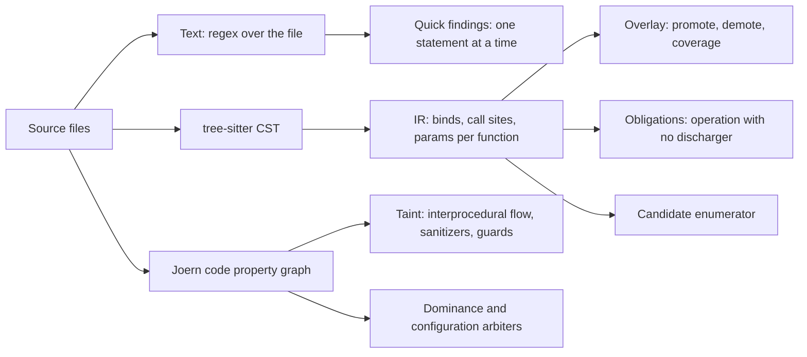
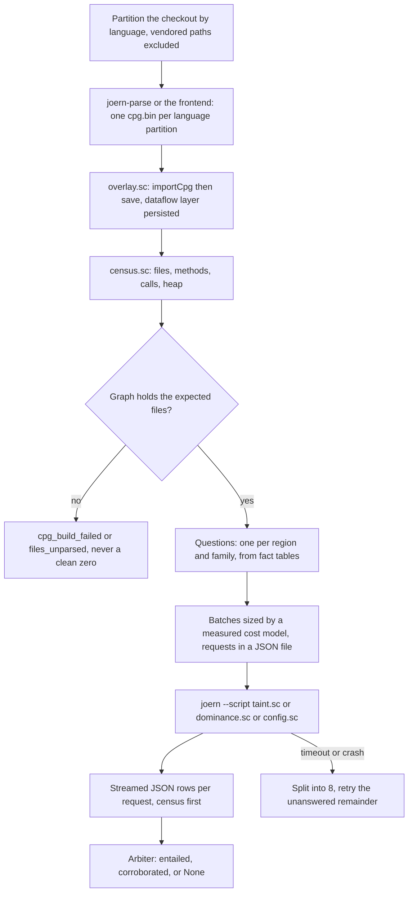
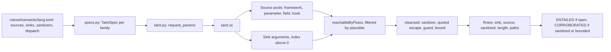
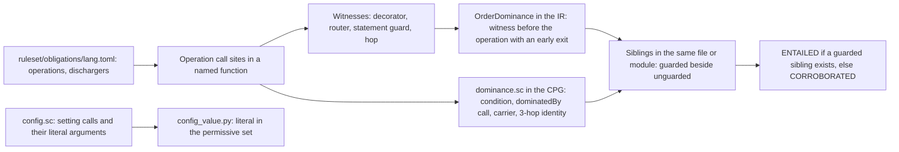
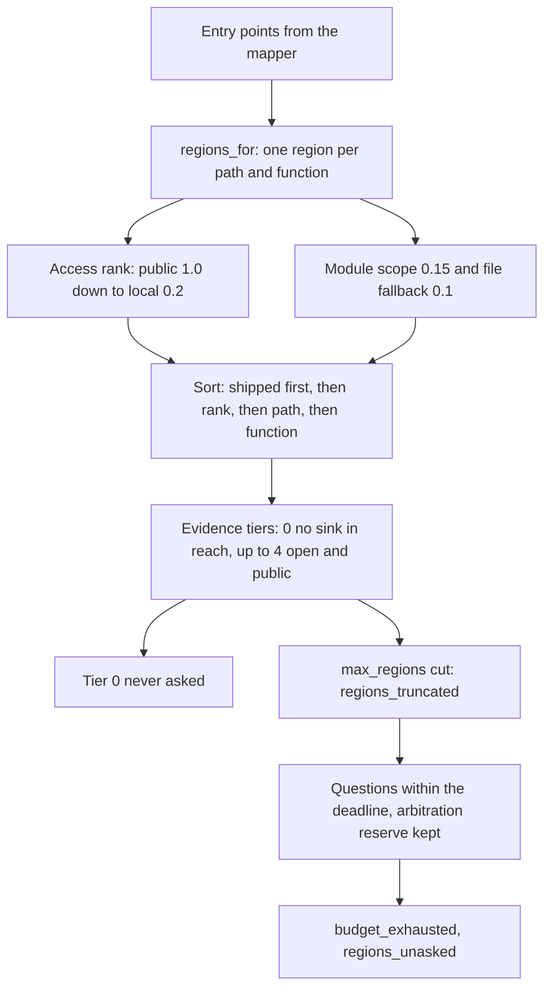
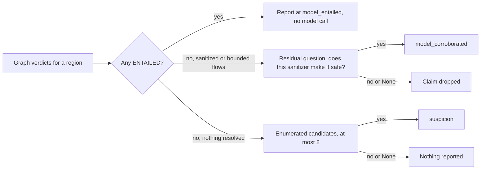
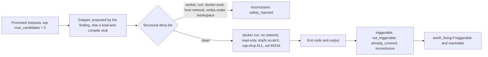

# Detection techniques

This page explains the program analysis under a scan: the three representations of a program the
tool builds, what each one can and cannot see, and the techniques that run over them (taint, guard
dominance, constant abstraction, candidate enumeration, sandboxed reproduction). It is written for
readers who know static analysis. Every statement names the code it comes from
(`src/openultrasast/` paths, `file:line`) and every number names a committed record under
`benchmarks/measurements/` or `benchmarks/independent/`. The scan modes and commands are in
[Scanning](scanning.md); the stage order is in [Architecture](architecture.md).

## 1. Three representations, three horizons

A finding is only as good as what its representation can see. The tool keeps three, from cheap to
expensive, and records which one produced each finding rather than averaging them.

### Text: quick rules

Quick rules are Python regexes applied to the whole file text with `finditer`
(`findings.py:58-68`); a rule's line number is computed afterwards from the match offset
(`findings.py:103`). Rules live in `ruleset/<language>/rules.toml` as `[[rule]]` tables with
`rule_id`, `cwe`, `pattern`, `status` (`enabled`, `shadow`, `disabled`), `min_evidence_level`,
`precision_estimate` and optional `framework`/`library`/`fallback_for` tags (`ruleset/store.py:12,
19-41`). The self-improvement loop may change only `status`, `min_evidence_level` and
`precision_estimate`; the pattern is "human-PR-only" (`store.py:23-25`). There are 52 rules: C 6,
Groovy 1, Java 4, JavaScript 12, Python 11, PHP 18, of which 6 PHP rules are `shadow` (written to
`shadow_findings.json` and removed from the report, `cli.py:538-543`).

What a regex sees is one statement. The patterns say so: most are anchored with `[^\n]*`, and the
PHP header explains that each rule pairs a sink from the engine's vocabulary with "the shape that
makes it dangerous WITHOUT flow -- a request superglobal on the sink's own line, or a query literal
composed with a variable" (`ruleset/php/rules.toml:1-15`). A few PHP rules reach further
(`php-sql-sprintf-unescaped` looks up to 2000 characters ahead for the closing `);`,
`php/rules.toml:102-116`), but none follows a value across statements. Comment suppression is also
line-local (`findings.py:186-205`).

The measured consequence is in `benchmarks/measurements/2026-09-30-php-quick-rules/measurement.json`:
on the PHP development corpus the rules hit the known site on the vulnerable pin in 4 of 5 cases
(pmpro, ultimate-member, phpmyfaq, yeswiki) and missed `wp-learnpress-sqli` on both pins
(`cases.wp-learnpress-sqli.vulnerable.at_known_site = []`). The record does not state the cause.
The case description (`benchmarks/independent/population-v1.toml:54-58`) places the sink at an
`implode` in `class-lp-db.php:607` with the fix on the source side in another file, and the PHP
fixture in the same record carries the general limit explicitly: its missed CWE-89 is "query built
from a request value on an earlier line (not visible to a line rule)"
(`fixtures.php-vulnerable.missed`). Precision on that corpus is a lower bound per rule
(`rules.<rule>.precision_lower_bound`): 0.032 for `php-wpdb-sql-composition`, 0.034 for
`php-sql-unquoted-concat`, 0.109 for `php-sql-sprintf-unescaped`, 0.129 for
`php-sql-unquoted-interpolation`. Every number in that file is in-sample (`provenance.in_sample`).

### Tree: the CST and the IR

The `semantic` extra installs tree-sitter grammars for Python, JavaScript, TypeScript and TSX, C,
C++ and Java (`pyproject.toml:25-34`; grammar table `semantic/extra.py:299-307`). PHP and Groovy
have no grammar: `ir.parse_file` returns `language_unsupported` for them (`semantic/ir.py:56-58`),
and PHP data flow is owned by the engine (`ruleset/php/rules.toml:3`). Without the extra, Python
falls back to the standard-library `ast` and every other language is `unadjudicated`
(`ir.py:50-67`, `semantic/overlay.py:20`).

The CST is reduced to a small IR per function (`semantic/ir.py:10-47`): `Bind(name, line,
value_text, is_constant, names, call_name)`, `CallSite(name, line, arg_texts, arg_is_constant,
arg_names, extra_arg_is_sequence)`, `FunctionIR(name, params, start_line, end_line, binds, calls)`
and `FileIR`. There is no control-flow graph, no guard record and no return record. A synthetic
`<module>` function holds top-level statements (`semantic/cst.py:117-128`); nested functions are
skipped during a function's walk (`cst.py:146-165`). The literal set `_CONST` and the per-language
`assign` and `function` node kinds are at `cst.py:32-84`.

Three consumers read the IR:

- **The overlay** (`semantic/taint.py`, `semantic/overlay.py`) runs an intra-function, order-
  insensitive fixpoint of at most eight rounds over the binds (`taint.py:86-96`), with parameters
  taken as tainted (`taint.py:84-85`) and sources matched as substrings of a bind's text
  (`taint.py:222-227`). A sink call with a tainted argument becomes a `TaintPath`; a sink call that
  matches a sanitizer shape (`parameterized`, a constant `literal_format_arg`, or a sanitizer call)
  or has only constant arguments becomes a `Demotion`; anything else is `flow_incomplete`
  (`taint.py:123-177`). The overlay then re-labels quick findings as `promote`, `demote`,
  `unadjudicated` or adds `coverage` records for sinks no rule inventoried (`overlay.py:19-20,
  94-122, 203-267`). Demotions are never proof: `prove_filter.py` keeps only promotions for the
  REGRESS stage, and "unadjudicated is not negative proof" (`prove_filter.py:1-31`).
- **Obligations** (`semantic/obligations/`), covered in section 4.
- **The candidate enumerator** (`model/candidates.py`), covered in section 6.

The IR's limits were measured on pair corpora in September 2026 and drove the order of later work:
C `init_declarator` is not an assign kind, so `int n = x;` never binds; field stores clobber the
base name's taint; `weak_literals` and `format_arg` are loaded but not consulted by this path; and
without a guard record a NULL or bounds check cannot be a sanitizer here. Those gaps are why guard
reasoning lives in the graph (section 3), not the tree.

### Graph: the Joern code property graph

The CPG is the only representation that follows a value across statements, calls and files. It is
built with Joern and queried in Scala; its use is the subject of section 2.

## 2. Joern: why a code property graph, and how this tool uses one

The engine exists because the first two representations cannot answer "does this request value
reach this query". A regex sees a statement; the IR sees a function with no control flow. Joern's
CPG unifies AST, control flow, dominance and data dependence into one graph, and its `dataflowOss`
overlay answers `reachableByFlows` queries interprocedurally (`cpg/backend.py:117`). Every taint,
dominance and configuration question in the `standard` and `deep` modes is a CPGQL script run over
that graph.

### Frontends and their known defects

| Language | Frontend (`cpg/backend.py:73-81`) | Notes |
| --- | --- | --- |
| PHP | `php2cpg` | Built directly, not through `joern-parse` (`backend.py:97, 607-628`). On one WordPress slice `joern-parse` produced 5 usable builds of 8 and reported success on empty graphs; `php2cpg` produced 11 of 12 and names the files it dropped (`backend.py:85-90`). Files with a `global` inside a closure are excluded for php2cpg before 4.0.625 (`backend.py:124-149`); joernio/joern#6281 is the graph bug fixed in 4.0.625 (`2026-09-20-php-runtime-after-graph-fix.json`, `.the_graph_bug_is_fixed`). The frontend needs a PHP interpreter; the image installs `php-cli` (`Dockerfile:17-21`). |
| Python | `pysrc2cpg` | |
| JavaScript, TypeScript | `jssrc2cpg` | Called directly, skipping `joern-parse` (`backend.py:629-637`). TypeScript adds the boundary `typescript_property_support_unvalidated` (`model/partitions.py`). |
| Java | `javasrc2cpg` | |
| C, C++ | `c2cpg` | Adds `c_bounds_arithmetic_unmodeled`; the `memory` family models calls, not arithmetic (`ruleset/families.toml:91`). |

Joern is pinned at `v4.0.625` in the image (`Dockerfile:14`, `docker-compose.yml:15`,
`ops/joern.py`), on `eclipse-temurin:21-jre-noble` (`Dockerfile:12`). The decision to leave the
pin there after the graph fix is recorded in `2026-09-20-php-runtime-after-graph-fix.json`
(`.on_the_engine_pin.decision`).

### Our approach

**One graph per language partition per scan.** `build_partitions` walks the tree, groups files by
extension (shebang fallback), excludes vendored paths and symlinks with the boundaries
`vendor_semantics_unresolved` and `symlink_context_unresolved`, copies each language into a scratch
directory and builds it into its own CPG (`model/partitions.py:168-305`). A request is routed to
the graph of its file's language (`partitions.py:110-165`). A repository with more than one
language records `cross_partition_semantics_unresolved` (`partitions.py:237-238`): a flow that
crosses languages "can hide a finding, never invent one" (`model/scan.py:706-715`). PHP may add a
second shard: files the frontend dropped after up to four retries are rebuilt separately into
`cpg-excluded.bin`, and the census then reports `cpg_sharded` (`backend.py:763-846`,
`scan.py:506-508`).

**Prove the tool read its input.** The project's repeated failure shape was a frontend that exited
0 and wrote a graph with no methods, which reads exactly like clean code. Three checks exist in
code. Before a PHP build, `php -r` must be able to open and size one sample file and the parser
itself, or the build is refused (`backend.py:719-761, 599-604`). After every build, `census.sc`
counts files, methods and calls; a census that cannot answer fails the build, and a graph holding
fewer files than expected sets `last_failure` (`backend.py:848-868, 809-819`;
`cpg/queries/census.sc:1-14`). On the host, `plane/engine_alerts.py:139-150` raises
`EngineAlertsError` when the engine log has no `read N files` line, N is 0, or no question was
asked, and `benchmarks/independent/evaluate.py:97-101` marks the same conditions
`instrument_error`. A JVM that returns in half a second did not run; the instrument check fails on
the census, not on elapsed time.

**Questions are generated, not written.** One request per (region, family) is built from the fact
tables (`scan.py:1479-1505`, `model/specs.py:237-296`). A taint request carries `sources`, `sinks`,
`sanitizers`, `guards`, `quotedSanitizers`, `boundedSinks`, `fixedOrigin`, `originAnchors`,
`parameterSources`, `fieldParameterSources`, `callDepth` and the dispatch vocabulary
(`model/taint.py:21-67`). Requests are written to a JSON file, never the command line
(`backend.py:1214-1224`); shared fields are hoisted to one `--param` each (`backend.py:1681-1698`).

**Batching follows a measured cost curve.** A fresh `joern --script` pays JVM start and graph load
each time. `2026-09-22-dataflow-batch-cost-curve.json` (`.measured`) shows 25 requests in 71.4 s,
100 in 155.4 s, 400 in 169.7 s: "roughly 70 s is fixed JVM start and graph load" (`.finding`).
Two fixes came from that. `overlay.sc` runs `importCpg` then `save` once after the build so the
dataflow layer is persisted: the saved graph reloads in 8 s where the raw one took 64 s
(`overlay.sc:11`), and without it each batch repaid 54 s on a 637-file plugin
(`backend.py:1001-1004`). Then `_PortionSizer` fits batches to `PORTION_TARGET_SECONDS = 120`
from a fixed-cost prior of 70 s (`scan.py:1121-1163`), with a hard cap of
`MAX_SINK_VISITS_PER_BATCH = 600` sink visits (`scan.py:926-957`). The evidence pass, which needs
no dataflow, sends `EVIDENCE_PORTION = 4000` requests per JVM (`scan.py:1249-1272`). A failed batch
is split into `_BATCH_SPLITS = 8` parts and only the unanswered remainder is retried
(`backend.py:55-57, 1115-1189`). An optional shared `joern --server` session exists behind
`OUSAST_ENGINE_SESSION=1` (`cpg/session.py`); its startup alone cost 9 to 13 s of a 30 s pre-push
budget and the profile recorded `NO-GO` (`2026-09-17-session-runtime-profile.json`, `.finding`,
`.runtime_verdict`).

**Deadlines.** Each query has a ceiling of `QUERY_TIMEOUT_SECONDS = 300` (`backend.py:54`) and each
build `BUILD_TIMEOUT_SECONDS = 900` (`backend.py:49`). The scan has one absolute monotonic
`ExecutionBudget` (`model/contracts.py:18-32`): 30 s for `pre-push` (`config.py:193`), 1800 s per
pin for `plane alerts-engine` (`engine_alerts.py:45`), 2400 s in the independent evaluation
(`evaluate.py:36`). A share of what remains is reserved for arbitration after querying
(`ARBITRATION_RESERVE_SHARE = 0.2`, floor 60 s, `scan.py:876-888`). A single query timeout does not
end the scan; a spent deadline does, and the whole process group is killed
(`backend.py:1420-1440`).

**Results are rows, and silence is typed.** Taint scripts stream a `__census__` line first, then
one `{"id","rows","ms"}` line per request (`cpg/queries/taint.sc:1475-1527`); a killed batch keeps
its finished answers and is marked `__partial__` (`backend.py:196, 234-270`). `None` means the
engine could not answer and `{}` means a genuine empty answer (`backend.py:1200-1203`). The
degradations a scan can carry are:

| Degradation | Raised at | Condition |
| --- | --- | --- |
| `cpg_unavailable` | `cli.py:1153-1156` | `joern` not on the path (`cpg/capability.py:13-15`); the scan is otherwise unchanged |
| `cpg_build_failed` | `scan.py:254-279` | no graph for any partition; detail is `backend.last_failure` |
| `cpg_empty` | `scan.py:490-501, 1311-1320` | census `methods == 0` |
| `files_unparsed` | `scan.py:287-298` | the frontend dropped files; carries the count and first 20 names |
| `cpg_sharded` | `scan.py:506-508` | the PHP second graph exists |
| `regions_truncated` | `scan.py:321-335` | more regions than `max_regions`; carries `examined` and `total` |
| `query_failed` | `scan.py:356, 478-483, 512-523` | a kind or some ids were unanswered |
| `cross_partition_semantics_unresolved` | `partitions.py:237-238` | more than one language partition |

`files_unparsed`, `cpg_empty` and `cpg_sharded` are "graph integrity gaps": completed answers in
the affected partition are demoted to `unresolved/graph_incomplete` rather than reported as clean
(`scan.py:716-729`).

**Operating the engine.** The engine runs inside the `openultrasast:dev` image with
`--network none --memory 3g`, one container at a time (`engine_alerts.py:43-44, 128-136`;
`evaluate.py:82-93`; `docker-compose.yml:30-31`: "two Joern JVMs at once is what triggered an
out-of-memory kill on a 7.7 GB machine"). The source mounted into the container is a frozen export
of a commit, never the live tree (`engine_alerts.py:102-110`), because a five-hour replay was once
confounded by edits landing mid-run. The heap is `CPG_HEAP_MB = 2048` by default, applied to both
the launcher and the forked worker JVM (`backend.py:63, 1466-1485`), and the census reports the
worker's `maxHeapMB` so a mismatch is visible (`backend.py:886-894`). Build, smoke and pre-push
commands are in [Engine and pre-push](ops/README.md).

### Where the engine sits in the plane

The engine is a signal producer, not a decider. On the host, `ousast plane alerts-engine` runs it
pin by pin for languages whose alerts of record come from the engine: `ENGINE_ALONGSIDE_QUICK =
{"php"}` keeps the engine running beside the PHP quick rules because the rules' measured precision
is low (`engine_alerts.py:47-50, 202-205`). Each finding becomes an alert row with
`rule_id = "engine:<family>"` and `source = "engine"` (`engine_alerts.py:160-174`). In the
decision engine's feature records the engine contributes the `eng.*` block (`eng.findings`,
`eng.rung_max`, `eng.witness_steps_min`, `eng.sink_kind`, `eng.source_kind`, `eng.completion`,
`eng.degraded`, `eng.unstable`; `learn/schema.py:140-150`, `learn/features.py:199-224`). Input
profile `v1` withholds that block entirely: on the pair corpus the engine's "read the file, asked no
question" state tracks the label, because a fixed side loses its sink (`learn/schema.py:97-109`;
`2026-10-01-decision-engine-leak-audit/`). [Deployment](deployment.md) lists `alerts-engine` as
implemented and run on this host; its planned Kubernetes cluster says nothing about the engine.

### What the engine costs and misses, with records

- **33 minutes per pin on a mid-sized plugin.** On Paid Memberships Pro (637 files, 4.2 MB) the
  engine took 1993.4 s on the vulnerable pin (382 questions, 125 completed, 10 findings, the CVE
  site hit) and 2025.8 s on the fixed pin, with `process_timeout` and `query_budget_reserved`
  among its degradations (`2026-09-30-php-quick-rules/measurement.json`, `engine.pmpro.*`). The
  quick rules read the same tree in 5.3 s.
- **Per-question cost is one to two seconds of graph work** (`2026-09-20-php-detection-corrected.json`,
  `.the_scale_limit.reading`): 25 regions produced 127 questions and 19 findings in 241 s of
  query time; 500 regions produced 2,526 questions and completed none inside a 300 s ceiling, and
  raising the ceiling to 1800 s "changed nothing except how long the failure took"
  (`2026-09-20-php-runtime-after-graph-fix.json`, `.reading`).
- **Population v2: recall 0 of 17** (`benchmarks/independent/results-v2.json`, `.recall`),
  completion 13,206 of 108,374 questions, 3 benign alerts, every M4 gate not met. Nine cases were
  `unanswered`. The zero is not an instrument artefact: FUXA, GoPay, cct-studio, ReactPress, User
  Registration and Directorist completed questions in the sink file itself and found nothing
  (commit `21adc40`).
- **froxlor and GoPay on the host** (`2026-09-30-php-engine-alerts/`): froxlor completed 130 of 130
  questions per pin in about 390 s and emitted six `engine:injection` alerts, none at a declared
  site and identical on both pins (`froxlor-*-alerts-summary.json`); GoPay completed 101 of 101 in
  about 120 s with 0 alerts on both pins, under `vendor_semantics_unresolved`. Neither record states
  the cause of the miss.
- **Population v1: recall 1 of 11**, with 8 of 11 cases completing no question at the vulnerable
  pin (`results-v1.json`, `.summary`, `cases_with_zero_completed_questions_at_vulnerable_pin`).

## 3. Taint: fact tables to query to verdict

**Facts.** A language's facts are `[[source]]`, `[[sink]]`, `[[sanitizer]]`, `[[dispatch]]` and
`[[layout]]` tables in `ruleset/semantic/<language>.toml`, loaded by `semantic/facts.py`
(`load_facts`, L412-427; schema L37-146). Counts per file: C 2/3/1, Java 2/9/4, JavaScript 2/17/6,
Python 5/18/4, PHP 3/11/11 (sources/sinks/sanitizers). A sink carries a CWE, call names, and
optional `weak_literals`, `format_arg`, `prefix_fixes_origin` and `origin_anchors`
(`facts.py:46-61`). A sanitizer is either a cleansing call or one of two typed shapes: `quoted_only`
(an escape, protects only inside a quoted literal) and `guard` (a check, "never a cleansing call on
a path") (`facts.py:65-79`). Families are not a fact field; `specs.py:269-279` groups sinks through
`families.family_of_cwe`, and `ruleset/families.toml` is the closed list of ten families with a
verifier kind each. `php.toml` is the worked example: sources `request` (`$_GET`, `$_POST`,
`$_REQUEST`, `$_COOKIE`, `$_FILES`), `server`, `raw_body`; sinks such as `wpdb` (CWE-89, the
qualified `$wpdb->get_var` form to avoid the generic-name trap, L40-59), `command` (CWE-78),
`unserialize` (CWE-502); sanitizers such as `sql_escape` with `quoted_only = true` (L176-186),
`allowlist` with `guard = true` (`in_array`, L200-207), `prepared_statement` with
`parameterized = true` (L234-237). `sanitize_text_field`, `esc_html` and `esc_attr` are
deliberately absent because they do not stop SQL injection (L195-199). Framework-tagged entries
can be switched off as a group through `priors` (`ruleset/frameworks.py:95-101`).

**The query.** `taint.sc` resolves the region's methods by name and file, scopes to lexical nesting
plus `callDepth` levels of callees (L192-278; `ENTRY_POINT_CALL_DEPTH = 3` for entry points,
`scan.py:70, 570-571`), builds source nodes from four pools (L1044), matches sink calls on name,
callee text or full name with word boundaries (L1098-1110), and asks
`sink.argument.argumentIndexGt(0).reachableByFlows(sourceNodes)` filtered by `plausible` (L1360).
Each row is one (sourceKind, source, sanitized) key with `sinkLine`, `length`, `paths`, `bounded`
and `inLabeledScope` (L1408-1442). The Python arbiter (`model/taint.py:129-173`) prefers flows from
a modelled source, orders them by a total `_rank`, and returns `ENTAILED` for a flow with no
sanitizer and no bound, `CORROBORATED` for a sanitized or bounded flow, and `None` when there are
no flows or the query failed, because "the engine could not decide" is not "there is no flow"
(`taint.py:8-10`).

**Refinements, each with the miss or false positive that forced it.** Every one is a rule about
what the graph may count, not a new source of flows.

| Refinement | What it does (`cpg/queries/taint.sc`) | Record |
| --- | --- | --- |
| Receiver exclusion | `$this` is parameter 0 of every PHP method; counting it made every method that reads a field reach every sink: 11 of 15 entailed findings on one PMPro class were `this -> $wpdb->...` (L247-263). On a response sink the receiver is the response object, so `res.end()` reported like `res.write(body)` | `2026-09-19-output-encoding-family.json`, `.changes.taint_query_receiver`; comment L247-259 |
| Field-owned sources | Excluding the receiver alone lost CVE-2023-6559 (MW WP Form's `_delete_files()` reads `$this->attachments`). `fieldSourceNodes` carries that evidence through the field itself; a write target, or a read dominated by the method's own write, is not a source (L886-903) | adjudication of PMPro SQLi: 6 of 8 false positives were object fields treated as input, precision 2/10 (`2026-09-23-pmpro-sqli-adjudication.json`, `.reading`); after the path rules, findings on common questions 29 to 17 with recall pins intact (`2026-09-24-pmpro-sqli-adjudication-after-path-rules.json`); round three 48 to 22 across five fixes (`2026-09-24-pmpro-sqli-adjudication-round3.json`) |
| Two-stage join through literal keys | Cross-method flow without a call edge, keyed by literal text. Field half: `field = rhs` reached by a source in the same file makes reads of that field sources in the region (L280-303, L829-873). Hook half: a WordPress `apply_filters` call becomes a source when a registered callback's array-key assignment is reached unsanitized; the callback name is read from source text because php2cpg drops the argument (L905-1033) | the same adjudication series; the second stage is what made receiver exclusion safe (comment L257-259) |
| Guards as sanitizer facts | A `guard = true` fact is a check judged by position: a flow is cleansed inside the true branch of an `IF` on the guarded value, past a failing `IF` that exits or overwrites, or through a ternary arm, with and, or and not polarity read from the condition (L693-827). A guard validates only the value it tests (commit `63460f8`) | three of the four fixed-side alerts in population v1 were fixes that added a check (`results-v1.json`, `.summary.fixed_side_alerts = 4`; commit `03f2ce7`) |
| Quoted-only SQL escapes | `mysqli_real_escape_string` and `esc_sql` protect a value only inside a quoted literal; `landsQuoted` inspects the string being built (L139-142, L647-691, L824-826) | Ultimate Member CVE-2024-1071 read as sanitized because 2 of 4 identical runs chose a path through `$wpdb->prepare`; after the fix the vulnerable pin is detected at `class-member-directory-meta.php:936` (commit `949977c`) |
| Fixed-origin destinations | A sink with `prefix_fixes_origin` ignores a path that enters a concatenation anywhere but the leftmost operand when that operand already fixes the origin (`?`, `#`, `/x`, `scheme://host/`), or passes an anchor such as `reverse`; `"/" + x` and `"https://" + host` stay attacks (L463-542) | OpenCVE's vulnerable and fixed pins fell from 2 and 3 findings to 0 and 0; the SSRF itself is still missed (commit `562b670`) |
| Bounded source tokens | A source pattern is a word-bounded token on the callee text or access, not a substring (L174-183); a package name is not a sink token | `axios` bounded inside `axios.get` (`2026-09-19-untrusted-destination-vocabulary.json`, `.design.bare_module_names`); YesWiki's 1,128 PHP questions all unresolved, and Flask's `request.get` claiming Django's `request.get_host()` (commit `3358631`); mongo-express's package name matching the SQL sink `query` (commit `ec3d145`) |

One refinement was reverted: treating a field as input only when a caller feeds it request data
cut findings 37 to 31 but removed the adjudicated true positive `discount-codes.php:154` and only
one of six object-field false positives (commits `6ebbc89`, `bdb5a86`). Known gaps are kept in the
records too: that true positive needs "a cross-file field join keyed by class"
(`2026-09-24-pmpro-sqli-adjudication-round3.json`, `.known_true_positive_not_reported`).

**Cost.** `2026-09-22-php-query-cost-identified.json` (`.the_answer`) found that a taint question
costs in proportion to the number of CALL nodes a family's sink names match, which is why PHP
`echo`/`print` sinks dominate output-encoding time. The budget controls are in section 5.

## 4. Absence bugs: obligations, dominance, configuration, census

An absence bug is an operation that should have been guarded and was not. There is no flow to find,
so it is modelled as an obligation and discharged by a witness.

**Obligation facts** live in `ruleset/obligations/{python,javascript,typescript}.toml` as
`[[operation]]` and `[[discharger]]` rows with closed vocabularies: operation kinds
`protected_read`, `protected_write`, `privileged_action`, `security_setting`; discharger kinds
`path_guard`, `identity_constraint`, `ownership_check`, `non_permissive_value`, `validated_input`;
provenance kinds `authenticated_context`, `request_input`, `constant`, `unknown`
(`semantic/obligations/facts.py`). Python has 5 operations and 6 dischargers, JavaScript and
TypeScript 7 and 6. Any other language records `obligations_language_unsupported`
(`obligations/check.py:76-78`). An example is `collection-read` (`javascript.toml:19-26`): `find`
with `query_document_arg = 1`, added only after a false-positive measurement showed 88 of 88 `find`
calls on one plugin's assets were selectors, matched as operations 0 times in the whole graph
(`2026-09-20-collection-read-obligation.json`, `.false_positive_measurement`).

**Two dominance checks.** In the IR, `OrderDominance` accepts a decorator or router witness for the
whole handler, a statement witness that precedes the operation and either is a `path_guard` or is
followed by an early exit, or an earlier hop along a path record (`obligations/dominance.py:446-468`).
In the CPG, `dominance.sc` recognises five governing shapes: a discharger token in the operation's
own arguments, a control-structure condition in the same method, a non-operator call that
`op.dominatedBy` and mentions a discharger (the one place CFG dominance is used), a guard at the
carrier call when the obligation is carried across a module boundary through an external stub, and
identity reaching the arguments through at most three local assignments (`dominance.sc:300-363`).
The arbiter compares siblings in the file: an unguarded operation beside guarded ones is
`ENTAILED`; no guarded sibling, or an obligation carried across a module, is `CORROBORATED`
(`model/dominance.py:62-105`). The sibling scope was measured: file scope gave 6 entailed with 4
true and 2 false, the narrower scope 2 entailed and 0 true, and file scope was kept
(`2026-09-20-sibling-scope-and-identity.json`, `.part_two`). On NodeGoat, 15 handlers were asked
and 9 carried an obligation across a module split, yielding 3 `model_corroborated` verdicts
(`2026-09-20-access-control-module-split.json`, `.measured_on_nodegoat`). Sibling consistency in
the IR path needs at least `min_siblings = 3` discharging siblings (`config.py:179`,
`obligations/siblings.py:470-504`). A project may declare routes public in
`.openultrasast/obligations.toml`, which waives `path_guard` (`obligations/policy.py`,
`check.py:112`).

**Configuration: constant abstraction.** `config.sc` returns, for every call matching a setting
name, the argument texts and the literals found anywhere in each argument's AST subtree
(`config.sc:206-236`). The abstraction is in Python: literals are stripped of quotes, lower-cased
and compared to a closed permissive set from the obligation facts, with per-setting polarity
(`model/config_value.py:55-57, 106-118`). A permissive literal is `ENTAILED`; a computed argument is
`CORROBORATED`, not safe (`config_value.py:7-9, 75-86`). Weak-algorithm literals come from sink
facts' `weak_literals` (`specs.py:211-218`). Asking every permissive setting rather than one raised
NodeGoat's `config_secrets` findings from 1 to 2 (`2026-09-20-every-permissive-setting.json`).

**Census.** `census.sc` counts files, methods and calls, lists file names and overlays, and reports
the worker JVM's heap (`census.sc:17-31`). It is the instrument check of section 2, and it also
settles whether a frontend warning mattered: if the graph holds every expected file, the warning is
ignored (`backend.py:827-829`). `vocabulary.sc` is a related, dataflow-free query that lists every
call not covered by the fact tables as a candidate list, "never an ontology"
(`vocabulary.sc:72-74`); it feeds `benchmarks/push/ontology_gap.py`, not the scan.

## 5. Regions, ranking and budgets

A repository is too large to ask the graph about everything, so the scan asks about regions in a
deterministic order under a budget and records what it did not ask.

**Regions.** `regions_for` makes one `ScanRegion` per (path, function) from the mapper's entry
points, adds a `<module>` region at rank 0.15 for files with only function-scoped regions and a
file fallback at rank 0.1 for uncovered files (`model/regions.py:56-171`). The rank is the entry's
access level: public 1.0, authenticated 0.8, role-restricted 0.6, contract-only 0.4,
review-required 0.3, local-only 0.2, unknown 0.5 (`regions.py:32-39, 125`). The sort key is
`(not shipped, -rank, path, function)`, "a total order so two runs of one repository agree"
(`regions.py:173-180`). Shipped status comes from the project's build files (`model/shipped.py`);
test paths are ordered after product code, not removed (`model/layout.py:67-73`). Mis-attributed
function-scoped regions once left 436 of NodeGoat's questions unresolved; region attribution
brought that to 0 with 299 completed on both pins (`2026-09-17-region-attribution.json`,
`.progression`).

**What ties did to PHP.** Access rank has five distinct values, so a large plugin collapses into a
few tiers ordered by path. On Paid Memberships Pro the baseline shows 4,463 regions with
`largest_tier_share 0.838` (83.8% of regions at one rank, `distinct_ranks 5`) and CVE-2023-23488
at position 390, so recall needed a budget of 391 regions; WP Statistics needed 504
(`benchmarks/ranking/baselines/2026-09-10-access-rank.json`). The answer was an evidence pass that
needs no dataflow (`model/evidence.py`): each region's pairs get a tier (`TIER_EXCLUDE = 0` no
sink in reach, `TIER_NO_SOURCE`, `TIER_CLEANSED`, `TIER_OPEN`, `TIER_OPEN_PUBLIC = 4`) and a
within-tier score from published weights (`evidence.py:18-40, 89-127`). Two uses followed. Tier 0
is never asked (`ScanBudget.prune_tier0 = True`, `scan.py:93`): at 500 regions the questions fell
from 2,526 to 406 and at 25 regions 19 findings stayed 19 (`2026-09-22-tier-zero-pruning.json`,
`.no_finding_lost`); commit `88ada8e` recorded 86% of 2,500 requests at tier 0 and a 7x taint
speed-up. Ordering regions by evidence (`order_by_evidence`) is implemented but **off by default**
"until the position benchmark says where the pinned CVEs land under it" (`scan.py:95-99`); when on,
ties fall back to the static order (`scan.py:1399-1422`). The host runs that produce alerts and
the independent evaluation pass `--max-regions 5000`, which on these repositories means no cut
(`engine_alerts.py:136`, `evaluate.py:82-93`).

**Budgets.** `ScanBudget` defaults are `max_model_calls = 200` and `max_regions = 500`
(`scan.py:78-99`); the product configuration uses 100 and 300 (`config.py:164-172`, wired at
`cli.py:1183`). When regions exceed the cap, `regions_truncated` records `examined` and `total`
(`scan.py:321-335`; the comment cites PMPro: 4,463 regions, so 500 examines 11%). When model calls
run out, the judge is withheld, graph arbitration continues, and `budget_exhausted` with
`regions_unasked` is appended (`scan.py:546-589`). The time budget is section 2's
`ExecutionBudget`. A push can select far more questions than a census: 2,500 PHP questions is
roughly six hours of engine, which is why the question count is sized before any replay
(`benchmarks/push/python_overhead.py` runs the real pipeline against a stub backend in about a
minute). `2026-09-22-php-declared-target-in-scope.json` (`.result`) shows the shape: 500 regions,
406 questions arbitrated, 271 completed, 2949.8 s, declared target found.

## 6. The model's role: the residual question only

The LLM never creates a flow. `model/pipeline.py:1` states the division: "the enumerator proposes,
the LLM answers, the model disposes", where "the model" is the graph and its rules. Three question
forms exist and each opens with "judging ONE ... Do not look for other issues"
(`pipeline.py:46-56, 183-222`). For a flow the graph found with a sanitizer on it, the residual
question is only "whether the sanitizer on that path actually makes it safe for the {family}
weakness class" (`pipeline.py:213-222`); the dominance form asks whether the operation is
legitimately public, the configuration form whether a value is permissive in a deployed
configuration. The answer is JSON `{"vulnerable": bool, "why": str}` with no tools and no retry;
anything else, or an endpoint failure, is `None`, "a degradation, never a verdict"
(`pipeline.py:225-244`). `scan_region` returns without a model call when any verdict is `ENTAILED`
(`pipeline.py:139-146`).

When the graph resolved nothing, the enumerator's candidates are judged. `enumerate_candidates`
parses the region's file to IR, collects call sites, binds, operations and config sites per family
shape, sorts by `(path, line, name)` and caps at `MAX_CANDIDATES_PER_CALL = 12`
(`model/candidates.py:30-47, 97-140`); the pipeline then judges at most `MAX_JUDGED_CANDIDATES = 8`
(`pipeline.py:44, 164`). Each affirmed candidate is reported at `suspicion` with the contradiction
"the model resolved no flow here; its sink table may not cover this API" (`pipeline.py:171-179`).
Silence is not refutation: "23 of the 39 misses in the entailment ceiling were sinks simply absent
from the fact tables" (`pipeline.py:10-17`). The enumerator was measured before it was built: the
IR's call sites and bindings reach the labelled function in 96.6% of the corpus against 12.1% for
the pattern ruleset (`candidates.py:7-10`), which is why "the ruleset is never the generator".
Candidates are enumerated only when a judge client exists; enumerating them without one cost 737 s
on a 637-file plugin (`scan.py:551-558`). Without a provider key `client is None`, and both the
corroborated and the suspicion branches return nothing (`pipeline.py:152-153, 161-162`).

Rungs are the ladder of `model/ladder.py:29-37`: `suspicion`, `model_corroborated`,
`model_entailed`, `execution_confirmed`. `at_rung` is the only way a finding rises above
suspicion (`ladder.py:58-71`). Findings are ordered `(rung, -region rank, site)` and deduplicated
per (site, family) keeping the strongest rung (`scan.py:1588-1614`).

Two other model-driven paths are independent of the graph. The plane's `verify` task is a metered
tool hunt over enumerated candidates (`PER_HUNT = 6`, `MAX_STEPS = 6`, `plane/tasks/verify.py:32-33`),
run as passes a and b; `agree` makes no model calls and marks a candidate agreed only when both
passes flagged it, with pass c re-hunting only the disputes at 2 of 3 (`plane/tasks/agree.py:20-26,
73-82, 131-134`). The decision engine consumes all of the above as feature blocks per candidate:
`quick`, `engine`, `facts`, `source`, `entry_points`, `roles`, `delta`, `verify`, `agree`,
`model_sinks` (`learn/schema.py:49-51`), where an instrument that did not run records a state,
"never a zero" (`learn/features.py:10-11`). Per-repository roles are inferred deterministically over
the facts: a function whose parameter reaches a sink call becomes a derived sink, a sanitizer if it
also returns the cleaned value, a source if it returns a source's value, to `MAX_DEPTH = 3`, and
"a derived sink alone is never a finding" (`learn/roles.py:21-22, 48, 345-405`). How those signals
become a decision is in [Memory and detection](memory-and-detection.md); the measured gap between
a tool-equipped hunter and the overlay on a Python holdout (12/14 against 5/14 once scoring was
class-aware) is in `benchmarks/measurements/2026-09-06-vibe-py-holdout-hunter-*.json`.

## 7. REGRESS: sandboxed reproduction

REGRESS runs only in `deep` mode (`stages.py:17`) and only when `docker info` succeeds; otherwise
the stage records `sandbox_unavailable` (`sandbox/probe.py:24-36`, `cli.py:691-693`). The top
`max_candidates = 5` hotspots by score plus forced severity-5 reachable inventory are selected
(`regress/candidate.py:63-88`, `config.py:157-160`). A snippet is the one a finding proposed, or a
default that only loads the file: Python compiles it, JavaScript reads it, C is `int main(void)
{ return 0; }` (`candidate.py:153-174`). Recipes exist for Python, JavaScript and C on
`python:3.12-alpine`, `node:22-alpine` and `gcc:13` (`regress/recipes.py:16-52`,
`candidate.py:30-34`); any other language is `inconclusive` with `missing_recipe`.

The deny-list is a regex check before any container starts (`regress/safety.py:63-75`): the Docker
socket, the word `socket`, the word `curl`, a host-network request, and writes under `/workspace`
in Python, Node, C and shell forms (`safety.py:21-60`). The real boundary is the container
(`sandbox/runner.py:113-137`): `--network none --read-only --tmpfs /scratch:rw,exec --memory
<mb>m --pids-limit <n> --cap-drop ALL --security-opt no-new-privileges --user 65534:65534` with
the repository bind-mounted read-only at `/workspace`; the runner also refuses an argv containing
`--privileged`, the Docker socket or host networking (`runner.py:182-192`). Defaults are 2048 MB,
300 s and 512 pids (`config.py:104-109`).

Verdicts (`regress/verdict.py:10-26, 64-110`): a safety rejection, missing recipe or sandbox, or
timeout is `inconclusive`; exit 0 under a covering test is `already_covered`; with an oracle,
`triggerable` on `oracle_fired` else `not_triggerable`; without one, a nonzero exit is
`triggerable` with reason `sanitizer_abort`, `assertion`, `crash` or `nonzero_exit`, and exit 0 is
`not_triggerable`. `is_worth_fixing` requires `triggerable` and reachability `reachable` or
`inferred-file-surface` (`verdict.py:28, 59-61`). Verdicts feed the complexity ledger and
`rank_obligations`, which caps every obligation finding strictly below the lowest proven finding
(`cli.py:724-727`, `rank.py:243-265`).

**What `execution_confirmed` means today.** The rung is defined as "a sandbox reproduced it
(deferred tier, memory/C first)" (`ladder.py:10, 33`) and ordered above `model_entailed`. No code
path assigns it: REGRESS produces the four verdicts above, not a rung, and nothing maps
`triggerable` onto `Rung.EXECUTION_CONFIRMED`. The default snippets prove that a file loads, not
that a vulnerability fires; a reproduction needs a finding-proposed snippet or an oracle. Read the
rung as reserved.

## 8. What each technique misses

| Technique | Cannot see | Evidence |
| --- | --- | --- |
| Quick rules | A value that arrives from an earlier statement or another file; a fix that lands on a line the rule does not read (the fixed pin keeps firing: ultimate-member 8 hits on both pins, phpmyfaq 4 then 3). Precision lower bounds of 0.03 to 0.13 on the PHP corpus | `2026-09-30-php-quick-rules/measurement.json`, `cases.*.fixed.at_known_site`, `rules.*.precision_lower_bound`, `fixtures.php-vulnerable.missed` |
| Overlay (IR) | Languages without a grammar (PHP, Groovy; JS, TS, C, C++, Java without the `semantic` extra); control flow, guards, interprocedural flow; C declarations and field stores | `semantic/extra.py:299-307`, `ir.py:56-58`, `ir.py:10-47` (no guard or CFG record) |
| CPG taint | Flows across language partitions (`cross_partition_semantics_unresolved`); sinks absent from the fact tables (23 of 39 misses in the entailment ceiling); cost: 1 to 2 s per question, 33 min per pin on a 637-file plugin, population v2 recall 0 of 17 with completion 13,206 of 108,374 | `partitions.py:237-238`; `pipeline.py:10-17`; `2026-09-20-php-detection-corrected.json`; `2026-09-30-php-quick-rules/measurement.json` `engine.pmpro`; `results-v2.json` |
| Obligations | Any language but Python, JavaScript and TypeScript; handlers with fewer than `min_siblings` guarded siblings and no declared policy; template-mediated escaping (`output_encoding` limits) | `ruleset/obligations/`, `check.py:76-78`; `config.py:179`; `families.toml:49` |
| Configuration | A value computed at runtime (reported `CORROBORATED`, never safe) | `config_value.py:75-86` |
| Ranking | A pinned CVE deep in a tier: PMPro's at position 390 of 4,463 under access rank, with evidence ordering still off by default | `benchmarks/ranking/baselines/2026-09-10-access-rank.json`; `scan.py:98` |
| The model | Anything the enumerator did not propose (a hard ceiling on recall); the residual question is bounded to 8 candidates per region; a public fix the model may have memorised is indistinguishable from reasoning, which is why labels come from ground truth and the engine block is withheld where it tracks the fix | `candidates.py:7-10`; `pipeline.py:44`; `learn/schema.py:97-109` |
| REGRESS | Anything without a Python, JavaScript or C recipe; anything the default load-only snippet cannot trigger; no finding reaches `execution_confirmed` today | `recipes.py:16-52`; `candidate.py:153-174`; `ladder.py:33` |

The three representations are kept separate on purpose: a finding carries the rung and the
degradations of the representation that produced it, so a reader can tell a flow the graph entailed
from a statement a regex matched, and "did not look" from "looked and found nothing".
