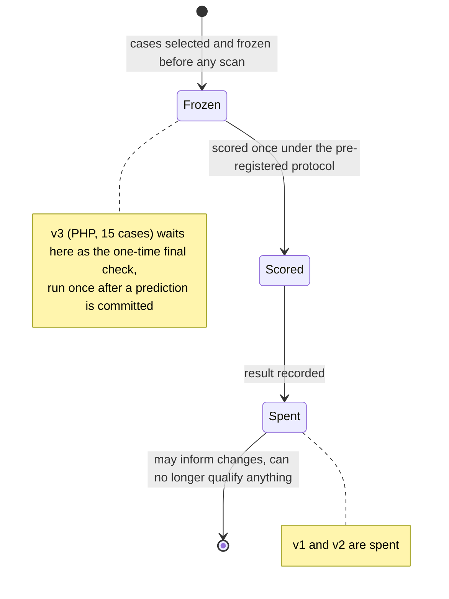
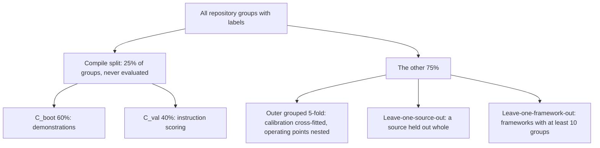

# Evaluation

This page shows what has been measured on code the tool was not tuned on, and how. State as of
2026-10-02. Every number below is quoted from a committed record, and the record's path is
given with it.

## Instruments

| Instrument | Measures | Where |
| --- | --- | --- |
| Detection gate | per-language recall/FP on the bundled cheat-sheet corpora (goal: >= 90% recall, < 10% FP) | `python -m openultrasast.gate`, `benchmarks/manifests/` |
| Pair corpus | fire on the vulnerable function, stay silent on its fix | `ousast pairs`, `benchmarks/pairs/` |
| Independent populations | real repositories at vulnerable, fixed and benign pins, scored under a pre-registered protocol | `benchmarks/independent/` |

Recall means the share of known bugs found. FP means false positives.

The detection gate and the local pairs are CI gates. They catch regressions. They do not
estimate recall on real code, because the rules were written against them.

## Pair corpora

A pair is a vulnerable function and its fixed version. You can run the catalog
`benchmarks/pairs/catalog.toml` and the slice directories with `ousast pairs --slice <name>`.
The slices are `local`, `github`, `sast`, `vfc`, `vibe-py`, `vfc-js`, `agent-vfc` and `owasp`.

- Each pair carries a provenance profile and a train/holdout split (`--profile`, `--split`).
- Pointer pairs are not vendored. `--pointers` fetches them into `~/.cache/openultrasast/pairs/`.
- `benchmarks/pairs/README.md` documents the schema and the review tiers.

**`advisory-fixes`** (`benchmarks/pairs/advisory-fixes/`, 2026-10-01) holds 97 pointer pairs,
one per repository. Each is a public CVE/GHSA fix commit. The function the advisory names is
declared on both sides and changed by the fix.

It was assembled to give the decision engine real negatives (fixed, non-vulnerable code). It
targets families the corpus had few of: access control, deserialization, output encoding,
path, untrusted destination. It is a label source of the decision engine
(`src/openultrasast/learn/sources.toml`), not an `ousast pairs` slice. The research log and
every rejection are in `research-2026-10-01.md`.

## Independent populations and the M4 gates

M4 is the qualification milestone of the pre-push safety net. It requires all of these
together:

- at least 95% actionable precision;
- at least 90% supported recall;
- at least 95% supported-check completion;
- the runtime gates;
- zero fixed-side or benign false alerts.

A population is a set of real repositories. Its lifecycle has three steps:

1. It is frozen before any of its cases is scanned.
2. It is scored once under a pre-registered protocol.
3. It is then **spent**: it may inform changes, but it can no longer qualify anything.

| Population | Status | Result | Record |
| --- | --- | --- | --- |
| v1 (11 cases) | spent | engine: recall 1/11, precision 1/12, 4 fixed-side and 1 benign false alert; every M4 gate failed. Eight of eleven cases completed no question at the vulnerable pin. | `benchmarks/independent/results-v1.json` |
| v2 (17 cases) | spent | engine: recall 0/17, 3 benign alerts, completion 13,206 of 108,374. Tool hunter: recall 1/17, precision 2/14, 1 fixed-side and 16 benign alerts, $8.88. No M4 gate met by either. | `results-v2.json`, `results-v2-hunter.json` |
| v2, model-driven pipeline | exploratory (v2 already spent) | stopped after 7 of 17 cases when the account emptied: recall 4/7; precision not adjudicated; no gate measurable | `results-v2-model-pipeline.json` |
| v3 (PHP, 15 cases; one SSRF slot left empty by the selection rule) | frozen, untouched | none: it is the one-time final check, run once under `protocol-v3.md` after a prediction is committed | `population-v3-php.toml`, `freeze-v3-php.json` |

v3 is reserved. Development and analysis work never reads its cases.
`tests/test_independent_population.py` fails when anything in the development tree names one
of its repositories. That covers a recipe, catalog, manifest or measurement.

## Folds: how learned decisions are kept out of their own training data

The decision engine is evaluated on repositories it was not shown
(`src/openultrasast/learn/folds.py`). Every split is by repository group. A group is the label
builder's normalised `owner/name`, merged across URLs, forks and shared advisories. Splits
cover all corpora and are seeded and deterministic.

`assert_disjoint` runs before a compile. It checks that the compile split and the evaluation
folds share no group. A framework with fewer than 10 groups gets `insufficient data` instead of
a fold. As of 2026-10-02, the outer folds have been run for the six evaluable families.
Leave-one-source-out and leave-one-framework-out have not
([decision-engine.md](decision-engine.md#second-slice-six-families-2026-10-02)).

## The plane increment

The first increment of the agentic plane ran on google/ax. It used the model-driven pipeline's
validation set: 46 candidates in 15 cases of v2, with 20 declared vulnerable sites. It was
compared with the script pipeline on the same cases, candidates, pins and recorded triage.

The pre-registered gate: at least 16 of 20 declared sites agreed, at a cost per candidate under
$0.022.

- **Increment 1** (2026-09-29, `benchmarks/independent/plane-increment-1.json`): 14 of 20
  declared sites agreed, against the reference's 16. Cost was $0.0194 per candidate with
  recorded triage. **NOT MET** on recall.
  *Correction (2026-09-30, in the record):* the first version misread agree's
  `declared_sites_matched`. That field is coverage by candidates (19), but it was read as
  "found in either pass". So the first version concluded detection was unchanged. Recounted
  from the agreed rows, the plane's passes flagged 17 of 20 declared sites in at least one
  pass. The reference flagged 19.
- **Increment 2** (2026-09-30, `benchmarks/independent/plane-increment-2.json`): came after the
  design revisit. It added a tie-break pass c on the 10 disputed candidates, with 2-of-3
  agreement. 16 of 20 declared sites agreed (reference 16). Cost was $0.0205 per candidate over
  46, and $0.02195 over the 43 after triage (reference: $0.022). **MET**, with two
  caveats the record carries:
  1. The tie-break was chosen after seeing the first measurement on the same validation set.
     So this compares plane with script and qualifies nothing on an independent population.
  2. The plane's passes still flag fewer declared sites than the reference (17 vs 19).

  Precision is not part of this gate and remains the open problem.

## The decision engine

Two slices have been measured out of repository: injection (2026-10-01) and six families
(2026-10-02). The engine is not adopted. [Where we
stand](where-we-stand.md#1-detection-capability-and-goals-no-go-measured) shows the state
against the gates in one place, with the plane increment and the populations above. The
per-family tables are on [decision-engine.md](decision-engine.md).

## Removal of the earlier agentic extra

The earlier agentic extra was removed on 2026-09-30. The removal was checked for byte-identical
deterministic outputs: pair replay, quick benchmark, standard scan, `improve --dry-run`. Records:
`benchmarks/measurements/2026-09-30-harnessx-removal-baseline/` and `-equality/`.
