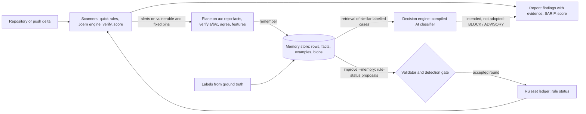

# OpenUltraSAST

OpenUltraSAST is an experimental static security analyser meant to work as a safety net on
repositories it has never seen: it scans a checkout, or the commits a `git push` would publish,
and separates what it can prove from what it merely suspects. A scan that could not look at
something records a degradation instead of reporting a clean result.

**State as of 2026-10-02 (v2.0.0):** the pre-push safety net is **NO-GO** for rollout.
No hook capability is enabled, and no independent population has passed the qualification gates
(see [Evaluation](evaluation.md)).

## Three layers

| Layer | What it is | Where |
| --- | --- | --- |
| **Scanners** | `ousast scan` (`quick`, `standard`, `deep`) and `ousast pre-push`: language-scoped pattern rules, a Joern code property graph engine, verification and scoring. Deterministic in `quick`; no model is needed for a scan. | [Scanning](scanning.md), [Architecture](architecture.md) |
| **The agentic plane on ax** | Model-driven work over whole repositories, run as a DAG of tasks on google/ax, one isolated actor per task. What the runs learn is kept in a memory store. Maintainer surface: `ousast plane`. | [The plane on ax](plane.md), [Memory](memory.md) |
| **The decision engine** | A learned classifier that weighs every instrument's signals against similar labelled cases from memory. **In development, not adopted**: no scan, pre-push check or report uses it. Maintainer surface: `ousast learn`. | [Memory and detection](memory-and-detection.md), [Decision engine](decision-engine.md) |

## How they connect

- The **scanners** produce findings and, inside plane Runs, the `alerts` that become memory rows.
- The **plane** runs model work (verify passes, roles) and model-free bookkeeping (facts, agreement,
  feature records) per case; its `remember` task turns a case's artifacts into rows of the
  [memory store](memory.md).
- Memory feeds two consumers. `ousast improve --memory` turns stored rows into rule-status
  proposals that pass through the same validator and gate as every other edit. The decision engine
  retrieves labelled examples from the same store.
- The decision engine's output (dotted line) is the intended path. Nothing user-facing reads it
  today.

## Where to go next

- The current state in one page, every figure with its record: capability against the M4 gates, the
  step-by-step approach, ax on the server, token economics before and after, and the open items:
  [Where we stand](where-we-stand.md).
- Run a scan: [Examples](examples.md), and the commands in [Scanning](scanning.md).
- Understand a finding's evidence and score: [Architecture](architecture.md).
- The program analysis under a scan, what each representation can see and what it misses:
  [Detection techniques](detection-techniques.md).
- Operate the plane and its store: [ax on this host](ops/ax/README.md) and
  [RustFS setup](rustfs.md).
- Where the plane runs today and what a separate Kubernetes cluster would take (planned, not
  done): [Deployment](deployment.md).
- Where the model spend goes, per Task at runtime and in the maintainers' own coding sessions,
  and what is reused instead of paid again: [Token ergonomics](token-ergonomics.md).
- Trust boundaries and hardening: [Threat model](threat-model.md).

Every number in these pages is quoted from a committed record whose path is given next to it.
