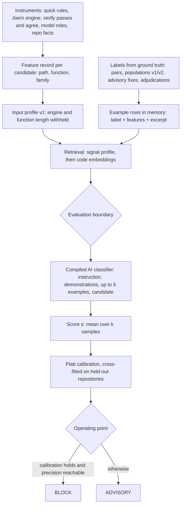
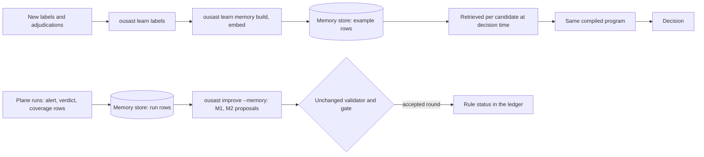

# Memory and detection

This page shows how the system's memory is meant to improve decisions on code it has not seen. It
describes the design of the learned decision engine (`src/openultrasast/learn/`).

The engine is **in development and not adopted**. No scan, pre-push check or report uses it today.
Every user-facing decision is still the deterministic one described in [Scanning](scanning.md) and
[Architecture](architecture.md). The engine's commands and status are on
[Decision engine](decision-engine.md). The store itself is on [Memory](memory.md).

## From instruments to a decision

These decisions are meant for changed code. `learn/features.py` builds feature records in two ways:

- for a whole-repository scan;
- for a base..head delta (`build_for_scan` with `Delta`). This is the same delta `ousast pre-push` checks.

Integration into scan and pre-push is still ahead.

## 1. Instruments produce signals, not verdicts

Each instrument contributes one block to a candidate's feature record (`learn/schema.py`,
`INSTRUMENTS`). The blocks are:

- `language`;
- `quick` (quick rules);
- `engine` (the Joern model layer);
- `facts` (repo facts, such as callers and function span);
- `source`;
- `entry_points`;
- `roles` (model source, sink and sanitizer roles);
- `delta`;
- `verify` and `agree` (the plane's verify passes and their agreement);
- `model_sinks` (the archived stage-1 classifier, `benchmarks/archive/model_sinks.py`). Its logic now
  lives in `plane/tasks/roles.py`.

A candidate is `(path, function, family)` of one repository and pin. At least one instrument must have
emitted a signal of that family there (`learn/features.py`).

An instrument may not run, may have no coverage, or may fail. It then records that state (`none`,
`failed`, `not_applicable`), never a zero. So "silent" and "did not look" stay distinguishable. No
instrument decides alone.

**Why profile v1 withholds the engine and function length.** A leak audit found that both separate the
vulnerable and fixed sides of a pair by construction (`ousast learn audit-leaks`,
`benchmarks/measurements/2026-10-01-decision-engine-leak-audit/`):

- a fix removes a sink;
- a guard lengthens the function.

That holds on the pair corpus, not on unseen code. So `INPUT_PROFILES["v1"]` drops the `engine` block
and `facts.function_lines` from prompts and from the retrieval distance.

## 2. Labels come from ground truth only

`ousast learn labels` (`learn/labels.py`) reads only the sources on a fail-closed allow-list
(`learn/sources.toml`). The sources are `population-v1`, `population-v2`, `dev-php` (reviewed recipe
sites), `pairs`, `advisory-fixes`, `adjudications` and `assumed_benign`. A file the list does not name
is refused before it is opened. The reserved population v3 is excluded unread.

- **Positives** are declared sites and the vulnerable side of a fix.
- **Negatives** are two kinds:
  - the same function on the fixed side, where the fix changed it;
  - recorded `False`/`FP` adjudications.
- A vulnerable-pin candidate matching no site is unlabelled, never negative.
- **Assumed benign** (maintainer decision 2026-09-30) covers ordinary non-security commits of the
  training repositories. Each is at least 90 days from any fix. No later security commit touches the
  same files.
  - They are their own source with weight 0.5, conditional on a signal at the tip and none at the base.
  - They are reported separately, never merged with verified negatives.
- **Plane verdicts are features, not labels.** "Agreed", "rejected" or "disputed" is the output of the
  verify instrument. It enters the record as the `verify` and `agree` blocks. Using it as a label would
  teach the engine to reproduce the plane, mistakes included. So "rejected by the plane" is never a
  negative (`learn/labels.py`: "A plane verdict ... is never a label").

`ousast learn memory build` joins each label with the candidate's feature record and an excerpt of
its function. It stores one `example` row (no rationale) plus the excerpt blob.

## 3. Retrieval of similar labelled cases

`learn/retrieve.py` uses no model. It works in three steps:

1. **Signal profile.** It computes a Gower distance (a distance for mixed-type features) over the
   allow-listed features of the active profile, per instrument block. Missing values are explicit: a
   different state counts as distance 1. The nearest 40 examples of the candidate's family go on. So do
   the nearest 40 of other families.
2. **Code embeddings.** It re-ranks by cosine over the excerpts' embeddings. The embeddings come from
   OpenAI `text-embedding-3-small` through OpenRouter (1,536 dimensions, cached by excerpt hash). The
   formula is `r = 0.5 (1 - D) + 0.5 cos`. Without the candidate's vector, the retrieval uses signals only.
3. **Balance.** It picks six examples:
   - at most half per label;
   - at most 2 per repository group;
   - at most 2 contrast examples from other families.

**The evaluation boundary.** `eligible()` is the only way an example enters a prompt. This holds for
retrieved examples and compiled demonstrations alike. An eligible example is never:

- from the candidate's own repository group;
- from a group the fold evaluates;
- from the held-out source or framework;
- a near-duplicate of the candidate (cosine >= 0.98), outside deployment.

The program repeats the check on the ids it actually rendered, before any call.

## 4. The AI classifier, compiled

The classifier lives in `learn/program.py` and `learn/compile.py`. It is DSPy-style (DSPy is a
framework that compiles prompts from examples) and built in-house.

The prompt has this order:

1. the instruction plus the compiled demonstrations. This prefix is identical for every candidate, so
   the provider's prefix cache hits;
2. the retrieved examples;
3. the candidate's excerpt, signals, roles and family.

The model (`deepseek-flash`) answers `vulnerable`, `not_vulnerable` or `unsure`. It adds a confidence
and a rationale. The rationale must cite a line of the code. The model is sampled `k` times. The score
`s` is the mean over samples. A majority `unsure` can never BLOCK.

Compilation bootstraps demonstrations and searches instructions on a compile split of repository groups.
A pre-registered balanced Brier score scores it (`learn/compile.toml`). The program is stored as
`programs/<id>.json`.

## 5. Calibration and the two operating points

`learn/calibrate.py` applies Platt scaling (a logistic map from score to probability) to `s`. It is
cross-fitted, so no map is checked on the fold it was fitted on.

Calibration **holds** when the slope interval contains 1, the intercept interval contains 0 and ECE
(expected calibration error) <= 0.05.

**BLOCK** is offered only when calibration holds and a fold reaches the required precision. Otherwise
the engine offers **ADVISORY** only.

## The loop: memory improves decisions without retraining

- **Decisions.**
  - The compiled part of the program is its instruction and demonstrations.
  - The examples are retrieved from memory for each candidate.
  - So a new `example` row is eligible for retrieval in the next decision without recompiling. The same
    evaluation boundary applies.
  - `ousast learn curve` measures the metric over memory size on a fixed candidate subset.
- **Rules.** `ousast improve --memory` reads the run rows (alerts, verdicts, coverage). It proposes
  rule-status edits only:
  - shadow a rule that is repeatedly false across repositories;
  - re-enable a shadow rule that keeps hitting agreed declared sites.

  Some rows are dropped first: rows from holdout pairs, the gated manifest's own cases and any
  `--qualify-population`. Every proposal goes through the same validator and gate as any other edit
  (`improve/memory.py`).

## What the first slice measured

Record: `benchmarks/measurements/2026-10-01-decision-engine-injection-slice/record.json` (counts
only). The setup:

- family **injection**;
- memory of 724 static examples from all families;
- input profile v1;
- framework priors off;
- out-of-repository evaluation: compile split never evaluated, outer grouped 5-fold, calibration
  cross-fitted, operating points nested;
- 95% repository-cluster bootstrap intervals.

The slice's spend is on [Token ergonomics](token-ergonomics.md#measured-costs). It was $0.003215 per
candidate at evaluation, k = 5, and its replay cost $0.

| Measure | Value | What it means |
| --- | --- | --- |
| Candidates | 110 in 29 repository groups, 58 positive | the positive share is 58/110 = 0.53 |
| AUC of the score `s` | 0.74 (0.65 - 0.85) | the score ranks a vulnerable candidate above a non-vulnerable one about three times in four: there is ranking signal |
| ADVISORY | recall 0.90 (0.82 - 0.97), precision 0.54 (0.44 - 0.65) | precision is at the positive share (0.53), so at this threshold ADVISORY is **not discriminating**: it flags nearly as indiscriminately as flagging everything would |
| BLOCK | not offered | calibration does not hold (ECE 0.064 > 0.05), and every outer fold reported `precision_unreachable` |

**The engine is not adopted.** A second slice (2026-10-02) evaluated the six evaluable families the
same way ([Decision engine](decision-engine.md#second-slice-six-families-2026-10-02)). The results: pooled AUC 0.77 to 0.96 per family, within-pair AUC 0.72 to 0.93, BLOCK offered for
none. Re-run agreement was below 0.9 for three families.

Still ahead:

- leave-one-source-out and leave-one-framework-out;
- integration into scan and pre-push;
- the one-time check on population v3.
