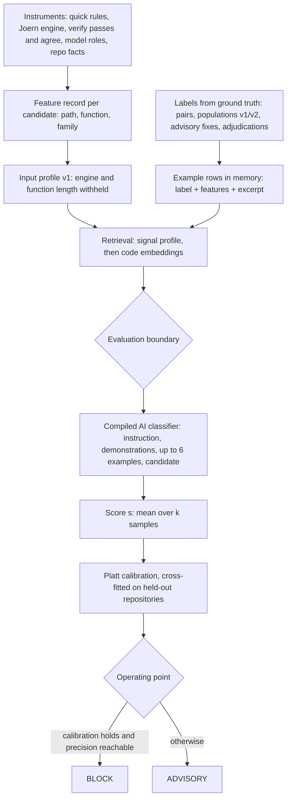
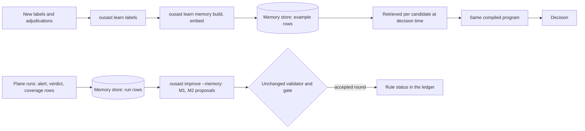

# Memory and detection

How what the system remembers is meant to turn into better decisions on code it has not seen.
This is the design of the learned decision engine (`src/openultrasast/learn/`), which is **in
development and not adopted**: no scan, pre-push check or report uses it today. Every user-facing
decision is still the deterministic one described in [Scanning](scanning.md) and
[Architecture](architecture.md). The engine's commands and status are on
[Decision engine](decision-engine.md); the store itself is on [Memory](memory.md).

## From instruments to a decision

The intended place for these decisions is changed code: `learn/features.py` builds feature records
for a whole-repository scan or for a base..head delta (`build_for_scan` with `Delta`), the same
delta `ousast pre-push` checks. Integration into scan and pre-push is still ahead.

## 1. Instruments produce signals, not verdicts

Each instrument contributes one block to a candidate's feature record (`learn/schema.py`,
`INSTRUMENTS`): `language`, `quick` (quick rules), `engine` (the Joern model layer), `facts` (repo
facts, such as callers and function span), `source`, `entry_points`, `roles` (model source, sink
and sanitizer roles), `delta`, `verify` and `agree` (the plane's verify passes and their
agreement), and `model_sinks`. A candidate is `(path, function, family)` of one repository and pin
where at least one instrument emitted a signal of that family (`learn/features.py`).

An instrument that did not run, had no coverage or failed records that state (`none`, `failed`,
`not_applicable`), never a zero, so "silent" and "did not look" stay distinguishable. None of the
instruments decides alone.

**Why profile v1 withholds the engine and function length.** A leak audit
(`ousast learn audit-leaks`, `benchmarks/measurements/2026-10-01-decision-engine-leak-audit/`)
found that both separate the vulnerable and fixed sides of a pair by construction: a fix removes
a sink, and a guard lengthens the function. That holds on the pair corpus, not on unseen code, so
`INPUT_PROFILES["v1"]` drops the `engine` block and `facts.function_lines` from prompts and from
the retrieval distance.

## 2. Labels come from ground truth only

`ousast learn labels` (`learn/labels.py`) reads only the sources on a fail-closed allow-list
(`learn/sources.toml`): `population-v1`, `population-v2`, `dev-php` (reviewed recipe sites),
`pairs`, `advisory-fixes`, `adjudications` and `assumed_benign`. A file the list does not name is
refused before it is opened; the reserved population v3 is excluded unread.

- **Positives** are declared sites and the vulnerable side of a fix; **negatives** are the same
  function on the fixed side where the fix changed it, and recorded `False`/`FP` adjudications.
  A vulnerable-pin candidate matching no site is unlabelled, never negative.
- **Assumed benign** (maintainer decision 2026-09-30): ordinary non-security commits of the training
  repositories, at least 90 days from any fix, with no later security commit touching the same
  files. They are their own source with weight 0.5, conditional on a signal at the tip and none at
  the base, and reported separately, never merged with verified negatives.
- **Plane verdicts are features, not labels.** "Agreed", "rejected" or "disputed" is the output of
  the verify instrument; it enters the record as the `verify` and `agree` blocks. Using it as a
  label would teach the engine to reproduce the plane, mistakes included, so "rejected by the
  plane" is never a negative (`learn/labels.py`: "A plane verdict ... is never a label").

`ousast learn memory build` joins each label with the candidate's feature record and an excerpt of
its function and stores one `example` row (no rationale) plus the excerpt blob.

## 3. Retrieval of similar labelled cases

`learn/retrieve.py`, no model:

1. **Signal profile.** A Gower distance over the allow-listed features of the active profile,
   per instrument block, with missing values explicit (a different state counts as distance 1).
   The nearest 40 examples of the candidate's family and the nearest 40 of other families go on.
2. **Code embeddings.** A cosine re-rank of the excerpts' embeddings (OpenAI
   `text-embedding-3-small` through OpenRouter, 1,536 dimensions, cached by excerpt hash):
   `r = 0.5 (1 - D) + 0.5 cos`. Without the candidate's vector the retrieval is signals only.
3. **Balance.** Six examples: at most half per label, at most 2 per repository group, at most 2
   contrast examples from other families.

**The evaluation boundary.** `eligible()` is the only way an example enters a prompt, for retrieved
examples and compiled demonstrations alike: never the candidate's own repository group, never a
group the fold evaluates, never the held-out source or framework, and (outside deployment) never
a near-duplicate of the candidate (cosine >= 0.98). The program repeats the check on the ids it
actually rendered before any call.

## 4. The AI classifier, compiled

`learn/program.py` and `learn/compile.py`, DSPy-style and in-house. The prompt is the instruction
plus the compiled demonstrations (a prefix identical for every candidate, so the provider's prefix
cache hits), then the retrieved examples, then the candidate's excerpt, signals, roles and family.
The model (`deepseek-flash`) answers `vulnerable`, `not_vulnerable` or `unsure` with a confidence
and a rationale that must cite a line of the code. It is sampled `k` times; the score `s` is the
mean over samples, and a majority `unsure` can never BLOCK. Compilation bootstraps demonstrations
and searches instructions on a compile split of repository groups, scored by a pre-registered
balanced Brier score (`learn/compile.toml`); the program is stored as `programs/<id>.json`.

## 5. Calibration and the two operating points

`learn/calibrate.py`: Platt scaling of `s`, cross-fitted so that no map is checked on the fold it
was fitted on. Calibration **holds** when the slope interval contains 1, the intercept interval
contains 0 and ECE <= 0.05. **BLOCK** is offered only when calibration holds and a fold reaches the
required precision; otherwise the engine offers **ADVISORY** only.

## The loop: memory improves decisions without retraining

- **Decisions.** The compiled part of the program is its instruction and demonstrations; the
  examples are retrieved from memory for each candidate. A new `example` row is therefore eligible
  for retrieval in the next decision without recompiling the program, subject to the same
  evaluation boundary. `ousast learn curve` measures the metric over memory size on a fixed
  candidate subset.
- **Rules.** `ousast improve --memory` reads the run rows (alerts, verdicts, coverage) and proposes
  rule-status edits only (shadow a rule that is repeatedly false across repositories; re-enable a
  shadow rule that keeps hitting agreed declared sites). Rows from holdout pairs, the gated
  manifest's own cases and any `--qualify-population` are dropped first, and every proposal goes
  through the same validator and gate as any other edit (`improve/memory.py`).

## What the first slice measured

Record: `benchmarks/measurements/2026-10-01-decision-engine-injection-slice/record.json` (counts
only). Family **injection**; memory of 724 static examples from all families; input profile v1;
framework priors off; out-of-repository evaluation (compile split never evaluated, outer grouped
5-fold, calibration cross-fitted, operating points nested); 95% repository-cluster bootstrap
intervals. The slice's spend ($0.003215 per candidate at evaluation, k = 5, and its replay at
$0) is on [Token ergonomics](token-ergonomics.md#measured-costs).

| Measure | Value | What it means |
| --- | --- | --- |
| Candidates | 110 in 29 repository groups, 58 positive | the positive share is 58/110 = 0.53 |
| AUC of the score `s` | 0.74 (0.65 - 0.85) | the score ranks a vulnerable candidate above a non-vulnerable one about three times in four: there is ranking signal |
| ADVISORY | recall 0.90 (0.82 - 0.97), precision 0.54 (0.44 - 0.65) | precision is at the positive share (0.53), so at this threshold ADVISORY is **not discriminating**: it flags nearly as indiscriminately as flagging everything would |
| BLOCK | not offered | calibration does not hold (ECE 0.064 > 0.05), and every outer fold reported `precision_unreachable` |

**The engine is not adopted.** A second slice (2026-10-02) evaluated the six evaluable families
the same way: pooled AUC 0.77 to 0.96 per family, within-pair AUC 0.72 to 0.93, BLOCK offered for
none, re-run agreement below 0.9 for three families
([Decision engine](decision-engine.md#second-slice-six-families-2026-10-02)). Leave-one-source-out
and leave-one-framework-out, integration into scan and pre-push, and the one-time check on
population v3 are still ahead.
