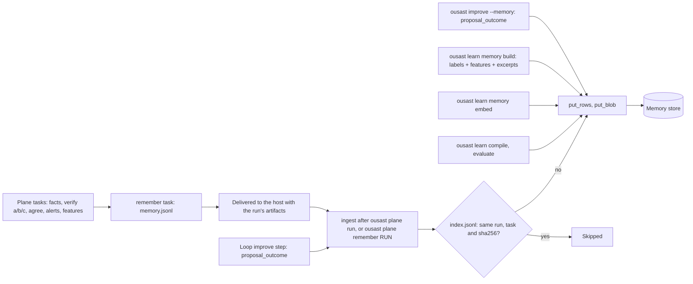
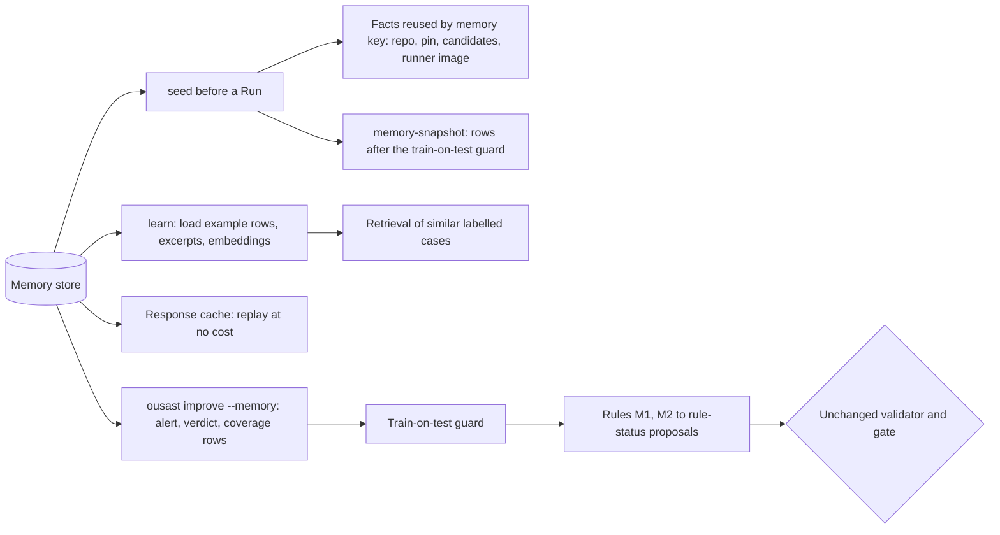

# Memory

One store holds what plane runs and the decision engine learned. It is keyed by repository and pin
(a fixed commit). The code is `src/openultrasast/plane/memory.py`. The same layout serves both backends.
[Memory and detection](memory-and-detection.md) shows how the stored rows feed detection.

## What is stored

```
index.jsonl                                one row per ingested (run, task): sha256 of its rows, row count
facts/<sha256>.json                        repository facts by content (identical facts stored once)
repos/<host>__<owner>__<name>/<pin>.jsonl  the rows of one repository + 40-hex pin, sorted by id
excerpts/<sha256>.txt                      code excerpts, by content
embeddings/<model>/<excerpt sha>.json      an excerpt's embedding vector, per embedding model
responses/<request sha>.json               cached model responses
programs/<program id>.json                 compiled decision-engine programs
```

**Rows.** Every row carries `id`, `kind`, `repo`, `pin`, `run`, `task`, `population`, `split`
and `image` (`ROW_FIELDS`). `id` is the sha256 of (kind, run, task, subject). So a repeated row
replaces itself. The kinds (`KINDS`) and who writes them:

| Kind | Written by | Holds |
| --- | --- | --- |
| `facts` | `remember` task | the facts entry of a case (points at `facts/<sha256>.json`; reused by memory key) |
| `verdict` | `remember` task | per candidate: each verify pass's answer, the final outcome, whether a tie-break ran, cost |
| `unit_cost` | `remember` task | per verify pass and file: usd, calls and token usage |
| `alert` | `remember` task | a quick-scan or engine alert on the vulnerable or fixed pin (loop Runs) |
| `coverage` | `remember` task | per language and pin: whether any rule could have fired there |
| `features` | `remember` task, from the `features` task | one feature record per candidate and family |
| `proposal_outcome` | `ousast improve --memory` (not with `--dry-run`), and the loop's `improve` step | what happened to each memory proposal in a round |
| `example` | `ousast learn memory build` | a labelled case: label + feature record + excerpt sha (no rationale) |
| `experiment` | `ousast learn experiment register` (task `register`) and `run` (task `run`) | a registered manifest's digests and provenance; a run's counts-only summary. Repo `experiments/<id>`, pin the registering commit |
| `arm_outcome` | `ousast learn experiment run` | one decision per (unit, arm, replicate): score, verdict, usd, order |
| `experiment_result` | `ousast learn experiment analyse --record` | the paired estimates, the looks and the adoption verdict (counts and intervals only) |
| `label`, `decision` | reserved for later decision-engine tasks | declared in `KINDS`; not written by the code on main yet |

**Blobs** (`put_blob`) are content-addressed: each has a 64-hex name under a fixed prefix.
Content-addressed means the name is the hash of the content. Who writes each blob:

- Excerpts: `learn memory build` (`learn/examples.py`).
- Embeddings: `learn memory embed` (`learn/embeddings.py`). They are keyed by excerpt sha, so an
  excerpt is embedded once.
- Responses: the program's caller (`learn/program.py`). The key is the sha256 of model, parameters
  digest, messages, temperature, sample and format. So a rerun replays at no cost.
- Compiled programs: `learn compile` (`learn/compile.py`).

## Write path



- `ingest` validates every row first. A malformed file fails before anything is written.
- Rows are merged by `id` into their repository + pin object.
- Every object is written whole, and the index last. So a repeat repairs anything an interrupted
  ingest left behind.
- Each row object carries tags (`TAG_FIELDS`: `repo`, `pin`, `kind`, `family`, `run`,
  `population`, `split`). The tags list the distinct values of its rows. A tag is `*` when the
  values exceed 256 characters.
- The plane's store failures never change a run's result. An ingest can be repeated by hand
  (`cli.py`, `_plane_memory`).

## Read path



- **Seed** (`memory.seed`).
  - A Run task gets stored facts when its `openultrasast.io/memory-key` matches them. It is then marked done.
  - A changed pin, candidate set or runner image finds nothing and recomputes.
  - The loop's `memory-snapshot` is seeded the same way. A sandboxed task cannot read the store.
- **Retrieval** (`learn/retrieve.py`): see
  [Memory and detection](memory-and-detection.md#3-retrieval-of-similar-labelled-cases).
- **`improve --memory`** (`improve/memory.py`). Some rows are dropped before any rule sees them:
  rows from holdout pairs, from the gated manifest's own cases, and from any `--qualify-population`. See
  [Architecture](architecture.md#proposals-from-plane-memory).

## Backends: FileStore and the S3 store

`OUSAST_MEMORY` selects the backend (`open_store`):

| | `FileStore` | `S3Store` (any S3-compatible store; RustFS is the tested server) |
| --- | --- | --- |
| Selected by | `file:///path`, or nothing (default `$OUSAST_RESULTS/plane/memory`) | `s3://<bucket>[/<prefix>]`, or `s3://` for the bucket in `S3_BUCKET` |
| Needs | a local disk; refuses to write below 1 GiB free | the `s3` extra (boto3); `S3_ENDPOINT`, `AWS_ACCESS_KEY_ID`, `AWS_SECRET_ACCESS_KEY` (optional `S3_REGION`, `AWS_SESSION_TOKEN`) from `.env` or the environment |
| Filtered reads | read and filter locally | S3 Select pushdown (`SelectObjectContent` over JSON Lines); kind filter by object tag |
| Object version cited by provenance | the file's content hash | the bucket's object version id |
| Bucket setup | none | done once by an admin, verified at every start ([RustFS setup](rustfs.md)) |

### Verify at startup, no fallback

The S3 store never configures its bucket. It only checks it. An `S3Store` is opened for a bucket and
prefix once per process. Each time, `verify_bucket()` runs these checks. It uses reads plus one small
probe object at `<prefix>/_probe/select.jsonl`.

1. Versioning is `Enabled`. Provenance cites object versions.
2. An enabled lifecycle rule expires `<prefix>/runs/` after a number of days. It uses a plain prefix
   filter. No enabled rule expires the whole store.
3. S3 Select (a server-side query over JSON objects) answers a probe query over JSON Lines.
4. The probe's object tags are readable.

If anything is missing, the store does not start. One `MemoryStoreError` names each problem and the
admin command that fixes it.

There is no local or fetch-and-filter fallback. A filtered read that S3 Select cannot answer raises a
`MemoryStoreError`. It does not return "no rows". [RustFS setup](rustfs.md#what-the-store-verifies-at-startup)
lists the exact messages.

### Queryable fields per kind

RustFS's Select infers an object's JSON schema from its leading rows. This causes two failures
(measured 2026-10-02; `memory.py`, `S3Store._select`):

- A `where` field missing from the leading rows fails with `EvaluatorBindingDoesNotExist`. This
  happens even when a later row has the field.
- A column that is null in the first 1000 rows breaks Select on the whole object.

So the store writes every row with its kind's full set of queryable fields (`QUERY_FIELDS`). It uses
`""` where a field does not apply. It refuses a `where` on an undeclared field. Existing rows are
rewritten once with `ousast plane memory-normalise`.
