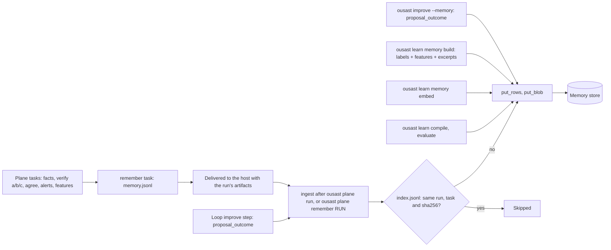
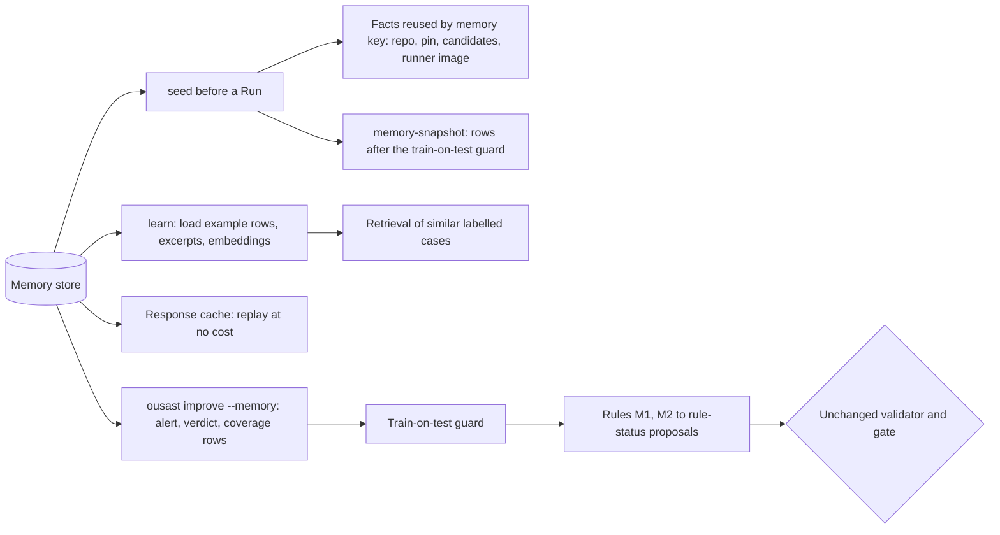

# Memory

One store, keyed by repository and pin, holds what plane runs and the decision engine learned.
The code is `src/openultrasast/plane/memory.py`; the same layout serves both backends.
How the stored rows feed detection is on [Memory and detection](memory-and-detection.md).

## What is stored

```
index.jsonl                                one row per ingested (run, task): sha256 of its rows, row count
facts/<sha256>.json                        repository facts by content (identical facts stored once)
repos/<host>__<owner>__<name>/<pin>.jsonl  the rows of one repository + 40-hex pin, sorted by id
excerpts/<sha256>.txt                      code excerpts, by content
embeddings/<model>/<excerpt sha>.json      an excerpt's embedding vector, per embedding model
responses/<request sha>.json               cached model responses
programs/<program id>.json                 compiled decision-engine programs
```

**Rows.** Every row carries `id`, `kind`, `repo`, `pin`, `run`, `task`, `population`, `split`
and `image` (`ROW_FIELDS`); `id` is the sha256 of (kind, run, task, subject), so a repeated row
replaces itself. The kinds (`KINDS`) and who writes them:

| Kind | Written by | Holds |
| --- | --- | --- |
| `facts` | `remember` task | the facts entry of a case (points at `facts/<sha256>.json`; reused by memory key) |
| `verdict` | `remember` task | per candidate: each verify pass's answer, the final outcome, whether a tie-break ran, cost |
| `unit_cost` | `remember` task | per verify pass and file: usd, calls and token usage |
| `alert` | `remember` task | a quick-scan or engine alert on the vulnerable or fixed pin (loop Runs) |
| `coverage` | `remember` task | per language and pin: whether any rule could have fired there |
| `features` | `remember` task, from the `features` task | one feature record per candidate and family |
| `proposal_outcome` | `ousast improve --memory` (not with `--dry-run`), and the loop's `improve` step | what happened to each memory proposal in a round |
| `example` | `ousast learn memory build` | a labelled case: label + feature record + excerpt sha (no rationale) |
| `label`, `decision`, `experiment`, `arm_outcome`, `experiment_result` | reserved for later decision-engine tasks | declared in `KINDS`; not written by the code on main yet |

**Blobs** (`put_blob`) are content-addressed: a 64-hex name under a fixed prefix. Excerpts are
written by `learn memory build` (`learn/examples.py`), embeddings by `learn memory embed`
(`learn/embeddings.py`, keyed by excerpt sha so an excerpt is embedded once), responses by the
program's caller (`learn/program.py`, keyed by the sha256 of model, parameters digest, messages,
temperature, sample and format, so a rerun replays at no cost), and compiled programs by
`learn compile` (`learn/compile.py`).

## Write path



- `ingest` validates every row first: a malformed file fails before anything is written.
- Rows are merged into their repository + pin object by `id`. Every object is written whole and the
  index last, so an interrupted ingest leaves nothing a repeat would not repair.
- Each row object carries tags (`TAG_FIELDS`: `repo`, `pin`, `kind`, `family`, `run`,
  `population`, `split`) listing the distinct values of its rows (`*` when they exceed 256
  characters).
- The plane's store failures never change a run's result: an ingest can be repeated by hand
  (`cli.py`, `_plane_memory`).

## Read path



- **Seed** (`memory.seed`): a Run task whose `openultrasast.io/memory-key` matches stored facts gets
  them and is marked done; a changed pin, candidate set or runner image finds nothing and
  recomputes. The loop's `memory-snapshot` is seeded the same way, because a sandboxed task cannot
  read the store.
- **Retrieval** (`learn/retrieve.py`): see
  [Memory and detection](memory-and-detection.md#3-retrieval-of-similar-labelled-cases).
- **`improve --memory`** (`improve/memory.py`): rows from holdout pairs, from the gated manifest's
  own cases and from any `--qualify-population` are dropped before any rule sees them. See
  [Architecture](architecture.md#proposals-from-plane-memory).

## Backends: FileStore and the S3 store

`OUSAST_MEMORY` selects the backend (`open_store`):

| | `FileStore` | `MinioStore` (S3: RustFS or MinIO) |
| --- | --- | --- |
| Selected by | `file:///path`, or nothing (default `$OUSAST_RESULTS/plane/memory`) | `minio://<bucket>[/<prefix>]` |
| Needs | a local disk; refuses to write below 1 GiB free | the `minio` extra, `MINIO_*` settings from `.env` or the environment |
| Filtered reads | read and filter locally | S3 Select pushdown (`SelectObjectContent` over JSON Lines); kind filter by object tag |
| Object version cited by provenance | the file's content hash | the bucket's object version id |
| Bucket setup | none | done once by an admin, verified at every start ([RustFS setup](rustfs.md)) |

### Verify at startup, no fallback

The S3 store never configures its bucket. Each time a `MinioStore` is opened for a bucket and
prefix (once per process), `verify_bucket()` checks, using reads plus one small probe object at
`<prefix>/_probe/select.jsonl`:

1. versioning is `Enabled` (provenance cites object versions);
2. an enabled lifecycle rule expires `<prefix>/runs/` after a number of days, as a plain prefix
   filter, and no enabled rule expires the whole store;
3. S3 Select answers a probe query over JSON Lines;
4. the probe's object tags are readable.

Anything missing is named, with the admin command that fixes it, in one `MemoryStoreError`, and
the store does not start. There is no local or fetch-and-filter fallback: a filtered read that
S3 Select cannot answer raises a `MemoryStoreError` instead of returning "no rows". The exact
messages are listed on [RustFS setup](rustfs.md#what-the-store-verifies-at-startup).

### Queryable fields per kind (in progress)

RustFS's Select infers an object's JSON schema from its leading rows, so a `where` field missing
there fails with `EvaluatorBindingDoesNotExist` even when a later row has it (measured
2026-10-02; `memory.py`, `MinioStore._select`). On main today the store turns that failure into a
`MemoryStoreError` naming the field, never into an empty answer. A fixed set of queryable fields
per row kind, so that every filtered field is present in every row of its kind, is in progress
and not on main as of this page.
