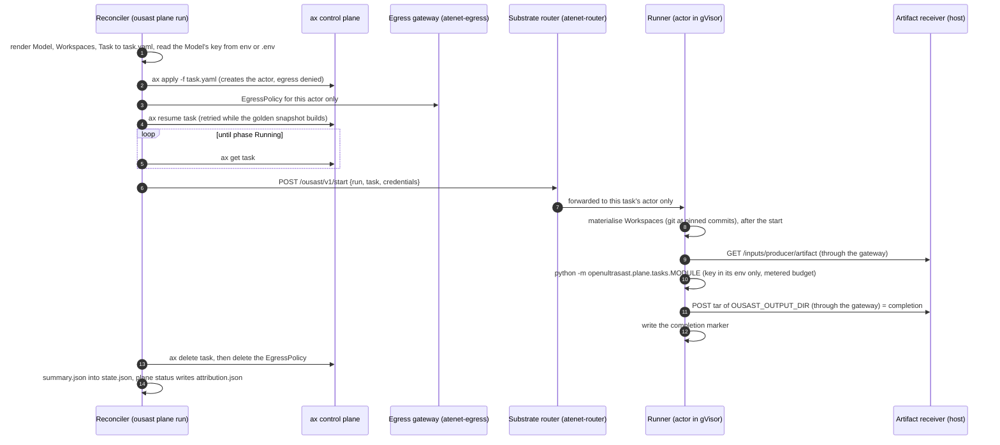
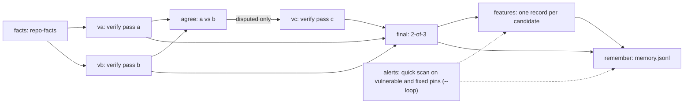
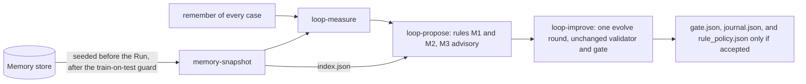

# The plane on ax

Model-driven work over whole repositories runs on a separate agentic plane. The plane has these parts:

- A **Run** (`plane/runs/*.yaml`, kind `openultrasast.io/v1alpha1 Run`) is a DAG (a graph of steps
  with no cycles).
- Each step is an ax **Task** (`plane/tasks/`).
- A Task binds its Workspaces (`plane/workspaces/`).
- A Task binds at most one ax **Model** (`plane/models/`). `deepseek-flash` serves chat.
  `openrouter-embedding` serves embeddings.
- A Task carries its own `budget: {usd, calls}`.

ax is the only executor. It is google/ax, Google's controller that runs agent tasks, over Agent Substrate (its
sandboxed actor runtime). It runs in a single-node kind cluster (Kubernetes in Docker) on the maintainer's host.
There is no local subprocess path.

Where to read more:

- Bring-up and the host's lessons are in [ax on this host](ops/ax/README.md).
- [Deployment](deployment.md) shows where each part runs today. The reconciler and the receiver run on the host.
  The tasks run in gVisor (a sandboxing kernel) on Agent Substrate. It also covers what a separate Kubernetes
  cluster would take (planned).
- This page draws the flow.

Sources: `src/openultrasast/plane/reconciler.py`, `router.py`, `egress.py`, `runner.py`,
`generate.py`, `memory.py`, and `src/openultrasast/plane/tasks/`.

## One task, end to end

`ousast plane run RUN.yaml` (the reconciler) does this for every ready task. `--workers` bounds the
tasks in flight. A rerun skips tasks already done.

What each step guarantees:

- **Credentials** (`router.py`, `runner.py`).
  - The reconciler reads the variable that the Model's `secretKey.key` names.
  - It reads it from the operator's environment or `.env`. `.env` never overrides an exported variable.
  - The key exists only in the start request.
  - The runner keeps it in memory and passes it to the command's environment.
  - The runner redacts it from echoed stderr and never writes it.
- **Egress** (`egress.py`). Egress means outbound network traffic.
  - Each actor gets one EgressPolicy. It denies by default and names hostnames only.
  - It allows plain HTTP to the artifact receiver.
  - It allows TLS passthrough to the source hosts of the bound Workspaces.
  - It allows TLS passthrough to the hosts the bound Model declares (`openultrasast.io/egress-hosts`).
  - The reconciler writes it between `ax apply` and the resume. It is deleted with the actor.
- **Inputs** (`reconciler.py`).
  - Artifacts that other tasks produced are never rendered into the manifest.
  - The runner fetches them from the receiver after the start.
  - The receiver serves a running task its declared inputs only.
- **Completion** (`runner.py`).
  - ax has no Completed phase. The runner's delivery of the output tar is the task's completion.
  - A completion marker stops a resumed actor from repeating billed work.
  - If the marker says the delivery failed, a later boot retries only the delivery.
- **Budgets** (`plane/budget.py`).
  - The metered client refuses the next call once a task reaches its `usd` or `calls` ceiling.
  - The task then ends `unfinished`. It resumes on a rerun with a larger budget.
  - Model-free tasks run with `{usd: 0, calls: 0}`, so a stray call fails loudly.
- **Attribution.**
  - `ousast plane status RUN` prints these per task: status, `calls`, `prompt`, `cache_hit` and
    `output` tokens, and `usd`. It reads them from the tasks' `summary.json`.
  - It writes `attribution.json` in the run directory (`$OUSAST_RESULTS/plane/RUN/`, default
    `~/ousast-results/plane/`).

!!! note "The golden snapshot"
    Agent Substrate boots every new actor template once as a *golden* actor and snapshots it. That boot
    uses the same image, Task and environment. Inside the sandbox, nothing tells that boot from the real one.

    So the runner's command never starts by itself. It waits for the start request. The reconciler sends
    that request through `atenet-router` to the task's actor, never to the golden one.

    Workspaces are prepared only after the start. So the golden boot touches no network. A started actor
    already runs under its egress policy. A clone at boot once failed on the live cluster while the actor
    was being restored (2026-09-29; `runner.py`, `_run_once`).

    The first resume of a new image can time out while the snapshot is built. So the reconciler retries it
    for up to `OUSAST_RESUME_TIMEOUT` seconds (900).

## The Runs: validation and loop

`ousast plane workspaces POPULATION --validation-set ...` (`generate.py`) writes one chain per case.
`--loop` adds the `alerts` step per case and the loop's singleton steps. Every step is model-free
except the verify passes (and `roles` in harvest Runs).

### Per case

### The loop (with `--loop`)

- **Before the Run**, `ousast plane run` seeds from the store (`memory.seed`).
  - Each task has an `openultrasast.io/memory-key`: repository, pin, candidates digest and runner image digest.
  - If the store has facts for that key, the task gets them and is marked done.
  - The sandboxed `memory-snapshot` task gets the store's rows after the guard.
- **After the Run**, it ingests every delivered `memory.jsonl`. `ousast plane remember RUN` repeats
  this by hand. See [Memory](memory.md).
- [Architecture](architecture.md#proposals-from-plane-memory) describes the loop's rules and its guard.
  Adopting an accepted ledger stays a maintainer commit (`src/openultrasast/plane/tasks/loop.py`).
- `ousast plane harvest` writes the decision engine's harvest Runs (verify a/b with agree, and
  model `roles`).
- `ousast plane alerts-engine` produces a Run's `alerts` from the Joern engine image on the host. It
  covers PHP and other languages that quick mode does not cover.

## Where this runs in production

ax is a Kubernetes application over Agent Substrate. Every Task runs the one runner image as an actor. Each actor
occupies a whole worker. This code base targets two profiles:

- `kind` on a laptop (today).
- `k3s` in production (planned). There the same CLI submits Runs remotely, and the tasks deliver to the S3 store.

[Production topology: ax on a Kubernetes cluster](deployment.md#production-topology-ax-on-a-kubernetes-cluster)
draws it and sizes the pre-push hook at scale.

## Tasks

| Task | Model | Does |
| --- | --- | --- |
| `repo-facts` | none | functions per product file, and each candidate's call sites in other files |
| `verify` (passes a, b, c) | `deepseek-flash` | batched tool hunt per file over the candidates, with their known callers |
| `agree` | none | a and b agreed or disputed; after pass c on the disputed, 2-of-3 (the step `final`) |
| `features` | none | one feature record per candidate for the decision engine |
| `remember` | none | the case's artifacts as memory rows |
| `alerts` | none | the quick scan on the vulnerable and fixed pins (loop Runs) |
| `loop` | none | the steps `snapshot`, `measure`, `propose`, `improve` |
| `roles` | `deepseek-flash` | per-repository source, sink and sanitizer roles without a vocabulary |

Source: [ax on this host](ops/ax/README.md#tasks).
