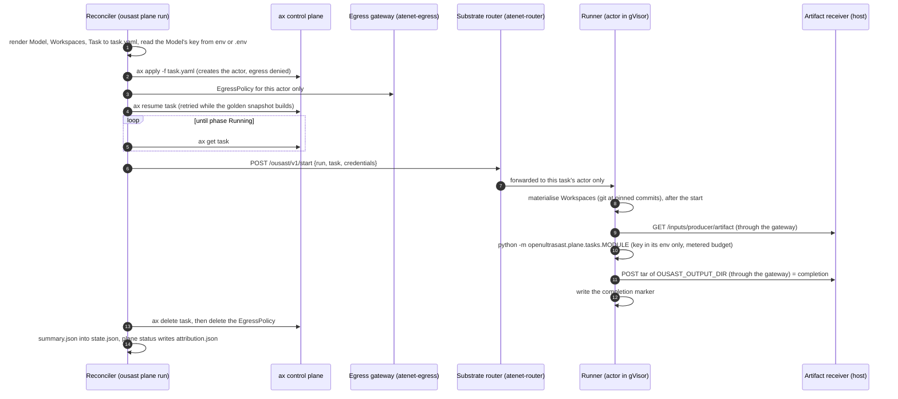
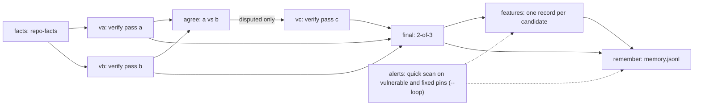
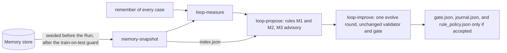

# The plane on ax

Model-driven work over whole repositories runs on a separate agentic plane: a **Run**
(`plane/runs/*.yaml`, kind `openultrasast.io/v1alpha1 Run`) is a DAG of steps, and each step is
an ax **Task** (`plane/tasks/`) that binds its Workspaces (`plane/workspaces/`), at most one ax
**Model** (`plane/models/`: `deepseek-flash` for chat, `openrouter-embedding` for embeddings) and
its own `budget: {usd, calls}`. ax (google/ax over Agent Substrate, in a single-node kind cluster
on the maintainer's host) is the only executor; there is no local subprocess path. Bring-up and
the host's lessons are in [ax on this host](ops/ax/README.md); where each part runs today (the
reconciler and the receiver on the host, the tasks in gVisor on Agent Substrate) and what a
separate Kubernetes cluster would take (planned) are on [Deployment](deployment.md); this page
draws the flow.

Sources: `src/openultrasast/plane/reconciler.py`, `router.py`, `egress.py`, `runner.py`,
`generate.py`, `memory.py`, and `src/openultrasast/plane/tasks/`.

## One task, end to end

`ousast plane run RUN.yaml` (the reconciler) does this for every ready task; `--workers` bounds
the tasks in flight, and a rerun skips tasks already done.

What each step guarantees:

- **Credentials** (`router.py`, `runner.py`). The reconciler reads the variable the Model's
  `secretKey.key` names from the operator's environment or `.env` (which never overrides an
  exported variable). The key exists only in the start request; the runner keeps it in memory,
  passes it to the command's environment, redacts it from echoed stderr and never writes it.
- **Egress** (`egress.py`). One EgressPolicy per actor, deny by default, hostnames only: plain
  HTTP to the artifact receiver, TLS passthrough to the source hosts of the bound Workspaces and
  to the hosts the bound Model declares (`openultrasast.io/egress-hosts`). It is written between
  `ax apply` and the resume, and deleted with the actor.
- **Inputs** (`reconciler.py`). Artifacts other tasks produced are never rendered into the
  manifest; the runner fetches them from the receiver after the start, and the receiver serves a
  running task its declared inputs only.
- **Completion** (`runner.py`). ax has no Completed phase: the runner's delivery of the output tar
  is the task's completion. A completion marker stops a resumed actor from repeating billed work;
  when the marker says the delivery failed, a later boot retries the delivery alone.
- **Budgets** (`plane/budget.py`). The metered client refuses the next call once a task's `usd` or
  `calls` ceiling is reached; the task ends `unfinished` and resumes on a rerun with a larger
  budget. Model-free tasks run with `{usd: 0, calls: 0}`, so a stray call fails loudly.
- **Attribution.** `ousast plane status RUN` prints per task its status, `calls`, `prompt`,
  `cache_hit` and `output` tokens and `usd` from the tasks' `summary.json`, and writes
  `attribution.json` in the run directory (`$OUSAST_RESULTS/plane/RUN/`, default
  `~/ousast-results/plane/`).

!!! note "The golden snapshot"
    Agent Substrate boots every new actor template once as a *golden* actor to snapshot it, with
    the same image, Task and environment, and inside the sandbox nothing tells that boot from the
    real one. So the runner's command never starts by itself: it waits for the start request,
    which the reconciler sends through `atenet-router` to the task's actor, never to the golden
    one. Workspaces are prepared only after the start, so the golden boot touches no network and a
    started actor already runs under its egress policy (a clone at boot failed on the live cluster
    while the actor was being restored, 2026-09-29; `runner.py`, `_run_once`). The first resume of
    a new image can time out while the snapshot is built, which is why the reconciler retries it
    for up to `OUSAST_RESUME_TIMEOUT` seconds (900).

## The Runs: validation and loop

`ousast plane workspaces POPULATION --validation-set ...` (`generate.py`) writes one chain per
case; `--loop` adds the `alerts` step per case and the loop's singleton steps. Every step except
the verify passes (and `roles` in harvest Runs) is model-free.

### Per case

### The loop (with `--loop`)

- **Before the Run** `ousast plane run` seeds from the store (`memory.seed`): a task whose
  `openultrasast.io/memory-key` (repository, pin, candidates digest, runner image digest) has
  stored facts gets them and is marked done, and the sandboxed `memory-snapshot` task gets the
  store's rows after the guard. **After the Run** it ingests every delivered `memory.jsonl`
  (`ousast plane remember RUN` repeats this by hand). See [Memory](memory.md).
- The loop's rules and its guard are described in
  [Architecture](architecture.md#proposals-from-plane-memory). Adopting an accepted ledger stays a
  maintainer commit (`src/openultrasast/plane/tasks/loop.py`).
- `ousast plane harvest` writes the decision engine's harvest Runs (verify a/b with agree, and
  model `roles`); `ousast plane alerts-engine` produces a Run's `alerts` from the Joern engine
  image on the host for PHP and other languages quick mode does not cover.

## Tasks

| Task | Model | Does |
| --- | --- | --- |
| `repo-facts` | none | functions per product file, and each candidate's call sites in other files |
| `verify` (passes a, b, c) | `deepseek-flash` | batched tool hunt per file over the candidates, with their known callers |
| `agree` | none | a and b agreed or disputed; after pass c on the disputed, 2-of-3 (the step `final`) |
| `features` | none | one feature record per candidate for the decision engine |
| `remember` | none | the case's artifacts as memory rows |
| `alerts` | none | the quick scan on the vulnerable and fixed pins (loop Runs) |
| `loop` | none | the steps `snapshot`, `measure`, `propose`, `improve` |
| `roles` | `deepseek-flash` | per-repository source, sink and sanitizer roles without a vocabulary |

Source: [ax on this host](ops/ax/README.md#tasks).
