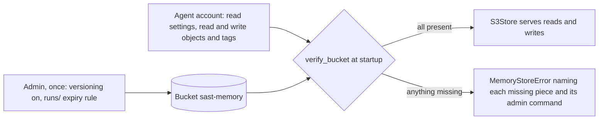

# RustFS setup for the memory store

The plane's memory store can live in an S3-compatible bucket: `OUSAST_MEMORY=s3://sast-memory`
selects `S3Store` (`src/openultrasast/plane/memory.py`), which talks to the server through boto3.
Any S3-compatible store with bucket versioning, lifecycle rules, object tags and S3 Select works;
RustFS is the server the contract tests run against. The maintainer's server is RustFS at
`files.because-security.com`, bucket `sast-memory`, store at the bucket root. What the store keeps
there is described on [Memory](memory.md).

**The store never configures its bucket.** An admin sets the bucket up once with admin
credentials. The agent account the store runs as can read the bucket's settings but not change
them, and reads and writes objects freely. Every time the store opens, it checks the setup and
refuses to start if anything is missing.



## One-time admin steps

Run these with **admin** credentials (not the agent's). Both use the AWS CLI against the RustFS
endpoint.

**1. Turn versioning on.** Provenance cites object version ids.

```bash
aws s3api put-bucket-versioning \
    --endpoint-url https://files.because-security.com \
    --bucket sast-memory \
    --versioning-configuration Status=Enabled
```

**2. Expire raw run outputs under `runs/` after 30 days.** Everything else (`repos/`, `facts/`,
`index.jsonl` and the blobs) is kept, so the rule must be a plain prefix filter on `runs/`.

```bash
aws s3api put-bucket-lifecycle-configuration \
    --endpoint-url https://files.because-security.com \
    --bucket sast-memory \
    --lifecycle-configuration '{"Rules":[{"ID":"ousast-runs-expiry","Status":"Enabled","Filter":{"Prefix":"runs/"},"Expiration":{"Days":30}}]}'
```

`put-bucket-lifecycle-configuration` **replaces every rule on the bucket**. If the bucket already
has rules, merge this one into them first. The rule id `ousast-runs-expiry` and the 30 days are the
store's defaults (`RUNS_RULE_ID`, `RUNS_EXPIRE_DAYS`); the store accepts any enabled, untagged
prefix rule on `runs/` with a number of days.

To read the result back:

```bash
aws s3api get-bucket-versioning --endpoint-url https://files.because-security.com --bucket sast-memory
aws s3api get-bucket-lifecycle-configuration --endpoint-url https://files.because-security.com --bucket sast-memory
```

## The agent policy

Attach this policy to the agent account (the account whose keys go into `.env`). It is the
complete policy: nothing else is needed, and it grants no `Put*` on versioning or lifecycle.

```json
{
  "Version": "2012-10-17",
  "Statement": [
    {
      "Sid": "BucketSettingsReadOnly",
      "Effect": "Allow",
      "Action": [
        "s3:ListBucket",
        "s3:ListBucketVersions",
        "s3:GetBucketLocation",
        "s3:GetBucketVersioning",
        "s3:GetLifecycleConfiguration"
      ],
      "Resource": ["arn:aws:s3:::sast-memory"]
    },
    {
      "Sid": "ObjectsReadWrite",
      "Effect": "Allow",
      "Action": [
        "s3:GetObject",
        "s3:GetObjectVersion",
        "s3:PutObject",
        "s3:DeleteObject",
        "s3:DeleteObjectVersion",
        "s3:GetObjectTagging",
        "s3:PutObjectTagging",
        "s3:GetObjectVersionTagging"
      ],
      "Resource": ["arn:aws:s3:::sast-memory/*"]
    }
  ]
}
```

| Statement | Resource | In one line |
| --- | --- | --- |
| `BucketSettingsReadOnly` | `arn:aws:s3:::sast-memory` | The agent can list the bucket and its versions and *read* its location, versioning and lifecycle settings, which is what the startup check needs; it cannot change them. |
| `ObjectsReadWrite` | `arn:aws:s3:::sast-memory/*` | The agent reads, writes and deletes objects and their versions and reads and writes object tags; this covers row objects, blobs, the index, the Select probe, and the `kind` tag the store filters by. |

So the agent writes objects freely but cannot change bucket settings: turning versioning off or
removing the expiry rule needs the admin.

## The `.env` settings

The store reads its endpoint and credentials from `.env` in the working directory or from the
environment (`s3_settings`), never from a manifest, and never prints them. The names are the ones
the AWS SDKs and CLI use for credentials, so one `.env` serves both the store and `aws s3api`.

| Variable | Value for this server | Notes |
| --- | --- | --- |
| `OUSAST_MEMORY` | `s3://sast-memory` | `s3://<bucket>[/<prefix>]`; `s3://` alone uses `S3_BUCKET`; unset means the local `FileStore` |
| `S3_ENDPOINT` | `https://files.because-security.com` | the full URL, scheme included (`https://host[:port]`); required |
| `AWS_ACCESS_KEY_ID` | the agent account's access key | required |
| `AWS_SECRET_ACCESS_KEY` | the agent account's secret key | required |
| `AWS_SESSION_TOKEN` | optional | for temporary credentials |
| `S3_REGION` | optional (`us-east-1` when unset) | the SigV4 signing region; spares a GetBucketLocation call |
| `S3_BUCKET` | `sast-memory` | the bucket `s3://` names when the URL has none; also the real-server tests' default bucket |

The client signs with SigV4 and uses path-style addressing (`https://host/bucket/key`), which
RustFS needs. The SDK's own checksum trailers are off, because not every S3-compatible server
accepts them.

- **Never commit `.env`.** It is gitignored (`.gitignore`: `.env`, `.env.*`, except
  `.env.example`). `.env.example` lists these names with empty values.
- **`.env` never overrides a variable already exported in your shell** (`config.load_dotenv`).
  A stale `export AWS_SECRET_ACCESS_KEY=...` in your profile silently wins over the file; `unset`
  it when a change in `.env` seems to have no effect.
- The store needs the `s3` extra (`uv sync --extra s3`, which installs boto3); without it opening
  the store fails with `OUSAST_MEMORY=s3://... needs boto3: install openultrasast[s3]`. A missing
  variable fails with `OUSAST_MEMORY=s3://... needs S3_ENDPOINT, AWS_ACCESS_KEY_ID,
  AWS_SECRET_ACCESS_KEY in .env or the environment` (naming only the missing ones); an endpoint
  without a scheme fails with `S3_ENDPOINT must be a URL with a scheme (https://host[:port])`.

## What the store verifies at startup

`S3Store.verify_bucket()` runs once per process for each bucket and prefix. It reads the
versioning status and the lifecycle rules, writes a two-line probe object at
`_probe/select.jsonl` (under the prefix, if any), queries it with S3 Select and reads its tags.
Every missing piece is collected into one error:

```text
memory s3://sast-memory: the bucket is not set up for the store. The store never configures its bucket (an admin sets it once, the store verifies); missing:
  - <one line per missing piece>
```

The lines, exactly as the code writes them for this bucket at the root (`<failure>` is the
server's error code and the first 200 characters of its message):

| Check | Refusal line |
| --- | --- |
| versioning unreadable | `versioning cannot be read (<failure>): the agent needs s3:GetBucketVersioning on arn:aws:s3:::sast-memory, and versioning must be Enabled` |
| versioning off | `versioning is Off, it must be Enabled (provenance cites object versions). Admin: aws s3api put-bucket-versioning --endpoint-url "$S3_ENDPOINT" --bucket sast-memory --versioning-configuration Status=Enabled` (the actual status, e.g. `Suspended`, replaces `Off` when set) |
| lifecycle unreadable | `the lifecycle configuration cannot be read (<failure>): the agent needs s3:GetLifecycleConfiguration on arn:aws:s3:::sast-memory, and a rule must expire runs/` |
| a rule expires everything | `lifecycle rule(s) <rule ids> expire the whole store (repos/, facts/ and the index would be deleted); limit them to runs/` |
| no `runs/` rule | `no enabled lifecycle rule expires runs/ after a number of days. Admin (merged with any rules the bucket already has): aws s3api put-bucket-lifecycle-configuration --endpoint-url "$S3_ENDPOINT" --bucket sast-memory --lifecycle-configuration '{"Rules":[{"ID":"ousast-runs-expiry","Status":"Enabled","Filter":{"Prefix":"runs/"},"Expiration":{"Days":30}}]}'` |
| tags unreadable | `object tags cannot be read on _probe/select.jsonl (<failure>): the store filters row objects by their kind tag, so the agent needs s3:GetObjectTagging on arn:aws:s3:::sast-memory/*` |
| S3 Select missing | `S3 Select (SelectObjectContent over JSON Lines) does not answer on _probe/select.jsonl (<failure>). The store requires it and has no local fallback: use a server with S3 Select (RustFS has it; not every S3-compatible server does) and let the agent s3:PutObject and s3:GetObject` |

The admin commands inside the messages use `--endpoint-url "$S3_ENDPOINT"`, which is the full
URL from `.env`, so they run as written once `.env` is exported.

There is **no fallback**: the store does not start in a degraded mode, does not drop to a local
store, and does not fetch and filter objects itself.

## The RustFS Select limit and the fixed-schema rule

RustFS's S3 Select infers an object's JSON schema from its leading rows. A `where` field that is
absent from those rows is unbound, even if a later row has it: the query fails with
`EvaluatorBindingDoesNotExist` instead of matching (measured 2026-10-02 with the field first
present at row 5000). The store does not read that as "no rows", since that answer could silently
drop matches; it raises:

```text
memory s3://sast-memory: S3 Select on <key> failed (EvaluatorBindingDoesNotExist: ...) (a field of [<fields>] is absent from the object's leading rows, which the server reads as its schema); the store has no local fallback
```

The rule that follows: a field the store filters on is present in every row of its kind from
the first row on, as `""` where it does not apply; each row kind has a fixed set of queryable
fields, enforced at write time (see [Memory](memory.md#queryable-fields-per-kind)).

## Checks against the real server

The contract tests that talk to a real server run only with `OUSAST_MEMORY_TEST_S3=1` (bucket
`OUSAST_MEMORY_TEST_BUCKET`, else `S3_BUCKET`). They verify the bucket at its root, write only
under a fresh `contract-<id>/` prefix, and remove every version and delete marker under it
afterwards; they never configure the bucket. More on the host setup:
[ax on this host](ops/ax/README.md).
