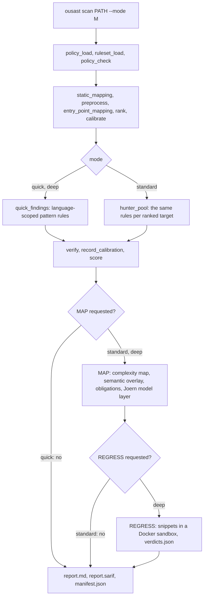
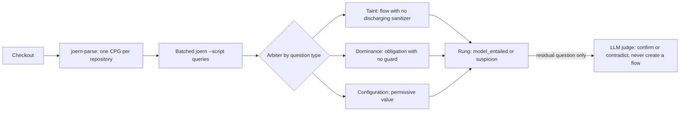
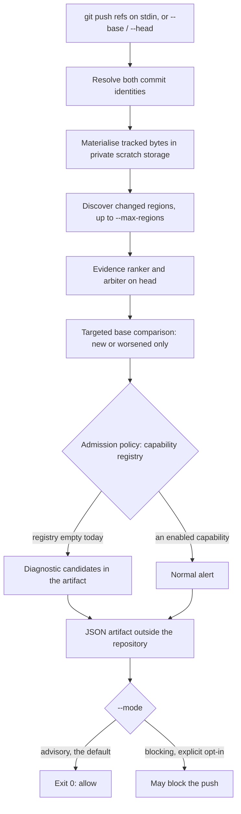

# Scanning

This page shows the scan flows.

- `ousast scan PATH --mode quick|standard|deep` scans a checkout.
- `ousast pre-push` checks only what a push changes, or what an explicit `--base`/`--head` pair
  changes.

The stage-by-stage pipeline, the evidence ladder and the score are in
[Architecture](architecture.md).

## The three scan modes

The stages each mode requests are listed in `MODE_STAGES` in `src/openultrasast/stages.py`:

- `quick` runs STATIC.
- `standard` adds MAP.
- `deep` adds REGRESS.

| Mode | Adds | Needs | Without it |
| --- | --- | --- | --- |
| `quick` | pattern rules, entry-point hints, ranking, verification, score | nothing | - |
| `standard` | MAP: complexity map, semantic overlay, authorization obligations, the Joern model layer; `fusion` (deterministic) | Joern; a provider key for the residual LLM question | `cpg_unavailable` degradation; the LLM's questions are skipped and only the graph's entailed findings are reported |
| `deep` | REGRESS: promoted candidates loaded in a sandbox with no network, read-only source, non-root | a working `docker` | `sandbox_unavailable` degradation |

Sources: `README.md` (scan modes), `src/openultrasast/cli.py` (`run_stage` calls),
[Architecture](architecture.md#the-scan-pipeline).

## Quick rules per language

Each rule runs only against files of its language. The bundled ruleset lives in
`src/openultrasast/ruleset/<language>/rules.toml`.

| Language | Classes (CWE) |
| --- | --- |
| C / C++ | stack buffer overflow (121), format string (134), command injection (78) |
| Python | command injection (78), code injection (95), SSTI (94), deserialization (502), SQLi (89), path traversal (22), SSRF (918), weak hash (327), insecure default (489) |
| JavaScript / TS | command injection (78), code injection (95), XSS (79), SQLi (89), path traversal (22), SSRF (918), weak hash (327), deserialization (502) |
| Java + Groovy templates | command injection (78), SQLi (89), weak hash (327), deserialization (502), unescaped template XSS (79) |
| PHP | SQLi (89), command injection (78), file inclusion (98), path (22), open redirect (601), SSRF (918); code eval (95), unserialize (502) and echo XSS (79) ship as `shadow` rules |

The detection gate (`python -m openultrasast.gate`) enforces two limits per language on the
bundled corpora in `benchmarks/manifests/`: at least 90% recall and under 10% false positives.

- Those corpora are cheat-sheet fixtures. They catch regressions. They do not estimate recall on
  real code.
- **PHP is not in the gate**. Its numbers are in-sample development numbers
  (`benchmarks/measurements/2026-09-30-php-quick-rules/measurement.json`).

See `README.md` for the gate's per-language output.

## The Joern engine

The model layer (`src/openultrasast/model/`, `src/openultrasast/cpg/`) is the core of `standard`.
It builds one code property graph per scan with Joern. A code property graph is a graph of the
program's syntax, control flow and data flow. The build runs `joern-parse`, then batched
`joern --script` queries from `cpg/queries/*.sc`.

The layer sends each question to the arbiter (the decider) of its type:

- **taint**: a flow from source to sink with no discharging sanitizer;
- **dominance**: does a guard govern the obligated operation;
- **configuration**: constant abstraction over a value.

Taint facts ship for C, Java, JavaScript, PHP and Python
(`src/openultrasast/ruleset/semantic/*.toml`).

The Docker image ships Joern and `php-cli`. The PHP frontend needs `php-cli`. Without Joern, the
layer records `cpg_unavailable`; the rest of the scan is unchanged.

- Engine installation and the Joern features used: [Engine and pre-push](ops/README.md).
- How the graph is built, queried and refined, with the records behind each refinement:
  [Detection techniques](detection-techniques.md).

## Framework priors

Some rule and taint-fact entries know a framework or library. They carry a `framework` or
`library` tag. The tag names a row of `src/openultrasast/ruleset/frameworks.toml` (for example
`wordpress`, `flask`, `django`, `express`, `spring`).

The loaders take `priors=` with one of three values:

- `"all"`: the default and today's behaviour;
- `"off"`: language-level knowledge only;
- a set of ids.

So the contribution of framework knowledge can be measured and switched off. The decision
engine's first slice ran with priors off
([Decision engine](decision-engine.md#first-measured-slice-2026-10-01)).

## Pre-push: the delta check (experimental)

`ousast pre-push` analyses the commits a `git push` would publish, or an explicit
`--base`/`--head` pair. It compares head with base. Only new or worsened defects become
candidates. Sources: `ousast pre-push --help`, `src/openultrasast/push/`,
[Engine and pre-push](ops/README.md#explicit-local-replay).

- `--deadline` (30 s by default) bounds preparation, both revisions and reporting together.
- `--incomplete-coverage block` opts into failing when coverage is incomplete.
- The default capability registry is empty until independent qualification passes. So no normal
  alert is emitted today. Every candidate stays diagnostic.
- A model is called only with an explicit `--model-config`.
- Hook installation (`ops/install-pre-push`) and the private cache (`--cache-dir`) are documented
  in [Engine and pre-push](ops/README.md#experimental-pre-push-integration).
