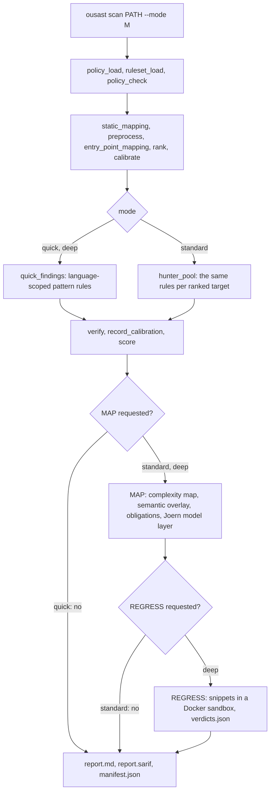
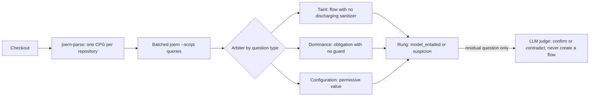
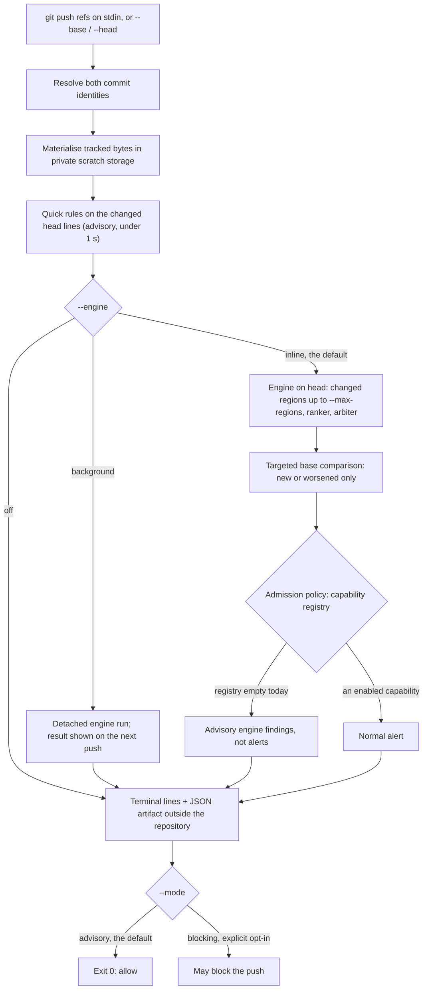

# Scanning

This page shows the scan flows.

- `ousast scan PATH --mode quick|standard|deep` scans a checkout.
- `ousast pre-push` checks only what a push changes, or what an explicit `--base`/`--head` pair
  changes.

The stage-by-stage pipeline, the evidence ladder and the score are in
[Architecture](architecture.md).

## The three scan modes

The stages each mode requests are listed in `MODE_STAGES` in `src/openultrasast/stages.py`:

- `quick` runs STATIC.
- `standard` adds MAP.
- `deep` adds REGRESS.



| Mode | Adds | Needs | Without it |
| --- | --- | --- | --- |
| `quick` | pattern rules, entry-point hints, ranking, verification, score | nothing | - |
| `standard` | MAP: complexity map, semantic overlay, authorization obligations, the Joern model layer; `fusion` (deterministic) | Joern; a provider key for the residual LLM question | `cpg_unavailable` degradation; the LLM's questions are skipped and only the graph's entailed findings are reported |
| `deep` | REGRESS: promoted candidates loaded in a sandbox with no network, read-only source, non-root | a working `docker` | `sandbox_unavailable` degradation |

Sources: `README.md` (scan modes), `src/openultrasast/cli.py` (`run_stage` calls),
[Architecture](architecture.md#the-scan-pipeline).

## Quick rules per language

Each rule runs only against files of its language. The bundled ruleset lives in
`src/openultrasast/ruleset/<language>/rules.toml`.

| Language | Classes (CWE) |
| --- | --- |
| C / C++ | stack buffer overflow (121), format string (134), command injection (78) |
| Python | command injection (78), code injection (95), SSTI (94), deserialization (502), SQLi (89), path traversal (22), SSRF (918), weak hash (327), insecure default (489) |
| JavaScript / TS | command injection (78), code injection (95), XSS (79), SQLi (89), path traversal (22), SSRF (918), weak hash (327), deserialization (502) |
| Java + Groovy templates | command injection (78), SQLi (89), weak hash (327), deserialization (502), unescaped template XSS (79) |
| PHP | SQLi (89), command injection (78), file inclusion (98), path (22), open redirect (601), SSRF (918); code eval (95), unserialize (502) and echo XSS (79) ship as `shadow` rules |

The detection gate (`python -m openultrasast.gate`) enforces two limits per language on the
bundled corpora in `benchmarks/manifests/`: at least 90% recall and under 10% false positives.

- Those corpora are cheat-sheet fixtures. They catch regressions. They do not estimate recall on
  real code.
- **PHP is not in the gate**. Its numbers are in-sample development numbers
  (`benchmarks/measurements/2026-09-30-php-quick-rules/measurement.json`).

See `README.md` for the gate's per-language output.

## The Joern engine

The model layer (`src/openultrasast/model/`, `src/openultrasast/cpg/`) is the core of `standard`.
It builds one code property graph per scan with Joern. A code property graph is a graph of the
program's syntax, control flow and data flow. The build runs `joern-parse`, then batched
`joern --script` queries from `cpg/queries/*.sc`.

The layer sends each question to the arbiter (the decider) of its type:

- **taint**: a flow from source to sink with no discharging sanitizer;
- **dominance**: does a guard govern the obligated operation;
- **configuration**: constant abstraction over a value.

Taint facts ship for C, Java, JavaScript, PHP and Python
(`src/openultrasast/ruleset/semantic/*.toml`).



The Docker image ships Joern and `php-cli`. The PHP frontend needs `php-cli`. Without Joern, the
layer records `cpg_unavailable`; the rest of the scan is unchanged.

- Engine installation and the Joern features used: [Engine and pre-push](ops/README.md).
- How the graph is built, queried and refined, with the records behind each refinement:
  [Detection techniques](detection-techniques.md).

## Framework priors

Some rule and taint-fact entries know a framework or library. They carry a `framework` or
`library` tag. The tag names a row of `src/openultrasast/ruleset/frameworks.toml` (for example
`wordpress`, `flask`, `django`, `express`, `spring`).

The loaders take `priors=` with one of three values:

- `"all"`: the default and today's behaviour;
- `"off"`: language-level knowledge only;
- a set of ids.

So the contribution of framework knowledge can be measured and switched off. The decision
engine's first slice ran with priors off
([Decision engine](decision-engine.md#first-measured-slice-2026-10-01)).

## Pre-push: the delta check (experimental)

`ousast pre-push` analyses the commits a `git push` would publish, or an explicit
`--base`/`--head` pair. It compares head with base. Only new or worsened defects become
candidates. Sources: `ousast pre-push --help`, `src/openultrasast/push/`,
[Engine and pre-push](ops/README.md#explicit-local-replay).



- `--deadline` (30 s by default) bounds preparation, the quick rules, both revisions and reporting together.
- The quick rules run first on the changed lines. Their matches are shown as advisory pattern
  matches, never as alerts, and never block.
- The default capability registry is empty until independent qualification passes. So no normal
  alert is emitted today. An engine finding the push introduced is shown as an advisory engine
  finding; every other candidate stays diagnostic in the artifact.
- A model is called only with an explicit `--model-config`.
- The private cache (`--cache-dir`) and the manual install recipe are documented in
  [Engine and pre-push](ops/README.md#experimental-pre-push-integration).

### First run: install the hook on any repository

The hook is advisory. It never rejects a push unless you set `OUSAST_PUSH_MODE=blocking`. A check
that cannot run says so in one line and lets the push through: a missing `ousast`, a missing
Docker image, an invalid setting, a crash.

1. Install the tool. The package is not on PyPI. Install it from the repository (or from a
   release wheel on the GitHub releases page):

    ```bash
    pip install "git+https://github.com/norandom/OpenUltraSAST"
    ```

2. Install the hook in the repository you want checked. Git's effective hook directory is used,
   including `core.hooksPath`, and that setting is never edited:

    ```bash
    cd /path/to/your/repository
    ousast pre-push install            # refuses if a pre-push hook already exists
    ousast pre-push install --force    # moves an existing hook to pre-push.before-ousast and chains it
    ```

3. Push as usual. Without the Joern engine, you get the quick rules and one line saying the
   engine did not run. For the engine, choose one:

    - a host install with `joern-parse` on the PATH (`pyinfra @local ops/joern.py`, see
      [Engine and pre-push](ops/README.md));
    - Docker: `docker pull ghcr.io/norandom/openultrasast:2.0.1`, then
      `ousast pre-push install --docker`. The wrapper `ousast-docker` is installed beside the
      hook and runs the check in the container (repository read-only, no network,
      `--memory 3g`). The container runs the code of its image's version: the quick-rule
      tier, the plain skip lines and `--engine` need an image built from a version that has them
      (`docker build -t openultrasast:dev .`, then `OUSAST_IMAGE=openultrasast:dev`).

4. Remove it with `ousast pre-push uninstall`. Only a hook this tool wrote is removed, and a
   chained previous hook is restored.

A push on the 2026-10-02 proof repository (serve-static, a new `debug.js` that evaluates
`req.query.code`, no Joern on the host) prints:

```text
Quick rules: 2 pattern match(es) on changed code (1 file(s), 87 bytes read). Advisory: not verified by the engine.
- js-eval (CWE-95, critical) at debug.js:2: Dynamic JavaScript evaluation needs review
- js-xss-response (CWE-79, medium) at debug.js:2: Unsanitized HTTP response reflection needs review
No actionable defects reported; analysis is incomplete.
Skipped: the changed code has no counterpart in the base revision to compare against
Skipped: engine did not run: the code graph could not be built (is Joern installed? ...)
Skipped: no base revision was analysed, so no engine finding can be called new or worsened
Notice: Engine checks did not run. Install Joern, or run the hook through ops/ousast-docker. Review the details.
Details: /home/you/.cache/openultrasast/push/push-12345.json
```

The hook reads these settings from the environment of `git push`:

| Variable | Default | Effect |
| --- | --- | --- |
| `OUSAST_PUSH_DEADLINE` | `30` | seconds for the whole check |
| `OUSAST_PUSH_MODE` | `advisory` | `blocking` is the only way a result can reject a push |
| `OUSAST_INCOMPLETE_COVERAGE` | `allow` | with `blocking`: `block` also rejects incomplete coverage |
| `OUSAST_PUSH_ENGINE` | `inline` | `background`: return after the quick rules, run the engine detached; `off`: quick rules only |
| `OUSAST_COMPARISON_BASE` | unset | a local ref to compare a new branch against |
| `OUSAST_ARTIFACT_DIR` | `~/.cache/openultrasast/push` | where the JSON results go; outside the repository |
| `OUSAST_COMMAND` | `ousast` | the command the hook runs, for example the Docker wrapper |
| `OUSAST_IMAGE` | `ghcr.io/norandom/openultrasast:2.0.1` | the Docker wrapper's image |
| `OUSAST_DOCKER_MEMORY` | `3g` | the Docker wrapper's memory limit |

**A new branch.** Git gives the hook no remote base for a branch the remote does not have yet.
The check says so ("new branch: the remote has no base to compare against"), runs the quick rules
over the files the branch's last commit changed instead, and says that too. Set
`OUSAST_COMPARISON_BASE=main` to compare a new branch against your local `main`.

**The engine and the deadline.** The engine does not fit a 30 s deadline today. The 2026-10-02
audit measured 260 s on a 26-file repository; graph reuse is the planned fix. When it cannot
finish, one line says so. With `OUSAST_PUSH_ENGINE=background`, the hook returns after the quick
rules and starts one detached engine run (`--background-deadline`, 900 s by default). The next push
in the same repository prints `Engine result for <head> from the previous push: ...` once. Only
one background run happens at a time. The Docker wrapper cannot run the engine in the background,
because the container ends with the hook.

**The artifact.** Every run writes one JSON file, and the terminal prints its path after
`Details:`. It records the following:

- `snapshots[].bytes_read`: proof that the input was read;
- `quick_tier`: the quick-rule matches, with the files and bytes read;
- `admission.coverage_reasons`: the raw skip reasons;
- `admission.dispositions`: every engine candidate and its vetoes;
- `engine_background`: background runs started or shown;
- `timings`.

Files accumulate, one per push; delete old ones when you like.

### Skip reasons

The terminal prints one `Skipped:` line per distinct reason in plain words. The artifact keeps the
raw reason. Repository paths are hex-encoded there, and per-question reasons end in a hash.

| Raw reason (artifact) | Terminal line says | What to do |
| --- | --- | --- |
| `cpg_build_failed`, `cpg_unavailable` | the engine did not run: the code graph could not be built | install Joern, or use the Docker wrapper |
| `cpg_empty` | the engine read no code | check that the changed files are in a supported language |
| `frontend_unsupported` | no engine frontend for a language in this push | none: that language gets the quick rules at most |
| `language_not_covered:<lang>:<changed>:<total>` | language not covered: `<lang>` (n changed files, m in the repository) | none: neither the engine nor the quick rules cover it, so silence is not a clean result |
| `deadline_exhausted` | the engine did not finish within the deadline | raise `OUSAST_PUSH_DEADLINE`, or set `OUSAST_PUSH_ENGINE=background` |
| `change_context_deadline_exhausted` | the deadline ran out while relating the change to the code | as above |
| `report_deadline_exhausted` | the deadline ran out while saving the details | as above |
| `engine_off`, `engine_background` | the engine was switched off, or runs after the push | none |
| `resolution:missing_base` | new branch: the remote has no base to compare against | set `OUSAST_COMPARISON_BASE` |
| `resolution:unsupported_base`, `resolution:no_merge_base`, `resolution:ambiguous_base`, `resolution:missing_target`, `resolution:unsupported_target`, `resolution:resolution_error` | the pushed ref or its remote base could not be resolved locally | fetch the remote, then push again |
| `base_comparison_unavailable`, `base_unavailable` | no base revision was analysed, so nothing can be called new | see the line before it for the cause |
| `base_counterpart_unresolved` | the changed code has no counterpart in the base to compare against | none: expected for new files |
| `<path>:ambiguous_line_correspondence`, `<path>:line_correspondence_unavailable`, `<path>:ambiguous_path_rename_correspondence` | changed lines or a renamed file could not be matched to the base | none: findings there stay diagnostic |
| `unmatched_added_deleted_path_correspondence` | files were both added and deleted, so a move cannot be told from a new file | push the move separately from other edits |
| `declaration_paths_unavailable` | project declaration files could not be listed | rerun |
| `capability_unavailable`, `capability_disabled`, `capability_unevaluated`, `capability_ambiguous` | engine findings are not qualified as alerts yet | none: they show as advisory engine findings |
| `eligibility:<reason>` | the capability registry does not match this build | reinstall a consistent build |
| `comparison_unknown`, `base_incomplete` and the other novelty reasons | whether this push introduced some engine findings could not be established | none: they stay diagnostic |
| `dynamic_external_or_depth_context_unresolved:...` | n engine checks depend on dynamic or external code the engine cannot follow | none |
| `query_failed`, `query_budget_reserved`, `query_too_expensive`, `regions_truncated`, `files_unparsed` | some engine questions were not answered | raise the deadline or `--max-regions` |
| `cross_partition_semantics_unresolved` | flows between languages are not followed | none |
| `dependency_unresolved`, `change_unsupported` | engine findings depend on unresolved code or have no supported link to the change | none |
| `snapshot:<reason>` | some files could not be materialised for analysis | see the reason (symlinks, submodules, LFS) |
| `<stage>_failed:<Error>`, `push_input_failed:<Error>` | the named step failed | rerun; report it if it repeats |

A reason not in this table is still printed as its own words, followed by "see the details file".

### In CI

The same check runs on a pushed range in CI. This GitHub Actions job is advisory: it never fails
the build, and it uploads the artifact.

```yaml
name: ousast pre-push (advisory)
on: push
jobs:
  pre-push:
    runs-on: ubuntu-latest
    steps:
      - uses: actions/checkout@v5
        with:
          fetch-depth: 0
      - uses: actions/setup-python@v5
        with:
          python-version: "3.12"
      - run: pip install "git+https://github.com/norandom/OpenUltraSAST"
      - name: Check what this push changed
        if: github.event.before != '0000000000000000000000000000000000000000'
        run: |
          ousast pre-push . --base ${{ github.event.before }} --head ${{ github.sha }} \
            --artifact "$RUNNER_TEMP/ousast-pre-push.json" --engine off --deadline 120 || true
      - uses: actions/upload-artifact@v4
        if: always()
        with:
          name: ousast-pre-push
          path: ${{ runner.temp }}/ousast-pre-push.json
```

A branch's first push has no `github.event.before` to compare against, and the job skips it. For
the engine in CI, run the job in the container image instead of `pip install`, and drop
`--engine off`.

### `ousast pre-push --help`

```text
usage: ousast pre-push [-h] [--base BASE] [--head HEAD] [--remote NAME URL]
                       [--comparison-base COMPARISON_BASE] [--model-config MODEL_CONFIG]
                       [--prior-hook PRIOR_HOOK] --artifact ARTIFACT [--cache-dir CACHE_DIR]
                       [--deadline DEADLINE] [--cancellation-allowance CANCELLATION_ALLOWANCE]
                       [--max-regions MAX_REGIONS] [--mode {advisory,blocking}]
                       [--incomplete-coverage {allow,block}] [--engine {inline,background,off}]
                       [--background-deadline BACKGROUND_DEADLINE]
                       [--experimental-declarations EXPERIMENTAL_DECLARATIONS]
                       [--experimental-record-vetoes]
                       path

Check what a push changes: quick rules on the changed lines, then the Joern engine on head and
base within one deadline. Advisory: exit 0 unless --mode blocking. Install the Git hook with
'ousast pre-push install [REPO] [--force] [--docker]'; remove it with 'ousast pre-push uninstall
[REPO]'.

positional arguments:
  path                  the repository to check (the hook passes '.')

options:
  -h, --help            show this help message and exit
  --base BASE           explicit replay: the base revision (with --head; instead of --remote)
  --head HEAD           explicit replay: the head revision to check against --base
  --remote NAME URL     Git hook mode: the remote name and URL Git passes to pre-push; the push
                        input is read from stdin
  --comparison-base COMPARISON_BASE
                        hook mode: a local ref to compare a NEW branch against (the remote has no
                        base for it); the hook reads OUSAST_COMPARISON_BASE
  --model-config MODEL_CONFIG
                        explicit optional witness selection endpoint configuration
  --prior-hook PRIOR_HOOK
                        explicitly chain an existing hook with the same input and arguments
  --artifact ARTIFACT   where to write the complete JSON result; must be outside the repository
  --cache-dir CACHE_DIR
                        reuse compatible local artifacts in a private directory outside the
                        repository
  --deadline DEADLINE   seconds for the whole check: resolution, quick rules, engine and reporting
                        (default 30; hook: OUSAST_PUSH_DEADLINE)
  --cancellation-allowance CANCELLATION_ALLOWANCE
                        seconds after the deadline to stop work and save the result (default 2)
  --max-regions MAX_REGIONS
                        most code regions the engine examines, highest-ranked first (default 500)
  --mode {advisory,blocking}
                        advisory (default) never blocks; blocking is the explicit opt-in that
                        rejects a push for an admitted alert (hook: OUSAST_PUSH_MODE)
  --incomplete-coverage {allow,block}
                        with --mode blocking only: also block when coverage is incomplete (hook:
                        OUSAST_INCOMPLETE_COVERAGE)
  --engine {inline,background,off}
                        inline (default): run the Joern engine inside the deadline; background:
                        return after the quick rules and run the engine detached, showing its
                        result on the next run; off: quick rules only
  --background-deadline BACKGROUND_DEADLINE
                        seconds the detached engine run of --engine background may take (default
                        900)
  --experimental-declarations EXPERIMENTAL_DECLARATIONS
                        explicit --base/--head replay only: unreviewed capability declarations
                        used to render the experimental evaluation explanation; never consulted by
                        admission and cannot enable any capability
  --experimental-record-vetoes
                        explicit --base/--head replay only: record each comparison and admission
                        veto per raw finding instead of applying it; output is labeled
                        experimental, changes no result and enables no hook capability
```

```text
usage: ousast pre-push install [-h] [--force] [--docker] [repository]

Install the advisory OpenUltraSAST pre-push hook into a repository's effective hook directory
(core.hooksPath is honoured, never edited).

positional arguments:
  repository  the repository (default: current directory)

options:
  -h, --help  show this help message and exit
  --force     install: replace our hook, or move a foreign hook to pre-push.before-ousast and
              chain it; uninstall: remove a hook this tool did not write
  --docker    also install the ousast-docker wrapper beside the hook, so the check runs in the
              container image
```

```text
usage: ousast pre-push uninstall [-h] [--force] [repository]

Remove the OpenUltraSAST pre-push hook and restore a chained previous hook.

positional arguments:
  repository  the repository (default: current directory)

options:
  -h, --help  show this help message and exit
  --force     install: replace our hook, or move a foreign hook to pre-push.before-ousast and
              chain it; uninstall: remove a hook this tool did not write
```
