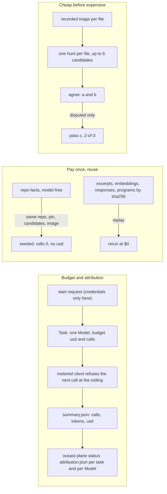
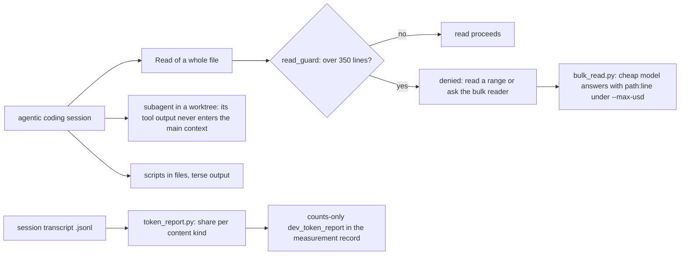

# Token ergonomics

Model tokens are the one running cost of this project, and they are spent in two places: by the
**plane** when a Run verifies candidates or compiles the decision engine, and by the maintainers'
own **agentic coding sessions**. The maintainer's framing (2026-09-29): "the token saving strategy
is a routing concern. ax can handle that and structure our services in small components." So the
runtime half is routing, one Model per Task with its own budget, and reuse of what was already
paid for; the development half is tooling that keeps bulk file contents out of the session.

Every number on this page comes from a committed record, named next to it. Records are counts
only; none holds code, prompts or responses.

The before-and-after summary (script pipeline against plane, and the development share) is on
[Where we stand](where-we-stand.md#4-token-economics-before-and-after); this page holds the
mechanisms and the detail table.

## A. Runtime: the plane's token economy



### One Model per Task, one budget per Task

A Run is a DAG of ax Tasks; each Task binds at most one Model and its own `budget: {usd, calls}`
([The plane on ax](plane.md)). The budget is enforced by the metered client
(`src/openultrasast/plane/budget.py`, `MeteredClient`): `check()` runs before every call and
raises `BudgetExhausted` once the spent `usd` or the call count reaches the ceiling, so the call
that crosses the ceiling completes and the next one is refused. The task then ends `unfinished`
and resumes from its `units.jsonl` on a rerun with a larger budget; an HTTP 401/402 or
"Insufficient Balance" is an `AccountError`, which fails the task and starts nothing further.
Usage is attributed per call: the wrapped client appends one usage row per call
(`prompt_tokens`, `prompt_cache_hit_tokens`, `completion_tokens`), rows are absorbed even when
the call raises, and they are priced by the Model's price list. An unpriced Model cannot run
under a `usd` budget, and `summary()` reports `usd: None` for it, never 0. Model-free tasks run
with `{usd: 0, calls: 0}`, so a stray call fails loudly.

`ousast plane status RUN` is the attribution table: one row per task with `calls`, `prompt`,
`cache_hit`, `output` and `usd` from each task's `summary.json`, a `subtotal` row per Model and a
`total` (a missing value makes a sum `n/a`, never a smaller number); `--units` adds the per-unit
rows. The same table is written as `attribution.json` in the run directory
(`src/openultrasast/plane/reconciler.py`, `attribution()`/`status()`). Provider credentials
reach a task only in the start request: `router.py` reads the variable the Model's
`secretKey.key` names, the runner keeps the value in memory, passes it to the command's
environment and redacts it from echoed stderr; it never appears in a manifest, a rendered Task
or a file.

### Pay once, reuse

- **Repo facts are computed model-free and reused.** `repo-facts` reads source text only (no
  model, no git) and its `facts.json` is byte-identical across runs over the same tree. The
  memory store keeps a facts entry under the key `(repo, pin, candidates digest, runner image
  digest)` (`src/openultrasast/plane/memory.py`, `memory_key()`); when a later Run's task
  carries the same key, `seed()` writes the stored `facts.json`, a `done` summary with
  `calls: 0` and no `usd`, and marks the task done without starting an actor. A changed pin,
  candidate set or image finds nothing and recomputes.
- **Content-addressed memory** (`src/openultrasast/learn/`). Excerpts are stored as
  `excerpts/<sha256 of the normalised text>.txt`; an embedding lives at
  `embeddings/<model>/<excerpt sha>.json` and "an excerpt is embedded once; a rerun makes no
  call" (`embeddings.py`). Model responses are cached under the sha256 of
  `{model, messages, params, temperature, sample}` (`program.py`, `request_key()`), and a
  compiled program is `programs/<sha256 of its artifact>.json` with the digests of the memory
  snapshot and of the response cache it was built from (`compile.py`).
- **Replay is free.** With no client, the response cache replays at $0 and a miss raises
  `ReplayMiss` instead of calling. The injection-slice record states it: "evaluate re-run
  replay-only on the committed code: 550 responses replayed, $0, identical overall and
  calibration" (`benchmarks/measurements/2026-10-01-decision-engine-injection-slice/record.json`,
  `replay_check`).

### Cheap before expensive

- **Triage first.** Verification runs only over the candidates the recorded triage kept; the
  plane applies that recording without a model call and prices it as a separate line
  (`recorded_triage_usd`), so every per-candidate cost below is reported both with and without
  it (`src/openultrasast/plane/tasks/agree.py`).
- **Hunts are batched per file.** `verify` runs one tool hunt per file for up to `PER_HUNT = 6`
  candidates, with the candidates' known callers (capped at 8) in the prompt
  (`src/openultrasast/plane/tasks/verify.py`, `units_of()`).
- **The tie-break pass runs only on disputes.** `agree` compares passes a and b; pass c is
  started with `inputs.only` set to the case's `disputed.json`, an empty list ends it `done`
  with no model call, and the final verdict is 2-of-3 ("pass c alone never decides",
  `agree.py`).
- **Cache-friendly prompt order.** The decision engine's prompt is the compiled prefix
  (instruction and fixed demonstrations, identical for every candidate so the provider's
  prefix cache hits), then the retrieved examples, then the candidate (`learn/program.py`).
  Its self-consistency `k` is tied to that cache: "k = 5 when samples 2..k hit the prefix cache
  for >= 0.8 of their prompt tokens"; the measured repeat-hit share was 0.96 (injection-slice
  record, `smoke.k_rule`, `smoke.k5_repeat_hit_share_measured`). The verify hunts share a prefix
  too: in the first plane increment 2,385,152 of 3,820,395 prompt tokens were cache hits
  (`benchmarks/independent/plane-increment-1.json`, `detail.cache_hit_tokens`,
  `detail.prompt_tokens`; its reading: "Cost fell 17% (62% of prompt tokens were cache hits)").

### Measured costs

| Measurement | Spend | Record |
| --- | --- | --- |
| Plane increment 2: verify a, b and the tie-break on the 46-candidate validation set | $0.0205 per candidate over the 46 including the recorded triage, against the $0.022 reference (`gate.cost_per_candidate_with_recorded_triage_usd`); totals: plane $0.8567, recorded triage $0.0872, with triage $0.9439, reference $1.0123 (`detail.usd`); the tie-break asked 10 disputed candidates and flipped 5 to agreed | `benchmarks/independent/plane-increment-2.json` |
| Plane increment 1: verify a and b alone | 357 calls, 54 hunts at 5.37 turns per hunt, $0.7471 plus $0.0872 recorded triage (`detail`) | `benchmarks/independent/plane-increment-1.json` |
| Decision engine, injection slice: evaluation at k = 5 | $0.003215 per candidate (`spend.cost_per_candidate_evaluate_usd`); metered at list price: canary $0.010158, compile $0.429194, a first compile attempt that failed with HTTP 400 $0.049047, evaluate $0.353626, smoke $0.070812, in all $0.912838, plus $0.003976 of embeddings; 8,601,840 of 9,936,337 prompt tokens were cache hits (`spend`) | `benchmarks/measurements/2026-10-01-decision-engine-injection-slice/record.json` |
| Decision engine, slice 2 (six families): compile, canary and evaluation per family | $2.8832 metered at list price for DeepSeek under an $8 ceiling (`spend.metered_usd_deepseek_total`), $0.000868 of embeddings; $0.0027 to $0.0032 per evaluated candidate (`families.<family>.spend.cost_per_candidate_usd`); 25,633,349 of 29,779,297 prompt tokens were cache hits (`spend.deepseek_tokens`); balance $17.73 to $16.73 | `benchmarks/measurements/2026-10-02-decision-engine-slice-2/record.json` |
| Decision engine harvest: `verify` part | $2.5373 over 1,961 calls, 474 tasks done, 10,921,167 prompt tokens of which 6,275,060 cache hits, 306,941 output tokens, task budgets summing to $8.624 under a $10 ceiling (`verify`) | `benchmarks/measurements/2026-10-01-decision-engine-harvest/record.json` |
| Decision engine harvest: `roles` part | $1.4036 over 1,034 calls, 151 tasks done, 2,398,669 prompt tokens of which 329,600 cache hits, 370,155 output tokens, task budgets summing to $4.917 under a $10 ceiling (`roles`) | same record |

The increment-2 record's note on the two denominators: "the reference divides by the 46
candidates before triage; on that basis the plane is 7% cheaper, on the 43 after triage it is
0.2% under".

!!! note "The meter prices at list; the account moved less"
    The attribution table prices every call at the Model's list price
    (`plane/models/deepseek-flash.yaml`). The harvest record: "Spend is the plane's attribution
    table (`ousast plane status`, task meters priced at plane/models/deepseek-flash.yaml); the
    DeepSeek account moved less (balance below)", with the balance at $19.63 before, $18.75
    after `verify` and $18.23 after `roles`. The injection-slice record names the ratio: "the
    provider charged ~1/3 of the list-price meter (balance moved $0.30 for $0.91 metered):
    DeepSeek's off-peak discount window, presumably; the meter prices at list"
    (`spend.balance_note`, balance $18.2 to $17.9). Budgets and gates are set against the
    meter, never against the balance.

### Not done yet

- **No model-side token budget in ax itself.** The plane's requirements state what ax does
  not yet carry: "task dependencies, artifacts, token budgets (on ax's roadmap), a DeepSeek
  provider"; the thin `Run` layer carries them and dissolves into ax as ax gains them. Until
  then the ceiling lives in the metered client, not in the executor.
- **Triage is applied, not run.** The plane has no triage task; it filters by the recorded
  triage and adds that recording's cost as its own line. A triage task is planned as a later
  specification.
- **`k` and the contrast examples are not knobs.** `k` is a compiled setting in {1, 3, 5}
  (`learn/compile.toml`, "k and lam remain A/B variants"), changed only through the decision
  engine's A/B experiments, its requirement that "changes to prompts, models, pass counts, rule
  sets and features [are] compared by controlled experiments, so that nothing is adopted on one
  run's number" (Requirement 4 of its specification). The retrieval cap of at most two
  contrast examples from other families is a module constant (`learn/retrieve.py`,
  `CONTRAST = 2`), a maintainer decision, not an experiment variant yet.

## B. Development: the maintainers' own sessions



### The measurement: tool I/O dominates

`benchmarks/dev/token_report.py` reads a Claude Code session transcript (`.jsonl`; without an
argument, the newest under `~/.claude/projects/`) and reports, per content kind, characters and
share: `tool_use_input` (the tool call's input as JSON), `tool_result`, `thinking`,
`assistant:text`, `user:text`, plus the tool-call count and the top five tools. Tokens are
approximated at four characters each. It prints to stdout and writes nothing; what gets
committed is the counts-only summary. The one in `benchmarks/independent/plane-increment-1.json`
(`dev_token_report`, for "the whole development session (c09e30b2), not the increment alone"):
7.3M unique characters (~1.81M tokens), `tool_use_input_pct` 45.4, `tool_result_pct` 40.1,
`tool_io_pct` 85.5 against `previous_tool_io_pct` 90, over 2,701 tool calls. The reasoning the
session is paid for (assistant text and thinking) is the small remainder. That is why the
remedies below target file contents, not prose.

### The remedies in `benchmarks/dev/`

**`read_guard.py`**, a `PreToolUse` hook for agentic coding sessions. It reads the hook event on
stdin and, for the `Read` tool only, denies a whole-file read of a file longer than 350 lines
(`LIMIT = 350`); a read with `offset` or `limit`, a missing path, an unreadable file or a file
within the limit passes. It always exits 0 ("never fails the tool"). A denial is one JSON line
whose `permissionDecisionReason` tells the agent to read a range or to ask the bulk reader. The
script's docstring records that it is wired in `.claude/settings.local.json` (a local, untracked
file) as `PreToolUse` with matcher `Read`; the setting has this shape, with the command
repo-relative because hooks run from the project directory:

```json
{
  "hooks": {
    "PreToolUse": [
      {
        "matcher": "Read",
        "hooks": [
          {"type": "command", "command": ".venv/bin/python benchmarks/dev/read_guard.py"}
        ]
      }
    ]
  }
}
```

**`bulk_read.py`**, the portal pattern: a cheap model reads the files and answers one question,
citing `path:line` for every claim; it reports what the files say and decides nothing.

```text
.venv/bin/python benchmarks/dev/bulk_read.py "<question>" FILE [FILE ...] [--max-usd 0.05]
```

Files go to the model in 400-line chunks with a `--- path (lines a-b)` header and numbered
lines; the client is the project's detector client (`deepseek-flash` through `DEEPSEEK_API_KEY`,
otherwise OpenRouter), each call has a 90 s timeout and no tools. `--max-usd` (default 0.05) is
checked before every chunk; at the ceiling the answer ends with
`[stopped at the $X ceiling before: <chunk header>]`. The answer goes to stdout, the summary
`[bulk_read: N chunk(s), $X.XXXX]` to stderr. Without a chat client it exits 2.

**`token_report.py`**: `python benchmarks/dev/token_report.py [TRANSCRIPT.jsonl]`, described
above.

### Practices

- **Scripts into files, not heredocs.** A heredoc is `tool_use_input` and its output
  `tool_result`; both are paid again at every later turn of the session. A script on disk is
  read once, by the interpreter.
- **Terse outputs.** Commands print counts, exit codes and the lines that matter; a harness
  fails loudly with the exit code rather than printing a table that has to be read back.
- **Subagents with worktrees** for work whose output need not enter the main context: a
  subagent's reads and command output stay in its own context and only its conclusion comes
  back; a git worktree keeps its edits off the main checkout.
- **Counts-only measurement records.** A record under `benchmarks/measurements/` or
  `benchmarks/independent/` holds numbers and their keys, never code, prompts or responses, so
  it can be quoted on a page like this one and reread by a model at a few hundred tokens.

Related: [The plane on ax](plane.md) for the Run and Task contract, [Memory](memory.md) for
the store the reuse keys live in, [Evaluation](evaluation.md) for the gates these costs are
measured against.
