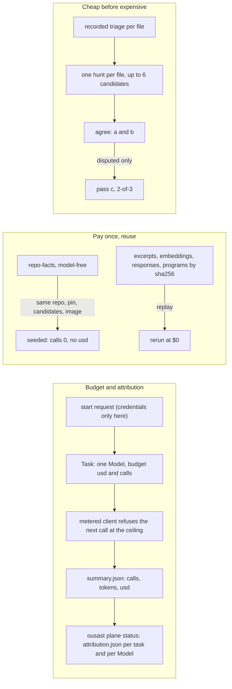
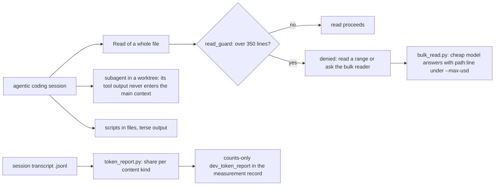

# Token ergonomics

Model tokens are the one running cost of this project. They are spent in two places:

- by the **plane** (the system that runs scans as small tasks) when a Run verifies candidates
  or compiles the decision engine;
- by the maintainers' own **agentic coding sessions**.

The maintainer's framing (2026-09-29): "the token saving strategy is a routing concern. ax can
handle that and structure our services in small components." Here ax is Google's controller
that runs agent tasks on Kubernetes. So the two halves look like this:

- **Runtime** is routing: one Model per Task with its own budget, and reuse of what was
  already paid for.
- **Development** is tooling that keeps bulk file contents out of the session.

Every number on this page comes from a committed record, named next to it. Records hold counts
only. None holds code, prompts or responses.

The before-and-after summary is on
[Where we stand](where-we-stand.md#4-token-economics-before-and-after). It compares the script
pipeline with the plane and gives the development share. This page holds the mechanisms and the
detail table.

## A. Runtime: the plane's token economy



### One Model per Task, one budget per Task

A Run is a DAG (a graph of steps with no cycles) of ax Tasks. Each Task binds at most one Model.
Each Task has its own `budget: {usd, calls}` ([The plane on ax](plane.md)).

The metered client enforces the budget (`src/openultrasast/plane/budget.py`, `MeteredClient`):

1. `check()` runs before every call.
2. It raises `BudgetExhausted` once the spent `usd` or the call count reaches the ceiling.
3. So the call that crosses the ceiling completes, and the next one is refused.
4. The task then ends `unfinished`. A rerun with a larger budget resumes from its `units.jsonl`.

An HTTP 401/402 or "Insufficient Balance" is an `AccountError`. It fails the task and starts
nothing further.

Usage is attributed per call:

- The wrapped client appends one usage row per call (`prompt_tokens`,
  `prompt_cache_hit_tokens`, `completion_tokens`).
- Rows are absorbed even when the call raises.
- Rows are priced by the Model's price list.
- An unpriced Model cannot run under a `usd` budget. `summary()` reports `usd: None` for it,
  never 0.
- Model-free tasks run with `{usd: 0, calls: 0}`, so a stray call fails loudly.

`ousast plane status RUN` prints the attribution table. It reads each task's `summary.json`
and shows:

- one row per task with `calls`, `prompt`, `cache_hit`, `output` and `usd`;
- a `subtotal` row per Model;
- a `total`. A missing value makes a sum `n/a`, never a smaller number.

`--units` adds the per-unit rows. The same table is written as `attribution.json` in the run
directory (`src/openultrasast/plane/reconciler.py`, `attribution()`/`status()`).

Provider credentials reach a task only in the start request:

- `router.py` reads the variable that the Model's `secretKey.key` names.
- The runner keeps the value in memory and passes it to the command's environment.
- The runner redacts it from echoed stderr.
- It never appears in a manifest, a rendered Task or a file.

### Pay once, reuse

- **Repo facts are computed model-free and reused.**
  - `repo-facts` reads source text only (no model, no git).
  - Its `facts.json` is byte-identical across runs over the same tree.
  - The memory store keeps a facts entry under the key `(repo, pin, candidates digest, runner image
  digest)` (`src/openultrasast/plane/memory.py`, `memory_key()`).
  - A later Run's task may carry the same key. Then `seed()` writes the stored `facts.json` and a
    `done` summary with `calls: 0` and no `usd`. It marks the task done without starting an
    actor.
  - A changed pin, candidate set or image finds nothing and recomputes.
- **Content-addressed memory** (`src/openultrasast/learn/`). Each item is stored under a hash
  of its content.
  - Excerpts are stored as `excerpts/<sha256 of the normalised text>.txt`.
  - An embedding lives at `embeddings/<model>/<excerpt sha>.json`. The source says: "an excerpt
    is embedded once; a rerun makes no call" (`embeddings.py`).
  - Model responses are cached under the sha256 of `{model, messages, params, temperature, sample}`
    (`program.py`, `request_key()`).
  - A compiled program is `programs/<sha256 of its artifact>.json`. It records the digests of
    the memory snapshot and of the response cache it was built from (`compile.py`).
- **Replay is free.** With no client, the response cache replays at $0. A miss raises
  `ReplayMiss` instead of calling. The injection-slice record states it: "evaluate re-run
  replay-only on the committed code: 550 responses replayed, $0, identical overall and
  calibration" (`benchmarks/measurements/2026-10-01-decision-engine-injection-slice/record.json`,
  `replay_check`).

### Cheap before expensive

- **Triage first.** Verification runs only over the candidates the recorded triage kept.
  - The plane applies that recording without a model call.
  - It prices the recording as a separate line (`recorded_triage_usd`).
  - So every per-candidate cost below is reported both with and without it
    (`src/openultrasast/plane/tasks/agree.py`).
- **Hunts are batched per file.** `verify` runs one tool hunt per file for up to `PER_HUNT = 6`
  candidates. The prompt includes the candidates' known callers, capped at 8
  (`src/openultrasast/plane/tasks/verify.py`, `units_of()`).
- **The tie-break pass runs only on disputes.**
  - `agree` compares passes a and b.
  - Pass c starts with `inputs.only` set to the case's `disputed.json`.
  - An empty list ends it `done` with no model call.
  - The final verdict is 2-of-3 ("pass c alone never decides", `agree.py`).
- **Cache-friendly prompt order.** The decision engine's prompt has three parts, in this order
  (`learn/program.py`):
  1. The compiled prefix: instruction and fixed demonstrations. It is identical for every
     candidate, so the provider's prefix cache hits.
  2. The retrieved examples.
  3. The candidate.

  The self-consistency `k` (the number of samples per candidate) is tied to that cache: "k = 5
  when samples 2..k hit the prefix cache for >= 0.8 of their prompt tokens". The measured
  repeat-hit share was 0.96 (injection-slice record, `smoke.k_rule`,
  `smoke.k5_repeat_hit_share_measured`).

  The verify hunts share a prefix too. In the first plane increment, 2,385,152 of 3,820,395
  prompt tokens were cache hits (`benchmarks/independent/plane-increment-1.json`,
  `detail.cache_hit_tokens`, `detail.prompt_tokens`). The record's reading: "Cost fell 17% (62%
  of prompt tokens were cache hits)".

### Measured costs

| Measurement | Spend | Record |
| --- | --- | --- |
| Plane increment 2: verify a, b and the tie-break on the 46-candidate validation set | $0.0205 per candidate over the 46 including the recorded triage, against the $0.022 reference (`gate.cost_per_candidate_with_recorded_triage_usd`); totals: plane $0.8567, recorded triage $0.0872, with triage $0.9439, reference $1.0123 (`detail.usd`); the tie-break asked 10 disputed candidates and flipped 5 to agreed | `benchmarks/independent/plane-increment-2.json` |
| Plane increment 1: verify a and b alone | 357 calls, 54 hunts at 5.37 turns per hunt, $0.7471 plus $0.0872 recorded triage (`detail`) | `benchmarks/independent/plane-increment-1.json` |
| Decision engine, injection slice: evaluation at k = 5 | $0.003215 per candidate (`spend.cost_per_candidate_evaluate_usd`); metered at list price: canary $0.010158, compile $0.429194, a first compile attempt that failed with HTTP 400 $0.049047, evaluate $0.353626, smoke $0.070812, in all $0.912838, plus $0.003976 of embeddings; 8,601,840 of 9,936,337 prompt tokens were cache hits (`spend`) | `benchmarks/measurements/2026-10-01-decision-engine-injection-slice/record.json` |
| Decision engine, slice 2 (six families): compile, canary and evaluation per family | $2.8832 metered at list price for DeepSeek under an $8 ceiling (`spend.metered_usd_deepseek_total`), $0.000868 of embeddings; $0.0027 to $0.0032 per evaluated candidate (`families.<family>.spend.cost_per_candidate_usd`); 25,633,349 of 29,779,297 prompt tokens were cache hits (`spend.deepseek_tokens`); balance $17.73 to $16.73 | `benchmarks/measurements/2026-10-02-decision-engine-slice-2/record.json` |
| Decision engine harvest: `verify` part | $2.5373 over 1,961 calls, 474 tasks done, 10,921,167 prompt tokens of which 6,275,060 cache hits, 306,941 output tokens, task budgets summing to $8.624 under a $10 ceiling (`verify`) | `benchmarks/measurements/2026-10-01-decision-engine-harvest/record.json` |
| Decision engine harvest: `roles` part | $1.4036 over 1,034 calls, 151 tasks done, 2,398,669 prompt tokens of which 329,600 cache hits, 370,155 output tokens, task budgets summing to $4.917 under a $10 ceiling (`roles`) | same record |

The increment-2 record notes that the two denominators differ: "the reference divides by the 46
candidates before triage; on that basis the plane is 7% cheaper, on the 43 after triage it is
0.2% under".

!!! note "The meter prices at list; the account moved less"
    The attribution table prices every call at the Model's list price
    (`plane/models/deepseek-flash.yaml`). The harvest record says: "Spend is the plane's
    attribution table (`ousast plane status`, task meters priced at
    plane/models/deepseek-flash.yaml); the DeepSeek account moved less (balance below)".
    The balance was $19.63 before, $18.75 after `verify` and $18.23 after `roles`.
    The injection-slice record names the ratio: "the provider charged ~1/3 of the list-price
    meter (balance moved $0.30 for $0.91 metered): DeepSeek's off-peak discount window,
    presumably; the meter prices at list" (`spend.balance_note`, balance $18.2 to $17.9).
    Budgets and gates are set against the meter, never against the balance.

### Not done yet

- **No model-side token budget in ax itself.**
  - The plane's requirements state what ax does not yet carry: "task dependencies, artifacts,
    token budgets (on ax's roadmap), a DeepSeek provider".
  - The thin `Run` layer carries them. It dissolves into ax as ax gains them.
  - Until then the ceiling lives in the metered client, not in the executor.
- **Triage is applied, not run.**
  - The plane has no triage task.
  - It filters by the recorded triage and adds that recording's cost as its own line.
  - A triage task is planned as a later specification.
- **`k` and the contrast examples are not knobs.**
  - `k` is a compiled setting in {1, 3, 5} (`learn/compile.toml`, "k and lam remain A/B
    variants").
  - It changes only through the decision engine's A/B experiments. Requirement 4 of its
    specification asks that "changes to prompts, models, pass counts, rule sets and features
    [are] compared by controlled experiments, so that nothing is adopted on one run's number".
  - Retrieval adds at most two contrast examples from other families. This cap is a module
    constant (`learn/retrieve.py`, `CONTRAST = 2`).
  - The cap is a maintainer decision, not an experiment variant yet.

## B. Development: the maintainers' own sessions



### The measurement: tool I/O dominates

`benchmarks/dev/token_report.py` reads a Claude Code session transcript (`.jsonl`). Without an
argument it reads the newest one under `~/.claude/projects/`.

It reports characters and share per content kind:

- `tool_use_input` (the tool call's input as JSON);
- `tool_result`;
- `thinking`;
- `assistant:text`;
- `user:text`.

It also reports the tool-call count and the top five tools. Tokens are approximated at four
characters each. It prints to stdout and writes nothing. Only the counts-only summary is
committed.

The committed summary is in `benchmarks/independent/plane-increment-1.json`
(`dev_token_report`). It covers "the whole development session (c09e30b2), not the increment
alone". It counts 7.3M unique characters (~1.81M tokens). The shares
are `tool_use_input_pct` 45.4, `tool_result_pct` 40.1, and `tool_io_pct` 85.5 against
`previous_tool_io_pct` 90, over 2,701 tool calls.

The reasoning the session is paid for (assistant text and thinking) is the small remainder.
That is why the remedies below target file contents, not prose.

### The remedies in `benchmarks/dev/`

**`read_guard.py`** is a `PreToolUse` hook (a script that runs before each tool call) for
agentic coding sessions.

- It reads the hook event on stdin.
- For the `Read` tool only, it denies a whole-file read of a file longer than 350 lines
  (`LIMIT = 350`).
- These pass: a read with `offset` or `limit`, a missing path, an unreadable file, or a file
  within the limit.
- It always exits 0 ("never fails the tool").
- A denial is one JSON line. Its `permissionDecisionReason` tells the agent to read a range or
  to ask the bulk reader.

The script's docstring records how it is wired. It sits in `.claude/settings.local.json` (a
local, untracked file) as `PreToolUse` with matcher `Read`. The setting has this shape. The
command is repo-relative because hooks run from the project directory:

```json
{
  "hooks": {
    "PreToolUse": [
      {
        "matcher": "Read",
        "hooks": [
          {"type": "command", "command": ".venv/bin/python benchmarks/dev/read_guard.py"}
        ]
      }
    ]
  }
}
```

**`bulk_read.py`** follows the portal pattern. A cheap model reads the files and answers one
question. It cites `path:line` for every claim. It reports what the files say and decides
nothing.

```text
.venv/bin/python benchmarks/dev/bulk_read.py "<question>" FILE [FILE ...] [--max-usd 0.05]
```

How it works:

- Files go to the model in 400-line chunks, with a `--- path (lines a-b)` header and numbered
  lines.
- The client is the project's detector client: `deepseek-flash` through `DEEPSEEK_API_KEY`,
  otherwise OpenRouter.
- Each call has a 90 s timeout and no tools.
- `--max-usd` (default 0.05) is checked before every chunk. At the ceiling the answer ends with
  `[stopped at the $X ceiling before: <chunk header>]`.
- The answer goes to stdout. The summary `[bulk_read: N chunk(s), $X.XXXX]` goes to stderr.
- Without a chat client it exits 2.

**`token_report.py`**: `python benchmarks/dev/token_report.py [TRANSCRIPT.jsonl]`, described
above.

### Practices

- **Scripts into files, not heredocs.** A heredoc (a script typed inline in a shell command) is
  `tool_use_input`, and its output is `tool_result`. Both are paid again at every later turn of
  the session. A script on disk is read once, by the interpreter.
- **Terse outputs.** Commands print counts, exit codes and the lines that matter. A harness
  fails loudly with the exit code. It does not print a table that has to be read back.
- **Subagents with worktrees** for work whose output need not enter the main context.
  - A subagent's reads and command output stay in its own context.
  - Only its conclusion comes back.
  - A git worktree (a separate checkout of the same repository) keeps its edits off the main
    checkout.
- **Counts-only measurement records.** A record under `benchmarks/measurements/` or
  `benchmarks/independent/` holds numbers and their keys. It never holds code, prompts or
  responses. So it can be quoted on a page like this one. A model can reread it at a few
  hundred tokens.

Related:

- [The plane on ax](plane.md) for the Run and Task contract;
- [Memory](memory.md) for the store the reuse keys live in;
- [Evaluation](evaluation.md) for the gates these costs are measured against.
